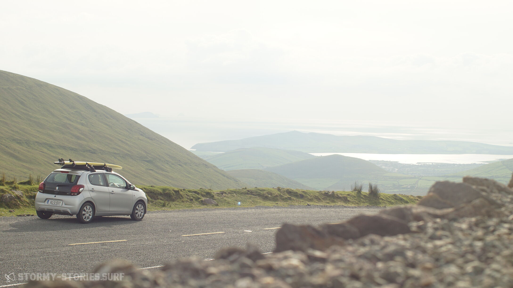

# About this blog

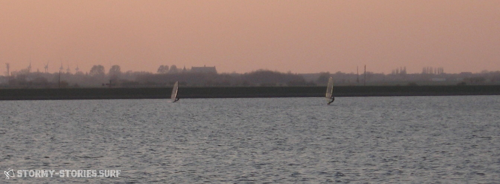

... "Holy shit, there's finally one that's still open."
I turn on the signal and pull into the petrol station - somewhere in the middle of nowhere in the middle of the night in South West Ireland.

I look to the left at the gas pump. All I see, however, is a pile of sails stacked up to the roof.
"Oh, how much space is there left? Am I already close, or do I have to go further?” “No, that’s fine, maybe a little further – yes, that’s enough.”

Okay - I open my seat belt and face the door. A police car drives past us and parks next to another. There's another police car next to it, another next to it, and a few more next to it.

The corresponding drivers stand ten meters away and look over at us with interest.
I think briefly of our tiny rental car, which could hardly be more overloaded. Packed to the roof with windsurfing equipment in every corner. The roof itself caved in under the weight of the boards stacked on top.

I turn back to exchange a significant look with my brother.
After seeing nothing but sail bags again, I say, “Dude, this place is full of police. Let's make sure we get out of here quickly."

I get out of the car a little hesitantly, raise my hand and briefly say “Hi”. The group of people in uniform greets back in a friendly manner and then goes into the building together to "have a coffee"...

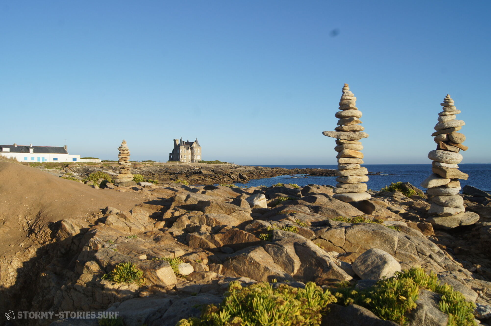

... I'm lying in the water. Just now the landing behind the last wave really tore me apart.

Still, I smile and am happy. I swim quickly to my gear, it's not too far away. The wave that just cleared me breaks a few meters away and the spray trickles down on me. Looking at the beach from here, it looks really impressive, with what force the waves tumble forward one after the other and how the spray behind them is blown up by the wind. A couple of bigger breakers roll past me. With my head at the level of the water surface, they even look much bigger. But since nothing breaks out here anyway, it's no problem. I look towards the beach. The sun shines beautifully over the crests of the waves, in the background you can see the fish factory.

Then someone shoots over the next wave, rises high into the air, smashes a perfect backloop into the air, and then into the water next to me. The water trickles down on me again. He glances over at me and sticks his thumb in the air. I hold mine up too. I'm doing great, you could say perfectly, but thank you for asking. I'm just taking a short break here...

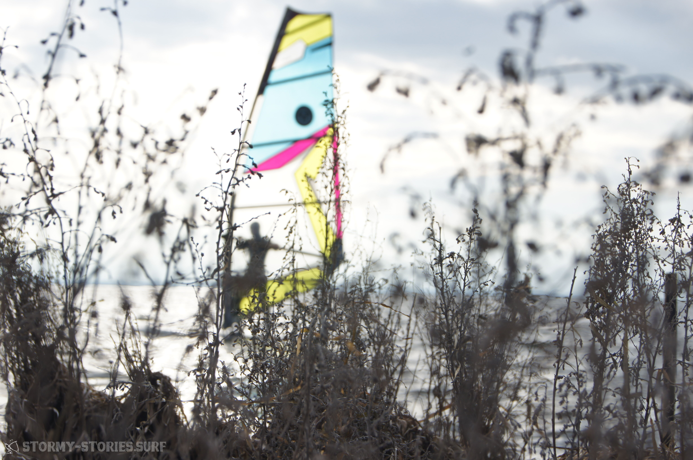

... I race towards a wave with what feels like infinite speed. Now it would probably make sense to be in the foot straps or in the harness or something.. It's a bit threatening uphill, but it's too late to brake now.. Then it's gone, the ground under my feet, or rather the water under my board.. It feels like forever going through the air - for me for the first time with a surfboard. And then - SPLASH - it goes back into the water. The board spins out on the side. It can no longer really be controlled. Then the sail pulls forward and catapults me - BANG - away in the direction of travel.. Wow, that was really awesome. My whole body is flooded with adrenaline, so much that I can't talk about anything else hours later...

... The alarm clock is ringing. In fact, I'm still pretty tired. But hey, what the heck. I open my eyes and then quickly close them again, then carefully open them again. Man, that's light. I sit up and look out the window - snow flurry - "Well", I think: "It doesn't help. Then putting on the wetsuite today will be particularly pleasant again." ...

... Completely motivated, I grab our new board. I've been looking forward to trying it out for weeks. That will probably change everything. A revolution, our ascent, finally getting better, finally planing, unimagined speeds. No more fixed centreboard, a modern sporty shape, 122 litres.. WOW.. ... Okay, first try.. Start uphauling school-start.. Align sails pull up, splash.. and again. Crawling back up, aligning the sails, pull up, splash.. But now.. back on the board, aligning the sails, up..splash.. And on and on it goes like this day after day...

... Wednesday afternoon, 4 p.m. The forecast just won't let me rest.
I refresh it again, make up my mind, and then quickly sit down at the keyboard and type, "Hi, how are you? Are you going for the forecast this weekend too?”

Seconds later my cell phone rings:

– "Moin... How's it going? We'll be in Holland from tomorrow. Are you in? The forecast looks really awesome and there's a wave spot that we wann.. Uh, wait a minute - the customer is calling me for my appointment tomorrow, I'll call you right back, okay??"

- "Of course, see you soon".

I put the phone aside – then it rings again :

- "Moin.., sooo now I have tomorrow off, how about you?".

Everything important has been clarified five minutes later.

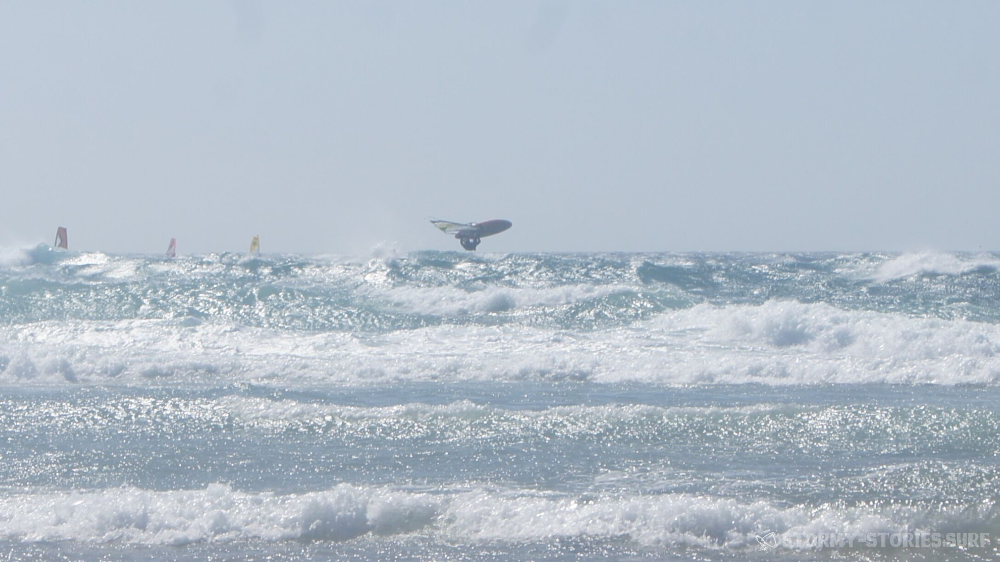

I look for the next number and press the green handset:

- "Hi, what's up? What about going spontaneously to the sea in Holland?”

- "When does it start?"

– "Tonight, I have to pack things quickly and then I'll pick you up."

- "Okay cool! When are we coming back?

- "Saturday night / or Sunday morning - we'll see."

- "Well then see you soon"

Thursday morning, 2:35 a.m.: Welcome back to Ouddorp, let's go to bed then...

... Somewhat demotivated I park on the side of the road. Actually I was hoping for a lot of wind in Ireland, but the forecast looks relatively poor for the next few days. I stroll comfortably to the beach, after all I want to see the spot in daylight too.

When I turn around the dune and can look out over the water, I almost get hit.
Waves, as clean and long as I have probably never seen before, run line by line onto the beach. Looking at a surfer snipping one of these magnificent specimens into small pieces using all the tricks of the trade, I realize that they must be a little over 2 meters tall.

My goodness - such waves and that without any storm, horizontal rain and doomsday mood on the streets. Then something clicks in my brain and I realize that I desperately need a surfboard from somewhere.

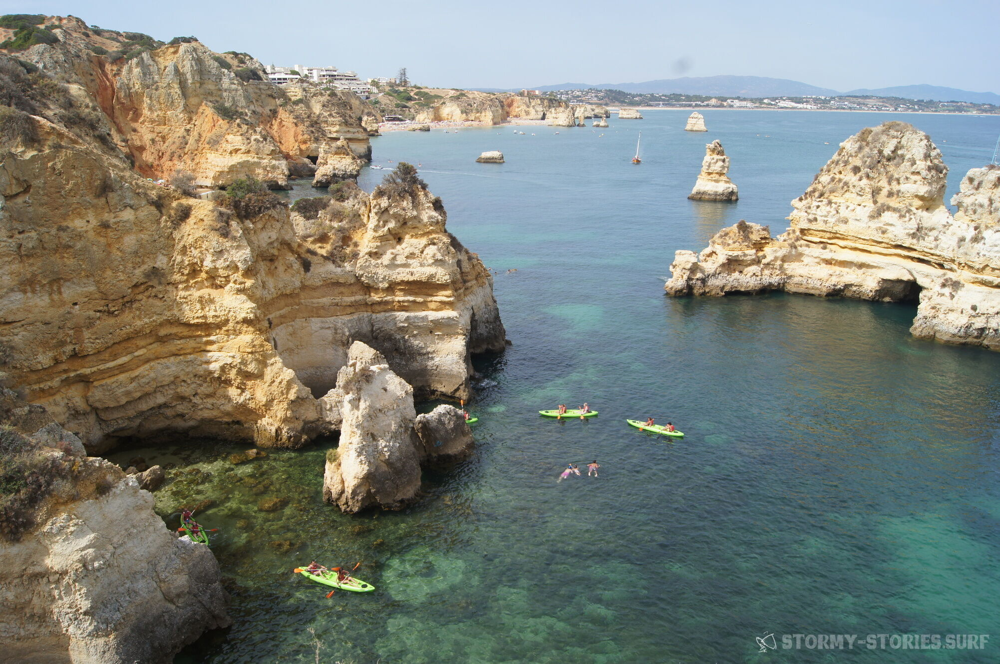

I quickly run to the next person in the parking lot and ask if it's possible to rent surf boards somewhere nearby. "Generally no problem at all - but I think with these good conditions you will have a hard time finding an open shop. Everyone will be surfing. But hey – just have mine – I'm done for today”.

I take one look at the brand new board, then another look back to the beach and think about my own low level of surfing boards with no sails. "Shit!" I think, "What will the board look like when I'm done with it?" I decline with thanks and make my way to the next town. On the second try, I meet someone who is busy closing his own surf shop.

When asked if I could rent a surfboard from him, he just rushes to the nearest shed, hands me one, and then hastily jumps into his SUV. When I call after him how much it's supposed to cost, he just waves his hand and mumbles something about "Just come by again in the next few days and now quickly get on the water"...

# What is this all actually about?

In any case, it's about surfing. It's about beautiful trips to even more beautiful places. It's about happiness in the world and where or how to get as much of this happiness into your life as possible.

It's about the water rushing past under you at crazy speed. And it's about how the tickle of the sun's rays slowly lures you out of sleep in the morning.

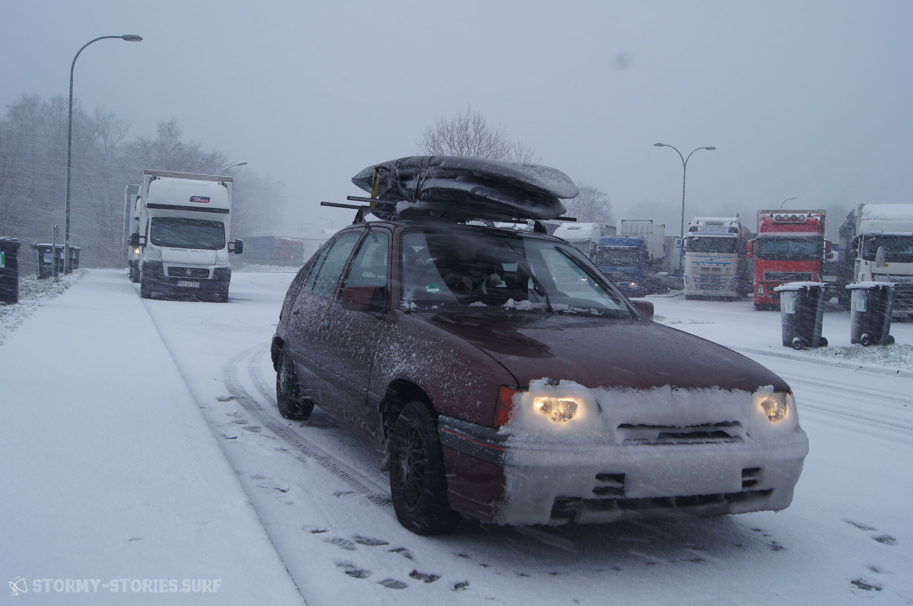

Maybe it's also sometimes about completely different things. Maybe also about things that have absolutely nothing to do with all of the above.

As a rule, however, it is probably always about stormy stories, ideas and thoughts. Whereby "stormy" will probably be interpreted in the most stormy ways and also sometimes might have absolutely nothing to do with moving air or water.

Pretty sure it will be sometimes about photography. Maybe also about filming. In both cases, it is probably mostly about the results of practice rather than theory. In our stormy blog, however, nothing seems to be ruled out in general, so you should be prepared for everything and also for nothing.

I think it's also about trying a few new things. It's about combining certain hobbies and preferences and seeing how you can get better at them.

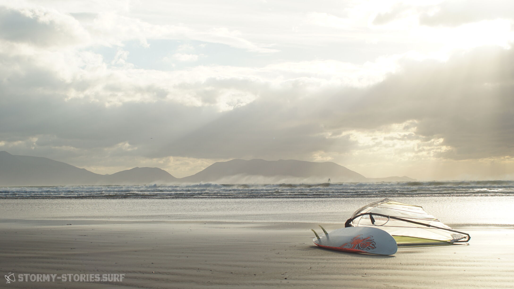

It will also be about showing how we achieved some things.

It's almost certainly also about the fact that things don't always go according to plan and some paths to success aren't always easy.

It's about trying new things. To keep failing, failing and failing and still going on. It's about how things that were previously unthinkable suddenly, surprisingly work in an completely outrageously simple way.

It will for sure be about the details.
The organization to make the most beautiful things in the world in the most beautiful places in the world often does not always seem easy at first glance and certainly not cheap.

But because of this, it will be about exactly these details and at this point we will probably not mince our words. Because with good instructions or a few tips, some things are often easier than one would think.

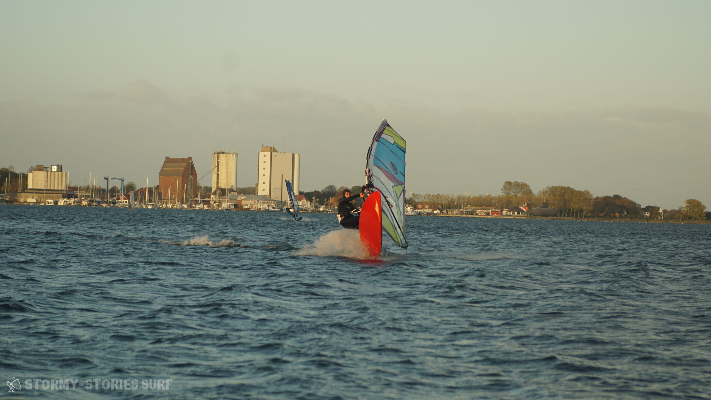

But basically it's also about something completely different. It's about a way of life. It's about the fact that we only have one life in this world and we have to see what we do with our time here. It's about how we quickly lose sight of the essential and beautiful in our daily work madness.

And much more than that, it should probably be about avoiding this problem as elegantly as possible.

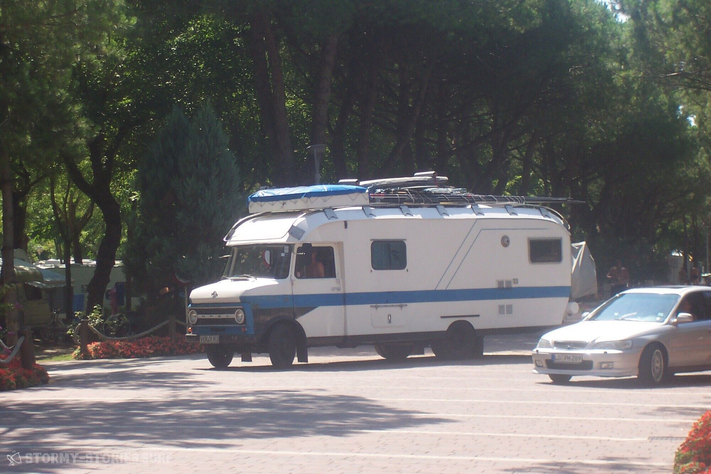

Is it necessary that we spend the best years of our lives working for other people's interests only to end up being spat out of this system when we can't anymore?

Is it necessary that while we are doing just that, we neglect the people and things that matter most to us and always give our all in the stress of work, until at some point we realize that the things that are important to us weren't waiting for us?

Maybe it's necessary, maybe it's not. It will very likely also be about this question and how to combine the beautiful with the necessary as well as possible.

We, the storytellers from STORMY-STORIES.SURF are looking forward to our new project.

We're already enthusiastic amateur surfers, photographers and storytellers and we're excited to see how and if we can improve on some of these things.

We are also curious to see if anyone will sit down at our campfire on the beach and listen to our stories.

If not, that probably won't stop us from continuing for as long as we have fun doing it.

If you do, we are always happy to receive any kind of feedback. Feel free to tell us what you think at our campfire. Tell us your stories and take ours with you on your travels and pass them on.

Don't hesitate and dare. But please bear with us if, as amateurs, we don't quite meet your expectations and wishes.

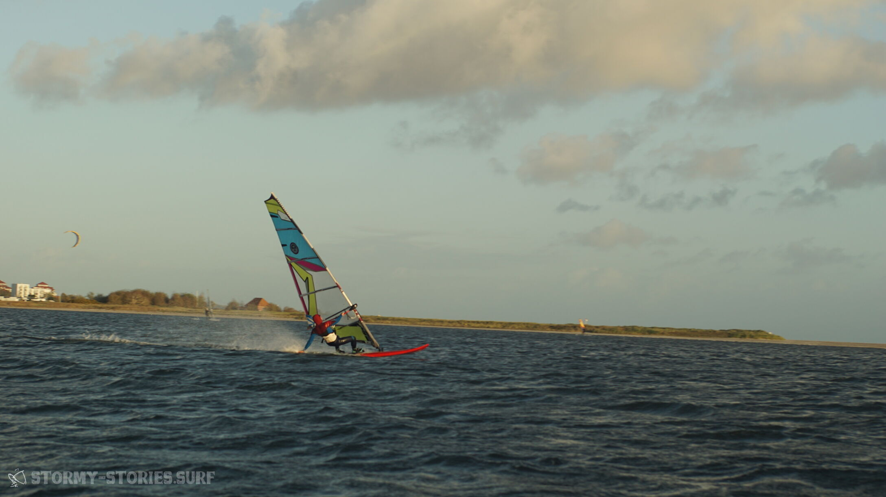

We would also like to ask you, if you have something to say, not to attack anyone directly and to be friendly with one another.

This site has no place for, and will never accept, racism, sexism, and homophobia.

If you don't have any problems with these basic rules of good taste, we look forward to you as a potential listener and are only too happy to talk to you about our stormy stories, thoughts and ideas.

Aloha.

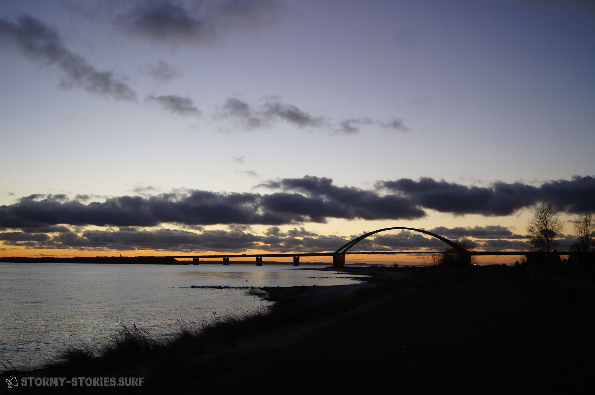
