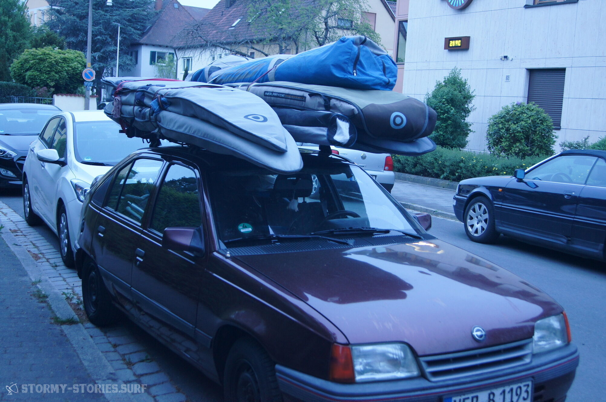
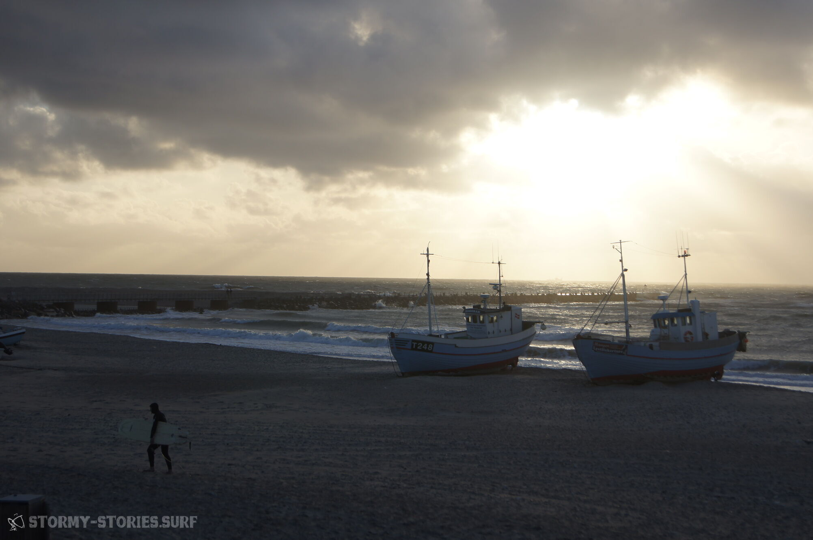

# About this Blog

… „Holy shit, there is finally one that is still open.“  
I activate the indicator and turn left to the gas station – somewhere in the nowhere in the middle of the night in south-west Ireland.

I turn my head to the left to have a look at the petrol pump. But the only thing I see is a stacked pile of windsurfing-sails.
"Uhhm, tell me, how much space is there? Am I already close, or do I have to go further?
„No it fits, a little bit maybe - Yeah, that's enough.“

Okay – I buckle up and turn to the door. A police car drives past us and parks nearby next to another police-car. Next to it is another police-car, next to it another and next to it a few more.

The associated drivers are ten meters away and look at us interested.
I think briefly about our tiny rental car, which could hardly be more overloaded. Every part of the car up the roof crammed with windsurf equipment. The roof dented by the weight of of the boards which are stacked on it.

I turn back to exchange a meaningful look with my brother.
After I again see nothing except windsurf-sail-bags, I say : "Damn, there is so much police. Let's see that we get away quickly."

A little hesitantly, I get out, raise my hand and say "Hi" for a moment. The squad of uniformed greets back friendly and then enters the building "to drink a coffee". ...

... I am lying in the water. Just now the landing after this last wave really tore me apart.

Nevertheless I smile and feel happy. The sun is shining down on me. The wave which just recently crashed me, breaks a few meters away and spray trickles down on me. Looking from here to the beach, it looks really impressive, with what force the waves overturn one after another forward and how the spray behind it is torn up by the wind. Just overwhelming.

Two waves later another windsurfer shoots over a wave and smashes a perfect backloop into the air before smashing next to me into the water. Again water trickles down on me.

"Haaach.. what an awesome day", I think, grab my sail and go on...

… „Oh mann, der Pub sieht aber ganz schön ausgestorben aus, wollen wir da wirklich rein? Nach Individual-Betreuung durch den Wirt ist mir jetzt heute irgendwie nicht.“
 –  „Hmm, jaa oder lass uns noch mal runter zur Bucht laufen, das zerfallene Boot da am Strand, das kann man bestimmt relativ cool mit einer Langzeitaufnahme vor der Bucht und dem Ort im Hintergrund fotografieren."

3 Stunden und gefühlte 10000 Versuche später -> „Krasse Scheiße, das Bild ist der Hammer und der Weg-Cider ist auch alle, lass uns zusehen, dass wir ins Bett kommen …

… Mittwoch Nachmittag, 16:00 Uhr. Die Vorhersage lässt mir einfach keine Ruhe.  
Ich aktualisiere sie noch mal, fasse einen Entschluss und setze mich dann schnell an die Tastatur und tippe : „Hi, wie geht es euch so? Seid ihr dieses Wochenende surf-technisch auch unterwegs?“

Sekunden später klingelt mein Handy:

– „Moin… Wie siehts aus? Wir sind ab morgen in Holland. Seid ihr dabei? Die Vorhersage sieht echt krass aus und da ist so ein Wavespot den wir noch mal.. Ääh, warte mal kurz – da ruft mich gerade der Kunde für meinen Termin morgen an, ich rufe dich gleich zurück, okay??“

– „Na klar, bis gleich“.

Ich lege das Handy zur Seite – dann klingelt es wieder :

– „Moin.. , sooo jetzt habe ich morgen frei, wie siehts bei dir aus?“.

Fünf Minuten später ist alles Wichtige geklärt.

Ich suche die nächste Nummer heraus und drücke auf den grünen Hörer :

– „Moin.. Wie gehts? Wie siehts aus, Lust spontan ans Meer nach Holland zu fahren?“

– „Wann gehts los?“

– „Heute Abend, muss noch schnell Sachen packen und dann hole ich dich ab.“

– „Okay, cool! Wann kommen wir wieder?“

– „Samstag Nacht / oder Sonntag früh je nachdem.“

– „Gut dann bis gleich“

Donnerstag Morgen, 2:35 Uhr : Herzlichen Willkommen in Ouddorp, na dann mal schnell ins Bett …

… Etwas demotiviert parke ich am Straßenrand. Eigentlich hatte ich mir in Irland jede Menge Wind erhofft, aber die Vorhersage sieht relativ mau aus für die nächsten Tage. Ich schlendere gemütlich zum Strand, schließlich will ich den Spot nun auch mal bei Tageslicht sehen.

Als ich um die Düne biege und aufs Wasser blicken kann, trifft mich fast der Schlag.  
Wellen, so sauber und lang wie ich sie wohl noch nie gesehen habe, laufen Line für Line an den Strand. Bei einem Blick auf einen Wellenreiter, der eine dieser Pracht-Exemplare nach allen Regeln der Kunst in kleine Stücke schnibbelt, wird mir klar, dass sie etwas über 2 Meter groß sein müssen.

Meine Güte – solche Wellen und das vollkommen ohne Sturm, waagerechten Regen und Weltuntergangs-Stimmung auf den Straßen. Dann rastet etwas in meinem Hirn ein und ich verstehe, dass ich irgendwo her dringend ein Surf-Board brauche.

Schnell laufe ich zum nächsten Menschen auf dem Parkplatz und frage, ob es irgendwo in der Nähe möglich sei Surf-Boards zu mieten. „Generell überhaupt kein Problem – Aber ich glaube bei den Bedingungen wirst du es schwer haben einen offenen Laden zu finden. Die werden alle selbst unterwegs sein. Aber hey – nimm doch einfach meins – ich bin für heute fertig“.

Ich werfe einen Blick auf das nagelneue Board, dann einen weiteren zurück zum Strand und lehne dann dankend ab und mache mich auf den Weg in den nächsten Ort. Beim zweiten Anlauf treffe ich jemanden, der sich gerade hektisch mit dem Abschließen des eigenen Surfshops beschäftigt.

Auf die Frage, ob ich bei ihm ein Surf-Board leihen könnte, rennt er nur schnell in den nächsten Schuppen, drückt mir eines in die Hand und springt dann hastig in seinen Geländewagen. Als ich ihm noch nachrufe, was es denn kosten solle, winkt er nur ab und nuschelt etwas von „Komm die nächsten Tage einfach mal wieder vorbei und jetzt schnell aufs Wasser mit dir“ …

# Worum geht es hier eigentlich?

Auf jeden Fall geht es ums Surfen. Es geht um schöne Reisen an noch viel schönere Orte. Es geht um Glück auf der Welt und wo oder wie man möglichst viel von diesem Glück in sein Leben bekommt.

Es geht darum, wie das Wasser in einer rasenden Geschwindigkeit unter einem vorbei fliegt. Und es geht darum, wie das Kitzeln der Sonnenstrahlen einen morgens langsam aus dem Schlaf lockt.

Vielleicht geht es auch einmal um ganz andere Dinge.   Vielleicht auch um Dinge, die rein überhaupt garnichts mit all dem zuvor Genannten zu tun haben.

In aller Regel geht es aber wahrscheinlich immer um stürmische Geschichten, Ideen und Gedanken. Wobei „stürmisch“ vermutlich in den stürmischsten Arten und Weisen interpretiert werden wird und auch öfters rein garnichts mit bewegter Luft oder Wasser zu tun haben könnte.

Ziemlich sicher geht es ziemlich viel ums Fotografieren.   Vielleicht auch mal ums Filmen. In beiden Fällen geht es wahrscheinlich meistens eher um die Ergebnisse der Praxis als um die Theorie. In unserem stürmischen Blog scheint aber generell nichts ausgeschlossen, sodass man auf alles und auch auf nichts vorbereitet sein sollte.

Ich glaube, es geht hier auch darum ein paar neue Dinge auszuprobieren. Es geht darum bestimmte Hobbies und Vorlieben  miteinander zu verknüpfen und zu schauen wie man in diesen besser werden kann.

Es soll auch darum gehen, zu zeigen wie man das ein oder andere erreicht hat.  
Es geht ziemlich sicher auch darum, dass nicht immer nur alles wie geplant läuft und mancher Weg zum Erfolg nicht immer einfach ist.

Es wird ziemlich sicher auch um Details gehen.  
Gerade die Organisation, um an den schönsten Orten der Welt die schönsten Dinge der Welt zu machen, scheint auf den ersten Blick oft nicht immer einfach und erst recht nicht günstig zu sein.

Um genau diese Dinge soll es daher auch gehen und an dieser Stelle soll kein Blatt vor den Mund genommen werden. Mit einer guten Anleitung oder ein paar Tipps ist manches nämlich manchmal doch einfacher als man denkt.

Außerdem geht es auch noch um etwas ganz anderes. Es geht darum, wie wir in unserem täglichen Arbeitswahn schnell den Blick für das Wesentliche und Schöne verlieren.

Und viel mehr als das, soll es vermutlich darum gehen, genau diesem Problem möglichst elegant aus dem Weg zu gehen.

Ist es notwendig, dass wir die schönsten Jahre unseres Lebens damit verbringen für die Interessen anderer Leute zu arbeiten um am Ende, wenn wir nicht mehr können, von diesem System wieder ausgespuckt zu werden?

Ist es notwendig, dass wir während wir genau das tun, die Menschen und Dinge die uns am Wichtigsten sind vernachlässigen und im Stress der Arbeit immer alles geben, bis wir irgendwann merken, dass die Dinge, die uns wichtig sind, nicht auf uns gewartet haben?

Vielleicht ist es notwendig, vielleicht auch nicht. Um diese Frage und wie man das Schöne möglichst gut mit dem Notwendigen verknüpft, wird es sehr wahrscheinlich auch gehen.

Wir, die Geschichten-Erzähler von STORMY-STORIES.SURF freuen uns auf unser neues Projekt.

Bereits jetzt sind wir begeisterte Amateur-Surfer, -Fotografen und -Geschichtenerzähler und sind gespannt, wie und ob wir uns in manchen dieser Dinge verbessern können.

Wir sind auch gespannt, ob sich jemand findet, der sich zu uns an unser Lagerfeuer am Strand setzt und unseren Geschichten zuhören will.

Falls nicht, wird uns das vermutlich trotzdem nicht davon abhalten weiter zu machen, so lange wie wir eben Lust darauf haben.

Falls doch, freuen wir uns immer und überall über jegliche Art von Feedback. Erzählt uns an unserem Lagerfeuer gerne auch, was ihr so denkt. Erzählt uns auch eure Geschichten und nehmt unsere mit auf Reisen und erzählt sie weiter.

Zögert nicht und traut euch. Aber habt auch ein wenig Nachsicht mit uns, wenn wir als Amateure nicht ganz euren Vorstellungen und Wünschen entsprechen.

Auch möchten wir euch auffordern, wenn ihr etwas zu sagen habt, dabei niemanden direkt anzugreifen und freundlich miteinander um zu gehen.

Diese Seite bietet keinen Platz für Rassimus, Sexismus und Homophobie und wird auch nichts davon dulden.

Wenn ihr mit diesen Grundregeln des guten Geschmacks keine Probleme habt, freuen wir uns über euch als potenzielle Zuhörer und unterhalten uns auch nur zu gerne mit euch über unsere stürmischen Geschichten, Gedanken und Ideen.

Aloha.

