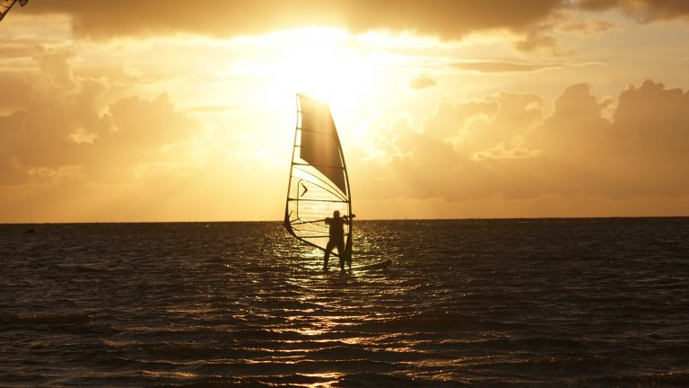
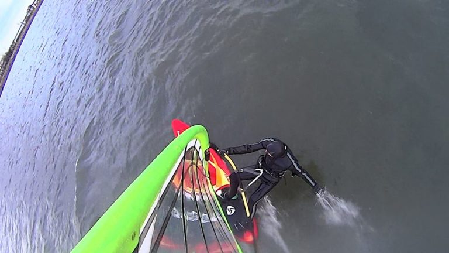

# Die Autoren

# Jana
Eher so Windsurf-Einsteigerin, aber das hält ja niemanden ab! Ist der Meinung, dass Segel für Wind da sind, für Wellen wurde das Wellenreiten erfunden. Fasziniert vom Freestyle. Fahrerin des knallorangen Partybus.

| Wohnort:         | Hamburg, Germany      |
|------------------|-----------------------|
| Homespot:        | Fehmarn               |
| Lieblings-Spots: | Gold (Fehmarn, GER)   |
|                  | Tonel (POR)           |
|                  | Cadiz Cortadura (ESP) |
| Hobbys:          | Windsurfen            |
|                  | Wellenreiten          |
|                  | Klettern              |
|                  | Technik               |
|                  | Bücher                |
|                  | Musik                 |

# Marcel

TODO

# Andre

TODO

| Wohnort:         | Erlangen, Germany               |
|------------------|---------------------------------|
| Homespot:        | Brombachsee                     |
| Lieblings-Spots: | Heiligenhafen (DEU)             |
|                  | Hanstholm (DNK)                 |
|                  | Pozo Izquierdo (ESP)            |
|                  | Brandon Bay (IRE)               |
| Lieblings-Setup: | Starboard Kode 92               |
|                  | North Sails Idol 4.2            |
| Hobbys:          | Windsurfen, Longboarden,        |
|                  | Snowboarden, Fotografieren,     |
|                  | Programmieren, Texte schreiben  |
