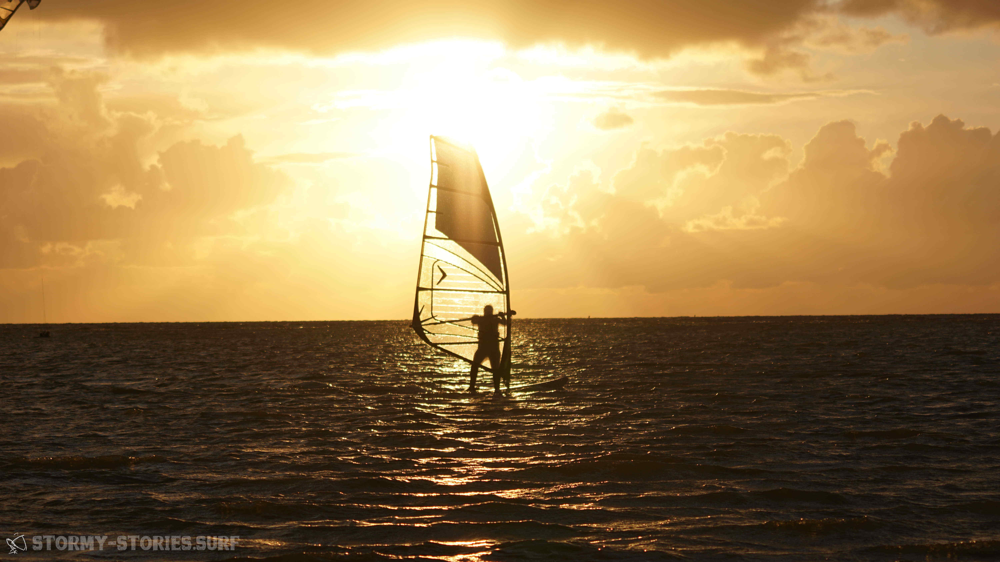
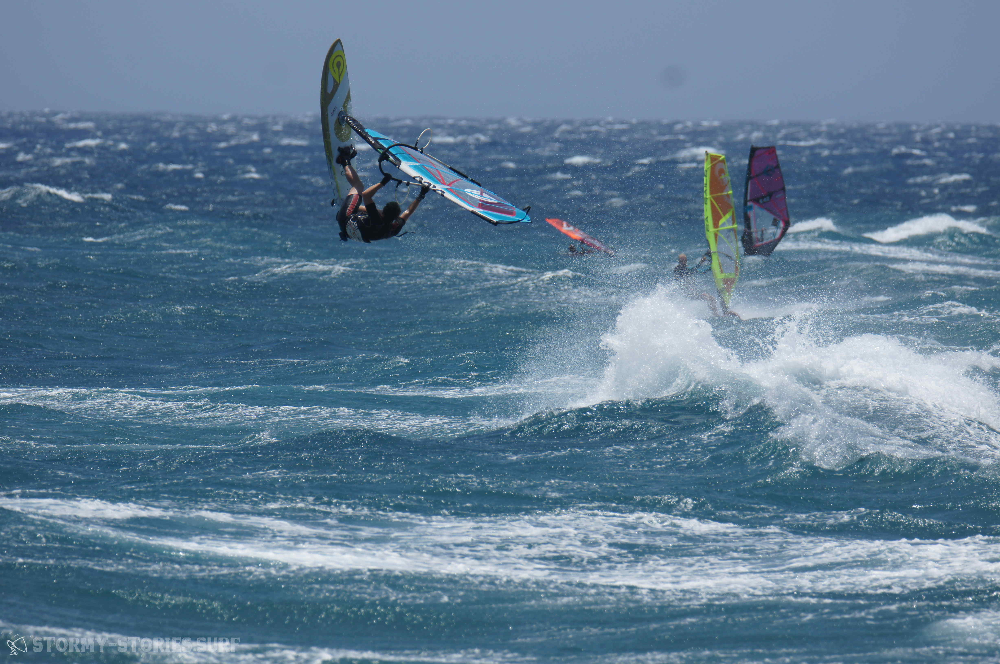

# Die Autoren

# Jana
Eher so Windsurf-Einsteigerin, aber das hält ja niemanden ab! Ist der Meinung, dass Segel für Wind da sind, für Wellen wurde das Wellenreiten erfunden. Fasziniert vom Freestyle. Fahrerin des knallorangen Partybus.

| Wohnort:         | Hamburg, Germany      |
|------------------|-----------------------|
| Homespot:        | Fehmarn               |
| Lieblings-Spots: | Gold (Fehmarn, GER)   |
|                  | Tonel (POR)           |
|                  | Cadiz Cortadura (ESP) |
| Hobbys:          | Windsurfen            |
|                  | Wellenreiten          |
|                  | Klettern              |
|                  | Technik               |
|                  | Bücher                |
|                  | Musik                 |

# Marcel

TODO

# Andre

Soweit ich mich erinnern kann, hat es mir an der See schon immer gut gefallen. Das raue, nass-kalte und oft stürmische Wetter hat mich dabei eigentlich nie weiter gestört. Auch Sport habe ich schon immer geliebt. Alles was es auszuprobieren gab, wollte ich auch ausprobieren. 2003?? stand ich das erste Mal in Italien auf einem Windsurf-Board. Das hat mir grundsätzlich schon eine Menge Spaß gemacht. Doch ein paar Jahre später raste ich dann zum ersten mal, vollkommen unkontrolliert und überpowered in voller Gleitfahrt mit dem Windsurf-Board über den Wulfener Hals in Fehmarn. Seit diesem Moment hat das Windsurfen mein Leben nachhaltig verändert. Ich gehöre jetzt zur Gemeinschaft der Süchtigen. Windsurfen ist komplizierter und anspruchsvoller als alles andere, das ich jemals ausprobieren konnte. Investiert man jedoch die Energie und Zeit ein grundlegendes Level zu erreichen, wird man belohnt : ein unvergleichbarer Adrenalin-Rausch, gepaart mit dem Gefühl in völliger Freiheit über das offene Meer zu rauschen, unbegrenzte Möglichkeiten der Steigerung und ein guter Grund die schönsten Orte der Welt zu bereisen und dort die entspanntesten Menschen der Welt kennenzulernen.
Neben dem Windsurfen ist mein höchstes Gut die Gleichheit aller Menschen - ungeachtet ihrer Herkunft, Religion oder Sexualität.
Hat man diese Sachen verstanden, hat man auch mich verstanden.

| Wohnort:         | Erlangen, Germany               |
|------------------|---------------------------------|
| Homespot:        | Brombachsee (DEU)               |
| Lieblings-Spots: | Heiligenhafen (DEU)             |
|                  | Hanstholm (DNK)                 |
|                  | Pozo Izquierdo (ESP)            |
|                  | Brandon Bay (IRE)               |
| Lieblings-Setup: | Starboard Kode 92               |
|                  | North Sails Idol 4.2            |
| Hobbys:          | Windsurfen, Longboarden,        |
|                  | Snowboarden, Fotografieren,     |
|                  | Programmieren, Texte schreiben  |
