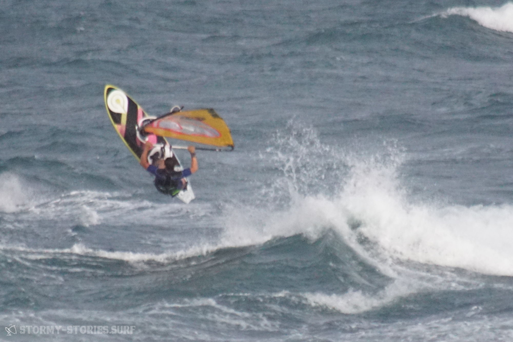

# The authors

# Jana
Rather a windsurfing-beginner, but never mind this will not stop me! I think sails are actually made for windsurfing and not for waves. For this someone invented surfing! Fascinated by Freestyle-Windsurfing and driver of the very orange partybus.

| Living at:       | Hamburg, Germany      |
|------------------|-----------------------|
| Homespot:        | Fehmarn (GER)         |
| Favourite-Spots: | Gold (Fehmarn, GER)   |
|                  | Tonel (POR)           |
|                  | Cadiz Cortadura (ESP) |
| Interested in :  | Windsurfing           |
|                  | Surfing               |
|                  | Climbing / Bouldering |
|                  | Technical topics      |
|                  | Books                 |
|                  | Music                 |

# Marcel

I have been surfing and taking photos for a number of years, even if only on an amateur / hobby level and for myself. When Andre then came up with the idea of combining both in one blog, I was very enthusiastic. Even if I'm really not the "writer" and always find it a bit difficult, you'll get a few more pictures from me ;)
I travel with Jana and Andre as much as possible to get to know beautiful landscapes, nice people and cool spots and to develop my skills a bit :)

| Living at:       | Hamburg, Germany       |
|------------------|------------------------|
| Homespot:        | Fehmarn                |
|                  | Sahlenburg             |
| Favourite-Spots: | Heiligenhafen (GER)    |
|                  | Magheroarty (IRE)      |
|                  | Brandon Bay (IRE)      |
|                  | Pozo Izquierdo (ESP)   |
| Favourite-Setup: | Hifly Madd 90          |
|                  | Avanti Sails Viper 4.0 |
| Hobbys:          | Windsurfing            |
|                  | Photograpyh            |
|                  | Programming            |
|                  | Working on cars / motorbikes              |
|                  | Motorbiking            |
|                  | Surfing                |
|                  | Snowboarding           |
| Musik:           | Metalcore A-Z          |

# Andre

As far as I can remember, I have always liked the sea. The rough, wet, cold and often stormy weather never really bothered me. I've always loved sports too. I wanted to try everything there was to try. In 2002 Marcel and I stood on a windsurf board in Italy for the first time. Basically, I had a lot of fun with that. But a few years later I raced for the first time completely uncontrolled and overpowered in full planing with the windsurf board over the Wulfener Hals in Fehmarn. Since that moment, windsurfing has changed my life forever. I'm part of the addict community now. Windsurfing is more complicated and demanding than anything else I've ever tried. However, if you invest the energy and time to reach a basic level, you will be rewarded: an incomparable adrenaline rush, coupled with the feeling of rushing across the open sea in complete freedom, unlimited possibilities for improvement and a good reason to travel the most beautiful places in the world and to get to know the most relaxed people over there.
Besides windsurfing, my greatest good is the equality of all people - regardless of their origin, religion or sexuality.

| Living at:       | Erlangen, Germany                   |
|------------------|-------------------------------------|
| Homespot:        | Brombachsee (GER)                   |
| Favourite-Spots: | Heiligenhafen (GER)                 |
|                  | Hanstholm (DNK)                     |
|                  | Pozo Izquierdo (ESP)                |
|                  | Brandon Bay (IRE)                   |
| Favourite-Gear:  | Starboard Kode 92                   |
|                  | North Sails Idol 4.2                |
| Interested in:   | Windsurfing, Skating (Longboarding) |
|                  | Snowboarding, Photographing,        |
|                  | Programming, Writing                |
