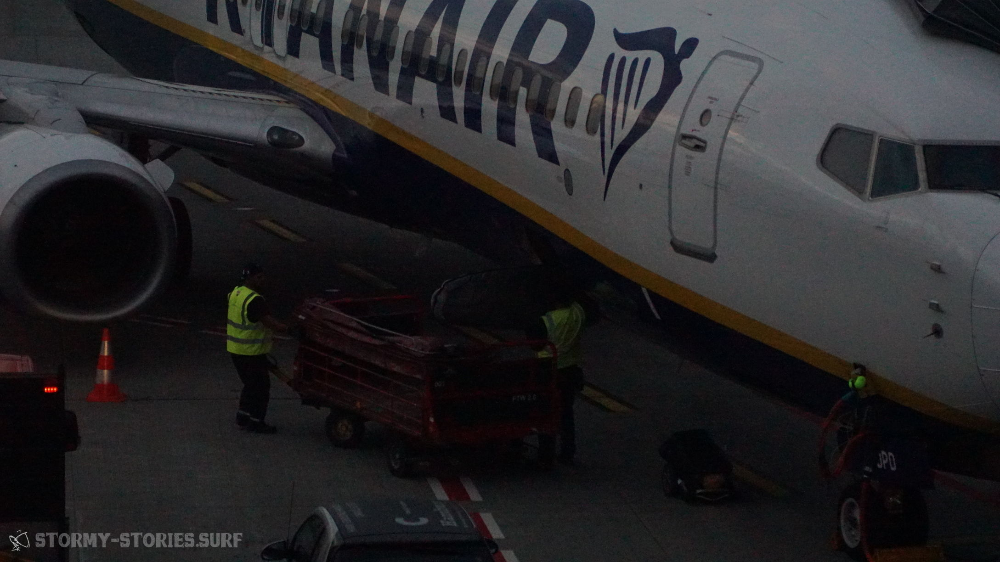
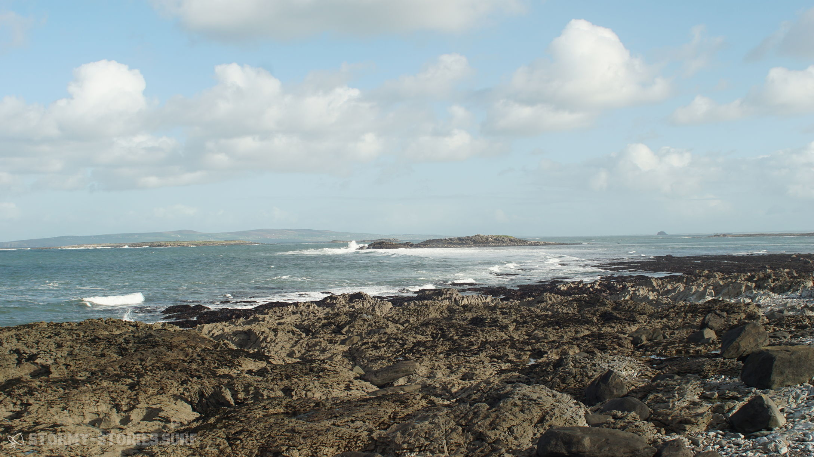
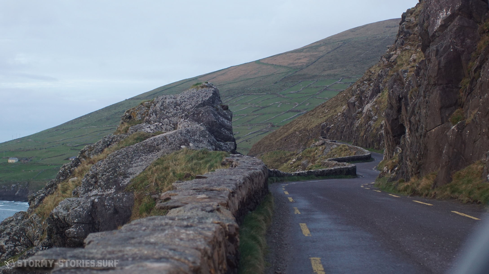
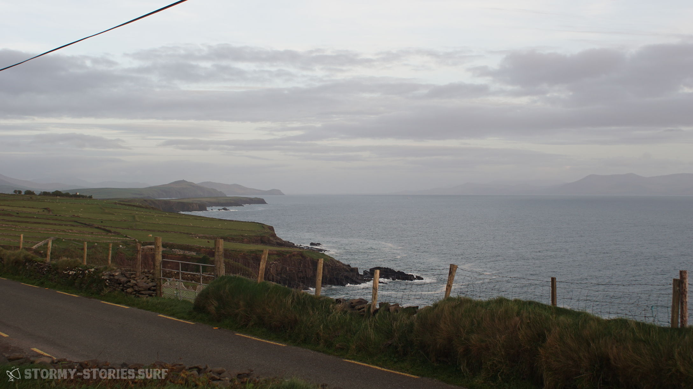
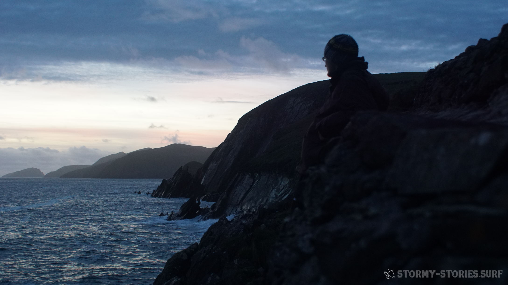

# Irland 2017 : Ankunft

„Ireland was always on the top of my list. Ireland, Ireland, Ireland. Cause in the winter it’s just battled with storms.“ Duncan Coombs (Red Bull Storm Chase)

Irland war für uns immer schon eine Insel. Ein Insel wie viele anderen Inseln auch. Ungefähr vergleichbar wahrscheinlich mit – vielleicht – Borkum. Ja Borkum oder vielleicht Kreta. Das waren Inseln. Eben jeweils ein Stück Land mit relativ viel Wasser drum herum. Anders als andere Inseln sollte es hier aber nicht einmal wirklich sonnig und warm sein, so hatte man gehört. Irgendjemand hatte es auch für nötig gehalten das kleine Land in zwei noch kleinere Teile zu teilen. Etwas komisch, aber auch davon hatte man schon gehört.

  
  

Im frühen Winter 2013 sahen wir, wie wahrscheinlich viele andere auch, Irland dann zum ersten mal durch die Windsurf-Brille.  
Aus irgendeinem Grund hatte diese kleine grüne Insel es auf die Liste von sehr wenigen ausgewählten Spots des Red Bull Storm Chase geschafft.  
Naja soweit eigentlich auch nicht weiter verwunderlich. Für das Red Bull Storm Chase brauchte es in erster Linie einmal zweierlei Dinge:
Wind und Wellen. Und vielleicht noch etwas Regen, damit die Bilder ein wenig radikaler und unangenehmer wirken. Diese Bedingungen schien Irland auf den ersten Blick erst einmal alle ganz gut zu erfüllen. So weit man gucken konnte, war da eigentlich nichts auf der Karte, was die kleine Insel vor größeren Unruhen auf dem Atlantik hätte schützen können. Wind und Wellen aus Richtung Westen hatten hier völlig freie Fahrt.

Als man dann die ersten Bilder und Videos des Contests sehen konnte, blieb zumindest uns ein bisschen die Spucke im Halse stecken. Dass das, was wir da sahen gerade Windsurf-Geschichte schrieb, war uns genauso klar, wie das wir in diesen Bedingungen keine zehn Minuten überleben würden. Wie bei vielen Extrem-Sportarten, und das was man hier sah, war Extrem-Sport, war die Begeisterung riesig. Aber, dass wir an diesem Ort jemals fahren könnten, schlossen wir heimlich eigentlich kategorisch aus.

  
  

Mit der Zeit stieg dann zunehmend unsere Motivation im Windsurfen doch einmal besser zu werden und eines Tages einmal zumindest die Basics des Windsurfens in der Welle zu beherrschen.  
Doch unsere Bemühungen erwiesen sich lange Zeit als wenig erfolgreich.  
Das Ganze zeichnete sich eher als eine salzwasser-schluckende, deprimierende Geduldsprobe ab.   Erfolgserlebnisse waren rar.. Ungefähr so rar wie die Möglichkeiten einer professionellen Wave-Schulung in erreichbarer Nähe. Prinzipiell gab es Angebote genug. Jedoch eher so in Richtung Mexiko, Marokko, Brasilien, Hawaii. Alles leider eher nicht so mit dem Studenten-Geldbeutel vereinbar.

Das näheste und bezahlbarste Ziel schien tatsächlich Irland zu sein. Irland in der Brandon Bay. Genau dort also, wo auch der Red Bull Storm Chase stattgefunden hatte. Wie es wohl wäre dort zu surfen? Eine Faszination gemischt mit Ehrfurcht packte uns damals.  
Die Bilder vom Storm Chase hatten wir immer noch im Kopf und so kam es, dass ich mir erst 2016 zutraute mich bei der Windsurf-Clinic in der Brandon Bay anzumelden.
Nachdem diese Entscheidung getroffen war, war Irland plötzlich überall. An jeder Ecke fanden sich plötzlich Bilder, Filme und Berichte die im Grunde immer das Selbe über die Insel auszusagen schienen :

- Wind ohne Ende,
- Wellen ohne Ende – so lang und sauber wie man sie sich kaum vorstellen konnte -,
- und naja Regen ohne Ende.

Als die Clinic, dann leider für genau dieses Jahr abgesagt werden musste, war die Stimmung unerträglich tief im Keller. Irland war schon so fest im Kopf verankert, dass es dieses Jahr einfach dort hingehen musste. Und so kam es dann auch. Der Windsurf-Coach wurde durch eine Landkarte, einen Spotguide und eine wunderschöne weibliche Begleitung getauscht. Also alles in allem auch nicht gerade schlecht.

Zwei irische Wochen später hatte ich damals in 2016 die längsten und saubersten Wellen meines Lebens gesurft. Auf dem Wellenreiter genauso wie auf dem Windsurf-Board. Insgesamt waren es nicht viele gewesen, aber trotzdem : Ich war infiziert. Ich hatte das Gefühl dort in diesen perfekten Bedingungen in wenigen Tagen mehr als in Deutschland in mehreren Jahren gelernt zu haben. Alles schien dort erreichbar, nichts mehr unmöglich. Zukünftig musste sich jede Welle an jedem Strand und in jedem Video zuerst einmal mit den Wellen in Irland messen. Und auch der Regen hatte uns verschont.

Auf der zwei wöchigen Reise quer durchs Land hatte uns der Regen vielleicht zwei oder dreimal kurz begrüßt und war dann relativ schnell wieder von der Sonne vertrieben worden.

Nun schrieben wir ein Jahr später, 2017. Es sollte im Herbst 10 Tage lang irgendwo in die Welle gehen. Diesmal sollte es als Geschwister-Surf-Urlaub zu zweit losgehen. Die Frage war nur: wohin? Tagelang checkten wir immer wieder alle möglichen Spotguides, Flugpläne, Windstatistiken. Aber am Ende fielen wir immer wieder auf Irland zurück.

Irland bietet für eine Windsurf – Reise eine ganze Menge Nachteile. Es gibt wenig Flughäfen, die aus Deutschland angeflogen werden. Es gibt kaum Möglichkeiten an den Spots Windsurf-Material zu leihen und das schlimmste von allem : Mietwagen gibt es per Gesetz erst ab einem Alter von 25 Jahren. Doch es brachte nichts. Im Herbst führte kein Weg vorbei an Irland.

Kurze Zeit später war der Urlaub genehmigt und die Flüge gebucht.  
Hier wiederum wurden uns allerdings relativ schnell auch die Vorteile eines Urlaubs im November in Irland klar : „Da will einfach keine Sau hin..“ – so viel zumindest schienen die Flugpreise uns zu verraten.

Wir hingegen waren uns sicher. Wir wollten auf jeden Fall hin. Mit jeder Woche die verstrich ein kleines bisschen mehr. In den Wochen vor dem Abflug überbot jede Vorhersage die vorherige. Anderthalb bis zwei Monate tobte ein Sturm nach dem anderen über die Insel. Bei diesen Aussichten war es dann tatsächlich auch verkraftbar, dass wir durch die Urlaubsvorgaben unserer Jobs statt dem geplanten Traumflugpreis von 30€, 100€ pro Person für Hin und Rückflug bezahlten.

  
  
     

  
    

Als Airline wurde dieses mal Ryanair ausgewählt. Im Jahr zuvor hatte ich mich dies nicht getraut, da es scheinbar nirgends offizielle Informationen zu geben schien, ob Ryanair mein Surf-Gepäck, dass die lächerlichen vorgegeben Gurtmaße überschritt, transportieren würde. Selbst nach etlichen Gesprächen im Flughafen und im Ryanair – Chat konnte niemand etwas verbindliches hierzu sagen. Damals entschied ich mich dann für den 200 € teureren Flug von KLM, da ich mir hier sicher war, am Ende nicht ohne mein Windsurf-Equipment am Flughafen zu stehen. In Irland lernte ich 2016 dann von anderen Windsurfern, dass meine Sorge vollkommen unberechtigt gewesen war und so entschieden wir uns dann 2017 auch für den Billig-Flieger.

Die Gepäck-Bestimmungen waren im Jahr 2017 nun etwas überarbeitet worden. Für unsere Anforderungen buchten wir drei mal „größere Sportausrüstung“ für 50 € pro Tasche und eine Strecke und einen zusätzlichen Koffer für 40 €. Ein Session-Board-Bag von Prolimit enthielt ein Board, die Masten und ein Segel. Ein zweiter, deutlich zu großer Boardbag enthielt ein weiteres Board und einige Segel. Eine alte Segel-Tasche von Gunsails enthielt alle weiteren Segel und zwei Gabelbäume. In einen zusätzlichen Koffer kam das übliche Surf-Werkzeug, Mastfüße, Mastverlängerungen, Trapeze, aufblasbare Dachgepäckträger, dicke warme Klamotten und ein warmer Überwurf Mantel namens Dryrobe.  
In zwei Handgepäck-Koffer wurde dann mit ausreichender Kompression alles weitere an Klamotten und jeweils ein Neopren-Anzug gezwängt.

Wir wollten so wenig Kompromisse wie möglich eingehen und lieber ein Segel zu viel, als eines zu wenig dabei haben. Doch beim Packen mahnte unsere Waage uns leider immer wieder zur Einsicht das ein oder andere auszupacken. Am Ende fiel unsere Material-Auswahl auf zwei 90 Liter Wave-Boards und acht Segel zwischen 3.5 und 6.2 Quadratmeter, drei Masten und zwei Gabelbäumen um möglichst alle Bedingungen abdecken zu können.

Der Weg zum Hamburger Flughafen verlief absolut problemlos und so standen wir bereits drei Stunden vor Abflug vor einem verlassenen Ryanair Schalter. Ganz so kompromissbereit waren wir am Ende dann doch nicht gewesen und so hatten drei der vier Gepäckstücke 22 statt 20 Kilo auf den Rippen. Etwas nervös warteten wir und hofften darauf dem Wiegen irgendwie entgehen zu können. Dieser Wunschtraum wurde uns leider nicht erfüllt. Dafür wurden wir jedoch mit einer besonders motivierten Mitarbeiterin belohnt. Ihr leerer, gelangweilter Blick lies mich hoffen, dass sie keine Lust auf Diskussionen hatte. Nach dem ich beim Ablegen der Taschen vergas, diese wieder loszulassen, brachten alle Taschen auf wundersame Weise ziemlich genau 20 Kilo auf die Waage und kurze Zeit später standen wir mit unseren gelabelten Taschen am Sperrgepäck-Schalter.

Im Jahr zuvor hatte ich gelernt, dass das Reisen in Irland einfach und spontan möglich ist und man nicht all zu viel vorher planen muss.  
In nahezu jedem kleinen Dorf finden sich Übernachtungsmöglichkeiten wie zum Beispiel Bed & Breakfast oder Hostels. Die Preise variieren hier zwischen ca. 30 und 60 € pro Nacht für zwei Personen, wobei ein klein bisschen Handeln fast immer möglich ist. Unser Flug sollte um 17:30 in Dublin landen, so dass wir uns für die erste Nacht schon im voraus eine Unterkunft im Harbour House Bed & Breakfast in der Brandon Bay buchten. (https://maharees.ie/)

Der Flug verlief bis auf eine Stunde Verspätung problemlos und all unser Material kam heile und komplett in Dublin an.  
Weniger erfolgreich lief es, wie auch schon im Jahr zuvor, beim Abholen des Mietwagens. Wir hatten uns wie auch schon im Jahr zuvor tagelang durch verschiedenste Mietwagen-Firmen geklickt, telefoniert und E-Mails geschrieben. Aber aufgrund gesetzlicher Vorschriften scheint es in Irland nicht möglich zu sein im Alter von 23 Jahren offiziell ein Auto mieten zu können. 2016 hatte ich nach etwas Überzeugungsarbeit und mit dem Verweis darauf, dass ich aufgrund von mehr als 6 Jahren Fahrpraxis theoretisch ein Fahrzeug bekommen müsste, das kleinste Auto der Flotte bekommen : einen Peugeot 108. Was damals zwar störend aber am Ende irgendwie machbar und witzig war, wollten wir dieses Jahr mit doppelt so viel Surf-Material unbedingt vermeiden.  
Nach dem wir endlich jemanden gefunden hatten, der uns am Telefon versicherte, wir könnten immerhin einen VW Golf mieten, buchten wir und freuten uns, auch wenn eigentlich ein Transporter unser Ziel gewesen wäre. Am Flughafen begann dann wieder das gleiche Spiel wie auch schon ein Jahr zuvor. Nach einer etwas längeren Diskussion bekamen wir das kleinste Auto der Flotte. Wer hätte es gedacht einen Peugeot 108. Etwas verärgert, aber irgendwie auch froh ging es ins Parkhaus ans beladen. Keiner sprach es aus, aber irgendwie schien es nicht möglich zu sein, das alles in diesem Auto unterzubringen.
Wir packten ein und wieder aus, ein und wieder aus, aber es wollte einfach nicht passen. Die Stimmung war kurz vorm kippen, es wurde immer später und die Überwachungskameras im Parkhaus machten uns auch etwas sorgen.
Schließlich wollten wir unser Auto auch nicht gleich wieder abgeben müssen. Etwas nervös ging es also weiter und nach einigen Anläufen war dann tatsächlich alles drin und es ging los in den Linksverkehr und ab Richtung Brandon Bay.

Ich wache auf und höre nichts – also zumindest wenn man mal dem leisen Piepen in meinem Ohr absieht – ruhige, durchdringende Stille. Kein Verkehr, keine lärmenden Menschen, keine Maschinen, einfach nur Stille. Mein Bruder liegt ein Bett weiter und schläft noch. Durchs Fenster kann ich die strahlende Sonne sehen. Ein paar grüne Wiesen liegen getrennt durch alte Steinmauern an einer kleinen Bucht. Im Hintergund sieht man blass einige Berge. Ich gehe zum Fenster und öffne es. Es bleibt still, nur leise hört man nun das Rauschen des Meeres.

Gestern Nacht hatten wir uns auf der Suche nach einer Tankstelle immer wieder verfahren. Durch die Verspätung des Flugs und das Abholen und Beladen des Mietwagens hatten wir außerdem viel Zeit verloren und so waren wir erst um zwei Uhr nachts in der Brandon Bay angekommen. Hier hatte uns der Herr des Hauses im Bademantel freudig strahlend erwartet und uns zu unserem Zimmer geführt. Wir hatten vorher versucht es ihm auszureden und telefonisch angeboten, dass wir die Nacht im Auto schlafen würden. Doch die Gastfreundlichkeit der Iren schien dies nicht für eine vertretbare Option zu halten.

Nach einiger Zeit wachte mein Bruder auf. Wir genossen die Ruhe und die bequemen Betten und unterhielten uns dann darüber, wann wir das letzte mal eine solche Stille erlebt hatten. Im täglichen Arbeitsstress und dem hektischen deutschen Leben schien das schon lange her zu sein. Dann ging es zum Frühstück. Wir bekamen den besten Platz direkt am Fenster und hatten den direkten Blick auf den Storm-Chase-Spot „Hell’s Gate“. Man konnte die Größe der Wellen nicht richtig einschätzen. Aber allzu groß schienen sie nicht zu sein. Da für den heutigen Tag aber auch keinerlei Wind angesagt war, ließen wir uns Zeit und genossen erst einmal Spiegelei und Bacon.

Anschließend erkundeten wir zu Fuß die kleine Landzunge „Maharees“. Der Spot Hell’s Gate zeigte bei Ebbe, dann auch den Grund für seinen vielversprechenden Namen. Hier ragten mannshohe zerklüftete Felsen in den merkwürdigsten Formationen vom Grund nach oben. Einer brutaler als der Nächste.

Am Nachmittag erkundeten wir dann schon einmal alle üblichen Spots und fuhren über den Connor’s Pass nach Dingle und von dort aus die malerisch schöne Küstenstraße Slea Head Drive entlang, die einmal rund um die westlichsten Zipfel der Dingle-Peninsula führt.

Es war ein schöner Tag, zwar ohne Wind, aber dennoch einfach wunderbar entspannend und somit typisch irisch.
