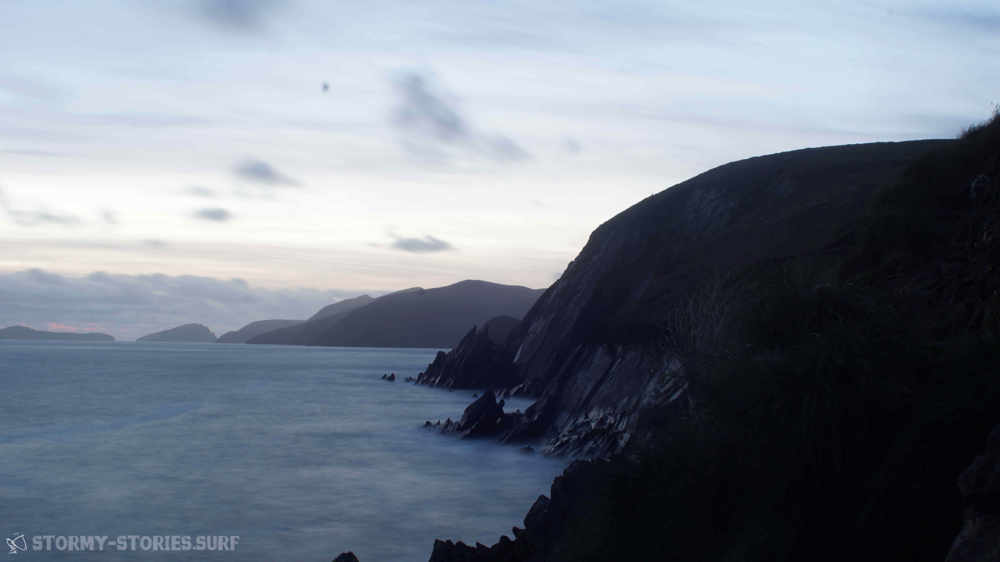

# Ireland 2017 : Arrival

„Ireland was always on the top of my list. Ireland, Ireland, Ireland. Cause in the winter it’s just battled with storms.“ Duncan Coombs (Red Bull Storm Chase)

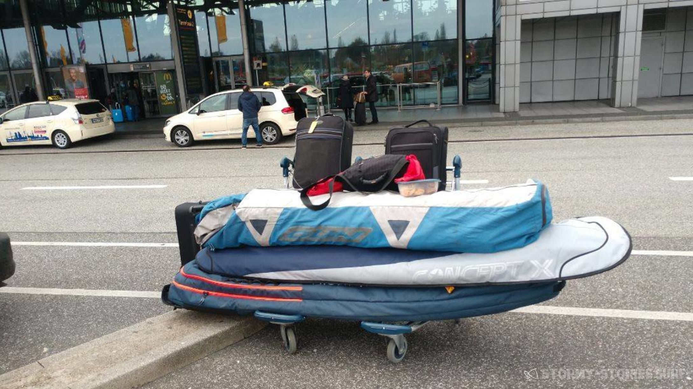

Ireland has always been an island for us. An island like many other islands. Probably roughly comparable to - perhaps - Borkum. Yes, Borkum or maybe Crete. They were islands. Just a piece of land with a relatively large amount of water around it. But unlike other islands, it wasn't even supposed to be really sunny and warm here, or so we had heard. Someone had also thought it necessary to divide the small country into two even smaller parts. A bit strange, but we had heard about that too from other places.

  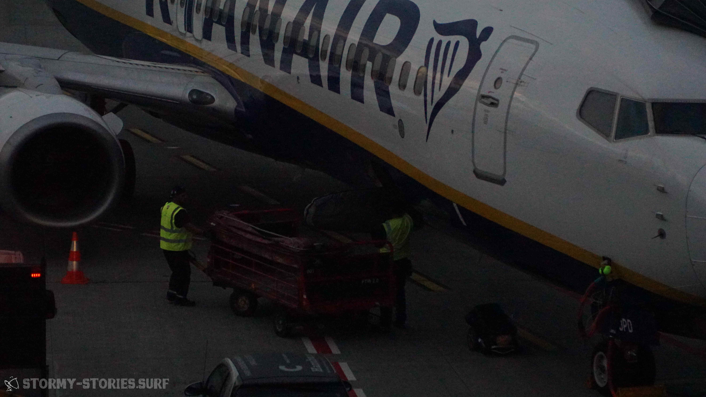
  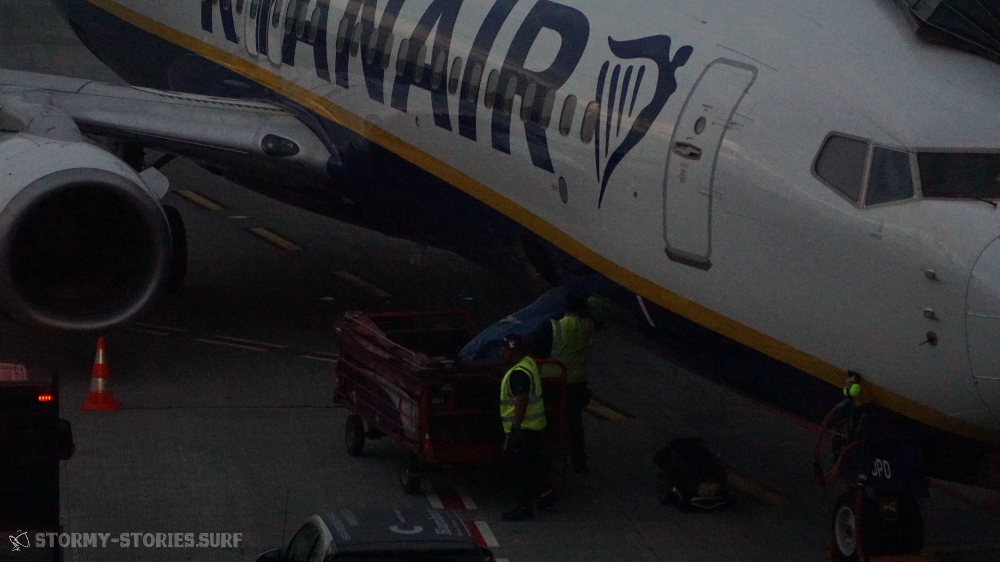

In the early winter of 2013, we, like probably many others, saw Ireland through windsurfing glasses for the first time.  
For some reason, this little green island had made it onto the list of very few selected spots for the Red Bull Storm Chase.  
Well, not really surprising so far. First and foremost, the Red Bull Storm Chase needed two things:
Wind and waves. And perhaps some rain to make the images look a little more radical and unpleasant. At first glance, Ireland seemed to fulfill all of these conditions quite well. As far as we could see, there was nothing on the map that could have protected the small island from big storms on the Atlantic. Wind and waves from the west have completely free entrance here.

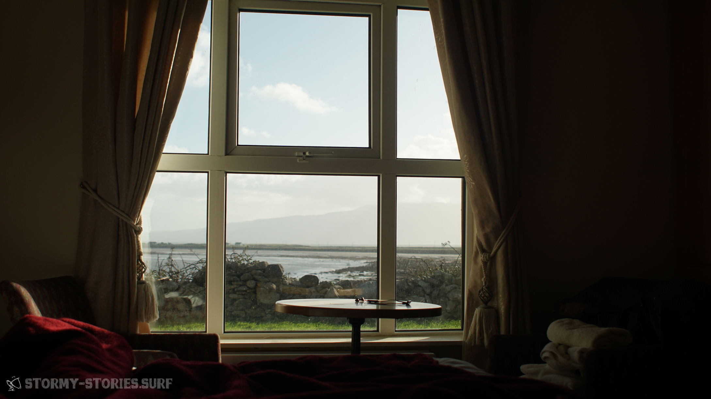

When we saw the first pictures and videos of the contest, our jaws dropped a little. Two things were just clear to us immediately: 1. That what we were seeing here was making windsurfing history and 2. That we wouldn't survive ten minutes in these conditions. As with many extreme sports, and what we saw here was EXTREME sport, the excitement was huge. But we secretly categorically ruled out that we would ever be able to sail in this place.

  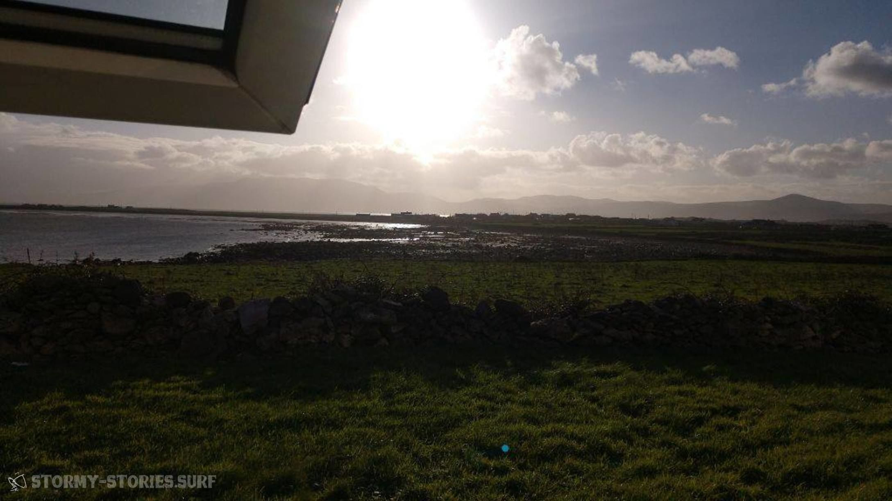
  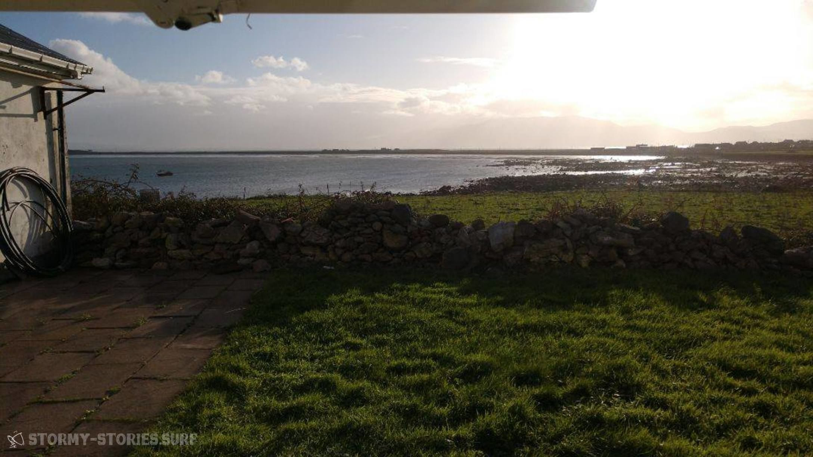

Over time, our motivation to get better at windsurfing and one day master at least the basics of windsurfing in the waves increased.  
However, our efforts proved to be unsuccessful for a long time.  
The whole thing turned out to be more of a depressing, saltwater-swallowing test of patience. Success was rare. About as rare as the opportunities for professional wave training within easy reach. In principle, there were plenty on offer. But more in the direction of Mexico, Morocco, Brazil, Hawaii. Unfortunately, none of them were compatible with our student wallets.

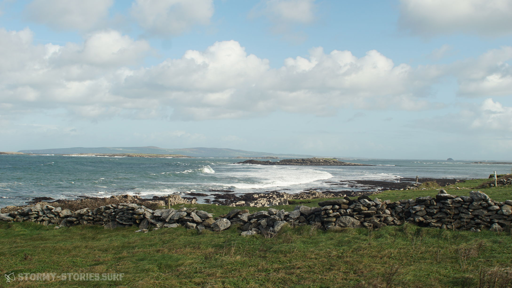

The closest and most affordable destination actually seemed to be Ireland. Ireland in Brandon Bay. Exactly where the Red Bull Storm Chase had taken place. What would it be like to sail there? A fascination mixed with awe gripped us at the time.  
We still had the images of the Storm Chase in our heads and so it wasn't until 2016 that I had the confidence to sign up for the windsurfing clinic in Brandon Bay.
Once this decision was made, Ireland was suddenly everywhere. There were suddenly pictures, films and reports on every corner that always seemed to say the same thing about the island:

- wind non-stop,
- waves non-stop - as long and clean as you could hardly imagine -,
- and well, rain non-stop.

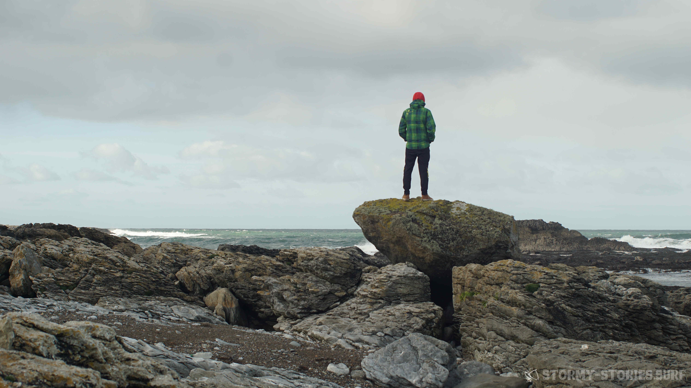

When the clinic unfortunately had to be canceled for this very year, the mood was unbearably low. Ireland was already so firmly anchored in our minds that we simply had to go there this year. And so it happened. The windsurfing coach was replaced by a map, a spot guide and a beautiful female companion.

So all in all, not too bad either.

Two Irish weeks later, I had windsurfed the longest and cleanest waves of my life back in 2016. On the surf-board as well as on the windsurf-board. In total I didn't had my waves, but I was still infected. I had the feeling that I had learned more in a few days in these perfect conditions than I had in several years in Germany. Everything seemed achievable there, nothing seemed impossible. In future, every wave on every beach and in every video would have to compete with the waves in Ireland. And even the rain had been kind to us.

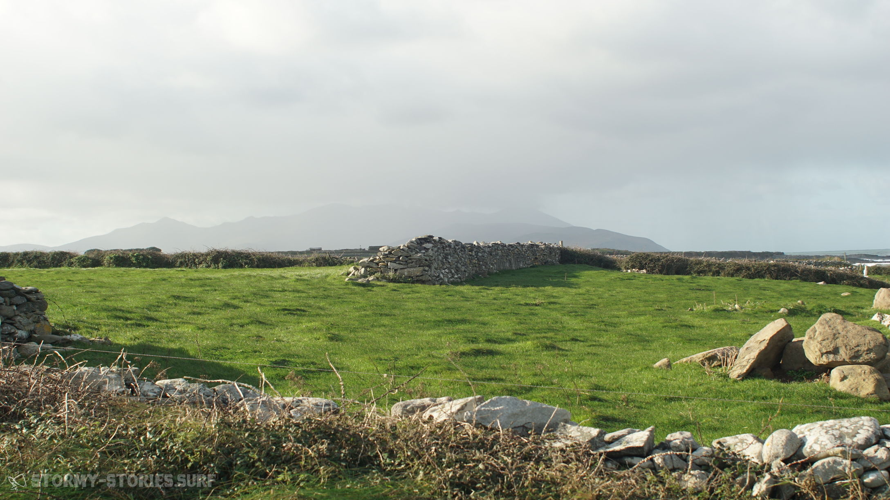

On the two-week trip across the country, the rain had greeted us briefly perhaps two or three times and was then driven away again relatively quickly by the sun.

It was now a year later, 2017, and we were supposed to go windsurfing somewhere for 10 days in the fall. This time the plan was a brother's-windsurfing-trip for two. The only question was: where? We spent many days checking all kinds of spot guides, flight plans and wind statistics. But in the end, we always kept coming back to Ireland.

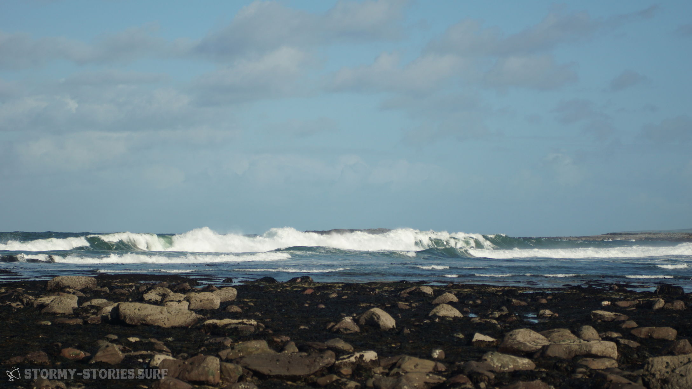

Ireland offers a lot of disadvantages for a windsurfing trip. There are few airports to fly to from Germany. There are hardly any opportunities to rent windsurfing equipment at the spots and, worst of all, rental cars are only available by law from the age of 25. But anyway - in the fall, there was no way around Ireland.

A short time later, the vacation was approved and the flights booked.  
Here again, however, we quickly realized the advantages of a vacation in Ireland in November: "Nobody wants to go there..." - at least that's what the flight prices seemed to tell us.

We, on the other hand, were sure. We definitely wanted to go. With every week that passed, a little bit more. In the weeks leading up to our departure, each forecast exceeded the previous one. For one and a half to two months, one storm after another raged across the island. With these prospects, it was actually bearable that we paid €100 per person for the flight (both directions) instead of the planned dream flight price of €30 due to the vacation requirements of our jobs.

  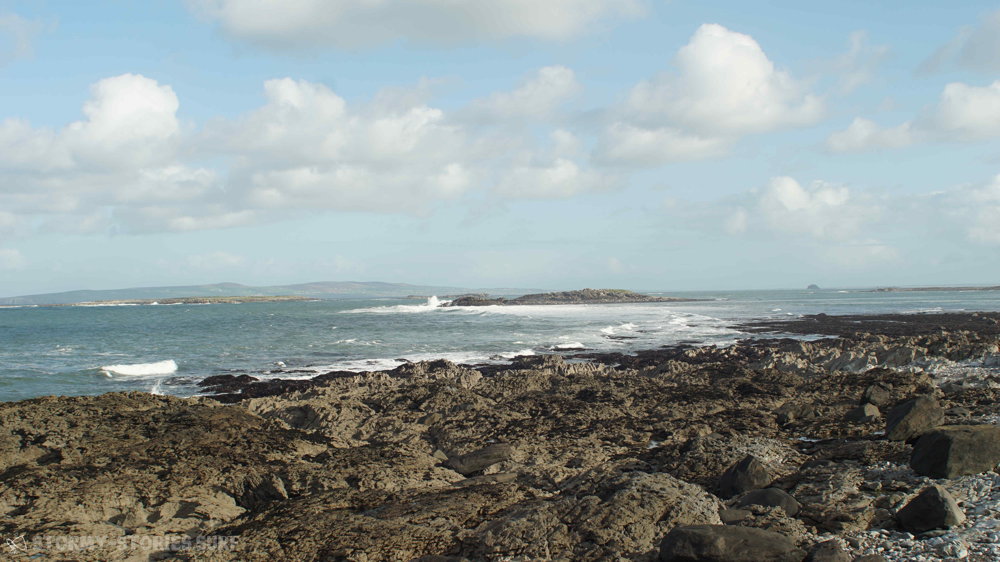
  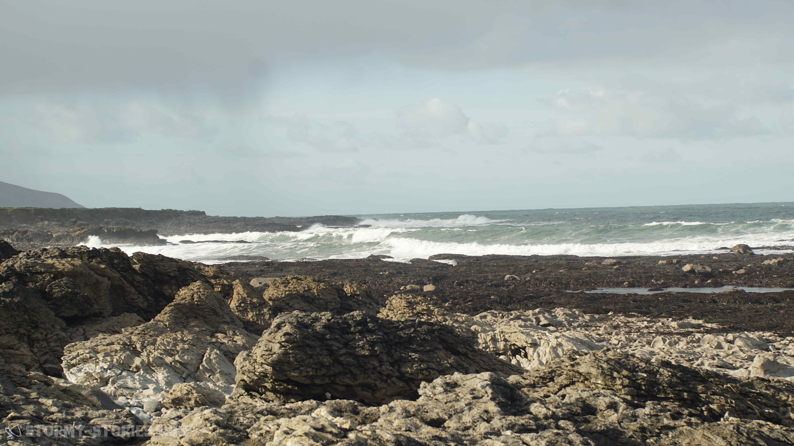
  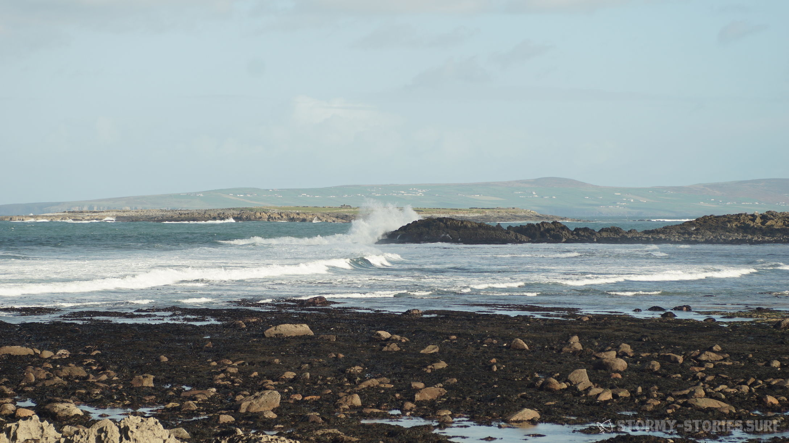   

  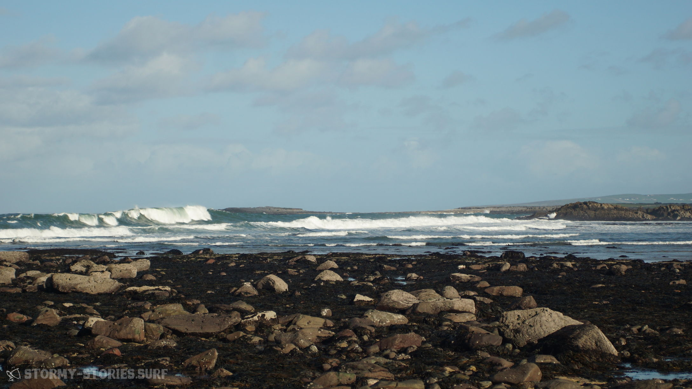
  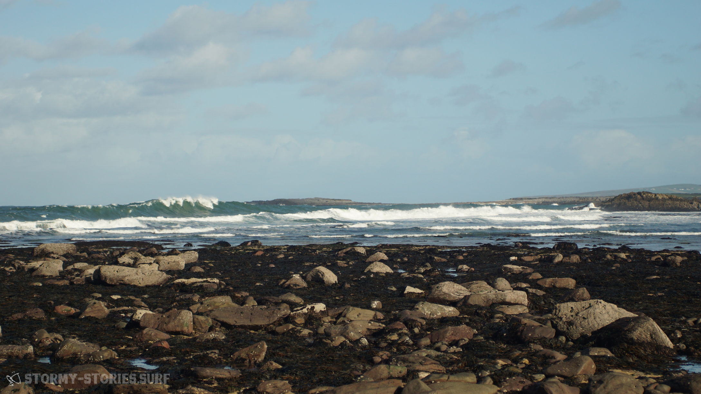  

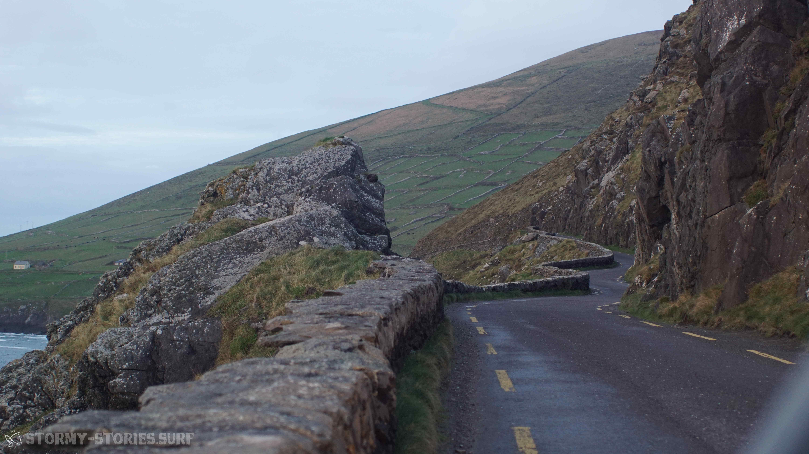

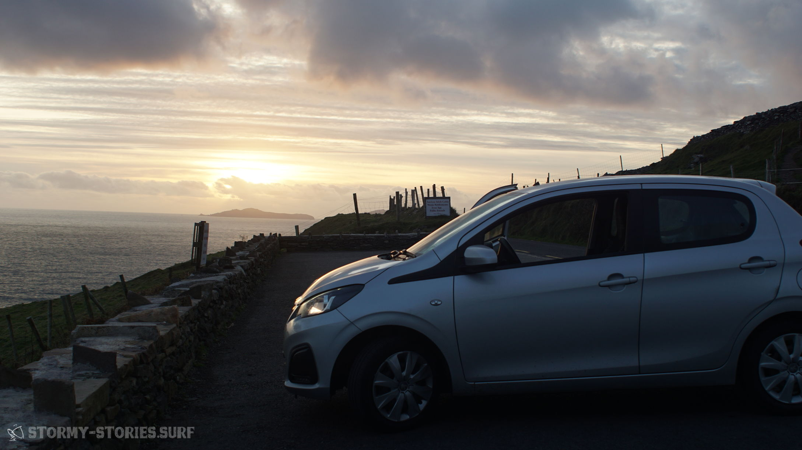

Ryanair was chosen as the airline this time. I hadn't dared to do this the year before, as there didn't seem to be any official information anywhere as to whether Ryanair would transport my windsurfing luggage, which exceeded the ridiculous specified belt dimensions. Even after several conversations at the airport and in the Ryanair chat, nobody could say anything definitive about this. At that time 2016, I opted for the €200 more expensive KLM flight as I was sure that I wouldn't end up at the airport without my windsurfing equipment. In Ireland in 2016, I learned from other windsurfers that my worries had been completely unjustified and so we now also opted for the cheap flight in 2017.

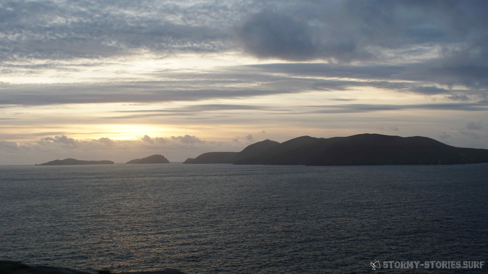

The baggage regulations had now been revised somewhat in 2017. For our requirements, we booked three times "larger sports equipment" for €50 per bag and one way and an additional suitcase for €40. A session board bag from Prolimit contained a board, the masts and a sail. A second board bag, which was clearly too big, contained another board and some sails. An old sail bag from Gunsails contained all the other sails and two booms. An additional suitcase contained the usual surfing tools, mast base, mast extensions, harnesses, inflatable roof racks, thick warm clothes and a warm overcoat called a "Dryrobe".  
All the other clothes and a wetsuit were then squeezed into two carry-on suitcases with sufficient compression.

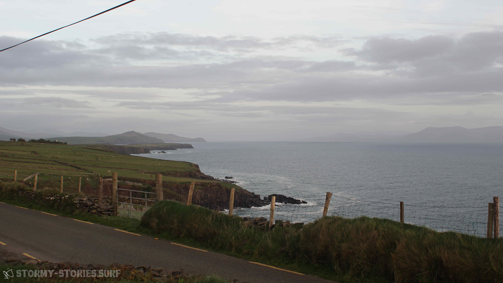

We wanted to make as few compromises as possible and would rather have one sail too many than one too few. Unfortunately, when we were packing, our scales kept reminding us to unpack one or two things. In the end, we chose two 90 liter wave boards and eight sails between 3.5 and 6.2 square meters, three masts and two booms to cover as many conditions as possible.

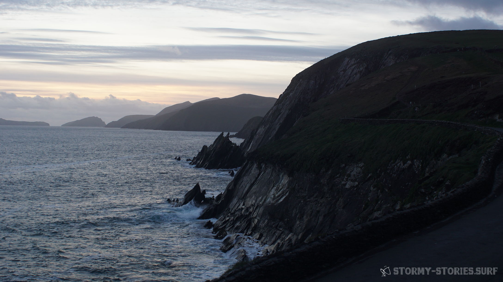

The journey to Hamburg airport went absolutely smoothly and so we were standing in front of a empty Ryanair counter three hours before departure. In the end, we weren't quite so willing to compromise and so three of the four pieces of luggage weighed 22 kilos instead of 20. We waited a little nervously and hoped that we could somehow avoid the weighing. Unfortunately, this dream was not fulfilled. However, we were rewarded with a particularly motivated employee. Her blank, bored look gave me hope that she wasn't in the mood for discussions. After I "forgot" to keep my hands of the bags when I put them down on the scale, all the bags miraculously weighed almost exactly 20 kilos and a short time later we were standing at the oversize luggage counter with our labeled bags.

The year before, I had learned that traveling in Ireland is easy and spontaneous and that you don't have to plan too much in advance.  
There are places to stay in almost every small village, such as bed & breakfasts or hostels. Prices here vary between around €30 and €60 per night for two people, although a little bargaining is almost always possible. Our flight was due to land in Dublin at 17:30, so we booked accommodation for the first night in advance at Harbour House Bed & Breakfast in Brandon Bay. (https://maharees.ie/)

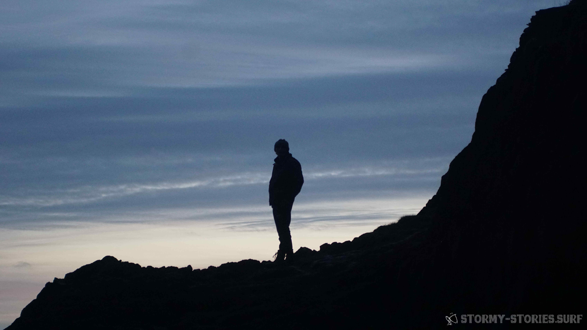

The flight went smoothly apart from an one hour delay and all our equipment arrived in Dublin safe and sound.  
As in the previous year, picking up the rental car was less successful. As in the previous year, we had spent days clicking through various car rental companies, making phone calls and writing emails. But due to legal regulations, it doesn't seem to be possible to officially rent a car in Ireland at the age of 23. In 2016, after a bit of persuasion and pointing out that I should theoretically get a car because I had more than 6 years of driving experience, I got the smallest car in the fleet: a Peugeot 108. What was annoying back then but in the end somehow feasible and funny, we wanted to avoid at all costs this year with twice as much windsurf equipment.  
After we had finally found someone who assured us on the phone that we could at least rent a VW Golf, we booked and were delighted, even though a big van would actually have been our goal. At the airport, the same game began as the year before. After a lengthy discussion, we were given the smallest car in the fleet. Who would have thought it, a Peugeot 108. Somewhat annoyed, but somehow also happy, we went into the parking garage to load up. Nobody said it loud, but somehow it didn't seem possible to fit everything in this car.
We packed and unpacked, packed and unpacked, but it just wouldn't fit. The mood was about to change, it was getting later and later and the surveillance cameras in the parking garage were also causing us some concern.
After all, we didn't want to have to return our car straight away. So we continued a little nervously and after a few attempts, everything was actually in place and we set off into the left-hand traffic and towards Brandon Bay.

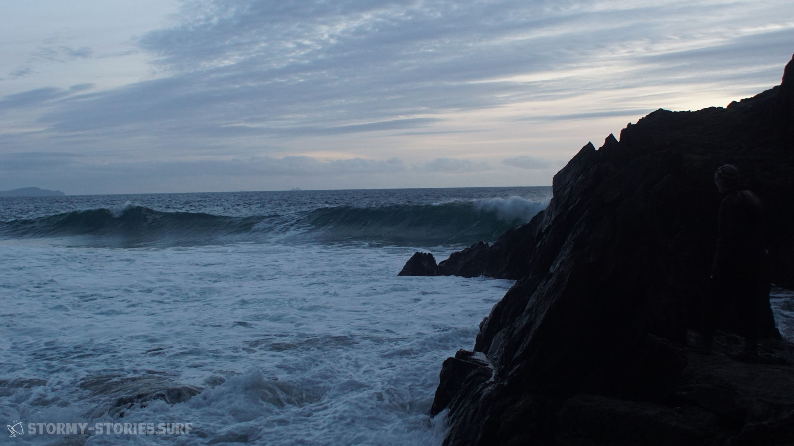

I wake up and hear nothing - at least apart from the quiet beeping in my ear - calm, penetrating silence. No traffic, no noisy people, no machines, just silence. My brother is lying one bed over, still asleep. I can see the bright sun through the window. A few green meadows lie separated by old stone walls on a small bay. A few pale mountains can be seen in the background. I go to the window and open it. It remains quiet, only the sound of the sea can now be heard.

Last night we kept getting lost looking for a gas station. We had also lost a lot of time due to the flight delay and picking up and loading the rental car, so we didn't arrive in Brandon Bay until two o'clock in the morning. The man of the house was waiting for us in a bathrobe, beaming with joy, and showed us to our room. We had tried to talk him out of it beforehand and offered by phone that we would sleep in the car that night. But the hospitality of the Irish didn't seem to think this was an acceptable option.

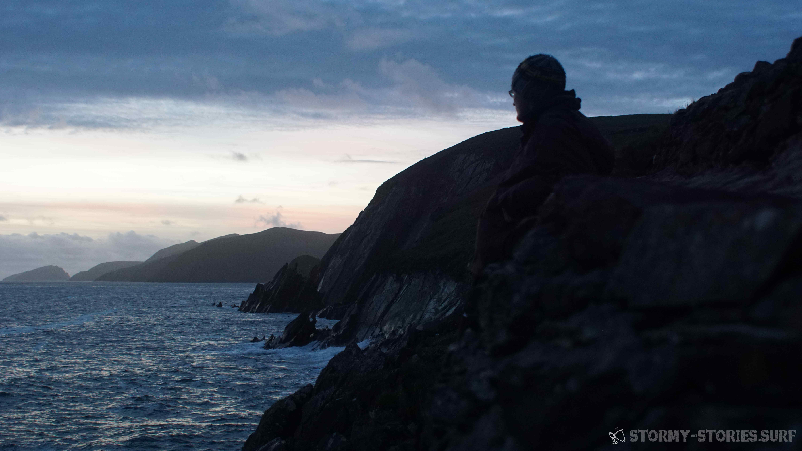

After a while, my brother woke up. We enjoyed the peace and quiet and the comfortable beds and then talked about the last time we had experienced such silence. With the daily stress of work and hectic German life, it seemed a long time ago. Then it was time for breakfast. We got the best seat right by the window and had a direct view of the storm chase spot "Hell's Gate". We couldn't really estimate the size of the waves. But they didn't seem to be too big. As there was no wind forecast for the day, we took our time and enjoyed a fried egg and bacon.

We then explored the small "Maharees" headland on foot. At low tide, the Hell's Gate spot showed the reason for its promising name. Here, jagged rocks as high as a man rose up from the bottom in the strangest of formations. One more brutal than the next.

In the afternoon we explored all the usual spots and drove over Connor's Pass to Dingle and from there along the picturesque coastal road Slea Head Drive, which leads around the westernmost tip of the Dingle Peninsula.

It was a beautiful day, without wind, but still wonderfully relaxing and therefore typically Irish.
