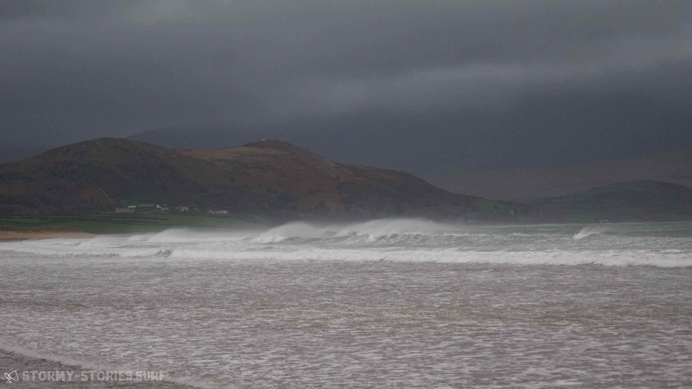

# Irland 2017 : Brandon Bay / Stradbally

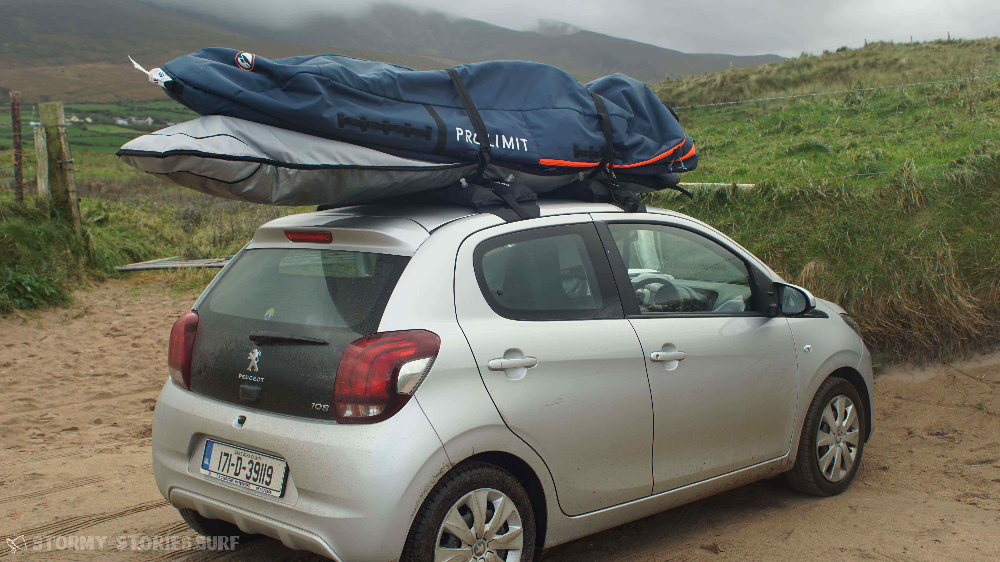

Der zweite Tag auf der grünen Insel begann in etwa genau so wie der Erste. Heute sollte der Wind kommen, allerdings erst gegen zwölf Uhr. Und somit entschlossen wir uns erst einmal auszuschlafen und dann in Ruhe zu frühstücken.  
Nach dem Blick auf die Vorhersage entschieden wir uns unsere Unterkunft noch eine Nacht zu verlängern. Platzmäßig schien das kein Problem zu sein, denn mittlerweile hatten wir immer mehr das Gefühl die einzigen Gäste zu sein - naja November eben.

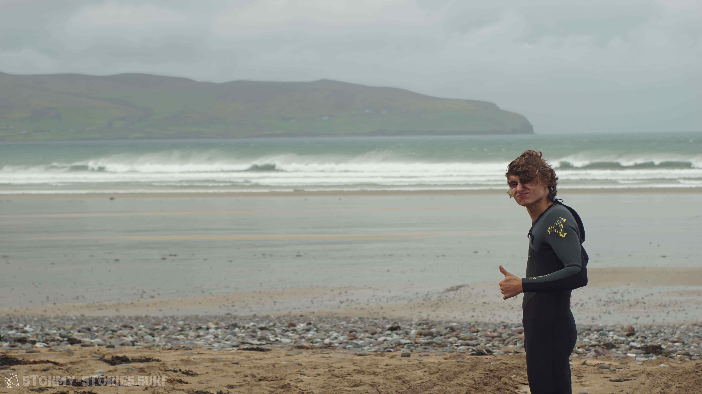

Dann ging es los ins Auto und einmal die Spots abchecken. Zu erst ging es in die Brandon Bay an die Spots Mossies und Dumps. Hier wehte es allerdings etwas zu sehr auflandig und die Wellen sahen garnicht so aus, wie wir uns das vorgestellt hatten. Irgendwie deutlich zu klein und ungeordnet. Mit einem Blick in die sichelförmige Brandon Bay entschieden wir uns weiter Richtung Süden zu fahren. Hier sollte der Wind mit etwas Glück Side-Shore bis Side-Off-Shore kommen.  
Also ging es wieder ins Auto und ab in Richtung Castlegregory. Vorbei an der Marien-Statue und dann rechts ab in Richtung Dingle. Hier fährt man auf einer Anhöhe in Richtung Stradbally und kann aus dem Fenster schön über die ganze Brandon Bay blicken. Im Hintergrund sieht man etwas entfernt den Mount Brandon, der am Ende der Brandon Bay liegt.

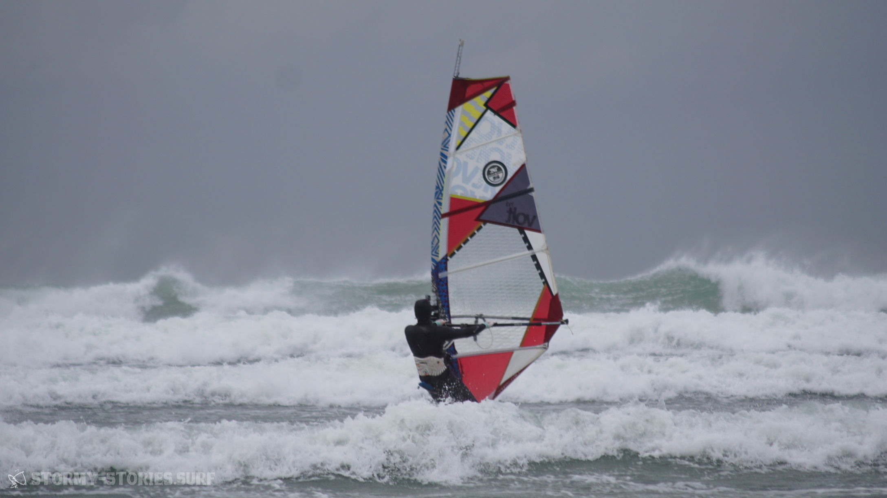

Was man von hier aus sah, gefiel uns schon etwas besser und so ging es dann rechts ab über einen Feldweg in Richtung "STRADBALLY STRAND".
Hier am Stradbally Beach standen bereits zwei große irische Camper.

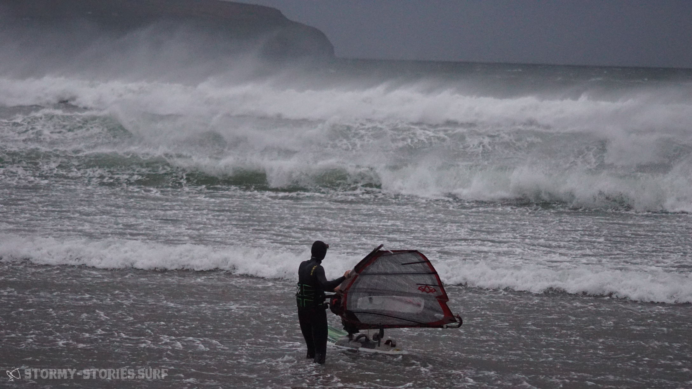

Am Strand selbst war jedoch niemand zu sehen. Die Bedingungen waren schwer einzuschätzen. Es fühlte sich nicht besonders windig an und auch die Wellen sahen nicht außergewöhnlich groß, dafür jedoch sehr sauber aus. Vermutlich lag dies aber auch daran, dass gerade Ebbe war und wir daher immer noch in relativ großer Entfernung zum Wasser standen.

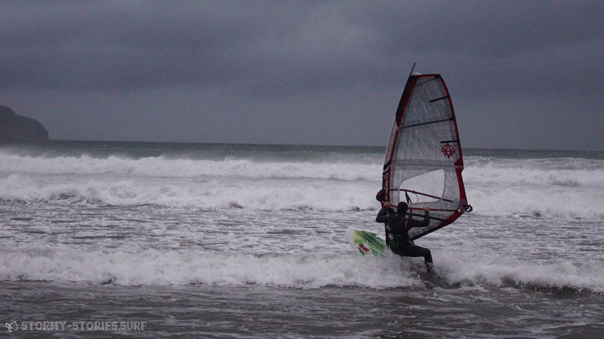

Wir unterhielten uns schon über unsere größeren Segel und dass man es einfach einmal ausprobieren könnte und sahen dann einige hundert Meter nördlicher ein Segel zwischen den Wellen und einen Bus am Strand stehen.

  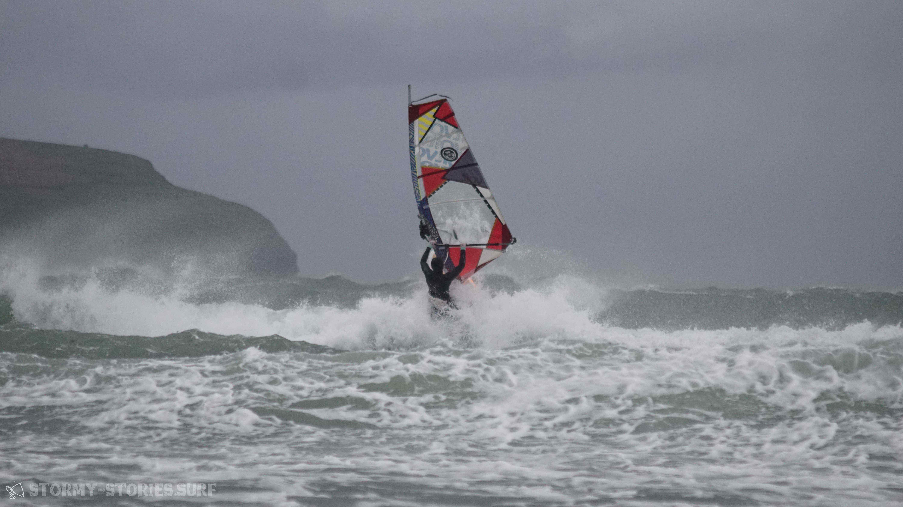
  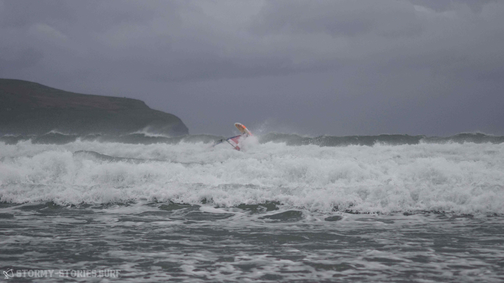

Kurze Zeit später hatten wir die Zufahrt gefunden und passender Weise stapfte der irische Local gerade aus dem Wasser. Er erzählte uns, dass er nun leider wieder los müsse, weil seine Mittagspause nun vorbei sei und erkundigte sich nach unserer kleinsten Segelgröße. 3.5 und 3.7 Quadratmeter passten für uns erst einmal überhaupt nicht zu dem, was wir dort am Strand sahen - aber naja. Wir dankten für den Rat, genau diese Segel aufzubauen und fuhren zurück zu unserer Unterkunft um das Auto zu beladen.

  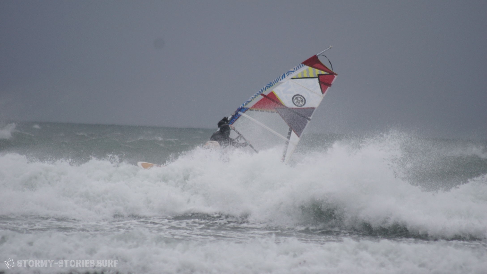
  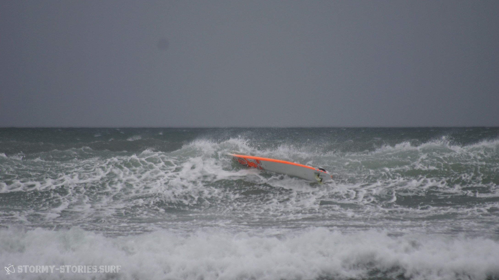

Zurück am Spot schienen die Bedingungen etwas besser geworden zu sein. 3.7 schien gefühlt noch immer viel zu klein, aber aufgebaut wurde es dann trotzdem. Nach dem Aufbauen und direkt an der Wasserkannte wurde uns dann mit einmal klar, dass hier vermutlich gerade die saubersten Wellen liefen, die wir jemals gesehen hatten. Und dieses Naturschauspiel sollte jetzt offenbar uns zwei Amateuren ganz alleine gehören.

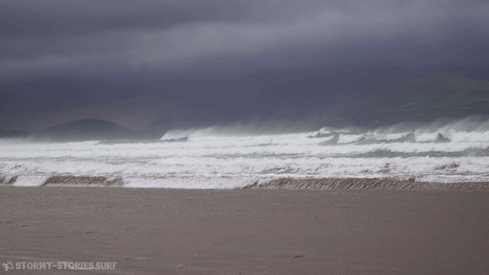

Wir waren komplett alleine an einem mehrere Kilometer langen Strand, an dem man das Ende der perfekten parallelen Lines oft in der Ferne nicht erkennen konnte. Fast ein bisschen unwirklich, vor allem wenn man sich dann einmal an die überquellenden Parkplätze der Ostsee zurückerinnert und das bei Onshore-Wind und den kleinen sogenannten „Wellen“.

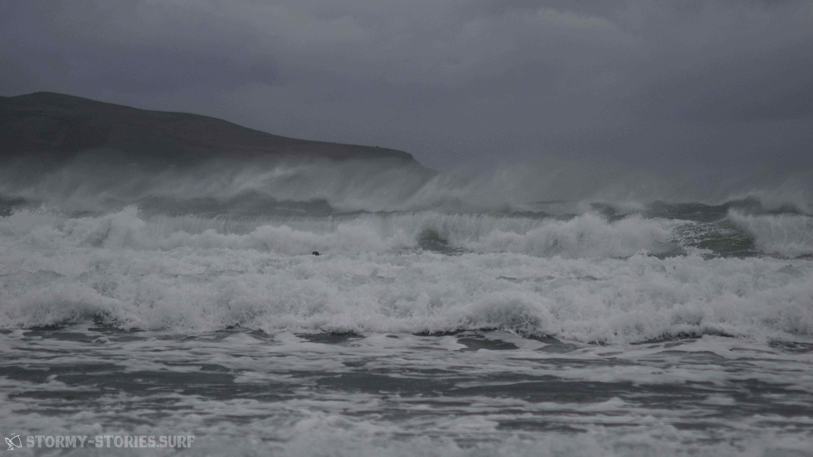

Der erste Versuch ging bei mir tatsächlich gleich durch den Shorebreak und hinter die Lines. Hier war es dann mehr oder weniger spiegel-glatt oder zumindest so wenig wellig, dass man entspannt ein bisschen freeriden konnte.

Auf dem Weg zurück, fühlte ich mich direkt an meine Zeit in Irland ein Jahr zuvor erinnert. Bei diesen langen geraden Wellen und Side-Offshore Wind ist es einfach unverschämt einfach in die brechende Welle hinein zu starten, auf der Welle zu bleiben und trotzdem die Geschwindigkeit zu halten. Das Fahren von richtigen Turns fiel mir allerdings mittlerweile schon wieder relativ schwer.

  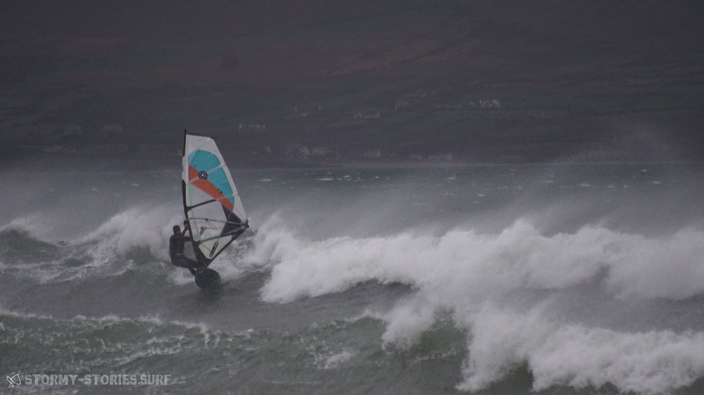
  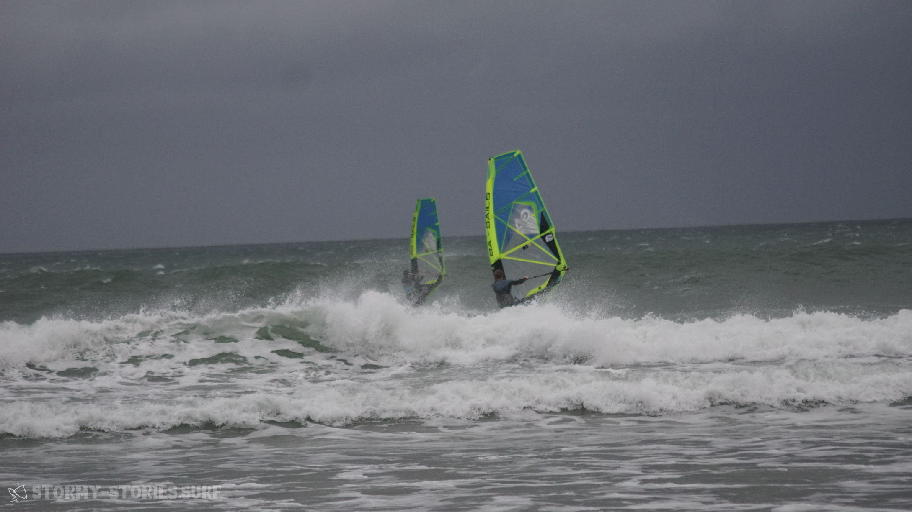

Ebenso erging es mir bei den nächsten Versuchen durch den Shore-Break zu kommen. Auch wenn 3.7 beim Abreiten der Wellen definitiv das Mittel der Wahl zu sein schien, hatte es bei der Fahrt durch den Shorebreak ein klein bisschen zu wenig Zug.

  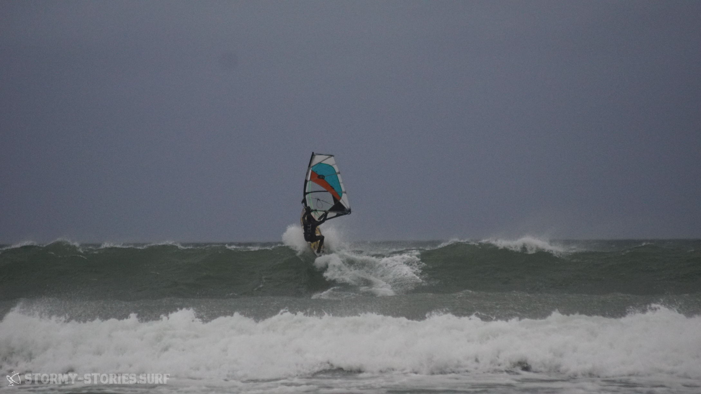
  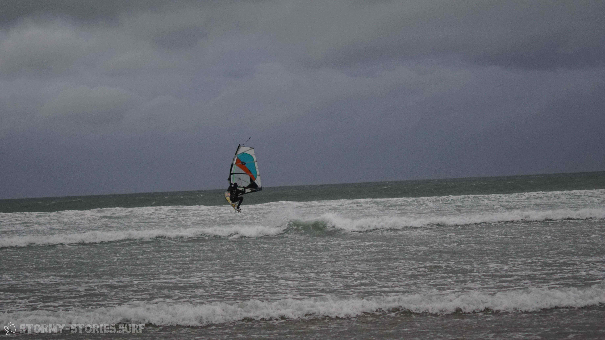

Doch auch selbst als der Wind im späteren Verlauf des Tages immer mehr zunahm, war es irgendwie schwierig durch den relativ kraftvollen Shore-Break zu kommen. Hier wiederum war die Länge der Wellen nicht gerade von Vorteil, da es nahezu unmöglich war komplett am brechenden Teil der Wellen vorbei zu fahren.

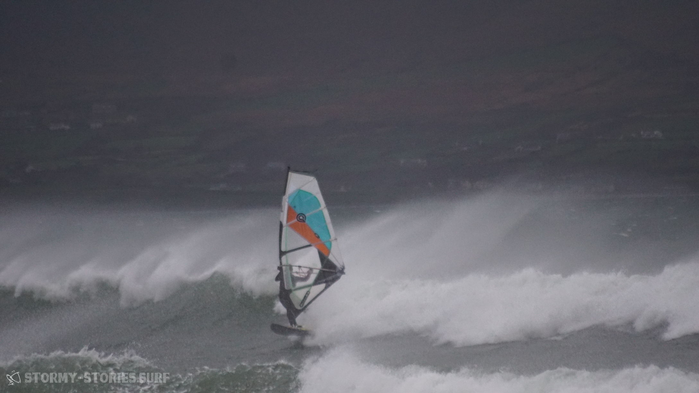

So ging es dann also immer und immer wieder ab aufs Wasser und in den meisten Fällen dann spätestens bei der letzten zu querenden Welle ab in die Waschmaschine. Hier bekam man dann mit aller Wucht die tausenden Kilometer Anlauf der Atlantikwellen zu spüren. Das war einfach nicht vergleichbar mit dem, was wir von Nord - und Ostsee gewohnt waren.

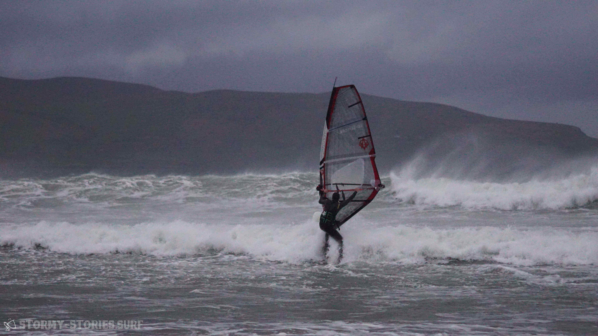

Mit zunehmenden Wind und durch die Flut größer werdenden Wellen wurde auch der Strand zunehmend „voller“. Ein weiterer Surf-Tourist aus Italien und zwei Locals teilten sich nun mit uns den Spot.

  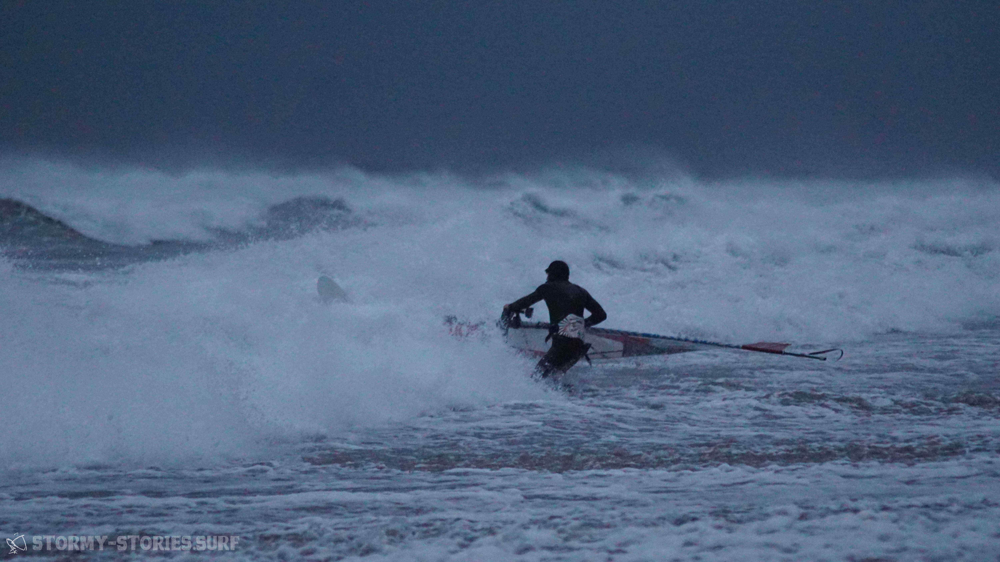
  

Auch unser italienischer Freund schüttelte bei dem Blick auf die 3.7er Segel den Kopf und griff motiviert nach seinem 4.2er. Eine halbe Stunde später schleppte er dann aber auch schon alles wieder an den Strand und riggte um auf 3.7.

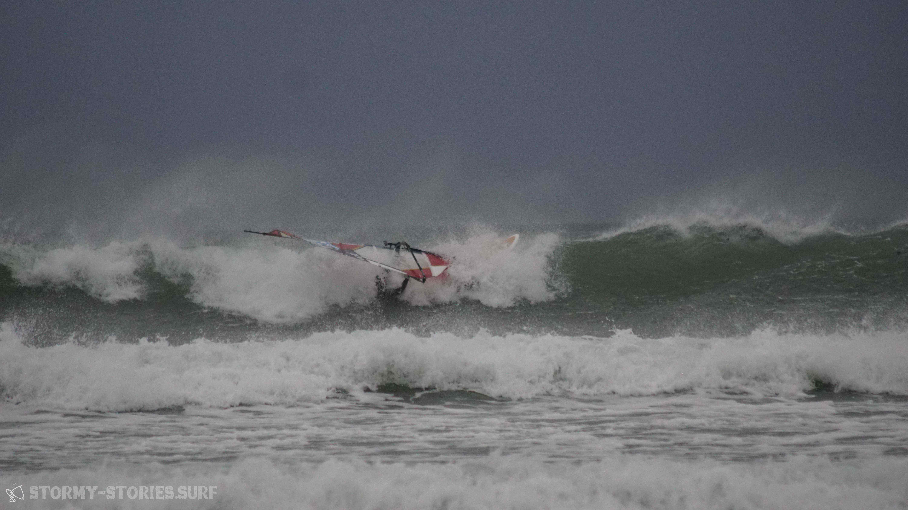

Nach einiger Zeit schluckte die Flut dann leider auch den kompletten Sandstrand und hinterließ einzig einen deutlich ungemütlicheren Ausstieg über große runde Steine. Der Wind ballerte mittlerweile aus allen Rohren. Die Wellen wurden immer größer. Jeder Versuch die Berge an Weißwasser zu durchqueren raubte einem für die nächsten 15 Minuten jegliche Energiereserven. Und selbst Steine oberhalb der fünf-Kilo-Marke wurden vom Sog der Wellen wieder ins Meer gezogen und dann geräuschvoll murmelnd zurück an den Strand gerollt.

  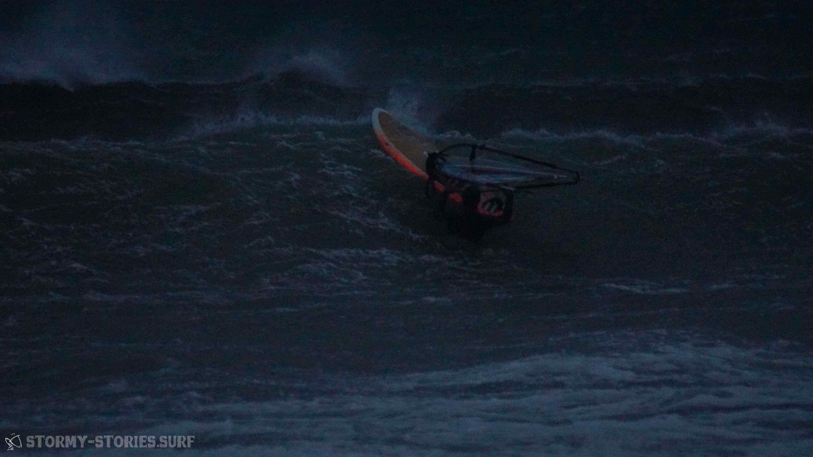
  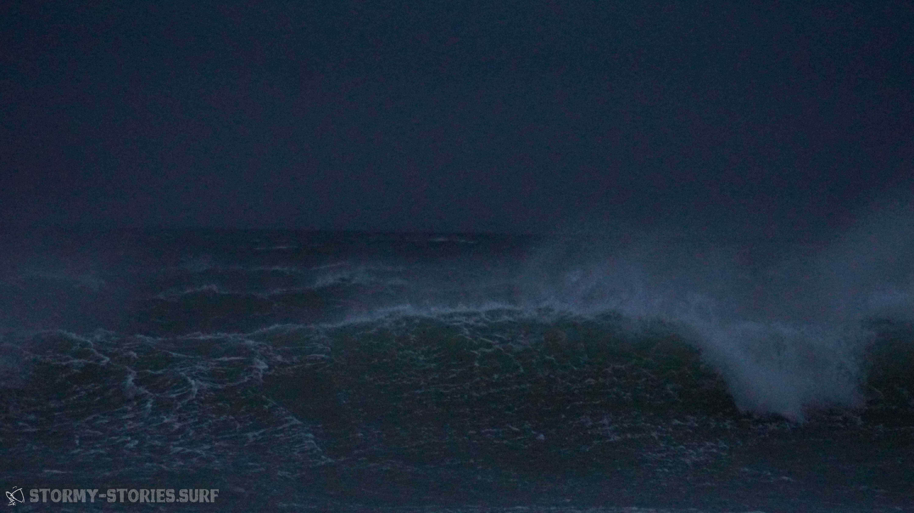

  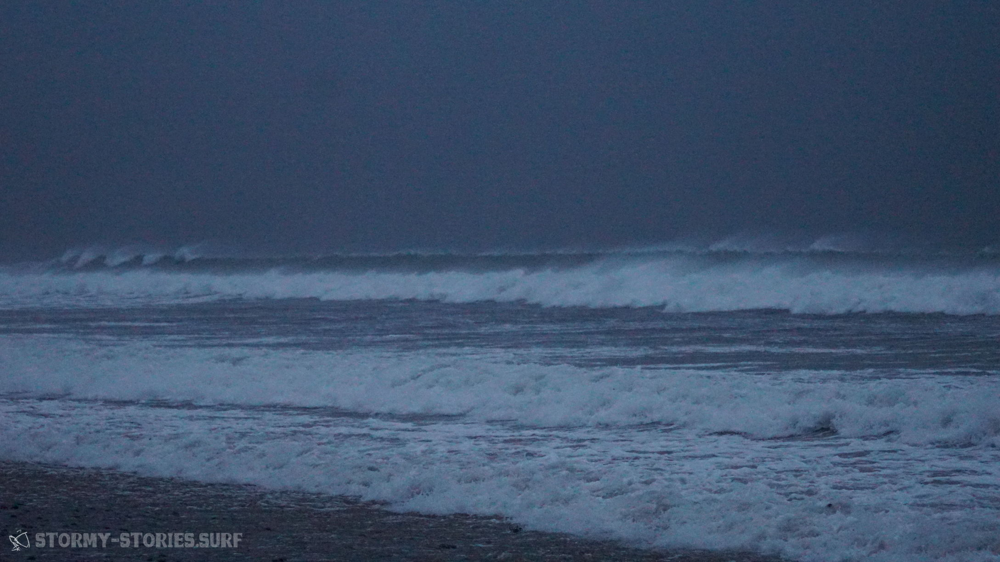
  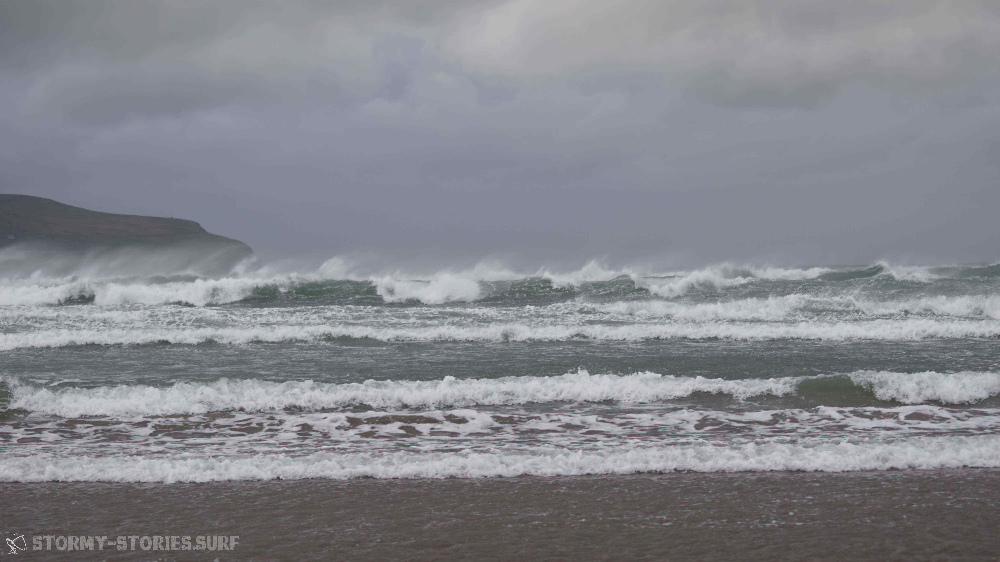

  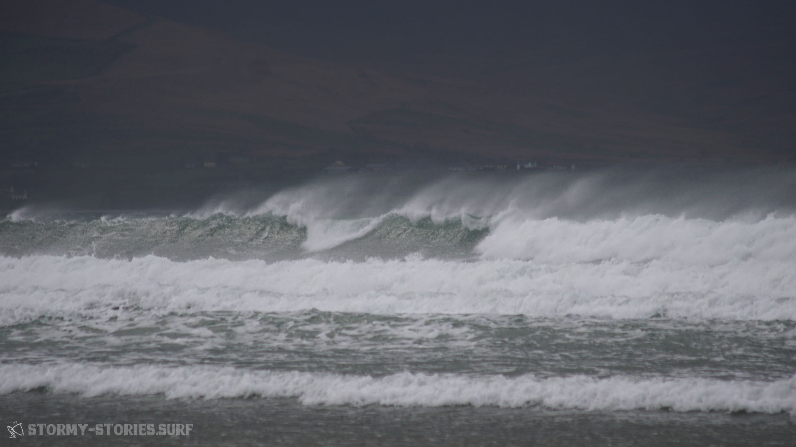
  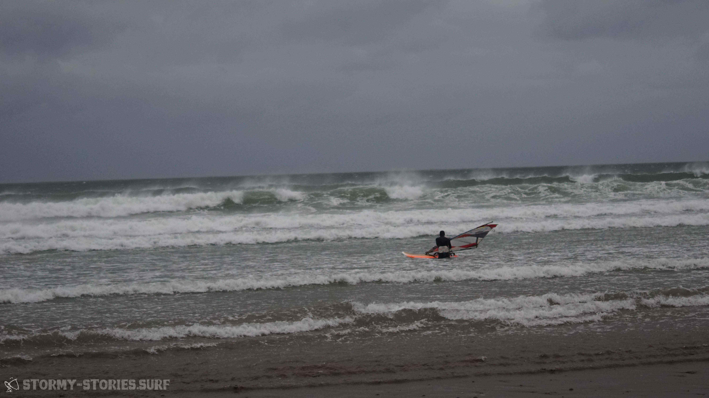

Doch trotz allem machte es einfach unglaublich viel Spaß. Jeder Sprung, den dann man gerade noch über die gleich brechende Welle schaffte, jede Welle die man abreiten konnte machte 10, 20, wsl. 100 Waschgänge wieder wett. Jedes mal, wenn es wieder Richtung Ufer ging, sah man auf den endlosen Strand und die bergige grüne Landschaft die sich hinter ihm erstreckte. Die Sonne tauchte alles in eine traumhafte Szenerie und leuchtete in die zwei - vier Meter hohe Gischt die von den Wellenkämmen abgerissen wurde.

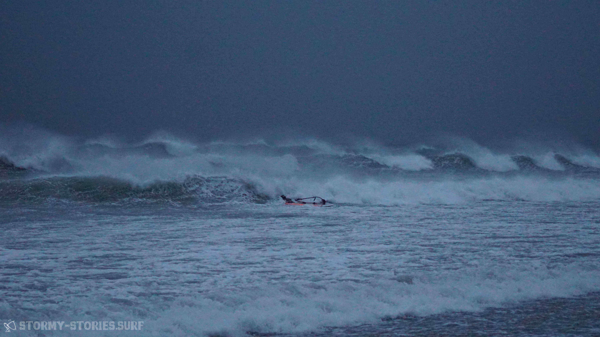

Und das Ganze immer mit der Gewissheit, dass es in dieser sichelförmigen Bucht nahezu keine Möglichkeit gab abzutreiben. Die Wellen entluden sich am Strand zwar mit enormer Brutalität, doch weiter draußen gab es fast keine Strömung, weder aufs offene Meer hinaus, noch parallel zum Strand. Am Ende des Abends - wir hatten bis zum Einbruch der Dunkelheit kein Ende finden können - waren unsere menschlichen Akkus leer. Alle Muskeln schrien nach Pause und unser Bauch nach einem ordentlich Abendessen.

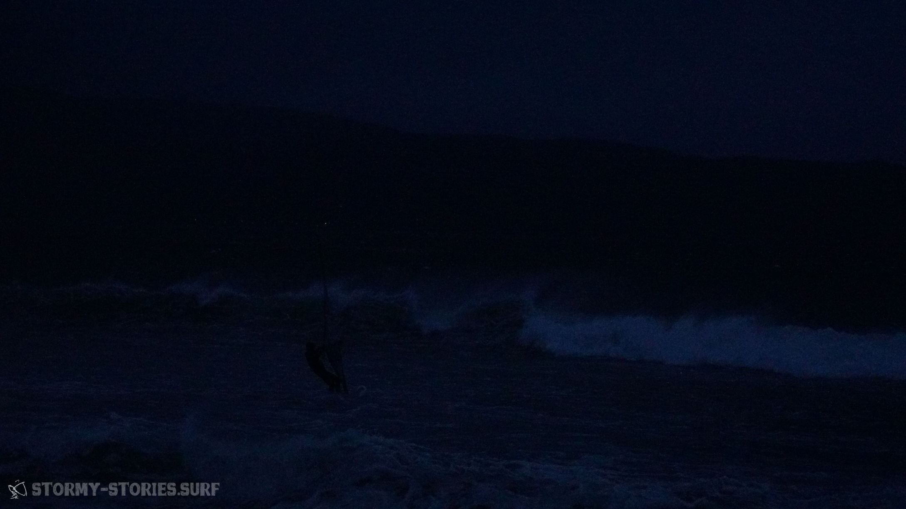

Das gab es dann auch. Am Inch Beach gibt es perfekte Burger um alle Reserven wieder aufzufüllen. Das Restaurant hier liegt direkt am Strand, der nebenbei bemerkt bei Side-Off auch einen sehr guten Wave-Spot mit Parkmöglichkeiten direkt auf dem Strand bietet. Von beidem konnte ich mich bereits 2016 überzeugen. Auch Delfine sollen hier hin und wieder schon gesichtet worden sein.

  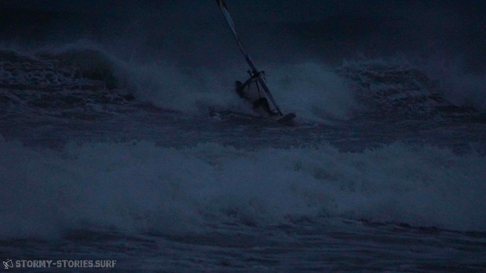
  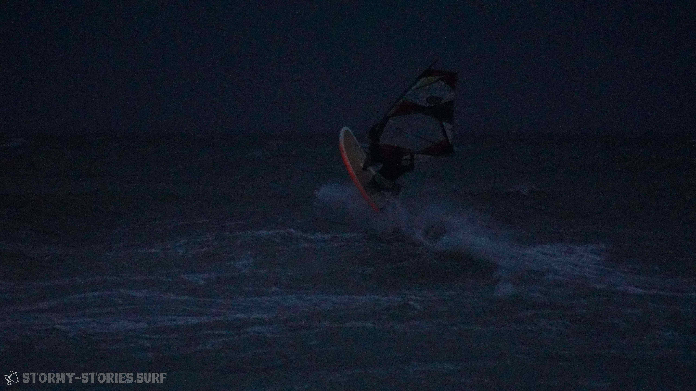

Dieses Privileg blieb uns an diesem Tag leider verwehrt, denn nach unserem gemütlichen Abendessen war draußen bereits alles stocke-finster. Somit ging es dann wieder in unser "geräumiges" Surf-Mobil und ab zurück auf die Maharees in unser gemütliches Bett.

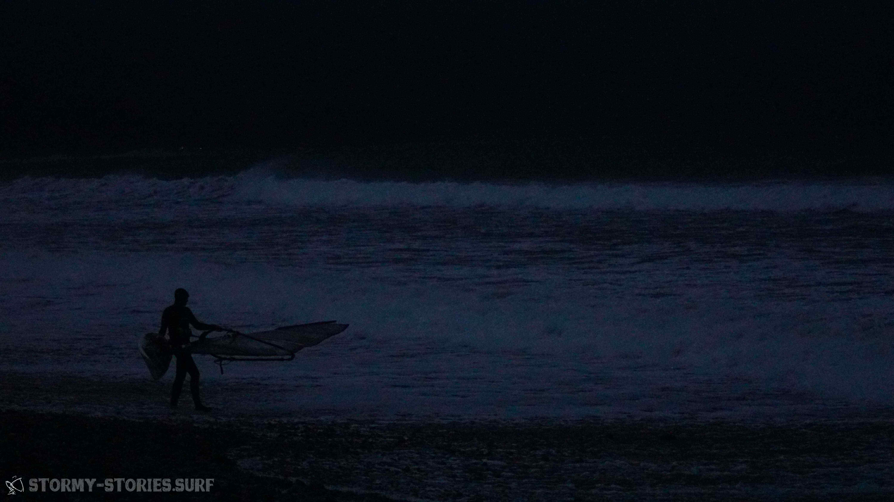
