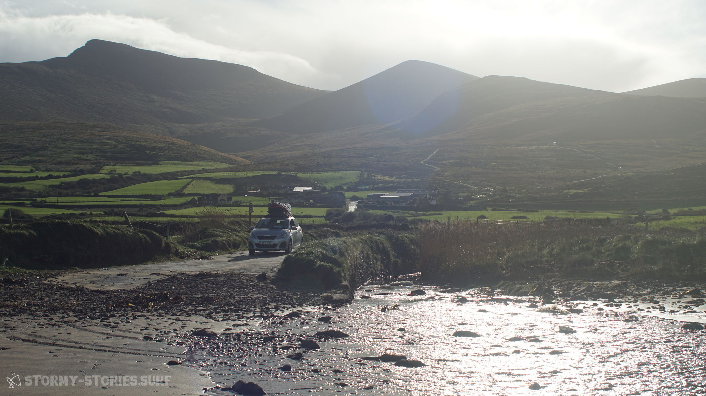
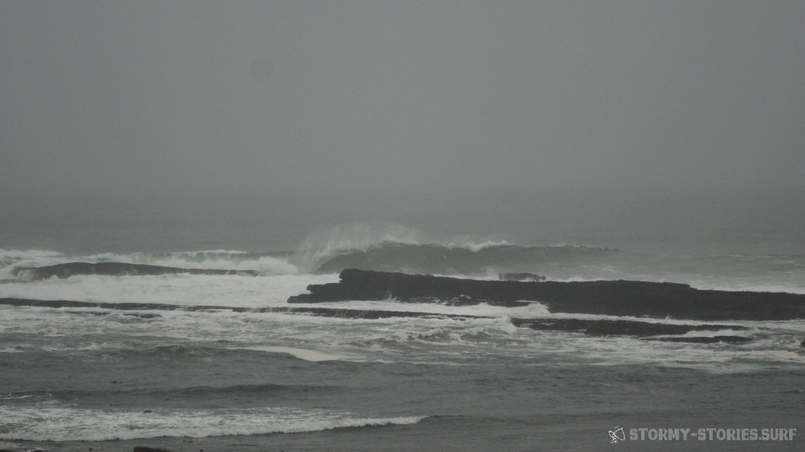

# Irland 2017 : Spanish Point, Cliffs of Moher & Mullaghmore

Am nächsten Morgen ging es dann wie auch schon am vorherigen Tag zur Spot-Sichtung einmal durch die Brandon Bay. Die Vorhersage war ziemlich genau am Limit, so dass es selbst mit unseren größeren Segeln (5.9 und 6.2) knapp werden konnte.

Nichts destotrotz standen wir nach einem weiteren ausgedehnten Frühstück mit Blick auf den Spot Hell's Gate wieder in Stradbally am Strand. Vor dem Frühstück hatten wir uns bereits entschieden unsere Unterkunft heute hinter uns zu lassen.
Eigentlich hatten wir uns hier wirklich wohl und willkommen gefühlt. Von hier aus hatte man im Grunde die beste Ausgangslage für Surf-Trips auf der Dingle-Peninsula und auch unsere Gastgeber hatten sich alle Mühe gegeben, damit wir uns wohl fühlten.
Doch für die nächsten Tage sah der Wind im Süden Irlands nicht sehr zuverlässig aus.
Der Norden wiederum schien so einiges  abzubekommen. Also ging es noch einmal in die Brandon Bay und dann weiter in Richtung Norden.

In Stradbally angekommen blickten wir etwas ratlos aufs Meer. Noch immer hatten wir die Erfahrung der gestrigen Session im Kopf und nur zu gerne hätten wir das Ganze heute noch einmal wiederholt. Die Wellen hatten sich seit gestern nich wirklich verändert und rollten weiterhin zuverlässig und sauber Line für Line an den Strand. Was jedoch nicht sonderlich zuverlässig aussah war der Wind. Wie schon in der Vorhersage angedeutet knapp 12 - 15 Knoten. Nach einigen Minuten des Grübelns entschieden wir uns gegen einen versuch und somit vermutlich gegen eine größere Runde Schwimmen zurück Richtung Land.

Okay somit dann schnell ins Auto, noch einen letzten Blick auf die traumhafte Szenerie der sonnendurchfluteten Brandon Bay und auf Richtung Norden.
Wie auch schon im vorherigen Jahr entschieden wir uns statt über Castleisland und Limerick für den 70 km kürzeren Weg über Tralee, Listowel und dann mit der Fähre in Tarbert nach Killimer. Die Überquerung der Grenze vom County Kerry ins County Clare auf dem Wasserweg dauert ca. 20 Minuten, kostet etwa 20€ für ein normales Auto und ist in der Regel mindestens stündlich möglich.
Zeitlich verbringt man hierbei ziemlich genau so viel Zeit wie bei der Fahrt mit dem Auto über Limerick. Uns gefällt diese Variante jedoch allein schon wegen der schöneren Aussicht und der entspannten Schiff-Fahrt besser. Über die Fähr-Zeiten sollte man sich jedoch je nach eigenem Entspannungs-Modus und Wetter vorher informieren. In unserem Fall haben wir 15 - 20 Minuten in der irischen Mittags-Sonne entspannte Musik gehört.

Von Killimer ging es dann bei sonnig-wolkigem Wetter weiter in Richung Lahinch. Auf dem Weg zwangen uns immer mal wieder einige viel versprechend aussehende Strände zum Anhalten und Spot-Check. In Quilty und auch am Spot Spanish-Point waren wir kurz davor rauszugehen. Doch der abnehmende Wind und vor allem die hohl und close-out brechenden Wellen am Spanish Point hielten uns schlussendlich dann doch an Land. Da es außerdem langsam anfing zu dämmern, machten wir uns auf die Suche nach einer Unterkunft.

Fündig wurden wir in einem günstigen und gemütlichen B&B im Ortsanfang von Lahinch auf einer Anhöhe in mitten einiger Mobil-Heime. (https://www.clareireland.net/coachhouse) Und auch hier schienen wir Anfang November wieder die einzigen Gäste zu sein und schliefen somit für 25€ pro Person im besten Zimmer des Hauses.
Von hier aus sollte unsere Reise am nächsten Tag weiter gehen. Unser finales Ziel war weiterhin Magheroarty Beach im Norden Donegals. Die Vorhersage schien hier weiterhin stabil zu bleiben und auf dem Weg dorthin sollte auch noch Zeit für die ein oder andere Surfer-Sehenswürdigkeit sein.

Nach dem Frühstück standen als erstes die Cliffs of Moher auf dem Programm. Von Lahinch ca. 15 Minuten entfernt lagen diese ohnehin direkt auf dem Weg in Richtung Norden und außerdem erwarteten wir auch hier im November nicht allzu viele Touristen-Busse.

Die Anzahl der Touristen-Busse, war tatsächlich relativ übersichtlich. Leider konnte man das gleiche allerdings auch über die Anzahl an Sonnenstrahlen sagen.

Doch selbst bei wolken-bedecktem Himmel und etwas Niesel-Regen zeigte sich die Kulisse der 14 Kilometer langen und bis zu 214 Meter hohen See-Klippen beeindruckend.

Um auch den restlichen Touristen zu entkommen wanderten wir vom Cliffs-Of-Moher-Besucher-Zentrum die Klippen entlang weiter in Richung Norden. Hinter dem "Achtung : Hier verlassen Sie den gesicherten Bereich" - Schild lichtete sich dann auch zunehmendt das Publikum und am nördlichen Ende der höchsten Klippe angekommen, konnten wir dann zu zweit den Blick auf die amtlichen Wellen vom Surf-Spot "Aileen's Wave" genießen. Pünktlich in diesem Moment beehrt uns die Sonne für ein paar Minuten mit ihrer Anwesenheit.
Da man gehen soll wenn es am schönsten ist und wir noch weitere 370 Kilometer vor uns haben, wandern wir zurück zu unserem Auto, nächste Station "Mullaghmore" kurz hinter Sligo.

In Mullaghmore angekommen suchten wir nach der weltweit bekannten gleichnamigen "Riesen-Welle". An diesem Ort können an wenigen Tagen in Jahr 20-30 Fuß hohe Wellen laufen, so viel zumindest wusste ich noch von Erzählungen und Bildern aus dem Vorjahr in einem Surf-Shop in Bundoran. Wie an den meisten guten Surf-Spots führte jedoch auch hier keine Beschilderung zum Spot. Immer wieder schauten wir auf die Karte und versuchten eine Straße nach der anderen. Dann als wir gerade kurz davor waren umzudrehen und die Suche aufzugeben sahen wir einen Jet-Ski auf einem Trailer an einer Straße stehen.
Einige Meter weiter die Straße entlang standen einige weitere Autos, einige Menschen in Neopren und ein weiterer Jet-Ski.

Und dann sahen wir auch die Wellen. Zwar war es etwas neblig und ein wenig regnerisch draußen, jedoch konnte man trotzdem hinter einigen schmerzhaft aussehenden Felsen zwei saubere Wellen an den Strand laufen sehen. Auf den ersten Blick sah alles sehr hamlos und klein aus, doch um so näher wir kamen umso klarer wurde uns, das die kleinen schwarzen Punkte im Wasser wohl Menschen sein mussten. Gigantisch waren die Wellen zwar nicht, jedoch ziemlich sicher 3 Meter hoch oder sogar ein Stück darüber. 
Beeindruckt, aber gleichzeitig auch nicht gerade scharf darauf hier weiter nass zu regnen setzten wir uns schnell wieder ins Auto und traten den Rest unserer Reise an.

