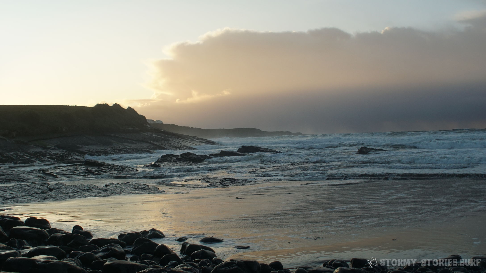
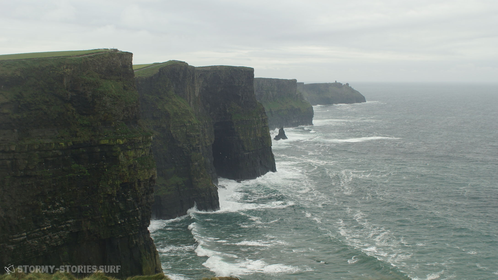
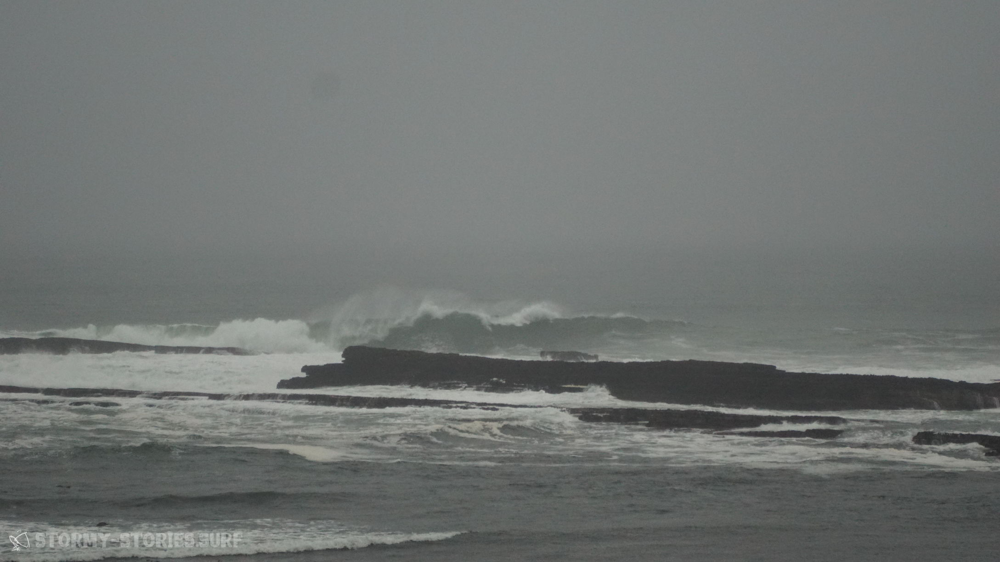

# Irland 2017 : Spanish Point, Cliffs of Moher & Mullaghmore

Am nächsten Morgen ging es dann wie auch schon am vorherigen Tag zur Spot-Sichtung einmal durch die Brandon Bay. Die Vorhersage war ziemlich genau am Limit, so dass es selbst mit unseren größeren Segeln (5.9 und 6.2) knapp werden konnte.

Nichts destotrotz standen wir nach einem weiteren ausgedehnten Frühstück mit Blick auf den Spot Hell's Gate wieder in Stradbally am Strand. Vor dem Frühstück hatten wir uns bereits entschieden unsere Unterkunft heute hinter uns zu lassen.
Eigentlich hatten wir uns hier wirklich wohl und willkommen gefühlt. Von hier aus hatte man im Grunde die beste Ausgangslage für Surf-Trips auf der Dingle-Peninsula und auch unsere Gastgeber hatten sich alle Mühe gegeben, damit wir uns wohl fühlten.
Doch für die nächsten Tage sah der Wind im Süden Irlands nicht sehr zuverlässig aus.
Der Norden wiederum schien so einiges  abzubekommen. Also ging es noch einmal in die Brandon Bay und dann weiter in Richtung Norden.

In Stradbally angekommen blickten wir etwas ratlos aufs Meer. Noch immer hatten wir die Erfahrung der gestrigen Session im Kopf und nur zu gerne hätten wir das Ganze heute noch einmal wiederholt. Die Wellen hatten sich seit gestern nich wirklich verändert und rollten weiterhin zuverlässig und sauber Line für Line an den Strand. Was jedoch nicht sonderlich zuverlässig aussah war der Wind. Wie schon in der Vorhersage angedeutet knapp 12 - 15 Knoten. Nach einigen Minuten des Grübelns entschieden wir uns gegen einen versuch und somit vermutlich gegen eine größere Runde Schwimmen zurück Richtung Land.

Okay somit dann schnell ins Auto, noch einen letzten Blick auf die traumhafte Szenerie der sonnendurchfluteten Brandon Bay und auf Richtung Norden.
Wie auch schon im vorherigen Jahr entschieden wir uns statt über Castleisland und Limerick für den 70 km kürzeren Weg über Tralee, Listowel und dann mit der Fähre in Tarbert nach Killimer. Die Überquerung der Grenze vom County Kerry ins County Clare auf dem Wasserweg dauert ca. 20 Minuten, kostet etwa 20€ für ein normales Auto und ist in der Regel mindestens stündlich möglich.
Zeitlich verbringt man hierbei ziemlich genau so viel Zeit wie bei der Fahrt mit dem Auto über Limerick. Uns gefällt diese Variante jedoch allein schon wegen der schöneren Aussicht und der entspannten Schiff-Fahrt besser. Über die Fähr-Zeiten sollte man sich jedoch je nach eigenem Entspannungs-Modus und Wetter vorher informieren. In unserem Fall haben wir 15 - 20 Minuten in der irischen Mittags-Sonne entspannte Musik gehört.

Von Killimer ging es dann bei sonnig-wolkigem Wetter weiter in Richung Lahinch. Auf dem Weg zwangen uns immer mal wieder einige viel versprechend aussehende Strände zum Anhalten und Spot-Check. In Quilty und auch am Spot Spanish-Point waren wir kurz davor rauszugehen. Doch der abnehmende Wind und vor allem die hohl und close-out brechenden Wellen am Spanish Point hielten uns schlussendlich dann doch an Land. Da es außerdem langsam anfing u dämmern machten wir uns auf die Suche nach einer Unterkunft.

