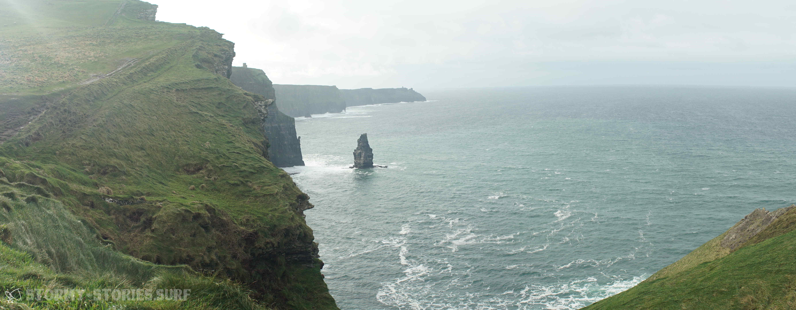

# Ireland 2017 : Spanish Point, Cliffs of Moher, Mullaghmore

The next morning, as on the previous day, we went for a spot-check through Brandon Bay. The forecast was pretty close to the limit, so even with our larger sails (5.9 and 6.2 square meters) it could be tight.

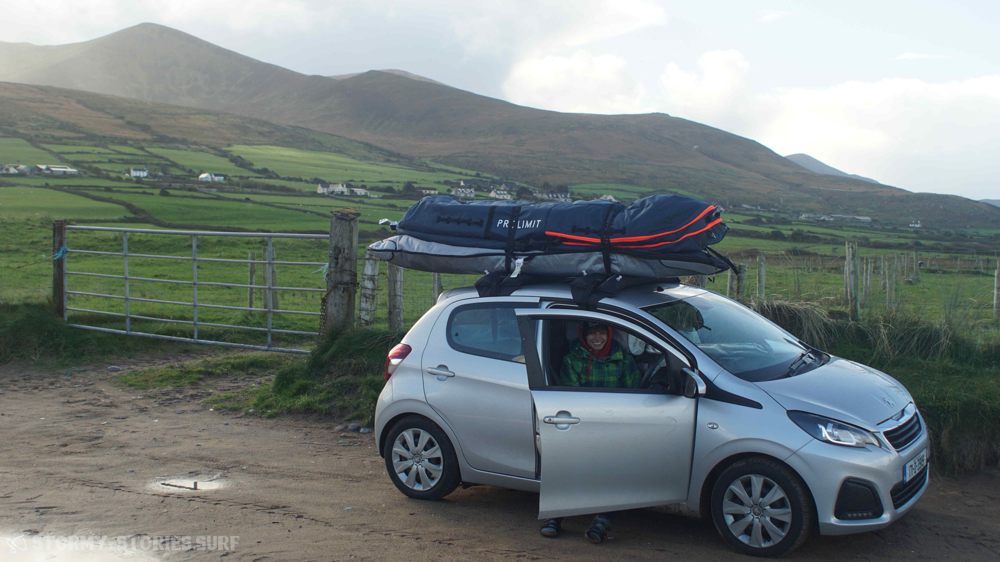

Nevertheless, after another extensive breakfast with a view of the Hell's Gate spot, we were back on the beach in Stradbally. Before breakfast, we had already decided to leave our accommodation behind today.

We had actually felt really comfortable and welcome here. It was basically the best starting point for surf trips on the Dingle Peninsula and our hosts had made every effort to make us feel at home.
However, the wind in the south of Ireland didn't look very reliable for the next few days. The north, on the other hand, seemed to be getting quite a bit. So we went back to Brandon Bay and then continued north.

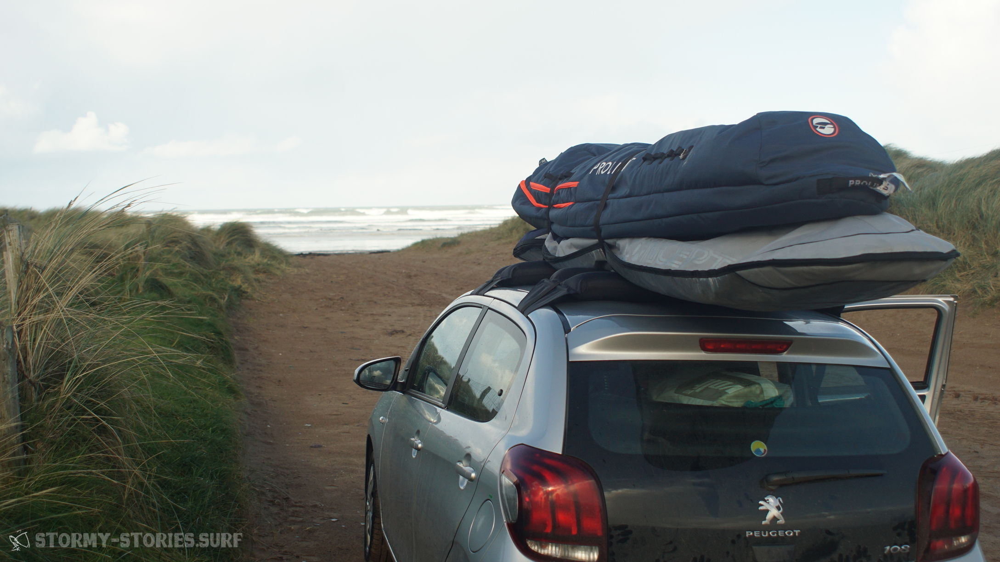

When we arrived in Stradbally, we looked out to sea, somewhat perplexed. The experience of yesterday's session was still fresh in our minds and we would have loved to do it all over again today. The waves hadn't really changed since yesterday and continued to roll onto the beach reliably and cleanly set after set. What didn't look particularly reliable, however, was the wind. As already announced in the forecast, it was around 12-15 knots. After pondering for a few minutes, we decided not to give it a go and therefore probably decided against a longer swim back towards land.

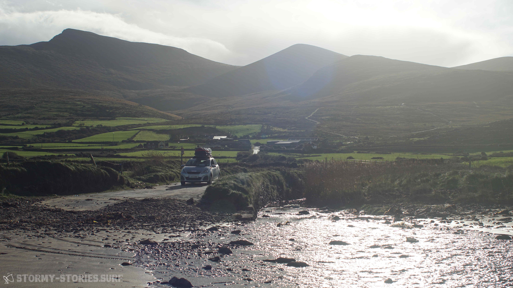

Okay, so quickly back into the car, one last look at the beautiful scenery of sun-drenched Brandon Bay and off we went north.

As in the previous year, we decided to take the 70 km shorter route via Tralee, Listowel and then the ferry from Tarbert to Killimer instead of Castleisland and Limerick. Crossing the border from County Kerry to County Clare by water takes about 20 minutes, costs around €20 for a normal car and is usually possible at least every hour.

You spend pretty much the same amount of time here as you would on the trip by car via Limerick. However, we liked this option better simply because of the more beautiful views and the relaxed boat trip. However, you should check the ferry times in advance depending on your own relaxation mode, the season and the weather. However, as we were now completely in Irish relaxation mode, we didn't check in advance. After all, we had time and didn't want to rush to any departure times, but rather enjoy the ride through the lush greenery in peace. In our case, not being informed meant having to listen to relaxing music for 15-20 minutes in the Irish midday sun. I think there are worse things.

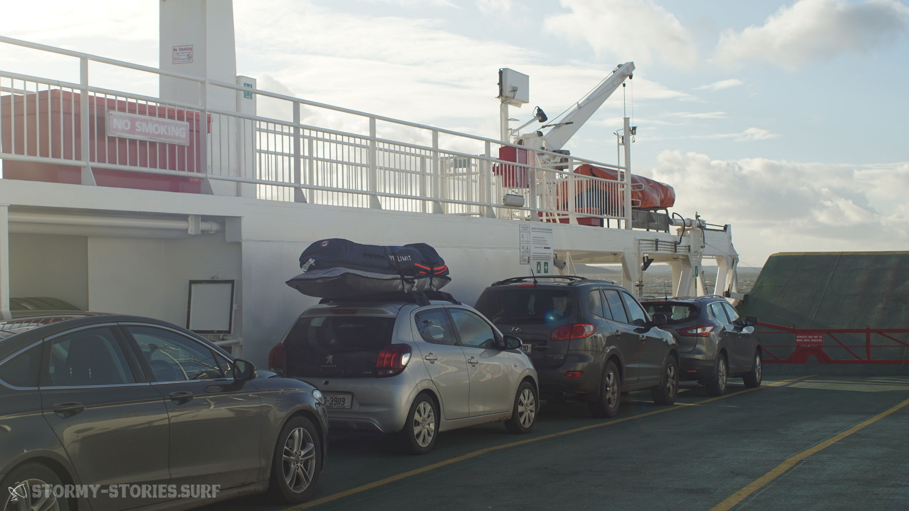

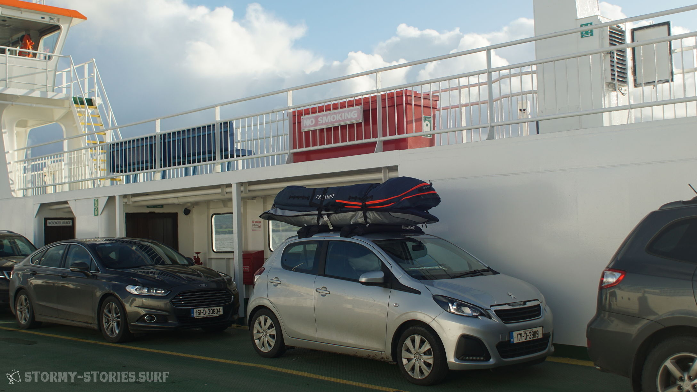

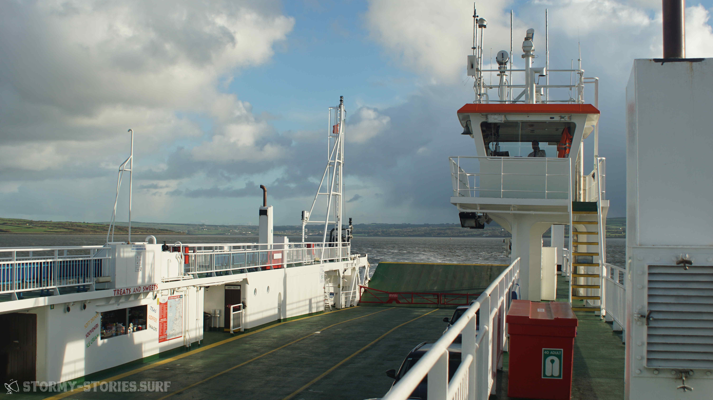

From Killimer, we continued towards Lahinch in sunny and cloudy weather. Along the way, promising-looking beaches forced us to stop and check out the spots. In Quilty and also at the Spanish Point spot, we were about to go out. But the decreasing wind and, above all, the hollow and close-out breaking waves at Spanish Point finally kept us ashore. As it was also starting to get dark, we set off in search of accommodation.

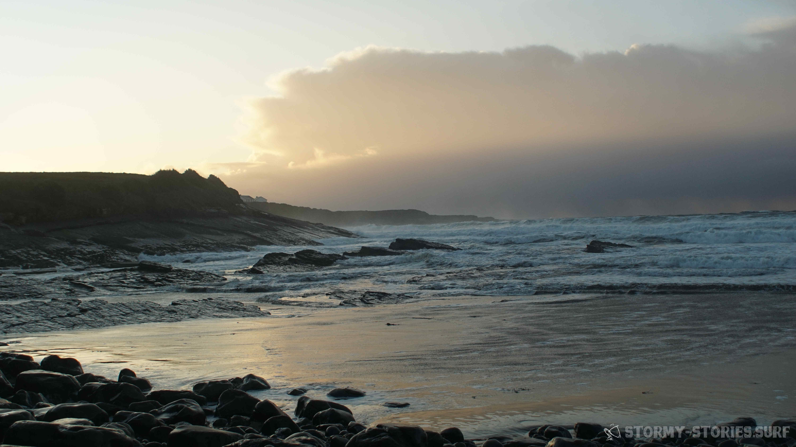

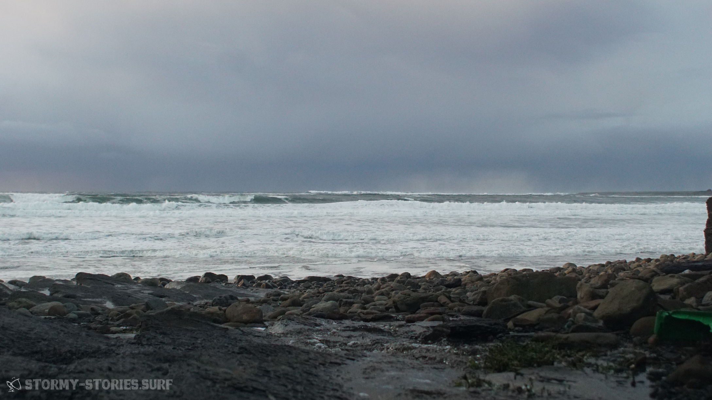

We found what we were looking for in a cheap and cozy B&B at the beginning of Lahinch on a hill in the middle of some mobile homes (https://www.clareireland.net/coachhouse). Once again, we seemed to be the only guests here at the beginning of November, so we slept in the best room in the house for €25 per person.

Our journey was to continue from here the next day. Our final destination was Magheroarty Beach in the north of Donegal. The forecast seemed to remain stable here and there should be time for one or two stops of surf-sightseeing on the way there.

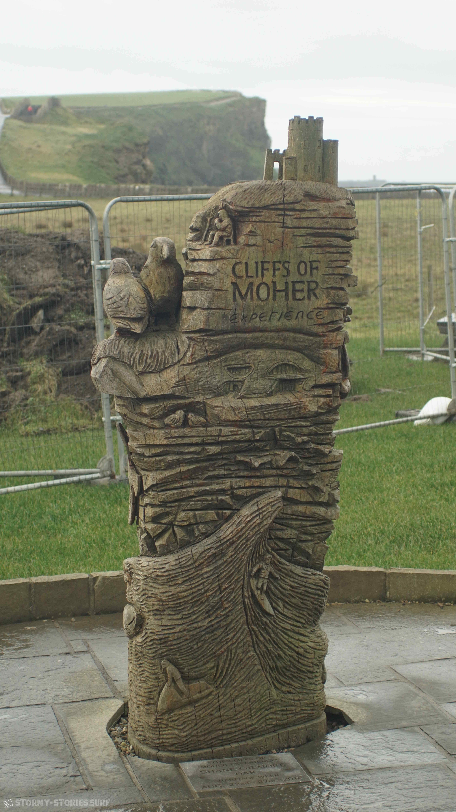

After breakfast, the first thing on the agenda was the Cliffs of Moher. They were about 15 minutes away from Lahinch, directly on the way north anyway, and we weren't expecting too many tourist buses here in November either.

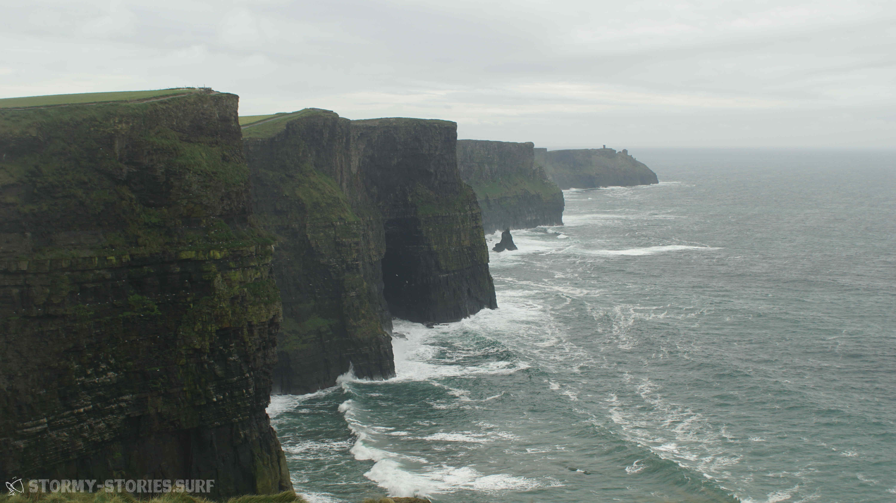

The number of buses was actually relatively manageable. Unfortunately, the same could also be said about the number of sunbeams.

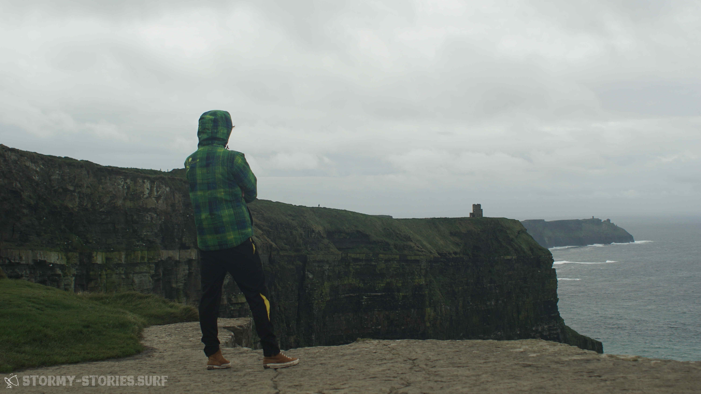

But even with cloudy skies and a little drizzle, the backdrop of the 14-kilometre-long and up to 214-metre-high sea cliffs was impressive.

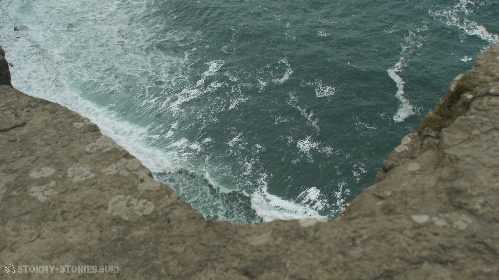

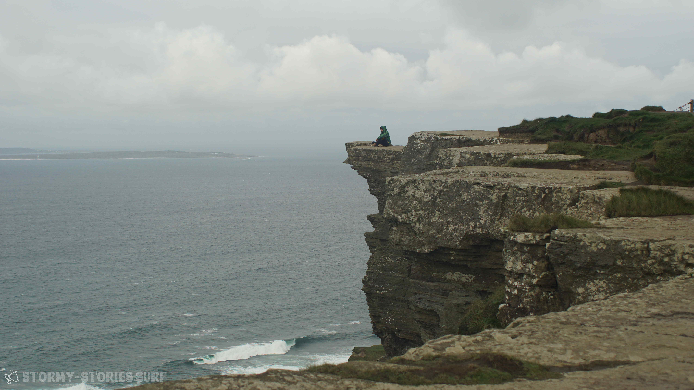

To escape the rest of the tourists, we walked from the Cliffs-Of-Moher visitor center along the cliffs to the north. After the "Attention: You are leaving the secured area here" sign, the crowds thinned out and when we reached the northern end of the highest cliff, the two of us were able to enjoy the view of the waves from the surf spot "Aileen's Wave". Just in time, the sun graced us with its presence for a few minutes.

As you should leave when it's at its best and we still had another 370 kilometers to go, we walked back to our car - next stop "Mullaghmore" just after Sligo.

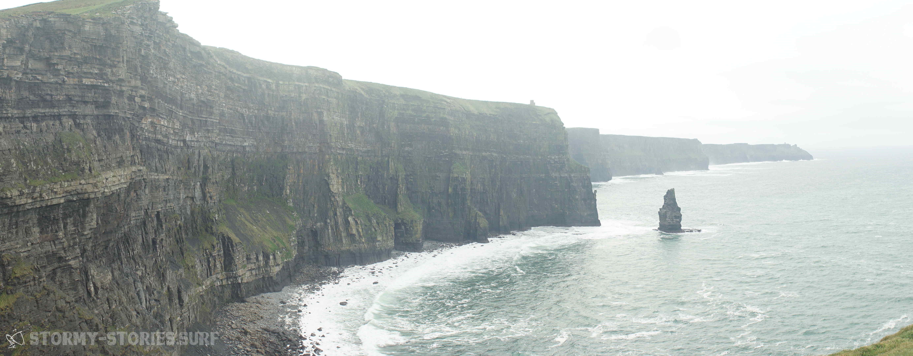

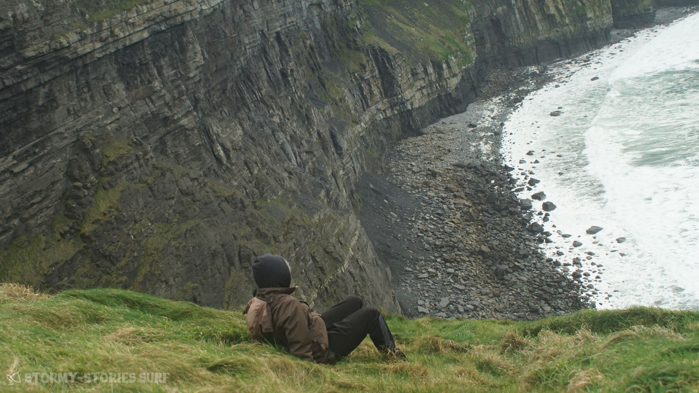

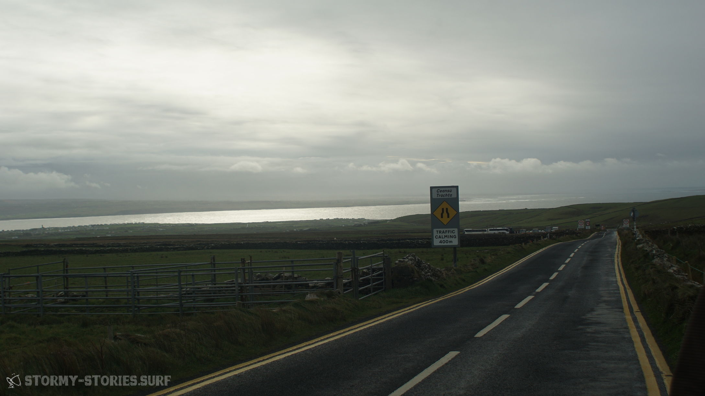

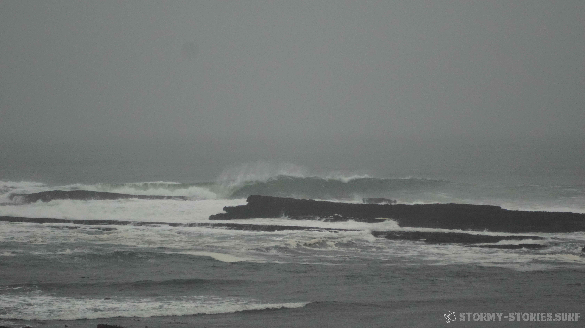

Once we arrived in Mullaghmore, we looked for the world-famous "giant wave" of the same name. On a few days a year, 20-30 foot waves can run at this spot, at least that much I knew from stories and pictures from the previous year in a surf store in Bundoran. However, as with most good surf spots, there was no signposting to the spot. We kept looking at the map and trying one street after another. Then, just as we were about to turn around and give up the search, we saw a jet ski on a trailer on a road.

A few meters further along the road were a few more cars, a few people in wetsuits and another jet ski.

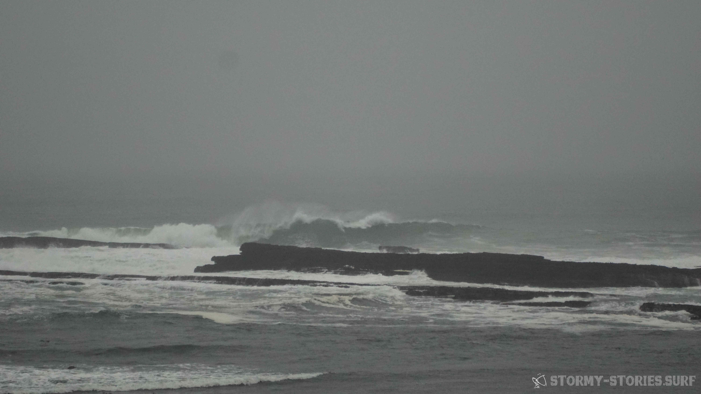

And then we saw the waves. Although it was a bit foggy and rainy outside, we could still see two clean waves running onto the beach behind some painful-looking rocks. At first glance, everything looked very harmless and small, but the closer we got, the clearer it became that the little black dots in the water must be people. The waves weren't gigantic, but they were almost certainly 3 meters high or even a bit more.

It was all difficult to assess. Except perhaps that the surfers in the water were having a lot of fun. This was obvious and completely independent of the bad weather, which, as I knew from my own experience, you easily forget completely during adrenaline-filled and freedom-driven sports.

It was also easy to imagine that on other days, mountains of water as high as houses roll onto the beach. It certainly suited the atmosphere of the place. Everything here felt somewhat daring, rough and adventurous.

Impressed, we took in the scenery and turned around again. At the same time, we weren't exactly keen on getting wet here. So we quickly got back in the car and set off on the rest of our journey.

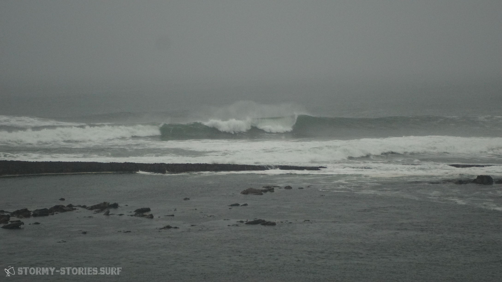
