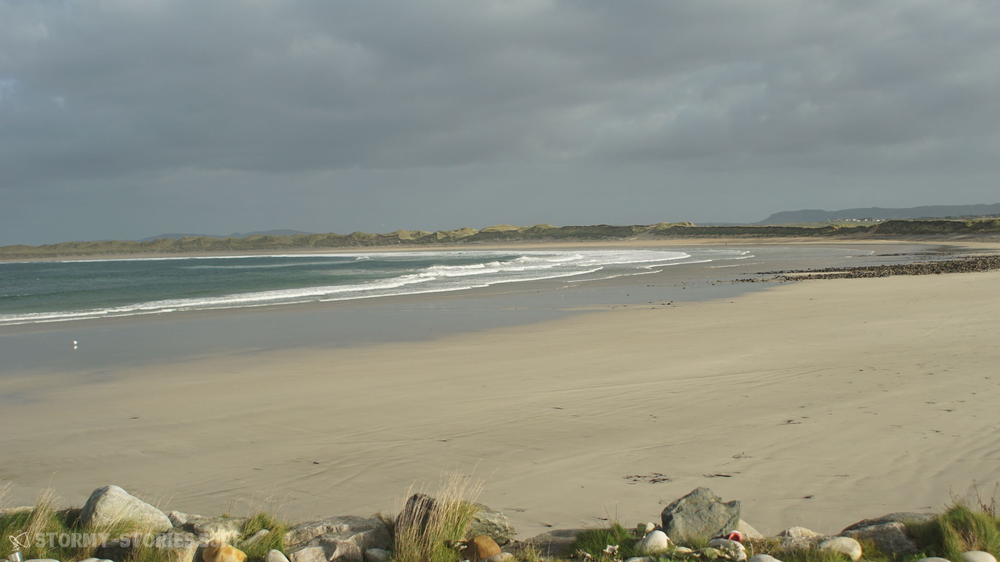
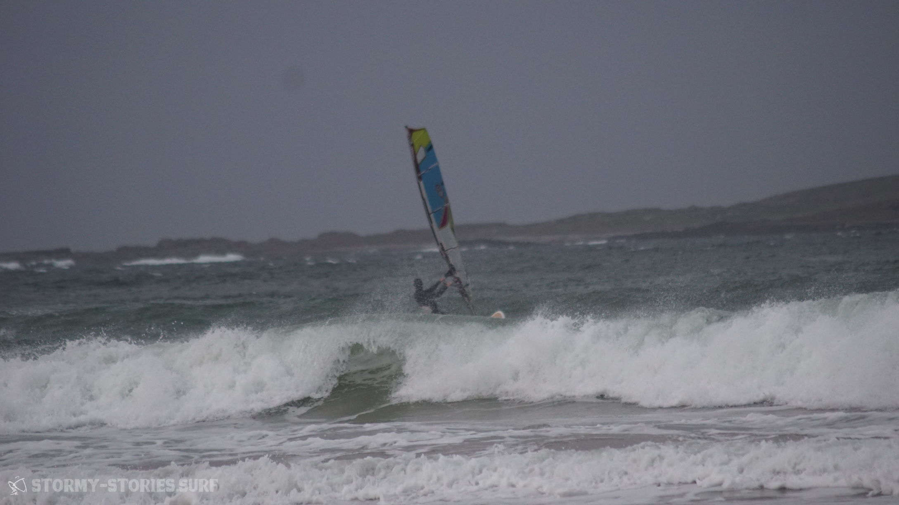
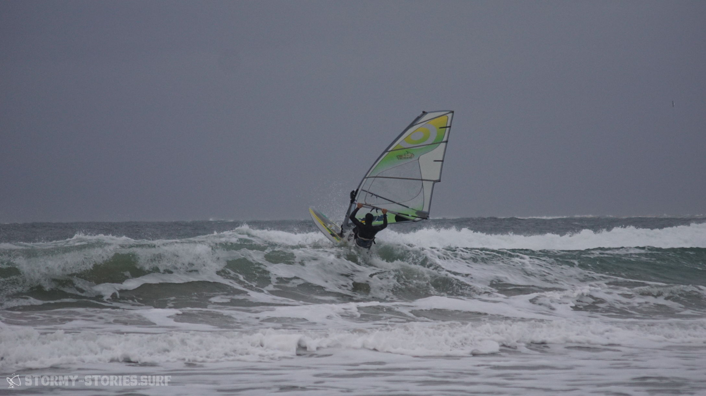
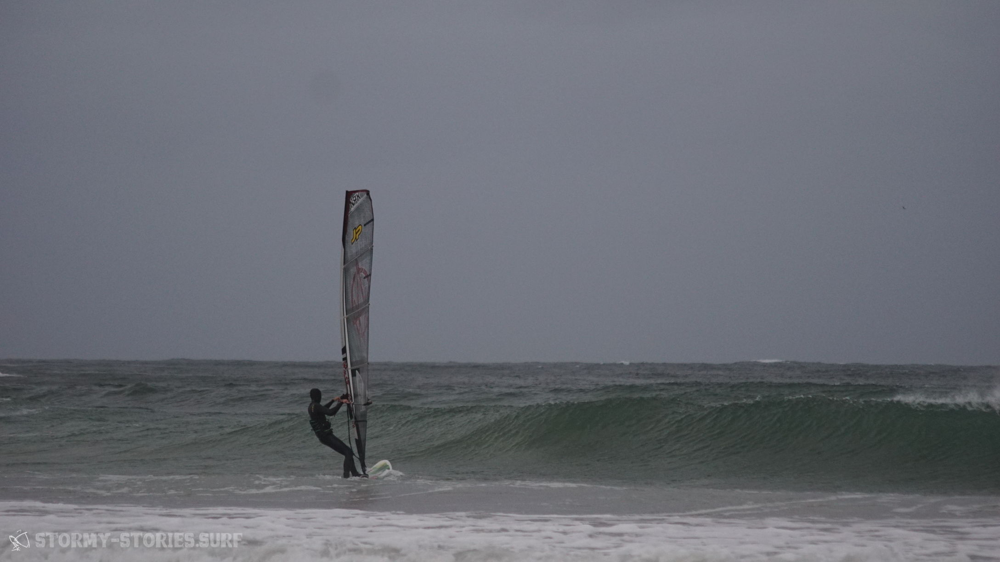

# Irland 2017 : Magheroarty Beach I

Die Fahrt von Mullaghmore weiter nach Magheroarty führte uns durch eine wunderschöne und teilweise vollkommen verlassene Landschaft. Von Donegal aus wählten wir zwar erst einmal den Weg über die Autobahn N15 und vorbei an Ballybofey und Drumkeen um ein bisschen Zeit zu sparen und nicht mitten in der Nacht nach einer Unterkunft suchen zu müssen. Von Drumkeen ging es dann allerdings doch wieder über die Landstraße entlang von Church Hill, nach Lossett, durch den Glenveagh National Park nach Roshine und dann letztendlich nach Gortahork.

Von Gortahork aus fuhren wir erst einmal weiter in Richtung Mín Lárach (Meenlaragh), den Ort auf Höhe des Magheroarty Beach. Hier kam uns jedoch alles relativ dunkel und ausgestorben vor, so dass wir uns schnell entschieden unser Glück an diesem regnerischen Abend lieber in Gortahork zu probieren.
Hier hatten wir sogar ein Hotel gesehen, dass aber auf den ersten Blick nicht gerade günstig aussah. Zuerst einmal war jedoch der lokale Supermarkt unser Anlauf-Punkt. Hier schien noch ordentlich etwas los zu sein und so fragten wir an der Kasse nach einem Bed & Breakfast in der Nähe.

Mit der typisch irischen Lässigkeit verwies uns die Kassiererin direkt an eine die Frau gerade dabei war den Laden zu verlassen. Sie würde uns voraus fahren und zeigen wo wir es probieren sollten.
Keine 500 Meter später blinkte das Auto vor uns, öffnete die Fensterscheibe und zeigte auf ein Haus auf der rechten Straßenseite.

Alles klar, also rauf auf die Auffahrt. Als wir auf die Auffahrt herauffahren, kommt uns ein Auto entgegen das offensichtlich gerade im Begriff ist diese wieder zu verlassen.

Schnell steige ich aus und laufe zum Fenster der Fahrertür. Im Auto sitz eine Frau mittleren Alters und für einen kurzen Moment scheint sie etwas verwirrt zu sein, was wir mit unserem beladenen Surf-Panzer auf ihrer Auffahrt machen. Doch als ich ihr erkläre, dass wir eine Unterkunft suchen und man uns vom Supermarkt hierher geführt hat lächelt sie und führt uns zum Haus.
Dabei erklärte sie uns, dass sie im Winter ihr Bed & Breakfast üblicherweise geschlossen hätten und deswegen auch keine Schild von draußen zu sehen sei. Doch wir seien natürlich trotzdem herzlich willkommen und könnten gerne bei ihnen unterkommen.
Wenige Minuten später ist unser Panzer geparkt und unsere Koffer stehen in einem gemütlichen Zimmer des "An Stoirin B&B"s . Wir sind froh über unsere Unterkunft und dass wir heute nicht in einer regnerischen Nacht im Auto schlafen müssen.
Einige Monate später erfahren wir, dass das Hotel in Gortahork mit ca. 70€ die Nacht nicht gerade günstig ist, hier jedoch vergünstigte Preise für Windsurfer angeboten werden, sodass man hier für ca. 40€ hätte unterkommen können.

Am nächsten Morgen ging es mit dem Auto zum Spot-Check an den Magheroarty Beach. Der Wind schien sich etwas zu verspäten und würde vermutlich erst am nächsten Tag sichere Bedingungen schaffen. Vor dem Frühstück hatten wir daher entschieden für die nächsten Tage eine neue Unterkunft zu suchen, die näher am Wasser liegt und evtl. etwas günstiger ist. Über AirBnB fanden wir eine Unterkunft die günstig und gut gelegen aussah. Sie lag direkt in der Mitte von Mín Lárach und sollte somit nur wenige hundert Meter vom Strand entfernt sein. Leider bekamen wir bis zu unser Abreise keine Antwort mehr über das Online-Portal und machten uns deshalb auf eigene Faust auf die Suche nach einer anderen Unterkunft. Doch alles was wir fanden sah entweder geschlossen oder belegt aus.
Als wir dann aus Gortahork kommend hinter Coll's Bar die Straße entlang fuhren, entdeckte Marcel plötzlich ein paar blaue Bungalows, die denen aus AirBnB ziemlich ähnlich sahen. Die fünfte Auffahrt hinter der Bar führte uns auf der linken Straßenseite zwischen zwei Häusern auf ein etwas weiter hinten gelegenes Grundstück. Hier standen tatsächlich mehrere kleine blaue Bungalows. An einem Bungalow stand ein Auto, er schien gerade gereinigt zu werden.

Zwar sahen die Bunglows von außen nicht all zu ansprechend aus, doch irgendwie hatten wir auch das Gefühl, dass es schwer werden würde für die nächsten Tage etwas besseres in der Nähe zu finden. Somit erkundigte ich mich, ob es möglich wäre hier für ein paar Nächte unterzukommen. Doch leider schien die Bude bereits vermietet zu sein. Jemand habe sie vor kurzem über das Internet angefragt.
Ha! Ja und genau dieser jemand waren ich.. Okay - also ab in die Butze und Zimmer beziehen.

Als wir unser Zuhause für die nächsten Tage dann von Innen sahen, staunten wir nicht schlecht. Zwei gemütliche Schlafzimmer, eine große Wohnküche und ziemlich neues Bad. Alles schön sauber und neu eingerichtet.

Aber jetzt hieß es erst mal die weitere Gegend zu erkunden. Weiter im Westen sollte es noch einen weiteren Surf-Spot namens "Bloody Foreland" geben und diesen galt es nun zu finden.  
Wir hörten einen spannenden Podcast über die Gesellschaft und das Leben in Saudi-Arabien und anderen arabischen Ländern (https://cre.fm/cre212-saudi-arabien) und fuhren durch die Nord-West-Irische Idylle. Eine schmale kurvige Straße führte durch ein Nichts außer grün-brauner Wiesen. Nach kurzer Zeit hatten wir das sogenannte Bloody Foreland erreicht. Diese Gegend hier hat ihren etwas blutigen Namen allerdings nicht wegen einer sagenumwobenen Schlacht in der Vergangenheit, sondern wegen der Rotfärbung der Steine bei Sonnenuntergang.
Unser Meinung nach hätte allerdings auch der Ein - und Ausstieg an diesem Spot Namensgeber für diesen Ort sein können. Für uns sah das Ganze jedenfalls nicht besonders einladend aus und so entschieden wir uns wieder zurück an den Magheroarty Beach zu fahren.

In Magheroarty sah es mittlerweile etwas besser aus. Der Wind schien zwar immer noch an der unteren Grenze zu sein, die Wellen jedoch hätten schöner kaum sein können.
Wir parkten unser Auto im großen Parkplatz des Hafens und erkundeten zufuß die Gegend.

