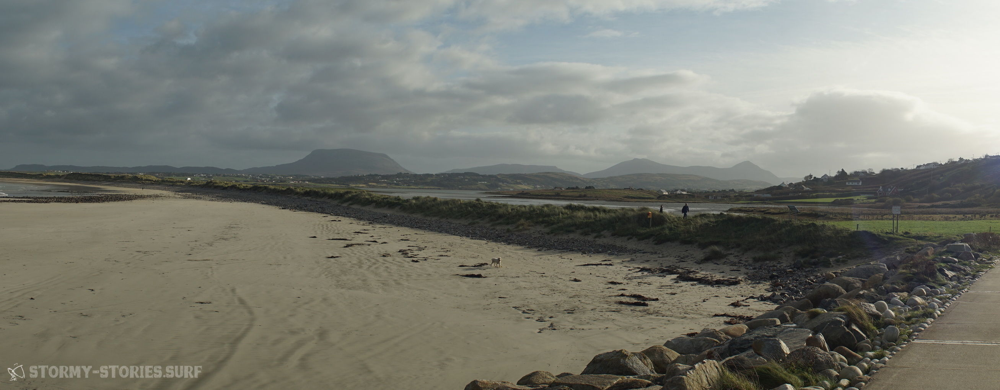
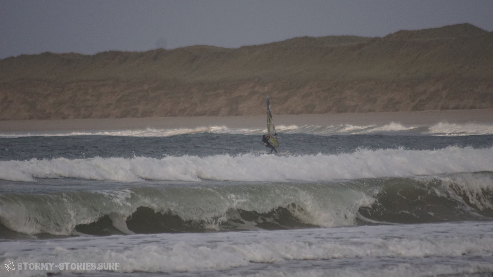
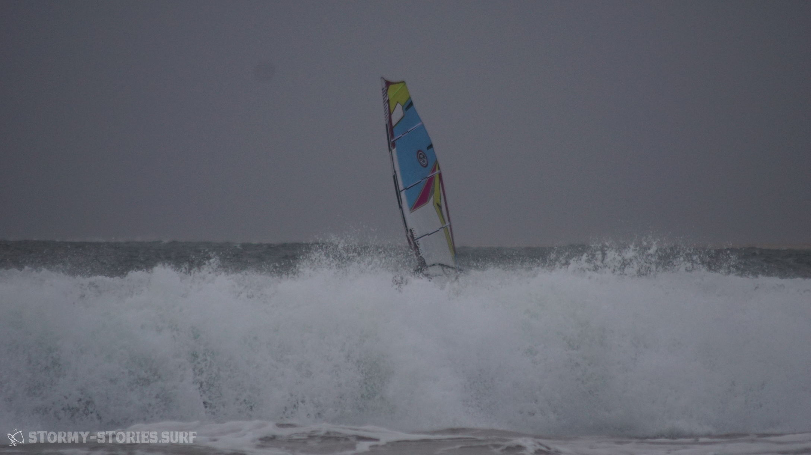
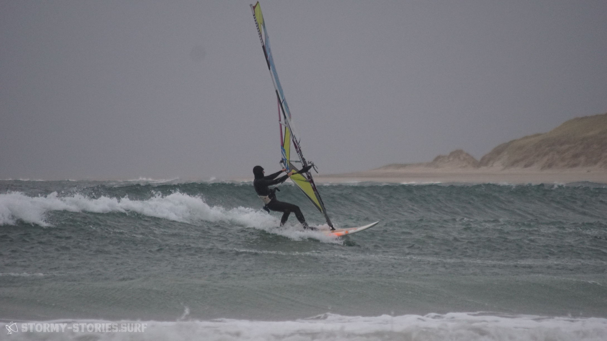
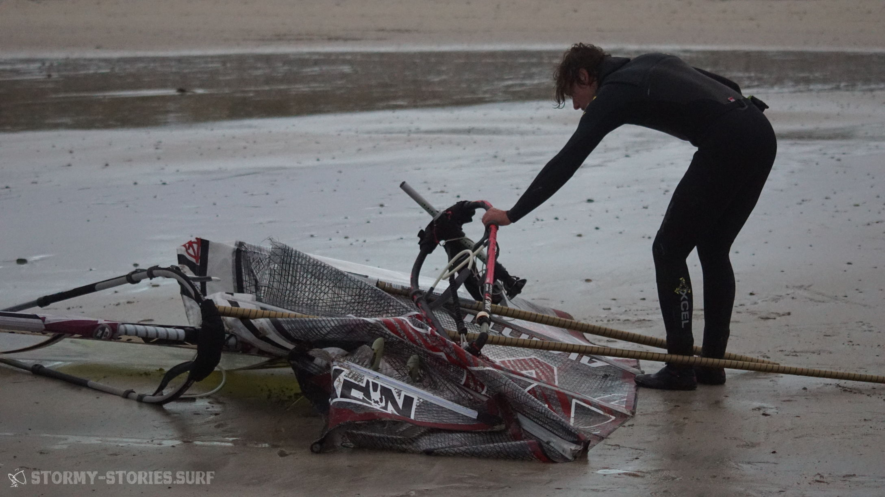

# Irland 2017 : Magheroarty Beach I

Die Fahrt von Mullaghmore weiter nach Magheroarty führte uns durch eine wunderschöne und teilweise vollkommen verlassene Landschaft. Von Donegal aus wählten wir zwar erst einmal den Weg über die Autobahn N15 und vorbei an Ballybofey und Drumkeen um ein bisschen Zeit zu sparen und nicht mitten in der Nacht nach einer Unterkunft suchen zu müssen. Von Drumkeen ging es dann allerdings doch wieder über die Landstraße entlang von Church Hill, nach Lossett, durch den Glenveagh National Park nach Roshine und dann letztendlich nach Gortahork.

Von Gortahork aus fuhren wir erst einmal weiter in Richtung Mín Lárach, den Ort auf Höhe des Magheroarty Beach. Hier kam uns jedoch alles relativ dunkel und ausgestorben vor, so dass wir uns schnell entschieden unser Glück an diesem regnerischen Abend lieber in Gortahork zu probieren.
Hier hatten wir sogar ein Hotel gesehen, dass aber auf den ersten Blick nicht gerade günstig aussah. Zuerst einmal war jedoch der lokale Supermarkt unser Anlauf-Punkt. Hier schien noch ordentlich etwas los zu sein und so fragten wir an der Kasse nach einem Bed & Breakfast in der Nähe.

Mit der typisch irischen Lässigkeit verwies und die Kassiererin direkt an eine Frau gerade dabei war den Laden zu verlassen. Sie würde uns voraus fahren und zeigen wo wir es probieren sollten.
Keine 500 Meter später blinkte das Auto vor uns, öffnete die Fensterscheibe und zeigte auf ein Haus auf der rechten Straßenseite.
Alles klar, also rauf auf die Auffahrt. Als wir auf die Auffahrt herauffahren will eine Frau diese gerade wieder heruntenfahren.

Schnell steige ich aus und laufe zu ihrem Fenster. Für einen kurzen Moment scheint sie etwas verwirrt zu sein, was wir mit unserem beladenen Surf-Panzer auf ihrer Auffahrt machen, doch als ich ihr erkläre, dass wir eine Unterkunft suchen und man uns vom Supermarkt hier her geführt hat lächelt sie und führt uns zum Haus.
Dabei erklärte sie uns, dass sie im Winter ihr Bed & Breakfast üblicherweise geschlossen hätten und deswegen auch keine Schild von draußen zu sehen sei. Doch wir seien natürlich trotzdem herzlich willkommen und könnten gerne bei ihnen unterkommen.
Wenige Minuten später ist unser Panzer geparkt und unsere Koffer stehen in einem gemütlichen Zimmer des "An Stoirin B&B"s . Wir sind froh über unsere Unterkunft und dass wir heute nicht in einer regnerischen Nacht im Auto schlafen müssen.

