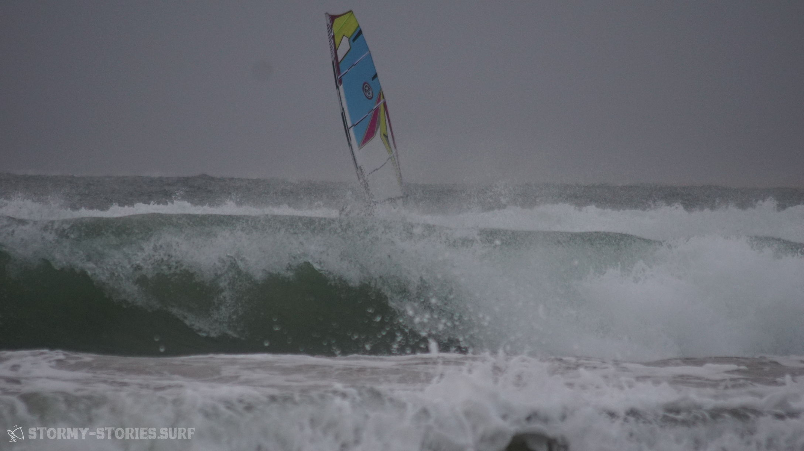
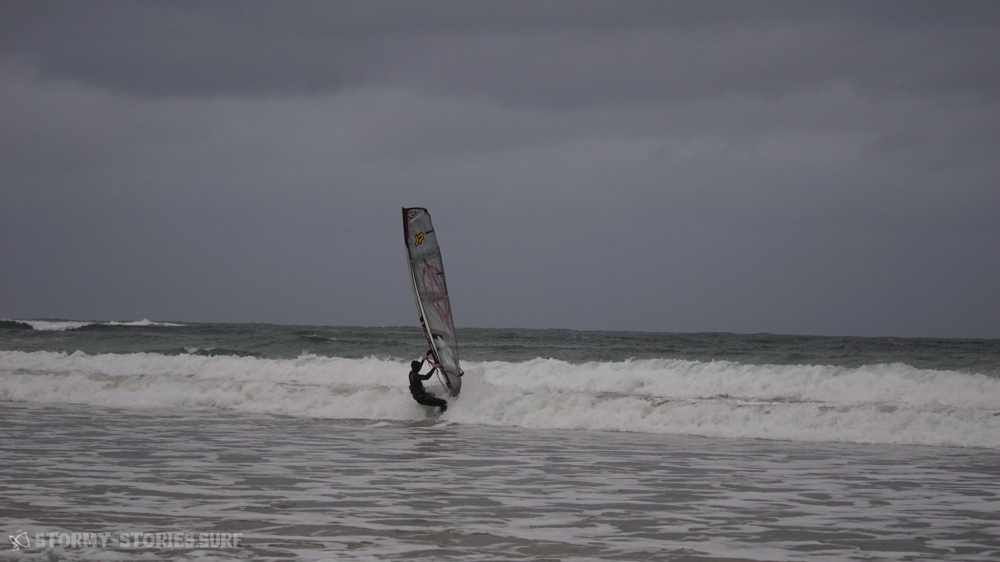
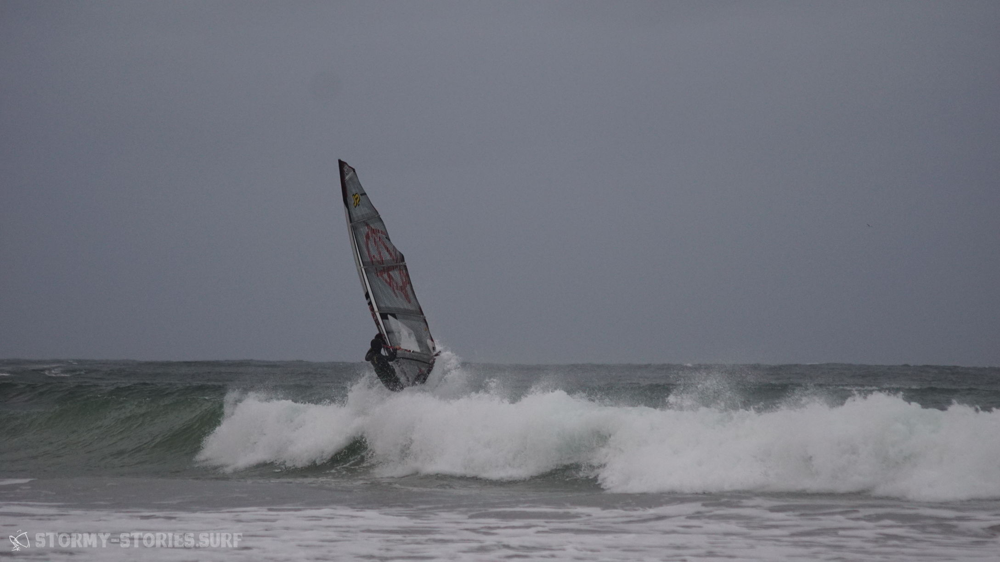

# Irland 2017 : Magheroarty Beach I

Die Fahrt von Mullaghmore weiter nach Magheroarty führte uns durch eine wunderschöne und teilweise vollkommen verlassene Landschaft. Von Donegal aus wählten wir erst einmal den Weg über die Autobahn N15 und vorbei an Ballybofey und Drumkeen um ein bisschen Zeit zu sparen und nicht mitten in der Nacht nach einer Unterkunft suchen zu müssen. Von Drumkeen ging es dann allerdings doch wieder die Landstraße entlang von Church Hill, nach Lossett, durch den Glenveagh National Park nach Roshine und dann letztendlich nach Gortahork.

// bisschen viel Location-Namedropping vielleicht. Hmm, ne Landkarte mit Route einblenden?

Von Gortahork aus fuhren wir erst einmal weiter in Richtung Mín Lárach (Meenlaragh), den Ort auf Höhe des Magheroarty Beach. Hier kam uns jedoch alles relativ dunkel und ausgestorben vor, so dass wir uns schnell entschieden unser Glück an diesem regnerischen Abend lieber in Gortahork zu probieren.
Hier hatten wir sogar ein Hotel gesehen, dass aber auf den ersten Blick nicht gerade günstig aussah. Zuerst einmal war jedoch der lokale Supermarkt unser Anlaufpunkt. Hier schien noch ordentlich etwas los zu sein und so fragten wir an der Kasse nach einem Bed & Breakfast in der Nähe.

Mit der typisch irischen Lässigkeit verwies uns die Kassiererin direkt an eine Frau, die gerade dabei war den Laden zu verlassen. Sie würde uns voraus fahren und zeigen wo wir es probieren sollten.
Keine 500 Meter später blinkte das Auto vor uns, öffnete die Fensterscheibe und zeigte auf ein Haus auf der rechten Straßenseite.

Alles klar, also rauf auf die Auffahrt. Im gleichen Moment kam uns ein Auto entgegen, das offensichtlich gerade im Begriff war, die Auffahrt wieder zu verlassen.

Schnell sprang ich aus dem Auto und lief zum Fenster der Fahrertür. Im Auto saß eine Frau mittleren Alters. Für einen kurzen Moment schien sie etwas verwirrt zu sein, was wir mit unserem beladenen Surf-Panzer auf ihrer Auffahrt machten. Doch als ich ihr erklärte, dass wir auf der Suche nach einer Unterkunft waren und man uns vom Supermarkt hierher geführt hatte, lächelte sie und führte uns zum Haus.
Dabei erklärte sie uns, dass sie im Winter ihr Bed & Breakfast üblicherweise geschlossen habe und deswegen auch kein Schild von draußen zu sehen sei. Wir seien natürlich trotzdem herzlich willkommen und könnten gerne bei ihnen unterkommen.
Wenige Minuten später war unser Panzer geparkt und unsere Koffer standen in einem gemütlichen Zimmer des "An Stoirin B&B" . Wir waren froh über unsere Unterkunft und darüber, in dieser regnerischen Nacht nicht im Auto schlafen zu müssen.
Einige Monate später erfuhren wir dann, dass das Hotel in Gortahork mit ca. 70€ die Nacht zwar nicht gerade günstig ist, hier jedoch vergünstigte Preise für Windsurfer angeboten werden, sodass man hier für ca. 40€ hätte unterkommen können.

Am nächsten Morgen ging es mit dem Auto zum Spot-Check an den Magheroarty Beach. Der Wind schien sich etwas zu verspäten und würde vermutlich erst am nächsten Tag sichere Bedingungen schaffen. Vor dem Frühstück hatten wir daher entschieden, für die nächsten Tage eine neue Unterkunft zu suchen, die näher am Wasser liegt und evtl. etwas günstiger ist. Über AirBnB fanden wir eine Übernachtungsmöglichkeit, die günstig und gut gelegen aussah. Sie lag direkt in der Mitte von Mín Lárach und sollte somit nur wenige hundert Meter vom Strand entfernt sein. Leider bekamen wir bis zu unser Abreise keine Antwort mehr über das Online-Portal und machten uns deshalb auf eigene Faust auf die Suche nach einer anderen Unterkunft. Doch alles was wir fanden sah entweder geschlossen oder belegt aus.
Als wir dann aus Gortahork kommend hinter Coll's Bar die Straße entlang fuhren, entdeckte Marcel plötzlich ein paar blaue Bungalows, die denen aus AirBnB ziemlich ähnlich sahen. Die fünfte Auffahrt hinter der Bar führte uns auf der linken Straßenseite zwischen zwei Häusern auf ein etwas weiter hinten gelegenes Grundstück. Hier standen tatsächlich mehrere kleine blaue Bungalows. An einem von ihnen stand ein Auto, es schien gerade gereinigt zu werden.

Zwar sahen die Bungalows von außen nicht besonders ansprechend aus, doch irgendwie hatten wir auch das Gefühl, dass es schwer werden würde für die nächsten Tage etwas besseres in der Nähe zu finden. Somit erkundigte ich mich, ob es möglich wäre hier für ein paar Nächte unterzukommen. Doch leider schien die Bude bereits vermietet zu sein. Jemand habe sie vor kurzem über das Internet angefragt.
Ha! Ja und genau dieser jemand war dann wohl ich..  Okay - also ab in die Butze und Zimmer beziehen.

Als wir unser Zuhause für die nächsten Tage dann von innen sahen, staunten wir nicht schlecht. Zwei gemütliche Schlafzimmer, eine große Wohnküche und ein ziemlich neues Bad, alles schön sauber und neu eingerichtet.

Aber jetzt hieß es erstmal, die weitere Gegend zu erkunden. Weiter im Westen sollte es noch einen weiteren Surf-Spot namens "Bloody Foreland" geben und diesen galt es nun zu finden.  
Wir hörten einen spannenden Podcast über die Gesellschaft und das Leben in Saudi-Arabien und anderen arabischen Ländern (https://cre.fm/cre212-saudi-arabien) und fuhren durch die nordwestirische Idylle. Eine schmale kurvige Straße führte durch ein Nichts mit grün-braunen Wiesen.

Nach kurzer Zeit hatten wir das sogenannte Bloody Foreland erreicht. Wie wir herausfinden konnten, war diese Gegend nicht, wie man vielleicht annehmen könnte, nach einer sagenumwobenen Schlacht in der Vergangenheit benannt, sondern der Rotfärbung der Steine bei Sonnenuntergang.
Unser Meinung nach hätte allerdings auch der Ein- und Ausstieg an diesem Spot Namensgeber für diesen Ort sein können. Für uns sah das Ganze jedenfalls nicht besonders einladend aus und so entschieden wir uns wieder zurück an den Magheroarty Beach zu fahren.

//habt ihr da ein Bild von? Würde hier passen

In Magheroarty sah es mittlerweile etwas besser aus. Der Wind schien zwar immer noch an der unteren Grenze zu sein, die Wellen jedoch hätten schöner kaum sein können und liefen mehrere hunderte Meter lang in die gigantische sichelförmige Bucht.
Wir parkten unser Auto auf dem großen Parkplatz des Hafens und erkundeten zu Fuß die Gegend.

Hinter einer Kaimauer brachen etwas größere Wellen, jedoch schienen hier auch größere Felsen im Wasser zu liegen. Auf der anderen Seite der Kaimauer war komplett spiegelglattes Wasser. Etwa 100 Meter weiter in Lee begannen dann die Wellen, die sich schön sauber und parallel in Richtung Sandstrand rollten.

Wenig später standen wir mit 5.9er und 6.2er Segel im glatten Wasser des Hafens. Der Plan war einfach: wir wollten versuchen im glatten Wasser heraus zu surfen, um dann hoffentlich gut angepowered über die Wellen nach draußen zu kommen. 5 Minuten später lagen wir beide in Wasserstart-Position am Ende der Kaimauer direkt vor den Wellen und versuchten vergeblich irgendwo genügend Wind zu finden um wieder zurück aufs Board zu kommen.
Aus irgendeinem Grund, vermutlich durch die Windabdeckung der Mauer, schien genau hier kein Wind mehr anzukommen - schade eigentlich.
Dabei wäre der der Plan doch so schön gewesen. Wir verständigten uns kurz über Handzeichen und schwammen mit unserem Material weiter nach Lee in die Wellen, um von dort einen weiteren Versuch zu starten.

Der Wind schien hier immer noch etwas löchrig, aber immerhin ausreichend zu sein, um wieder zurück aufs Board und raus über die Wellen zu kommen. Draußen angekommen war dann eigentlich alles ganz einfach. Zwar ging es zwischen den Wellen ordentlich auf und ab, aber immerhin hier reichte der Wind für entspanntes Freeriden.

Besonders beeindruckend war hierbei allerdings die Rückfahrt zum Strand. Bereits mindestens 200 Meter vor dem Strand konnte man sich eine passende Welle aussuchen. Hier konnte man in Ruhe beobachten, wie sich aus der langen Line im Wasser ein kleiner Berg auftürmte. In diesen konnte man dann bei passender Höhe hineindroppen und versuchen den ein oder anderen Turn zu fahren. Wenn man bis dahin noch nicht im Gleiten war (was hin und wieder der Fall war), konnte man spätestens dann in die Fußschlaufen steigen.
//man-Overload

Später am Tag gesellte sich noch ein weiterer Surfer dazu, der aber nur kurz am Strand auftauchte, mehrere Schläge raus kreuzte und dann einige hundert Meter weit draußen beeindruckend große Wellen abritt.

Der restliche Tag gestaltet sich ähnlich wie auch schon in der Brandon Bay. Das Hauptziel lag immer darin, irgendwie über die langen Wellen nach draußen zu kommen. Durch den etwas löchrigen Wind war es hier nur noch mal eine Nummer komplizierter. Sobald man dies jedoch einmal geschafft hatte, war man erstmal in sicheren Gewässern und konnte sich eine Welle aussuchen und mit dieser zurück an den Strand fahren. Kam man beim Rausfahren jedoch zum Liegen, bekam man mit aller Wucht zu spüren, dass dieser Swell hier mit der heimischen Ostsee nicht zu vergleichen war und wurde dann nach allen Regeln der Kunst gewaschen.

Und so forderte Mutter Natur am Ende des Tages auch noch ein 6.2 Quadrameter großes Opfer.
Im löchrigen Wind zum Liegen gekommen, nahm die nächste Welle das Material einmal mit in Richtung Grund, brach den Mast und drehte wenig später das Board einmal quer durch das zum Bersten gespannte Segel.

