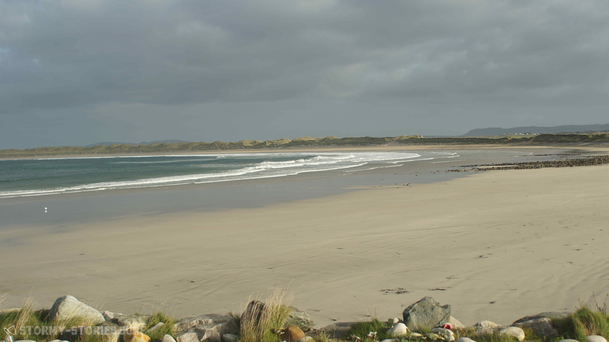

# Ireland 2017 : Magheroarty Beach I

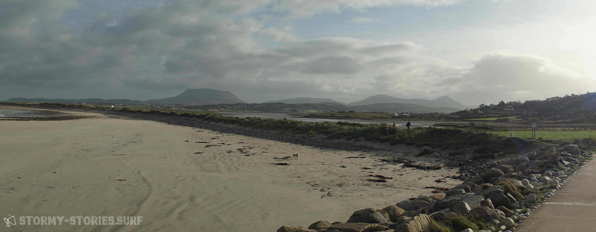

The drive from Mullaghmore on to Magheroarty took us through a beautiful and partly completely deserted landscape. From Donegal, we first chose the route via the N15 highway and past Ballybofey and Drumkeen to save a bit of time and avoid having to look for accommodation in the middle of the night. From Drumkeen, however, we took the small road again along Church Hill, to Lossett, through Glenveagh National Park to Roshine and then finally to Gortahork.

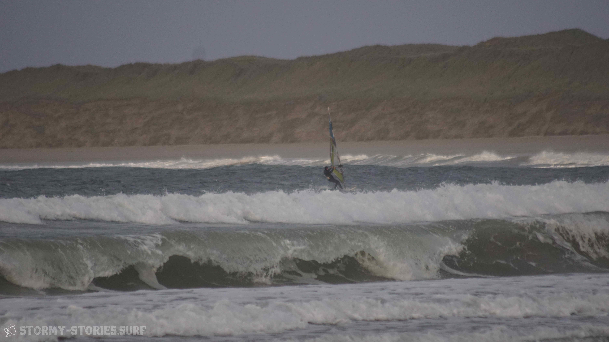

From Gortahork, we first drove on towards Mín Lárach (Meenlaragh), the village at Magheroarty Beach. Here, however, everything seemed relatively dark and deserted, so we quickly decided to try our luck in Gortahork on this rainy evening.

We had even seen a hotel here, but it didn't look very cheap at first glance. Our first port of call, however, was the local supermarket. There seemed to be a lot going on here and so we asked at the checkout for a bed and breakfast nearby.

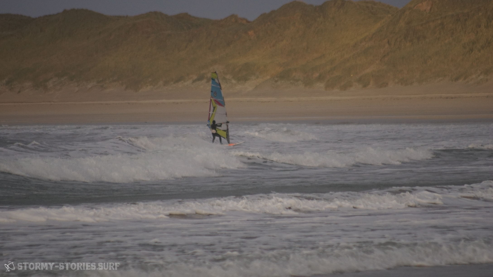

With typical Irish nonchalance, the cashier directed us straight to a woman who was just about to leave the store. She would drive us ahead and show us where we should try it. Less than 500 meters later, the car in front of us flashed its lights, opened the window and pointed to a house on the right-hand side of the road.

All right, so up onto the driveway. At the same moment, a car came towards us that was obviously about to leave the driveway again.

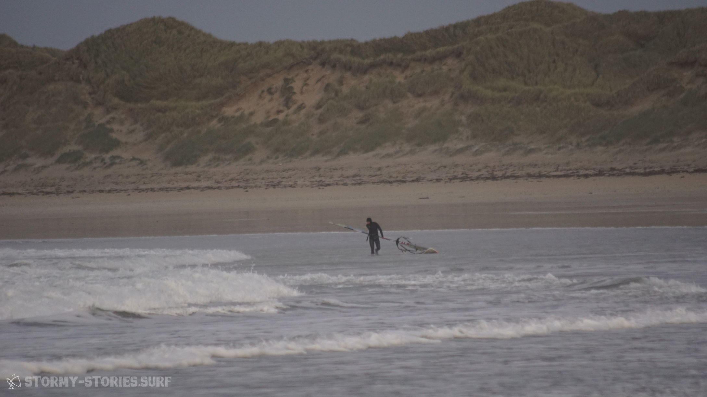

I quickly jumped out of the car and ran to the driver's door window. There was a middle-aged woman in the car. For a brief moment, she seemed a little confused as to what we were doing with our loaded surf tank on her driveway. But when I explained to her that we were looking for accommodation and that we had been led here from the supermarket, she smiled and led us to the house. She explained that her bed and breakfast was usually closed in winter and that there was therefore no sign outside, but we were of course still very welcome and could stay with them.

A few minutes later, our tank was parked and our suitcases were in a cozy room at An Stoirin B&B. We were happy about our accommodation and not having to sleep in the car on this rainy night.

A few months later, we found out that the hotel in Gortahork wasn't exactly cheap at around €70 a night, but that they offered discounted rates for windsurfers, so its possible to stay here for around €40.

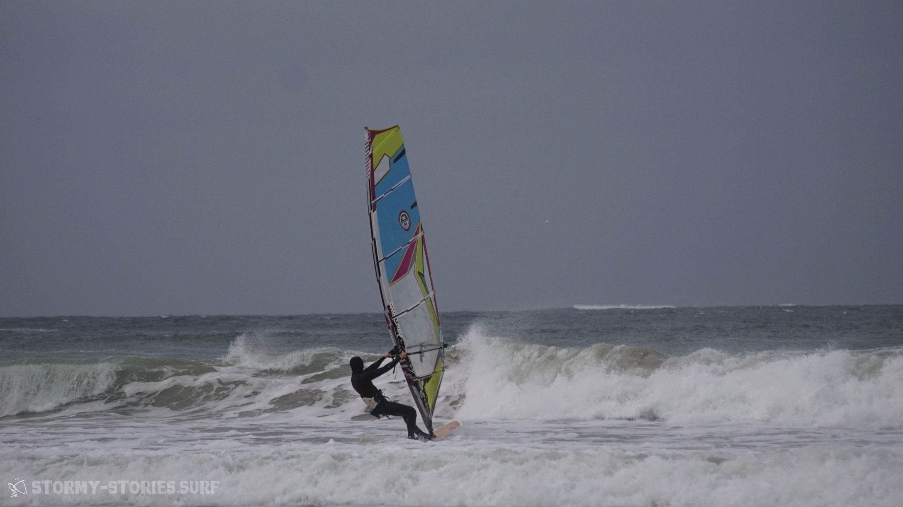

The next morning we took the car to Magheroarty Beach for a spot check. The wind seemed to be a little late and would probably not create safe conditions until the next day. Before breakfast, we therefore decided to look for new accommodation for the next few days that was closer to the water and possibly a little cheaper. We found a place to stay via AirBnB that looked cheap and well located. It was right in the middle of Mín Lárach and should therefore only be a few hundred meters from the beach. Unfortunately, we didn't get any response from the online portal before we left, so we set off on our own to look for other accommodation. But everything we found looked either closed or occupied.

As we drove along the road behind Coll's Bar coming from Gortahork, Marcel suddenly spotted a few blue bungalows that looked pretty similar to the ones on AirBnB. The fifth driveway behind the bar led us between two houses on the left-hand side of the road to a plot of land a little further back. There were actually several small blue bungalows here. There was a car parked at one of them, which appeared to be being cleaned.

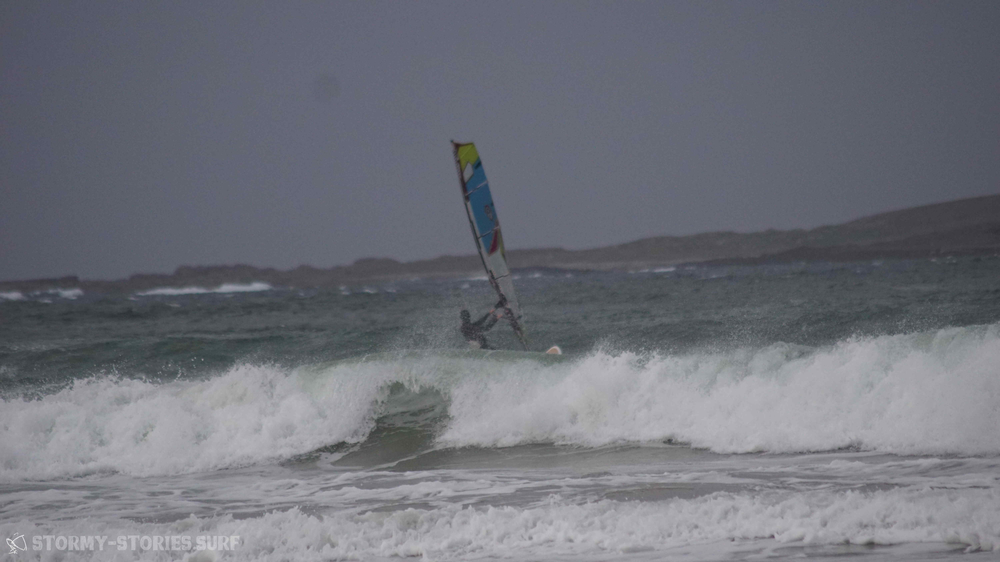

The bungalows didn't look particularly appealing from the outside, but somehow we also had the feeling that it would be difficult to find something better nearby for the next few days. So I enquired whether it would be possible to stay here for a few nights. Unfortunately, the place seemed to have already been rented out. Someone had recently enquired about it on the internet.

Ha! Yes, and that someone was probably me. Okay, at least I had understood that now, but obviously our counterparts hadn't yet. After a brief conversation, it was clear to them too - so off we went our new home and checked into our rooms.

When we saw the inside of our place for the next few days, we were amazed. Two cozy bedrooms, a large kitchen-living room and a fairly new bathroom, all beautifully clean and newly furnished.

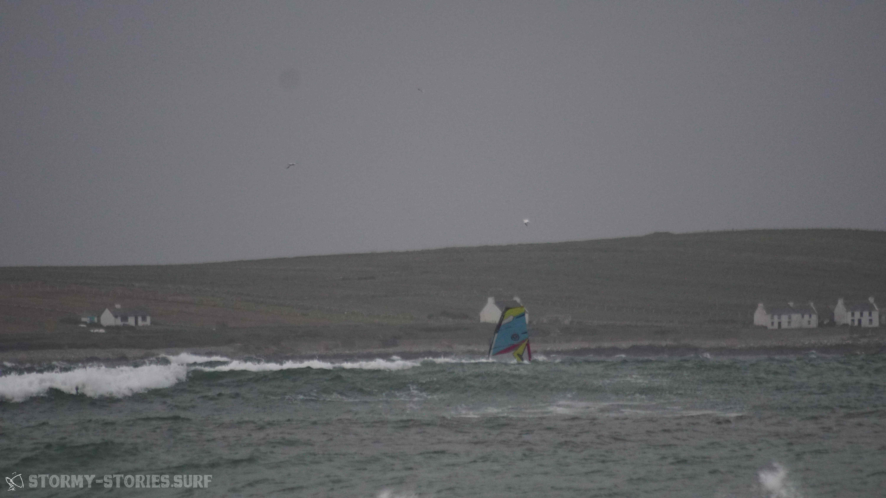

But now it was time to explore the rest of the area. Further west, there was supposed to be another surf spot called "Bloody Foreland" and we had to find it.  
We listened to an exciting podcast about society and life in Saudi Arabia and other Arab countries (https://cre.fm/cre212-saudi-arabien) and drove through the idyllic north-west of Ireland. A narrow winding road led through a nothingness of green-brown meadows.

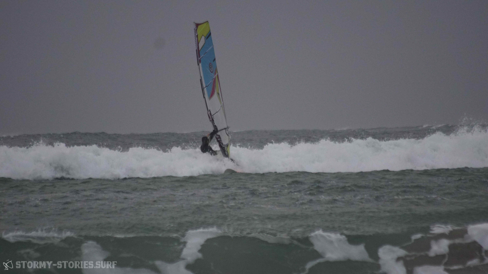

After a short time, we had reached the so-called Bloody Foreland. As we found out, this area was not named after a legendary battle in the past, as one might assume, but owed its name to the red color of the rocks at sunset.

In our opinion, however, the entrance and exit at this spot could also have given the place its name. It didn't look particularly inviting to us, so we decided to head back to Magheroarty Beach.

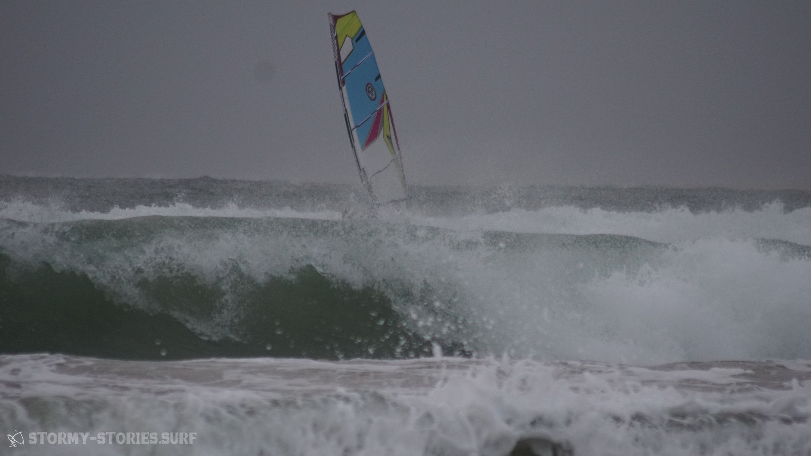

In Magheroarty, things were looking a little better by now. The wind still seemed to be at the lower limit, but the waves could hardly have been more beautiful and ran for several hundred meters into the gigantic crescent-shaped bay. We parked our car in the large parking lot of the harbour and explored the area on foot.

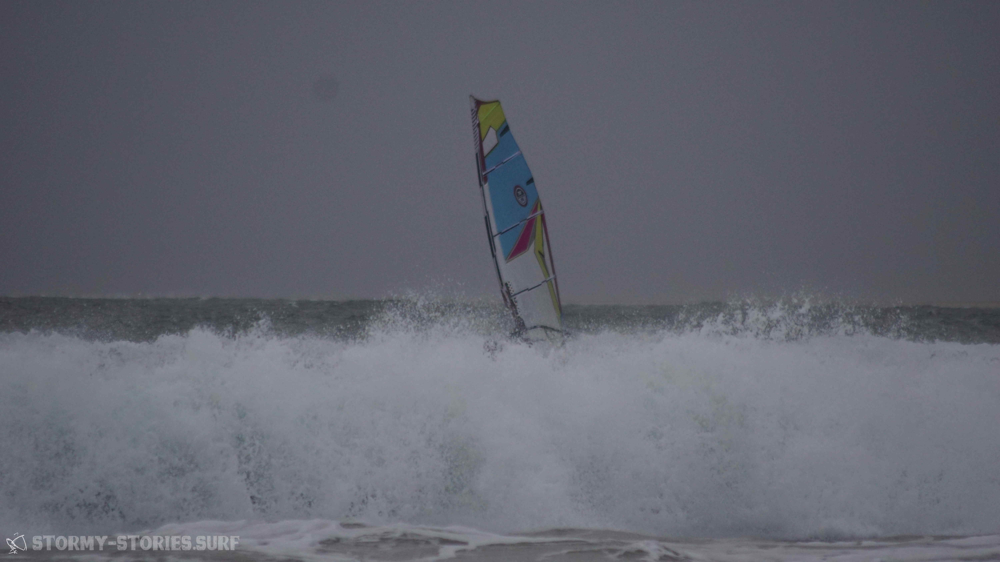

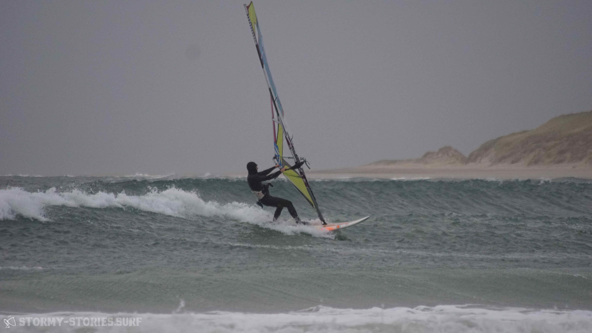

Slightly larger waves broke behind a quay wall, but there also appeared to be larger rocks in the water. On the other side of the quay wall, the water was completely smooth as glass. About 100 meters further downwind, the waves began to roll cleanly and parallel towards the sandy beach.

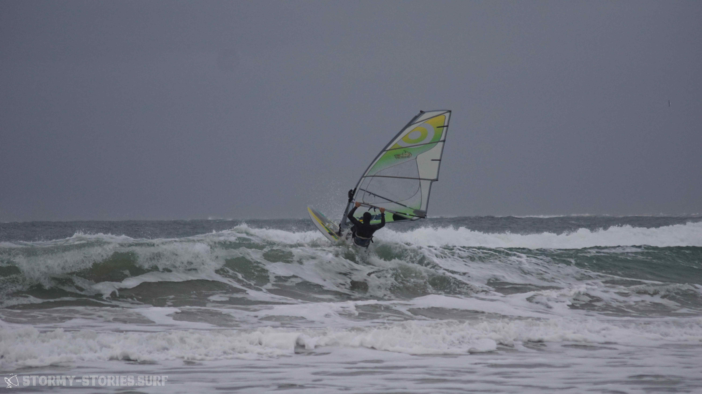

A little later we were standing in the smooth water of the harbor with 5.9 and 6.2 sails. The plan was simple: we wanted to try to surf out in the smooth water and then hopefully get well powered over the waves to the outside. 5 minutes later we were both in waterstart position at the end of the quay wall right in front of the waves, trying in vain to find enough wind to get back on the board.

For some reason, probably due to the wind cover on the wall, there didn't seem to be any wind here - a shame really. But the plan would have been so nice. We communicated briefly using hand signals and swam with our equipment further downwind into the waves to make another attempt from there.

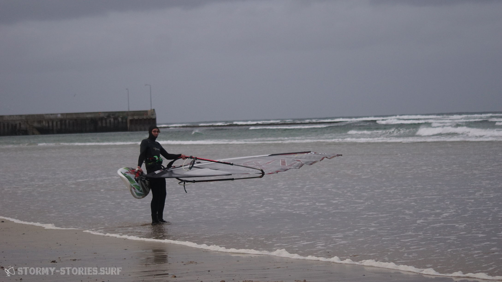

The wind still seemed a bit patchy here, but at least it was enough to get us back on the board and out over the waves. Once outside, everything was actually quite easy. Although there was a lot of up and down between the waves, there was enough wind for relaxed freeriding.

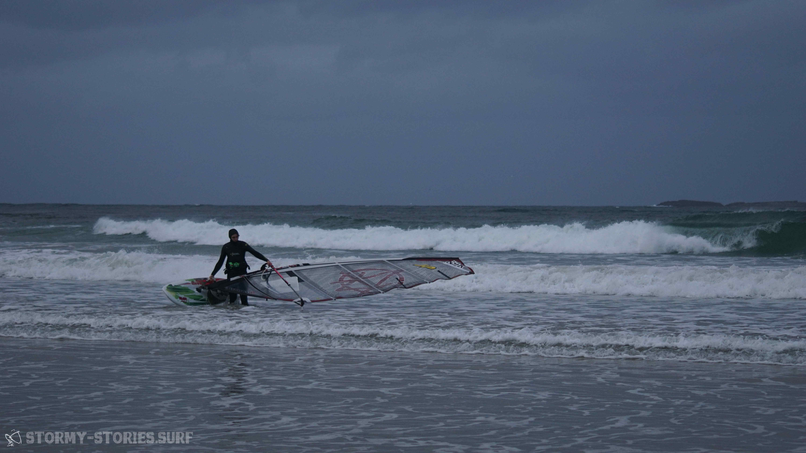

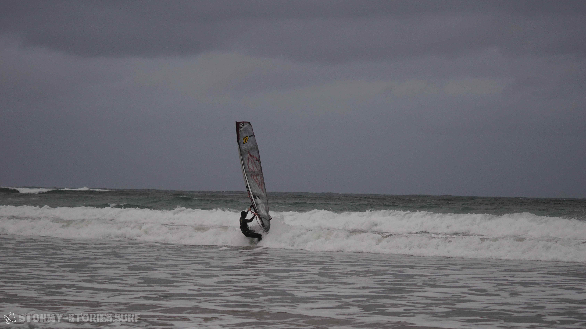

However, the return trip to the beach was particularly impressive. You could choose a suitable wave at least 200 meters from the beach. Here you could watch the long line in the water pile up into a small mountain. Then it was time to drop in at the right height and try to do one or two turns. If the wind had not been enough for planing up to this point - which was occasionally the case - it was now possible to get into the footstraps.

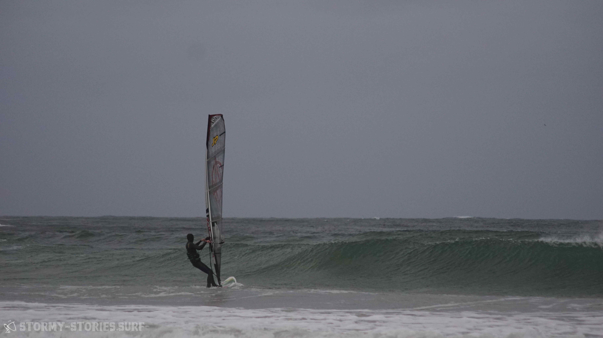

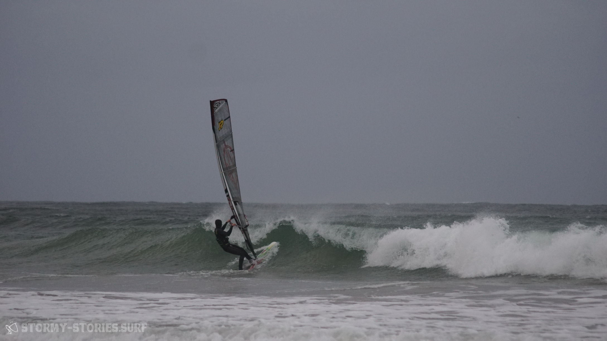

Later in the day, another surfer joined us, but he only appeared briefly on the beach, cruised out several turns and then rode impressively large waves a few hundred meters out.

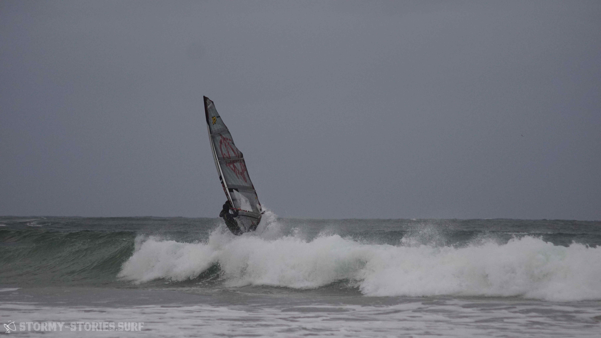

The rest of the day was similar to Brandon Bay. The main aim was always to somehow get out over the long waves. The somewhat patchy wind made it even more complicated here. However, once you had managed this, you were in safe waters and could choose a wave and ride it back to the beach. However, if you came to fall on the way out, you were made to feel with all your might that this swell could not be compared with your local Baltic Sea and were then washed by every trick in the book.

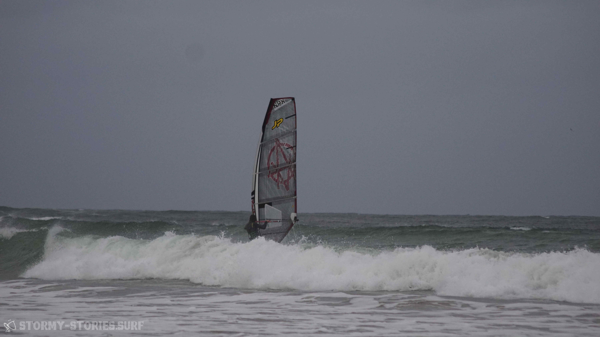

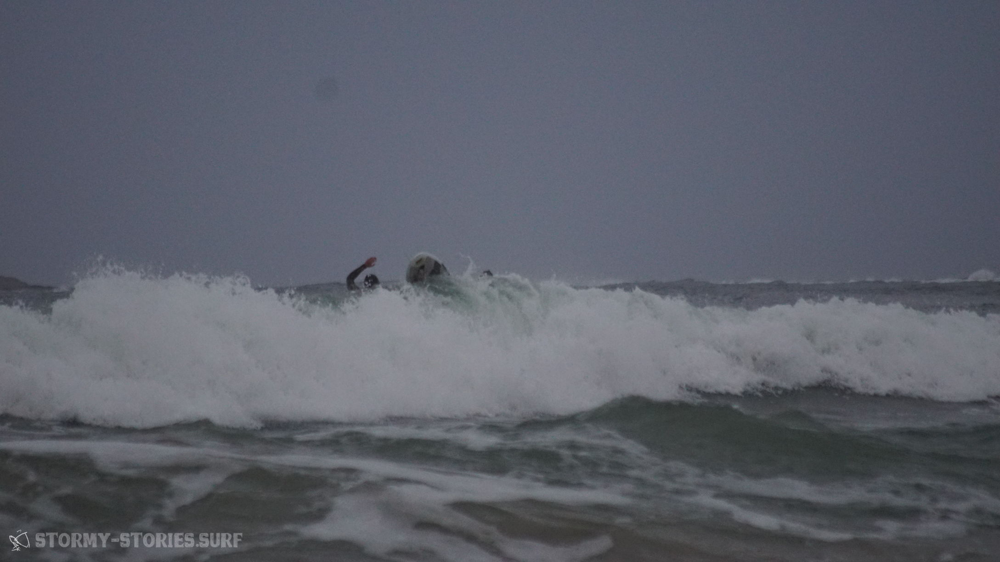

And so Mother Nature claimed a 6.2 square meter victim at the end of the day.
After dropping the sail in a moment of no wind, the next wave took the material towards the bottom, broke the mast and a little later turned the board right through the sail, which was already stretched to bursting point.

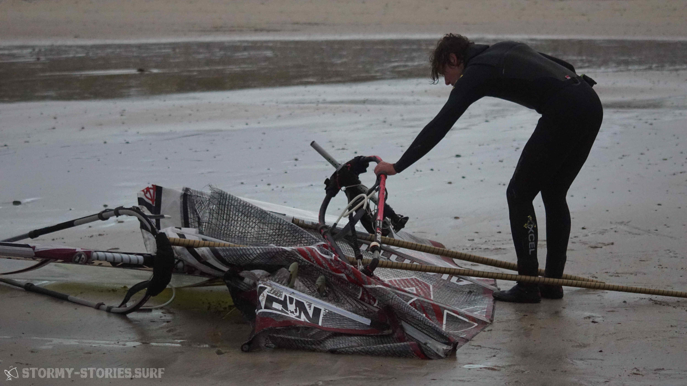
