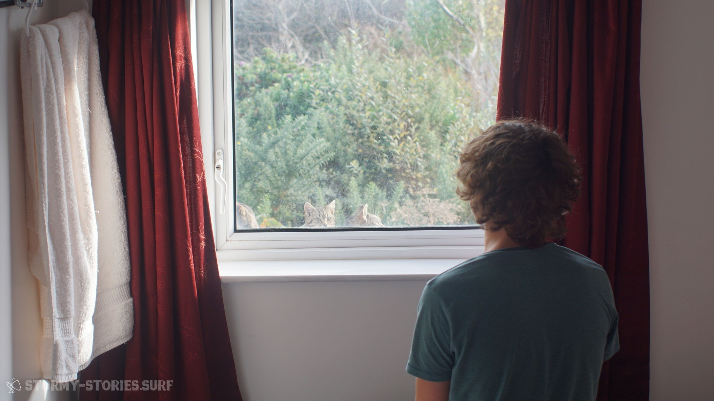
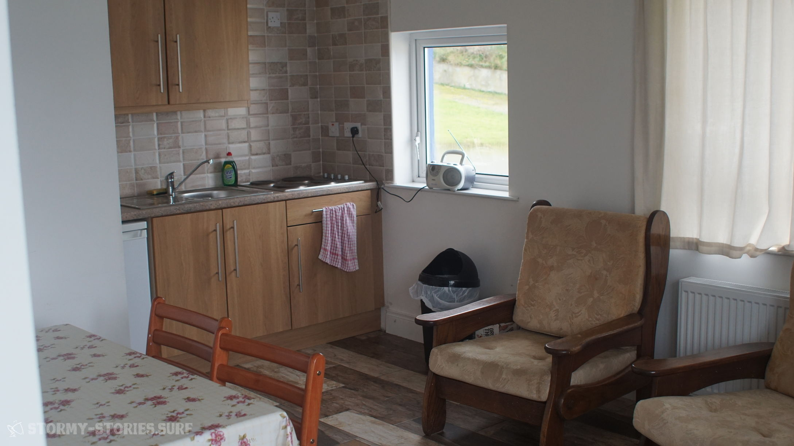

# Irland 2017 : Magheroarty Beach II

Am nächsten Tag sollte der Wind kommen. Morgens relativ stark und über den Tag sollte es dann abnehmen. Motiviert stellten wir unseren Wecker auf 6 Uhr Morgens und gingen dann nach einem gemütlichen Abend auf dem Sofa und einigen Dosen Cider ab ins Bett. Während der Nacht wachten wir einige Male auf, weil der Wind in den Fenster pfiff und draußen ganz schönen Lärm machte.

Als wir dann um 6 Uhr von unserem Wecker aus einem unruhigen Schlaf gerissen wurden, stellten wir fest das es draußen noch stocke finster war.
Eigentlich war das auch logisch gewesen, doch irgendwie hatten wir beide nicht darüber nachgedacht.
Nich ganz zufrieden, aber auch garnicht mal so unzufrieden legten wir unsere müden Körper für weitere zwei, drei Stunden ins Bett.

Nach einem kurzen Frühstück ging es vor die Haustür. Von hier aus konnte man den Berg hinab bis in die Bucht des Magheroarty Beachs gucken und was wir dort sehen konnten gefiel uns. Die Wellen schienen im Vergleich zu gestern noch weiter zugenommen zu haben und die Bäume bogen sich auch deutlich mehr, als noch am Tag zuvor.

Müde aber trotzdem irgendwie hochmotiviert sprangen wir im warmen Badezimmer unseres Bungalows in die noch etwas feuchten Neopren-Anzüge und dann mit Kamera-Equipment und etwas Essen ins Auto.

Keine drei Minuten später standen wir unten auf dem Parkplatz des Hafens. Es schien noch Ebbe zu sein, so dass sich vor uns ein langer schöner Sandstrand erstreckte. Dem Windmesser nach schien der Wind perfekt für 4.5 und 4.7er Segel zu sein, er hatte also bereits wie angekündigt abnommen.
Auf dem Parkplatz wurde aufgeriggt und das Material dann auf dem Strand in Start-Position positioniert.

Heute schien der Wind etwas gedreht zu haben. Side-Shore bis Side-On-Shore machten das Wellenabreiten etwas schwieriger als noch am Tag zuvor. Dafür schien das Rausfahren gegen die Wellen und das Springen bedeutend einfacher zu sein.

Insgesamt waren es aber einfach abgefahren gute 

