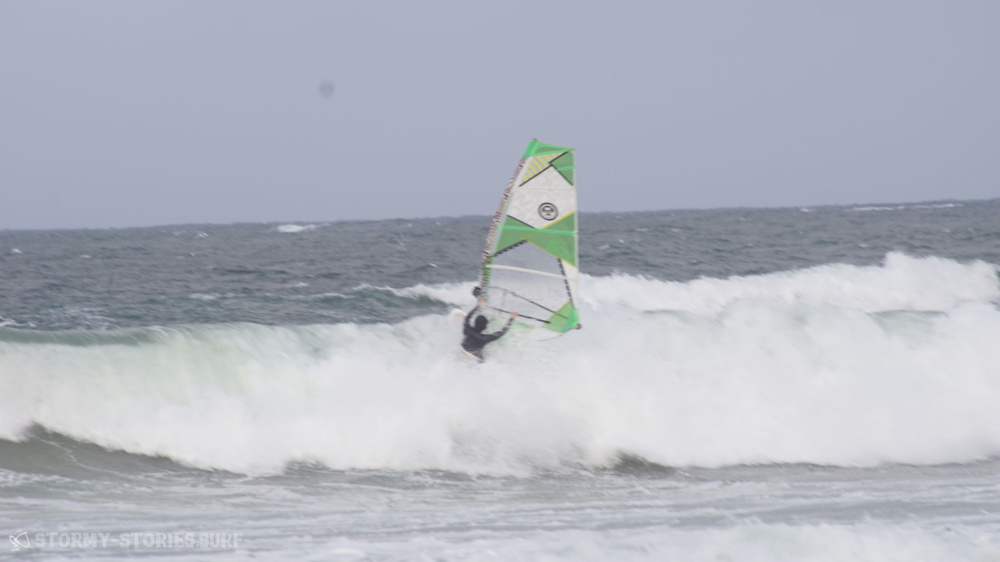
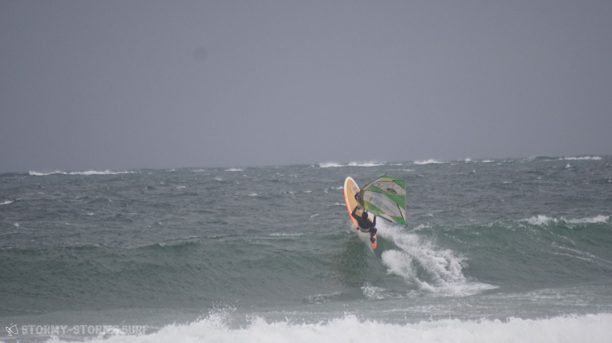
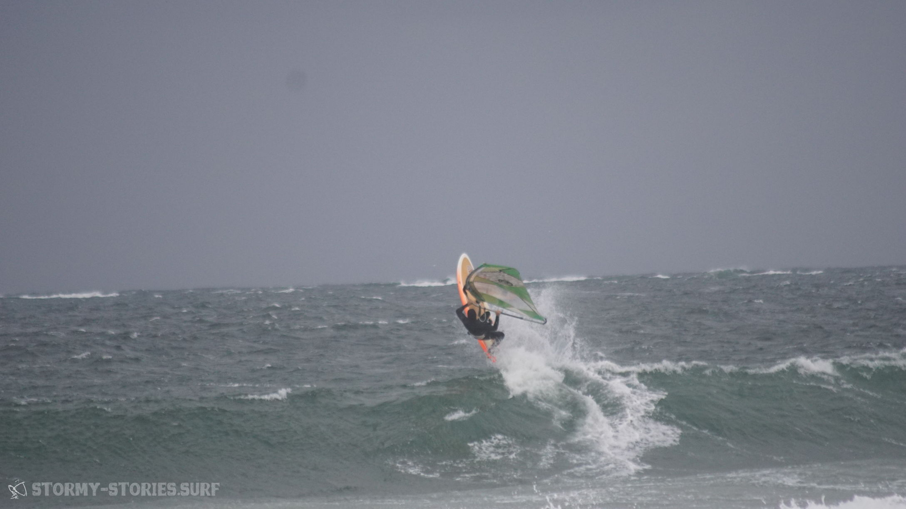
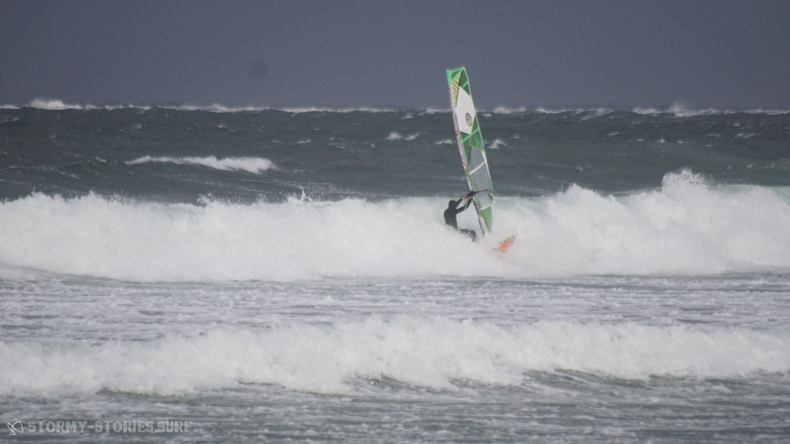

# Irland 2017 : Magheroarty Beach II

Am nächsten Tag sollte der Wind kommen. Morgens relativ stark und über den Tag sollte es dann abnehmen. Motiviert stellten wir unseren Wecker auf 6 Uhr Morgens und gingen dann nach einem gemütlichen Abend auf dem Sofa und einigen Dosen Cider ab ins Bett. Während der Nacht wachten wir einige Male auf, weil der Wind in den Fenster pfiff und draußen ganz schönen Lärm machte.

Als wir dann um 6 Uhr von unserem Wecker aus einem unruhigen Schlaf gerissen wurden, stellten wir fest das es draußen noch stocke finster war.
Eigentlich war das auch logisch gewesen, doch irgendwie hatten wir beide nicht darüber nachgedacht.
Nicht ganz zufrieden, aber auch garnicht mal so unglücklich über die Ausrede sich wieder hinlegen zukönnen, legten wir unsere müden Körper für weitere zwei, drei Stunden zurück ins Bett.

Nach einem kurzen Frühstück ging es vor die Haustür. Von hier aus konnte man den Berg hinab bis in die Bucht des Magheroarty Beachs gucken und was wir dort sehen konnten gefiel uns. Die Wellen schienen im Vergleich zu gestern noch weiter zugenommen zu haben und die Bäume bogen sich auch deutlich mehr, als noch am Tag zuvor.

Müde aber trotzdem irgendwie hoch motiviert sprangen wir im warmen Badezimmer unseres Bungalows in die noch etwas feuchten Neopren-Anzüge und dann mit Kamera-Equipment und etwas Essen ins Auto.

Keine drei Minuten später standen wir unten auf dem Parkplatz des Hafens. Es schien noch Ebbe zu sein, so dass sich vor uns ein langer schöner Sandstrand erstreckte. Dem Windmesser nach schien der Wind perfekt für 4.5 und 4.7er Segel zu sein, er hatte also bereits wie angekündigt abgenommen.
Auf dem Parkplatz wurde aufgeriggt und das Material dann auf dem Strand in Start-Position positioniert.

Heute schien der Wind etwas gedreht zu haben. Side-Shore bis gelegentlich leicht Side-On-Shore machten das Wellenabreiten etwas schwieriger als noch am Tag zuvor. Dafür schien das Rausfahren gegen die Wellen und das Springen bedeutend einfacher zu sein.

Insgesamt waren es aber einfach abgefahren gute Bedingungen, wir feierten unsere ersten richtig guten und zunehmend deutlich kontrollierteren Sprünge.
Vor dem Urlaub war noch jeder kleiner Hüpfer über eine Windwelle ein riesen Erfolg gewesen, doch die letzten Tage hatten ihre Spuren hinterlassen. Wie auch schon im vorherigen Jahr hatte ich das Gefühl, dass man hier in diesen perfekten Bedingungen einfach unglaublich schnell lernen kann.

Natürlich wurden wir weiterhin auch unendliche Male durch die Waschmaschine gedreht, aber insgesamt machte sich doch ein gewisser Fortschritt bemerkbar.
Nach einer Zeit gesellte sich auch der Surfer vom Vortag wieder zu uns. Er war aus Österreich mit seinem Bus für drei Wochen hier hoch gefahren.
Er erzählte uns auch, dass am anderen Ende der Bucht noch drei verrückte Franzosen windsurfen seien. Von uns aus konnte man niemanden sehen doch am Ende des Tages sah man tatsächlich einen größeren Transporter mit drei Männern in der Fahrer-Kabine die Dühne entlang holpern.
Insgesamt teilten wir uns diese wunderbaren Windsurf Bedingungen also wieder einmal mit sechs Personen.

Leider entschied sich Marcels Magen im Laufe des Tages noch dazu seine Surf-Session für den heutigen Tag zu unterbrechen. Er fühlte sich überhaupt nicht mehr gut und wollte nicht so gerne noch einmal mit Material wieder an Land schwimmen müssen. Stattdessen widmete er sich für diesen Tag dem Fotografieren, was aber leider auch bedeutete, dass es von ihm an diesem Tag keine weiteren Bilder mehr gab.

Gegen Nachmittag waren dann auch meine Surf-Akkus vollkommen entladen. Einige Male hatten die Wellen mich ziemlich zerlegt und so entschieden wir unser Glück lieber nicht weiter aufs Spiel zu setzten und lieber einzupacken. Motiviert von unserem Freund aus Österreich, der es mit seinem Bus über die sehr matschigen Wegen bis auf die große bewachsene Dühne geschafft hatte, versuchten auch wir unser Auto etwas näher am Equipment zu parken und dort dann ohne viel Schleppen alles in Ruhe abzubauen.
Nach einer ausgiebigen Analyse, welcher Weg am wenigsten tiefe, schlammige Fützen beinhaltet, schafften wir es mit viel Schwung, durchdrehenden Reifen und viel Glück bis auf die Dühne.

Hier bauten wir bei leichtem Sonnenschein unser Material ab und machten uns auf dem Weg zurück zur Wohnung.
Am Abend wollten wir den örtlichen Pub aufsuchen und dort ein bisschen über die vergangenen Tage sinnieren.
Doch als wir dann so daran vorbei liefen sahen wir nimanden außer dem Wirt darin. Eigentlich hatten wir uns auf die gemütliche irische Pub-Athmosphäre gefreut, aber auf Einzelbetreuung hatten wir keine besonders große Lust. Dementsprechend brauchten wir einen neuen Plan. Auf der anderen Seite der Landzunge des Magheroarty Beachs lag eine kleine beleuchtete Stadt.

Das könnte eventuell eine gute Möglichkeit sein ein paar schöne Langzeit-Belichtungs-Aufnahmen mit der Kamera zu machen. So ging es also wieder zurück zur Wohnung und mit Stativ, Kamera und ein paar Dosen Cider im Gepäck zurück zum Strand.
Wir versuchten einige verschiedene Perspektiven, doch nichts passte so wirklich zu dem was wir uns vorgestellt hatten. Dann kamen wir auf die Idee, zwei halb zerfallene Boote, die hier auf der Düne lagen zu fotografieren. Sie machten sich als Motiv vor der beleuchteten Stadt eigentlich sehr gut. Nur leider leuchtete die Stadt so stark herüber, dass die Boote im Dunkel immer kaum zu erkennen waren.

Nach einigen Versuchen kam uns dann schlussendlich die Idee die Boote mit der Taschenlampe von Marcels Handy zu beleuchten. Die Wirkung von Taschenlampen in Langzeit-Belichtungen hatten wir schon vor einigen Jahren beim "Light-Painting" entdeckt, doch als aktive Beleuchtung hatten wir sie bis jetzt noch nie genutzt.

Wir probierten verschiedene Belichtungszeiten und dabei verschiedenste Stellen der Boote zu beleuchten. Besonders gut schien sich hierbei die Beleuchtung der einzelnen "Rippen" der Wracks zu machen. Ebenso eindrucksvoll zeigte sich die Beleuchtung der Außenwände vom Gras aus, so dass der Boden vor dem Boot ebenfalls gut zu sehen war. Auch ein Licht-Strahl, der aus dem Boot auf das Gras dahinter fiel, gefiel uns sehr gut.

So experimentierten wir insgesamt zweieinhalb Stunden und 52 Versuche lang herum, bis um 1:13 AM Uhr des nächsten Tages das Bild endlich im Kasten war. (Siehe auch das Titel-Bild dieses Berichts) Schon die letzte Stunde des Fotografierens hatten wir eigentlich genau gewusst wie das Bild aussehen sollte, doch jedes mal, wenn man die Taschenlampe aus Versehen auch nur in die Nähe der Kamera hielt zeigte sich an dieser Stelle auf dem Bild ein sehr weißer Fleck, weil das Bild hier verhältnismäßig viel heller belichtet wurde als der Rest.

Auf der anderen Seite durft man an keiner Stelle im Bild zu lange stehen bleiben, da man ansonsten die Umrisse der Beine oder anderer Körperteile des Taschenlampen-Tragenden im Bild erahnen konnte. Bei acht Minuten Belichtungszeit und weiteren acht Minuten, die die Kamera benötigt um das Bild zu verarbeiten bedeutete jeder weitere Versuch eine weitere viertel Stunde.

Doch als das Bild dann endlich im Kasten war, waren wir sehr stolz darauf und traten unseren Fuß-Weg zurück zur Wohnung an. Für den nächsten Tag sollte der Wind vermutlich weiter auf On-Shore drehen, so dass es erst einmal ausschlafen hieß.

Wie die Vorhersage bereits angekündigt hatte drehte der Wind über die Nacht. Windsurfen schien somit bei komplett auflandigem Wind am Magheroarty Beach nicht sonderlich sinnvoll zu sein und für die nächsten Tage war die Vorhersage sehr unklar und änderte sich ständig.
Da wir uns am Tag zuvor ordentlich im Supermarkt eingedeckt hatten gab es heute unser erstes selbst zubereitetes Irish Breakfast und es schmeckte atemberaubend gut. Wir aßen und berieten uns, wie es weiter gehen sollte.

Für die nächsten Tage sah der Wind im Süden und auch im Osten der Insel deutlich zuverlässiger aus. Der Süden würde zeitlich vermutlich nicht zu schaffen sein, da wir in drei Tagen schon wieder aus Dublin abfliegen mussten. Der Osten sah für uns allerdings auch nicht sonderlich attraktiv aus, weil wir hier vermutlich keine sauberen Atlantik-Wellen mehr zu erwarten hatten. Nichtsdestotrotz fiel die Entscheidung für die Abreise in Richtung Osten. Mit hoher Wahrscheinlichkeit konnten wir hier noch einmal Surfen gehen, was hier im Nord-Westen nur mit sehr viel Glück möglich sein würde und außerdem hätten wir dann den meisten Weg der Rückreise nach Dublin bereits wieder geschafft und könnten deutlich entspannter wieder zurück reisen.
Somit hieß es Sachen packen und unser süßes kleines Zuhause wieder verlassen. Zum Abschied kamen dann noch einmal alle Nachbars-Kätzchen vorbei und setzten sich direkt vor ein Schlafzimmer-Fenster. Einige Streichel-Einheiten später ging es dann aber doch endlich los. Bis auf ein weiteres "See you soon North-West Ireland" hüpften wir zurück in unseren gigantischen Surf-Panzer und fuhren los.
