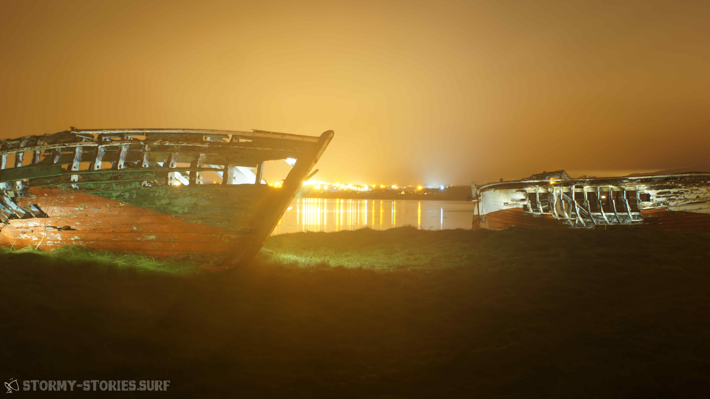

# Ireland 2017 : Magheroarty Beach II

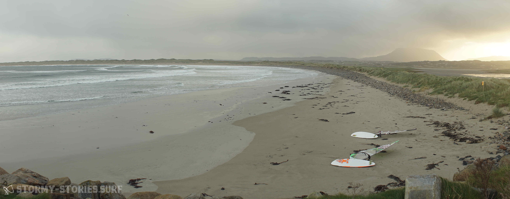

The wind should come the next day. It was supposed to be relatively strong in the morning and then calm down over the course of the day. Motivated, we set our alarm clock for 6 a.m. and then went to bed after a cozy evening on the sofa and a few cans of cider. We woke up a few times during the night because the wind was whistling in the windows and making a lot of noise outside.

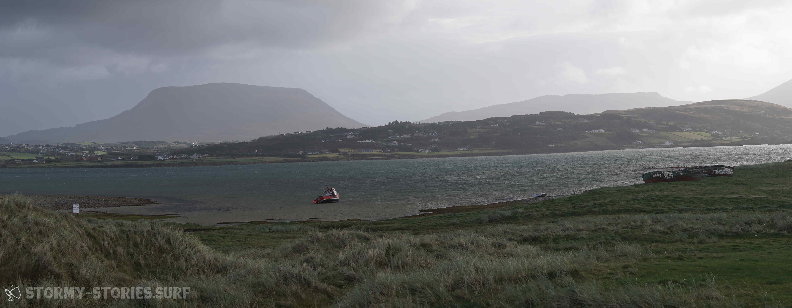

When our alarm clock woke us from a restless sleep at 6 a.m., we realized that it was still pitch black outside.

That had actually been logical, but somehow neither of us had thought about it. Not entirely satisfied, but not at all unhappy about having an excuse to lie down again, we put our tired bodies back to bed for another two or three hours.

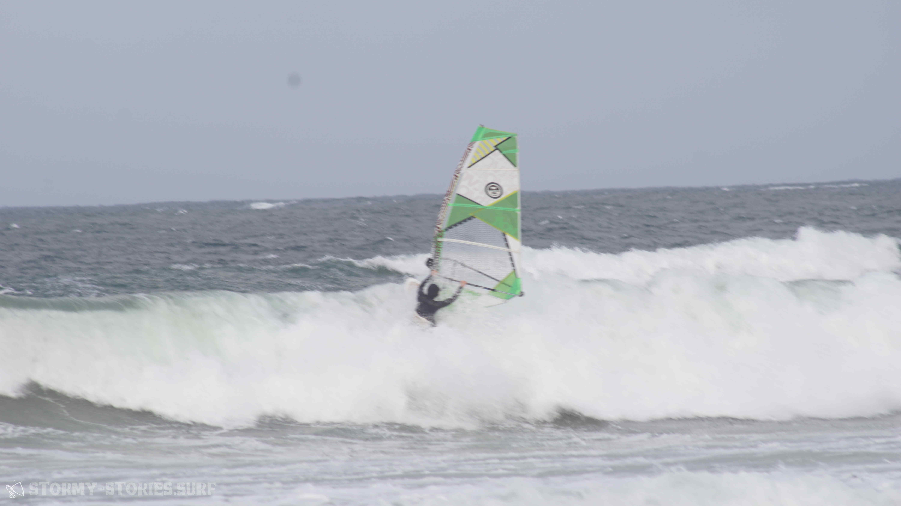

After a quick breakfast, we headed out the front door. From here, we could look down the hill into the bay of Magheroarty Beach and we loved what we could see. The waves seemed to have increased even further compared to yesterday and the trees were bending a lot more than the day before.

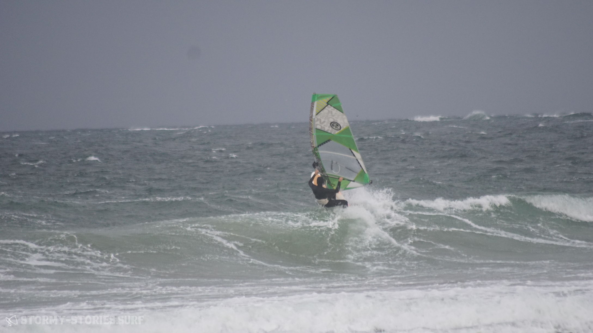

Tired but still somehow highly motivated, we jumped into our still slightly wet wetsuits in the warm bathroom of our bungalow and then into the car with our camera equipment and some food.

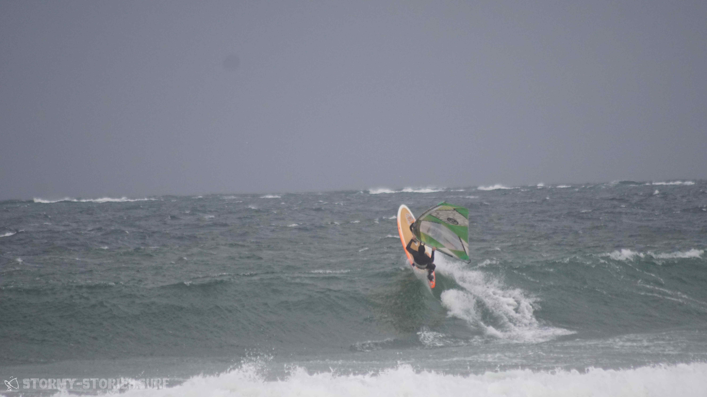

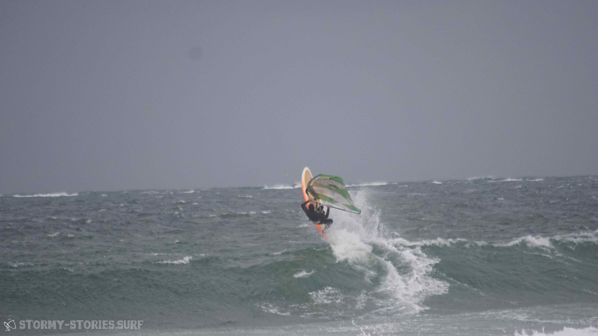

Less than three minutes later, we were down in the parking lot of the harbour. It still seemed to be low tide, so a long, beautiful sandy beach stretched out in front of us. According to the anemometer, the wind seemed to be perfect for the 4.5 and 4.7 sails. So, as announced, it had already died down.

We rigged in the parking lot and then positioned the equipment on the beach in the starting position.

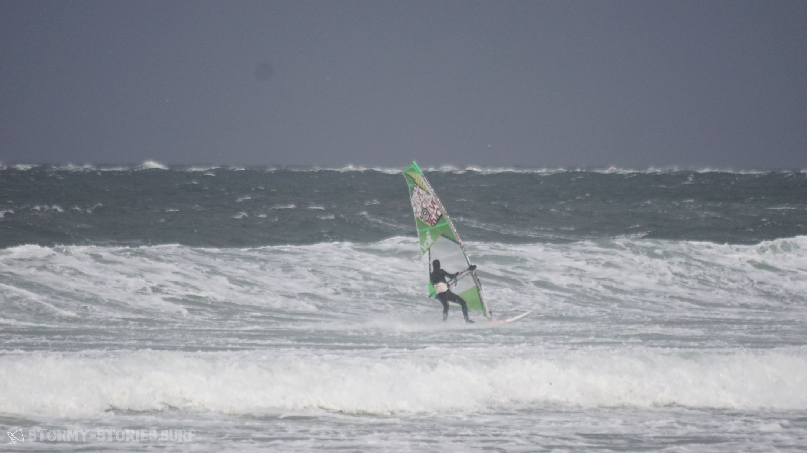

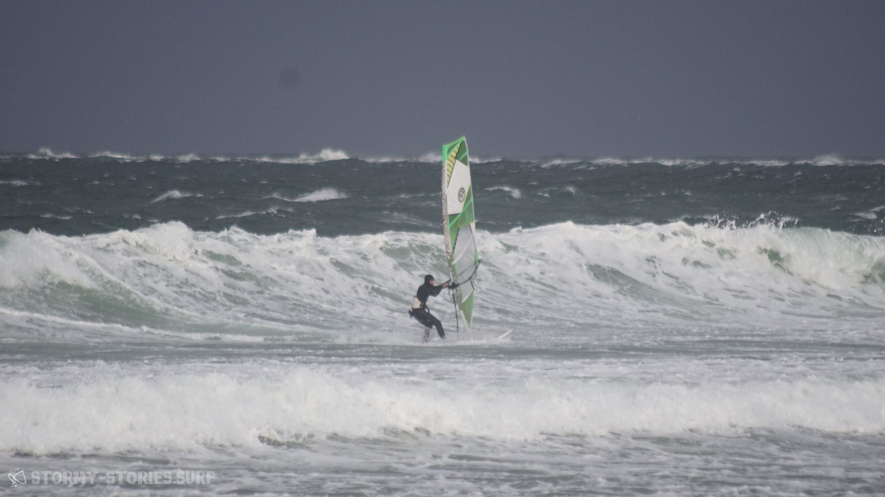

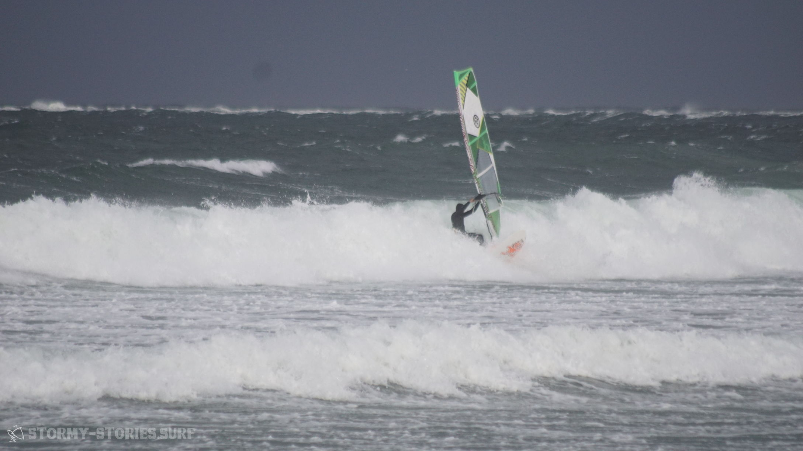

The wind seemed to have shifted a little today. Side-shore to occasionally slightly side-on shore made riding the waves a little more difficult than the day before. On the other hand, sailing out against the waves and jumping seemed to be much easier.

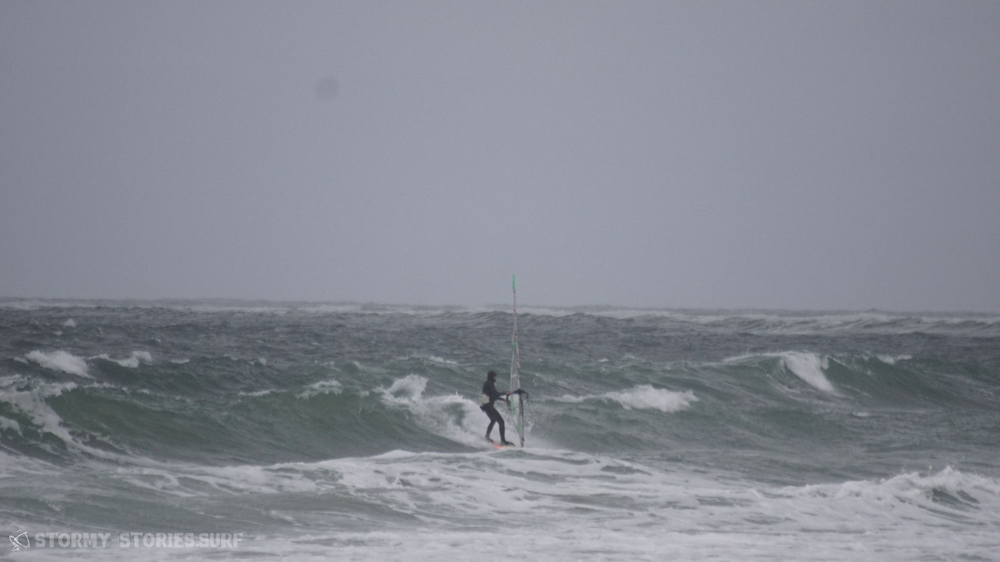

All in all, however, the conditions were simply awesome and we celebrated our first really good and increasingly more controlled jumps.

Before the vacation, every little hop over a wind wave had been a huge success, but the last few days had left their mark. As in the previous year, I had the feeling that you can learn incredibly quickly here in these perfect conditions.

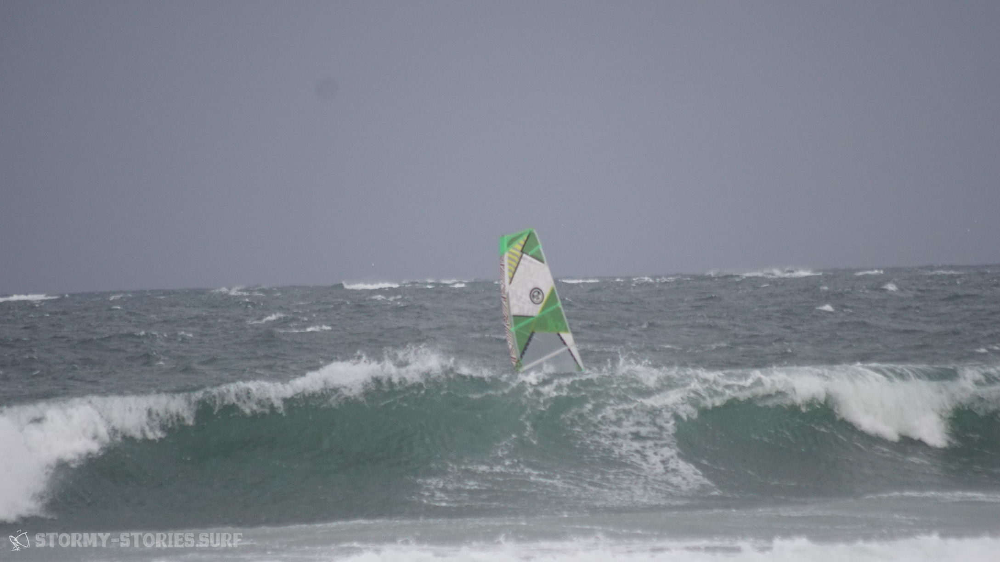

Of course, we continued to be put through the washing machine an infinite number of times, but overall, a certain amount of progress was noticeable.

After a while, the surfer from the previous day joined us again.
He had come up here from Austria in his bus for three weeks.

He also told us that there were three crazy French guys windsurfing at the other end of the bay. You couldn't see anyone from here, but at the end of the day you could actually see a large van with three men in the driver's cab bumping along the dune.

In total, we were once again sharing these wonderful windsurfing conditions with six people.

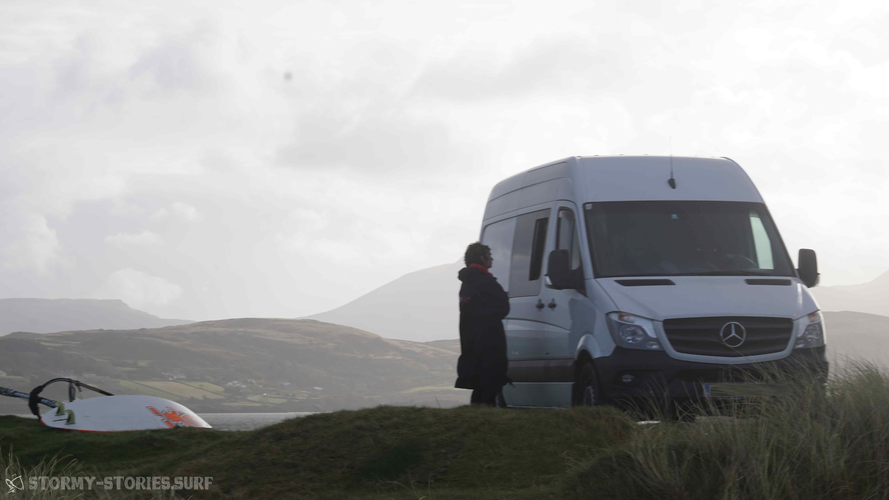

Unfortunately, during the course of the day, Marcel's stomach decided to interrupt his surf session for the day.He didn't feel well at all and didn't want to have to swim ashore again with his equipment. Instead, he dedicated himself to taking photos for the day, which unfortunately also meant that there were no more photos of him that day.

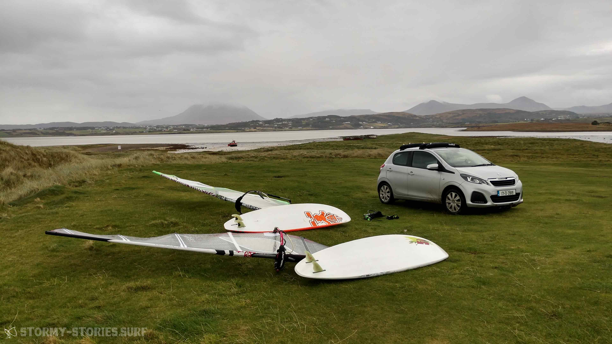

By the afternoon, my surfing batteries were completely drained. The waves had pretty much destroyed me a few times, so we decided not to risk our luck any further and to pack up.
Motivated by our friend from Austria, who had made it over the very muddy paths to the large overgrown dune with his bus, we also tried to park our car a little closer to the equipment and then dismantle everything there in peace and quiet without having to drag it around.

After an extensive analysis of which path had the least deep, muddy potholes, we made it to the dune with a lot of momentum, spinning tires and good luck.

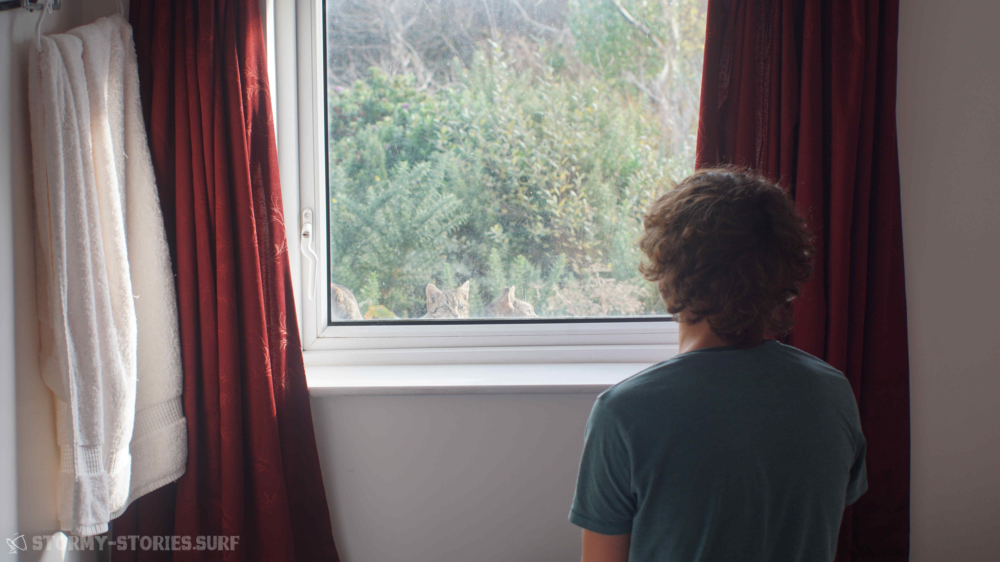

Here we de-rigged our equipment in the light sunshine and made our way back to the apartment.

In the evening, we wanted to go to the local pub and reflect on the past few days.
But as we walked past it, we didn't see anyone there except the owner. We had actually been looking forward to the cozy Irish pub atmosphere, but we weren't particularly keen on one-to-one supervision.

So we needed a new plan. On the other side of the headland of Magheroarty Beach was a small illuminated town.

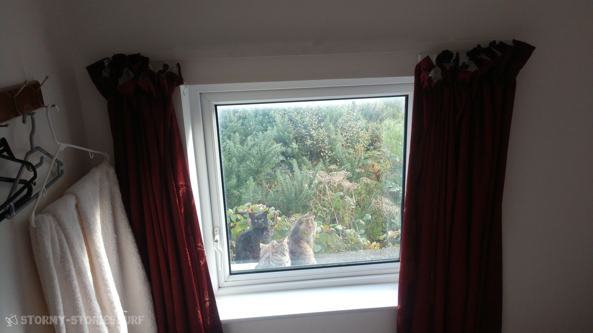

This might be a good opportunity to take some nice long exposure shots with the camera. So we headed back to the apartment and back to the beach with our tripod, camera and a few cans of cider.

We tried a few different perspectives, but nothing really matched what we had originally imagined. Then we came up with the idea of photographing two half-broken boats lying on the dune. They actually made a very good motif in front of the illuminated city. Unfortunately, the city was so brightly lit that the boats were barely recognizable in the dark.

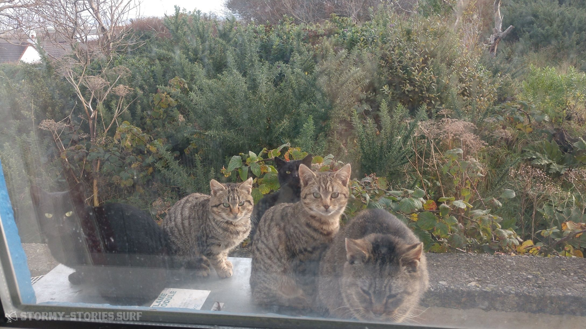

After a few attempts, we finally came up with the idea of illuminating the boats with the flashlight from Marcel's cell phone. We had already discovered the effect of flashlights in long exposures a few years ago with "light painting", but we had never used them as active lighting before.

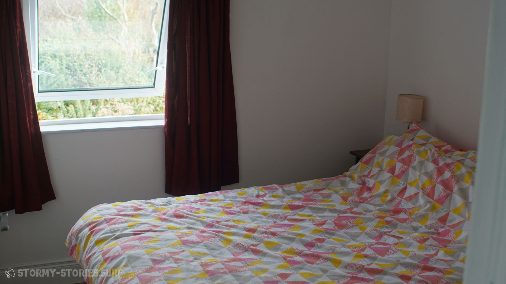

We tried different exposure times and illuminated different parts of the boats. The lighting of the individual "ribs" of the wrecks seemed to work particularly well.

Equally impressive was the lighting of the outer walls from the grass, so that the ground in front of the boat was also clearly visible. We also liked a beam of light that fell from the boat onto the grass behind it.

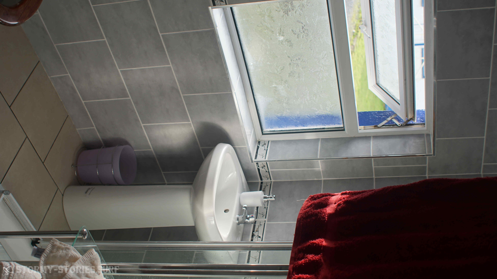

We experimented for a total of two and a half hours and 52 attempts until the picture was finally taken at 1:13 a.m. of the next day. For the last hour of photography, we had actually known exactly how the picture should look.

But every time we accidentally held the flashlight anywhere near the camera, a very white spot appeared in this area of the picture, because the picture was proportionally much brighter here than the rest.

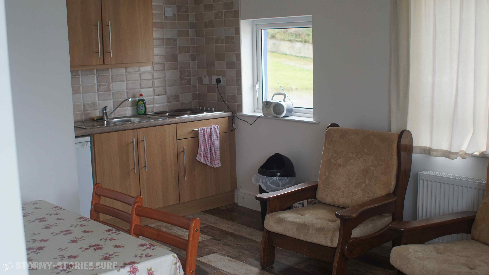

On the other hand, it was important not to stand still for too long at any point in the picture, as otherwise the outline of the legs or other body parts of the person carrying the flashlight could be seen in the picture.

With eight minutes of exposure time and another eight minutes required by the camera to process the image, each additional attempt meant another quarter of an hour.

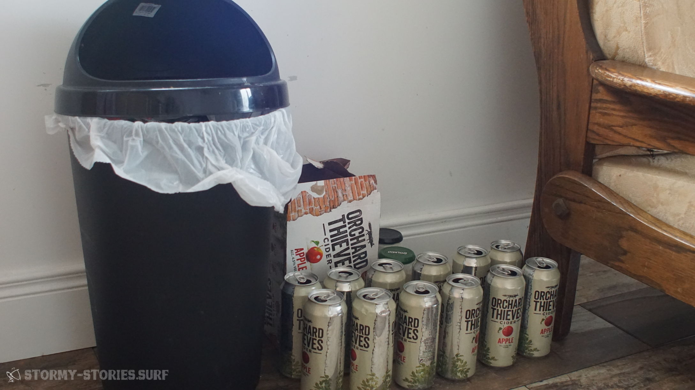

But when the picture was finally successful, we were very proud of it and started our walk back to the apartment.
(See also the cover picture of this report)

The wind was expected to shift further onshore the next day, so we could sleep long this night.

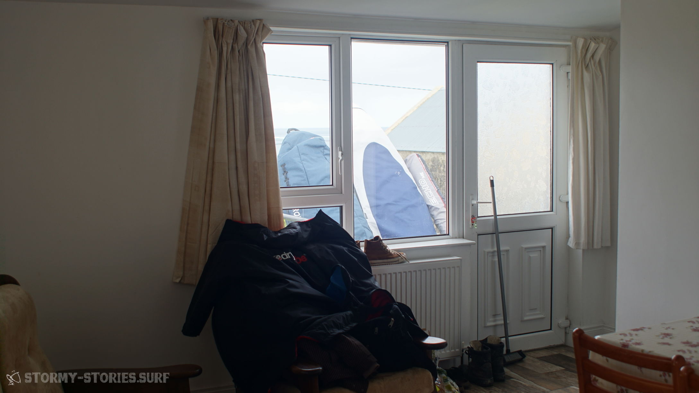

As the forecast had already predicted, the wind shifted during the night. Windsurfing therefore didn't seem to make much sense with a completely onshore wind at Magheroarty Beach and the forecast for the next few days was very unclear and constantly changing.

As we had stocked up properly in the supermarket the day before, we had our first home-made Irish breakfast today and it tasted breathtakingly good. We ate and discussed what to do next.

The wind in the south and east of the island looked much more reliable for the next few days. The south would probably not be possible in terms of time, as we had to fly out of Dublin again in three days. However, the east didn't look particularly attractive for us either, as we probably didn't have any clean Atlantic waves to expect here.

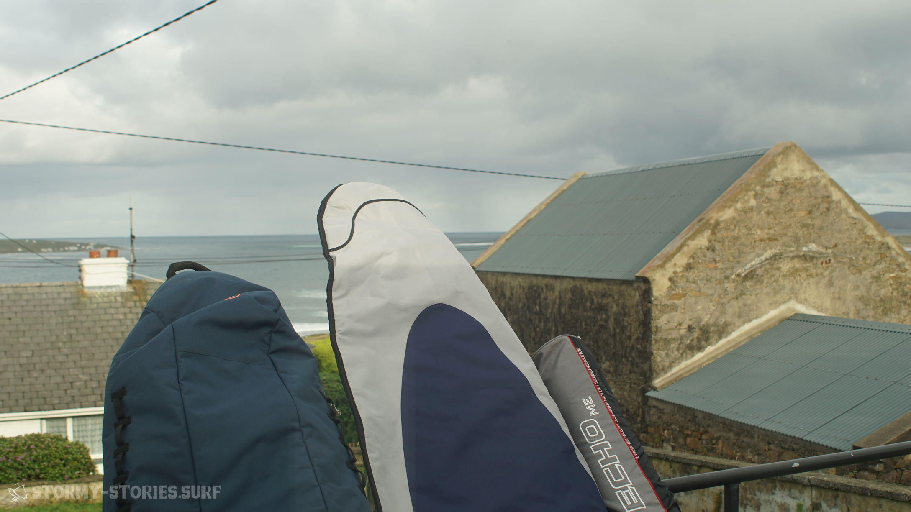

Nevertheless, the decision was made to head east. There was a high probability that we could go windsurfing here again, which would only be possible here in the north-west if we were very lucky. In addition, we would have already covered most of the way back to Dublin and could travel back much more relaxed.

So it was time to pack up and leave our sweet little home again. To say goodbye, all the neighbor's kittens came by and sat right in front of a bedroom window. A few petting sessions later, we finally left. Apart from another "See you soon North-West Ireland", we hopped back into our gigantic surf tank and drove off.
