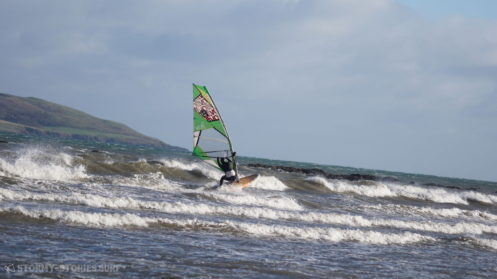
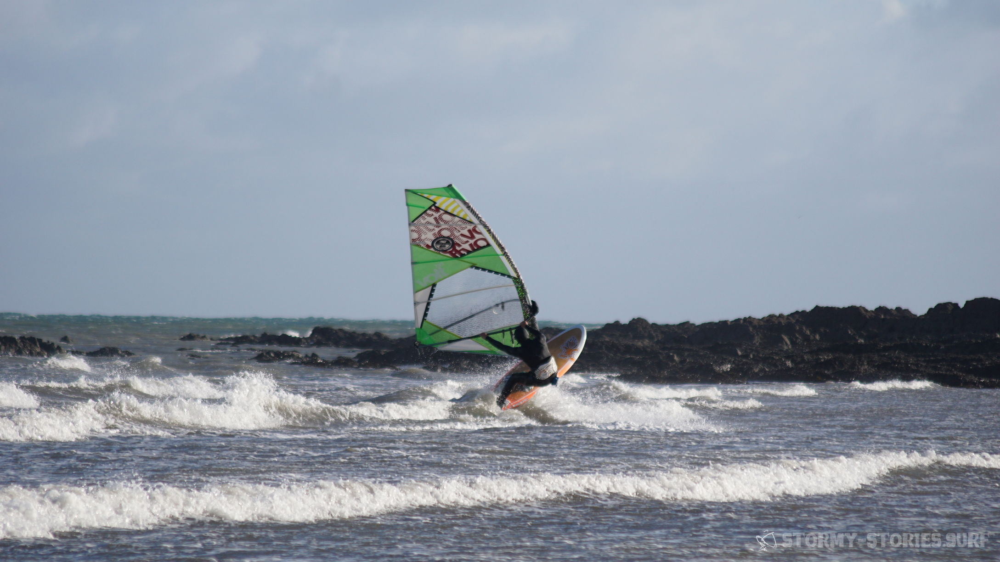
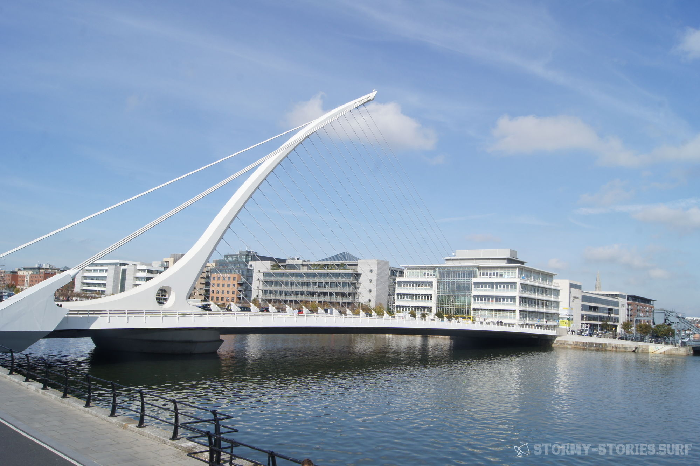
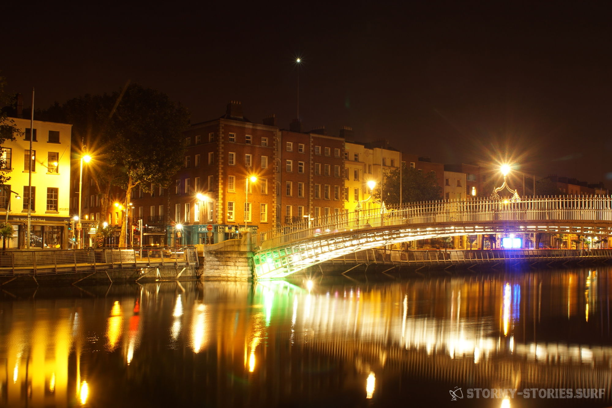

# Irland 2017 : Portrane Beach (Dublin)

Unser Weg von Magheroarty Richtung Süd-Osten führte uns einmal quer durch Nord-Irland.
Unser grobes Ziel war die Küste kurz vor oder hinter Dublin um von dort aus einen relativ kurzen Weg zum Flughafen zu haben. Auf dem gleichen Weg, auf dem wir auch bereits hergefahren sind, ging es zurück durch den Glenveagh National Park, dann auf die N56 und in Letterkenny weiter auf die N14.

Kurz vor Strabane warteten wir die ganze Zeit auf ein Zeichen, an dem wir erkennen konnten, wann wir die Nord-Irische Grenze übertreten haben. Dieses Zeichen blieb allerdings aus. Als wir dann jedoch den Grenz-Fluss Foyle überfahren hatten und nirgends auch nur ein Hinweis auf eine Grenze zu sehen war, akzeptierten wir einfach nun in einem neuen Land zu sein und fuhren munter weiter die A5 entlang in Richtung Omagh.

Das nächste Etappenziel lag, einem Schild an der Straße zufolge, garnicht mehr so weit entfernt wie ich vermutet hatte. Bei den nächsten zwei Schildern wunderte ich mich dann jedoch kurz darüber, wie langsam wir voran zu kommen schienen.
Als wir dann an einer Tanke vorbei fuhren, wurde es mir plötzlich klar.
Auch die Preise, die wir hier lesen konnten waren deutlich geringer als noch vor ein paar Tagen. Hier rechnete man jedoch in anderen Einheiten. Auch wenn nirgends ein Währungs-Zeichen zu erkennen war, hier ging es offensichtlich um Pfund an der Tankstelle und Meilen auf den Verkehrsschildern.

Bei Aughnacloy übertraten wir die nächste Grenze und wechselten am Grenzfluss River Blackwater zurück ins Land Irland und somit zurück zu europäischen Preisen und Einheiten.
Auch hier gab es keinerlei Hinweis auf eine Grenze und so fuhren wir frohen Mutes weiter auf die N2 in Richtung Ardee, wo es dann über die N33 auf die nach Dublin führende M1 ging. Da wir mittlerweile knappe fünf Stunden Fahrt hinter uns hatten und in Magheroarty ein wenig getrödelt hatten, war es mittlerweile leider wieder am Dämmern.
Es wurde also Zeit eine Unterkunft zu suchen. Hier in halbstündiger Entfernung zu Dublin schien alles irgendwie ein bisschen un-irischer zu sein. Hohe unsympatische Mauern und große luxuriöse Grundstücke, schwere Tore vor den Einfahrten und überall nicht zu übersehende Alarm-Anlagen.

Alles wirkte irgendwie unentspannter und weniger herzlich als im ländlichen West-Irland. Nach zwei Fehl-Versuchen bei denen uns auf ein Klingeln nicht geöffnet wurde, fanden wir schließlich in Rush ein B&B in unmittelbare Nähe zum Wasser. Auch diese Unterkunft schien offenbar eigentlich im Winter geschlossen zu sein, doch auch hier wollte man uns gerne in die nagelneuen Zimmer des B&Bs aufnehmen. Die einzige Bedingung schien zu sein, dass wir kein Problem mit dem enventuell noch nicht verflogenen Geruch der Wandfarben haben, denn hier wurde gerade vor kurzem noch gestrichen. Wir willigten gerne ein und lösten das Problem durch die ebenso neuen großen Kipp-Fenster mit Blick aufs Meer.

Beim Ausladen des Autos wurden wir dann mehrfach darauf hingewiesen, dass es doch sicher sinnvoller sei unser Auto mit all dem Surf-Equipment auf dem Dach in der verschlossenen Einfahrt zu parken. Die ersten zwei Male winkten wir nur freundlich ab. Wir selbst sind in einem behüteten kleinen Dorf in Niedersachsen aufgewachsen und dort, genau wie auch im ländlichen West-Irland, kam es uns eher übertrieben vor unser Hab und Gut besonders schützen oder abschließen zu müssen.
Hier jedoch schien alles ein bisschen anders zu sein. Schlussendlich ließen wir uns dann überzeugen das Auto mit auf den Innenhof zu stellen. Vielleicht war es tatsächlich nicht verkehrt, doch insgesamt, so hatten wir beide das Gefühl, erlebte man hier einfach nur ein typisches Beispiel für : "Wer viel hat, der kann auch viel verlieren." .

Und so kann ein klein bisschen zu viel Reichtum einen auch schnell unnötig paranoid werden lassen. Oder aber, wenn die Zweifel vielleicht sogar berechtig sind, dann kann in diesem Fall das kleine bisschen zu viel Reichtum einfach so viel Neid in der Umgebung erzeugen, dass man völlig berechtig paranoid wird.
Naja - was man auf jeden Fall zusammenfassen kann : Die offensichtlich etwas wohlhabenderen Menschen hier in der Vorstadt von Dublin scheinen uns irgendwie deutlich unentspannter und unglücklicher zu sein als die einfachen Menschen in den ländlichen Regionen West-Irlands. Was uns zu dem Schluss kommen lies, das Geld, am Ende des Tages, einfach nicht alles ist.
Und genau aus diesem Schluss heraus nahmen wir nun unser Portemonnaie und liefen ein paar Straßen weiter zu den gut besuchten Pubs, die wir schon zuvor aus dem Auto gesehen hatten.
Prost - und gute Nacht ...

Am nächsten Tag ging es nach einem leckeren Frühstück erst einmal an den nahegelegenen Strand. In unserem Spot-Guide hatten wir von dem, hier in der Nähe liegenden, Spot "Rush-Portrane" gelesen, der bei südlichen bis südwestlichen Winden annehmbare Wave-Bedingungen liefern sollte. Heute blies der Wind leider aus Nord-West was anscheinend alles andere als ein Garant für gute Wave-Bedingungen zu sein schien.
Hier, wo wir gerade standen, bedeutet das außerdem massive Windabdeckung durch die Wohnsiedlung und auch etwas ablandig wehender Wind.

Alles in allem sah es für heute also nicht sonderlich gut aus und das an Marcels Geburtstag, wo wir uns doch eigentlich eine Birthday-Surfing-Session erhofft hatten. Wir beschlossen erst einmal unsere Zelte hier abzubrechen und die Küste nach Wind abzusuchen.
Je nach dem Erfolg unserer Suche würden wir dann eine Runde Surfen gehen und anschließend den Weg in Richtung Dublin einschlagen oder gleich zum zweiten Teil über zu gehen.
Wir hatten uns bereits auf der Autofahrt zurück in den Osten überlegt in einem Hostel im Temple-Bar Viertel unsere letzte Nacht zu verbringen und so unseren letzten Abend und Marcels Geburtstag ausklingen zu lassen. Hierfür wollten wir unser Auto dann schon einmal beim Flughafen abstellen und mit dem Bus in die Stadt fahren. Wenn möglich wollten wir schon einmal unser Gepäck einchecken oder es im Zweifel dann eine Nacht im Flughafen-Parkhaus auf dem Auto-Dach liegen lassen. An diesem morgen hatte unsere Gastgeberin vom B&B in Rush uns von unserem Plan strengstens abgeraten. Denn ihrer Meinung nach sei dabei geradezu garantiert, dass man uns unser Surf-Material in der Nacht vom Auto-Dach klauen würde.

Nach dem von "Verlust-Angst" geprägten Eindruck, den wir von diesem Vorort Dublins bekommen hatten, waren wir uns zunächst etwas unsicher. Letztendlich entschieden wir dann aber einstimmig für unseren Plan und somit dagegen uns von irgendwelchen Ängsten unseren letzten Tag kaputt machen zu lassen. Schließlich erschien es uns nicht allzu einfach die sperrige Surf-Ausrüstung unbemerkt in einem kameraüberwachten Flughafen-Parkhaus verschwinden zu lassen und außerdem wollten wir ja ohnehin erst einmal versuchen das Gepäck für den Flug aufzugeben. So buchten wir also online zwei Betten in einem 11-Personen Schlafsaal im "Oliver St. John Gogartys" Hostel. Mitten im Herzen des Temple-Bar-Viertels, direkt über dem gleichnamigen "Oliver St. John Gogartys" Pub und für 13€ pro Person pro Nacht durchaus preiswert.

Danach ging es dann mit dem Auto in Richtung Süden die Küste entlang. Doch alle Windsurf-Spots von denen wir gelesen hatten, boten nur unterirdisch schlechte Bedingungen, so dass wir uns schon fast etwas ärgerten nicht doch länger in Magheroarty geblieben zu sein. Hier wäre die Windrichtung zwar auch sehr unpassend gewesen, aber vielleicht immerhin surfbar.
Dann jedoch fanden wir am Ende einer Bucht eine Landzunge die mit ein bisschen Glück nicht mehr in der Windabdeckung liegen sollte. Eine Straße dorthin gab es nicht, denn dieser Küstenabschnitt schien von einen "Mobile-Home Park" im Beschlag genommen worden zu sein. Also liefen wir, bewaffnet mit Windmesser und warmen Jackn, über ein paar Felsen und erreichten schließlich einen netten kleinen Sandstrand. Vom Strand aus ragten weitere Felsen in das Meer und am Horizont wuchs eine große grün überwucherte Insel aus dem Wasser und verlieh dem Ort somit einen gewissen Charme. Hinter uns ging der Strand in kleine wenige Meter hohe Steil-Klippe auf deren Ende die Mobil-Heime standen und vermutlich einen traumhaften Blick auf das Meer boten.

Wir kletterten ein paar Felsen entlang und konnten hier (53.492891, -6.098071) , etwas vorgelagert im Wasser, tatsächlich gut 20 - 25 Knoten Wind bei Side bis Side-Offshore messen. Das hieß dann wohl perfekte Bedingungen fürs 4.7er Segel. Die Wellen wiederum sahen ziemlich klein und kabellig aus. Ganz anders jedenfalls als noch vor ein paar Tagen auf der Atlantikseite. Auf der anderen Seite war das bei dem links und rechts mit Felsen gesäumten Einstieg vielleicht auch garnicht so schlecht. So hatte man immerhin keine Sorge sicher rein und raus zu kommen. Motiviert liefen wir zurück zum Auto, das wir mangels richtiger Parkplätze einfach auf dem Grünstreifen geparkt hatten. Ab ging es in die Neos und dann nach schnellem Aufriggen zurück an den Strand. Als wir hier nun unsere Boards an den Strand brachten, fiel mein Blick auf etwas schwarzes im Wasser. Im ersten Moment dachte ich an Vögel. Doch dann war das Schwarze auch schon wieder weg und verschwand somit auch aus meinen Gedanken. Wenige Minuten später trugen wir unsere Segel an den Strand und machten sie an unseren Boards fest. Da! Schon wieder etwas schwarzes! Aber da war es auch schon wieder verschwunden. Dann wieder mehrere kleine schwarze Flecken!

Nun hatte auch Marcel sie gesehen und wir liefen näher an den Strand um das Ganze mal genauer anzugucken. Da tauchten sie wieder auf. Kleine schwarze Köpfe, vielleicht zwei oder drei Stück. Und dann überkam es uns. Robben! Es waren tatsächlich Robben, die sich hier in den kleinen Windwellen vergnügten, immer mal wieder untertauchten und teilweise sogar in den Wellen surften. Dann wurden es noch mehr Köpfe und noch mehr. Knappe zehn fröhlich schwimmende Robben hatten hier ihren Spaß in den Wellen. Wir waren uns nicht ganz sicher, ob die Tiere sich gestört fühlen würden, wenn wir uns mit in die Fluten stürzen würden. Wir hatten auf unserer Reise und auch hier nirgends Info - oder Warnschilder gesehen. Jungtiere sollte es unserer Meinung nach erst im Frühjahr geben und da die Robben sich hauptsächlich in Ufer-Nähe aufhielten, beschlossen wir es einfach einmal zu versuchen und dabei genügend Abstand zu halten.

Die Bedingungen waren traumhaft und einfach unglaublich einfach zu fahren. Ganz und gar in unserer Komfort-Zone und genau richtig um weder unter - noch überfordernd zu sein. Der Wind war super gut zu händeln, die Wellen zwar sehr klein und ungeordnet aber trotzdem ausreichend um alles, was wir in den vergangenen Tagen übers Springen und Abreiten gelernt hatten, in Ruhe auszuprobieren. So sprangen wir von jedem kleinsten Kabbel-Wellchen so hoch es ging in die Höhe, versuchten Table-Tops mit gerade mal 50 cm Höhe unterm Board und schlitzten Cut-Backs ins knie-tiefe Wasser so dass die Finnen gelegentlich den Boden streiften.
Lediglich die Wassertemperaturen hatten uns Anfangs wirklich geschockt. Wie auch schon die letzten Tage hatten wir uns darauf geeinigt uns nach ein bis zwei Runden wieder am Strand zu treffen und die Lage zu besprechen. Wir kamen zu dem Schluss, dass es sicher war weiter zu machen. Doch anders als an den vorherigen Tagen hatten wir beide mit erstaunen zu berichten, wie unfassbar kalt das Wasser doch war. Eigentlich war es logisch gewesen. Die "warmen" Wasser-Temperaturen an der West-Küste Irlands sind selbst im Winter nur deshalb möglich weil hier der Golf-Strom für eine ausreichende Durchmischung mit warmen Wasser aus dem Westen sorgt.

Der Golfstrom, der in manchen geographischen Breiten mehr als einhundertmal so viel Wasser transportiert, wie über alle Flüsse der Welt zusammen ins Meer fließt (https://de.wikipedia.org/wiki/Golfstrom) geht in Richtung Europa in den Nordatlantik-Strom über. Er sorgt hier gerade in Irland, Groß-Britannien und in Teilen Skandinaviens für ein wärmeres Klima als auf Grund der hohen geographischen Breite eigentlich zu vermuten wäre. Das macht Irland auch selbst im Herbst und Winter zu einem attraktiven Windsurf-Ziel. Die Irische See wiederum, die zwischen Irland und Groß Britannien verläuft, ist dieser "Warmwasserheizung" nicht so direkt ausgesetzt wie die Atlantikküste Irlands und scheint zumindest an diesem Tag nicht viel von der Heiz-Leistung abbekommen zu haben.
Nach einer kurzen Pause waren wir wieder ausreichend aufgewärmt und starteten einen zweiten Versuch. Nun sahen wir auch beim Surfen vermehrt immer öfter ein paar Robben in unserer Nähe auftauchen. Auch wenn wir versuchten Abstand zu den Tieren zu halten, schienen sie daran nicht unbedingt interessiert zu sein.
Nicht selten wenn wir auf dem Weg nach draußen Fahrt aufnahmen, tauchte plötzlich in der Nähe ein niedlich aussehender schwarzer Kopf aus dem Wasser auf und beobachtet wie das Surf-Board sich seinen Weg durch das Wasser bahnte. Wenige Meter bevor man dann bei ihnen angekommen war, tauchte der Kopf dann ab in die Tiefe, nur um dann ein paar Sekunden später wieder aus dem Wasser zu gucken und uns von hinten zu beobachten.

Hierbei kam man sich dann schon fast eher selbst wie die Attraktion vor und nicht mehr wie der Beobachter. Nach wenigen Stunden war unser Akku dann entgültig entladen. Das kalte Wasser zehrte an unseren Kräften und da wir für heute Abend noch Dublin geplant hatten, ging es wieder zurück zum Auto. Beim Abbauen des Materials trafen wir dann auf ein Deutsch-Irisches Windsurfer-Pärchen. Laut ihrer Aussage wohnten sie auf der anderen Seite der Bucht, ein paar hundert Meter entfernt und hatten uns von dort aus beobachtet. Da hier normaler Weise fast nie jemand surfe, war ihr Interesse geweckt worden und sie hatten sich mit ihrem Bulli auf dem Weg zu uns gemacht.

Wir unterhielten uns über die irische Westküste, über die Brandon Bay und darüber, dass sie zum Surfen meist den Weg bis genau dort hin antraten und so gut wie nie hier, direkt vor der Haustür, ins Wasser gingen. Außerdem erzählten sie uns von der kleinen Windsurf-Community in Irland. Angeblich sei Windsurfen in Irland nicht besonders populär. Vielen Menschen haben nicht genügend Geld für das teure, viele und sperrige Equipment und würden daher das Wellenreiten vorziehen. Und die Anzahl fortgeschrittener irischer Windsurfer die man in der Welle antreffen würde, begrenze sich angeblich auf unter 100 Personen. Bei dieser Anmerkung dachten wir nur zurück an die völlig überfüllten Ost-See-Parkplätze an einem guten Tag im Sommer. Allein an einem solchen Tag waren vermutlich an vielen Orten Deutschlands jeweils hundert und mehr Leute am Windsurfen. Schwer vorzustellen, dass es um die irische Windsurf-Szene so schlecht bestellt sein solle. Vor allem wo die Westküste doch im Winter von Stürmen geradezu bombardiert wird und in regelmäßigen Abständen weltklasse Bedinungen abliefert.

Dann kamen wir auf das Thema mit den Robben, oder auch "See-Löwen", wie die Iren sie nannten, zu sprechen. Hier erzählten uns die beiden, dass man diese hier öfters mal sehen könne und das in der vorherigen Woche auch ein Bekannter, der täglich eine Runde durch die Bucht schwimme, von zehn oder mehr Robben begleitet worden sei. Ein Erlebnis was er so schnell wohl nicht wieder vergessen werde.
So zog sich das Abbauen dann irgendwie doch etwas länger hin als am Anfang gedacht. Aber es war sehr angenehm auch in dieser teuren und unecht wirkenden Gegend Irlands auf nette Leute zu treffen. Als dann aber schlussendlich alles gepackt war, ging es weiter in Richtung Dublin. Hier parkten wir wie geplant unser Auto im Parkhaus des Flughafens und versuchten unser Glück am Gepäckschalter von Ryanair. Wie wir insgeheim schon befürchtet hatten, war das Aufgeben des Gepäcks am Vortag hier leider nicht möglich. Grund hierfür sei angeblich, dass der gleiche Flug auch an diesem Tag noch nach Deutschland gehen würde und man das Gepäck dann nicht unterscheiden könne. Okay - hier schien das Glück also schon mal nicht auf unserer Seite zu sein. Einen zweiten Versuch starteten wir dann am Gepäck-Storage Schalter. Hier war es möglich Gepäck gegen Geld für eine Zeit zu verwahren. Interessanter Weise schien die Größe der Taschen hierbei nicht wichtig zu sein. Alles drehte sich um Gewicht und Stückzahl. Als wir auf die Nachfrage, ob es auch möglich sei, zwei große Sportgepäck-Taschen zu hinterlegen, wieder einmal ein entspanntes irisches "No problem" zurück als Antwort bekamen, liefen wir fröhlich zurück zum Auto und holten unseren Board-Bags vom Dach. Ca. 30€ später waren die Boards abgegeben und wir saßen für weitere 6€ pro Person in einem Shuttle-Bus der uns heute in die Innenstadt und morgen wieder zurück zum Flughafen bringen würde.

Bei Gogartys angekommen, schleppten wir kurz unsere Klamotten hoch ins Zimmer und machten uns dann auf den Weg ins gleichnamige Restaurant. Wie wir aus einem Städte-Trip zwei Jahre zuvor wussten, gibt es in diesem Restaurant mit Abstand die besten Spare-Ribs, die wir jemals zuvor an irgendeinem Ort gegessen haben. Auf diesen Genuss hatten wir uns schon monatelang gefreut. Leider wurden wir dann aber kurze Zeit später in die Realität zurückgeholt und unsere Träumerein abrupt beendet. Die Spare-Ribs waren heute Abend leider schon alle verkauft worden. Verdammt! Aber naja einen solchen Surf-Tag kann man Gott sei Dank nur schwer trüben. Alternativ gab es das in der Karte direkt darunter befindliche Barbecue-Gericht - ebenfalls ein Gaumenschmaus, aber auch ebenfalls zu einem typisch hohen Dublin-Preis.

Anschließend ging es dann bis zur Sperrstunde, die in Dublin schon relativ früh gegen ca. 1 Uhr die Läden dicht macht, zu reichlich Live-Musik in die Pubs. Dazu gab es leckeren Snake-Bite, eine Mischung aus Cider, hellem Bier und einem Schuss Schwarze Johannisbeere. Wir lauschten den talentierten Musikern und erinnerten uns an die letzten Tage zurück. Im Grunde waren wir garnicht mal so viel auf dem Wasser gewesen und relativ viel dem Wind hinterhergefahren.

4 Tage Surfen bei einem 10-tägigen Urlaub. Aber irgendwie hatte es sich wirklich gelohnt. Die Gastfreundschaft der entspannten Iren, die schöne weite Landschaft, die ruhige Atmosphäre und die leeren Strände mit ihren unfassbar sauberen und langen Wellen. Vor dem Urlaub hatte es mit dem Springen noch nicht so wirklich sicher geklappt. Jetzt nach dem Urlaub hatte man doch deutlich das Gefühl den Dreh heraus zu haben. Und auch das Wellenabreiten. Es war von Tag zu Tag besser geworden und gerade am letzten Tag in Portrane hatte es unfassbar gut geklappt und super viel Spaß gemacht. Ja - alles in allem war es ein verdammt geiler Urlaub gewesen.

Und genau so entspannt wie es die letzten Tage gewesen war, sollte sich auch der Rückflug abzeichnen. Am nächsten Morgen fuhren wir pünktlich - wer hätte es gedacht - zurück mit dem Shuttle-Bus zum Flughafen. Wir entluden das restliche Gepäck, holten unsere Boardbags von der Gepäck-Station ab und liefen damit zum Check-In. Hier erfuhren wir dann, dass es keine Check-In Schalter mehr gebe, sondern nur noch Selbst-Bedienungs-Terminals.

Was wir zuerst nicht ganz verstanden, stellte sich dann beim zweiten Blick als ein Geschenk des Himmels heraus. Hier musste man sein Gepäck selbst wiegen und etikettieren. Da unser Gepäck jetzt nach Regen, Dreck und Salzwasser noch ein paar Kilo mehr auf die Waage brachte als noch beim Hinflug war das genau das, was wir jetzt gebrauchen konnten. Wir wogen drei mal genau 20.0 Kilogramm, etikettierten unser Sportgepäck und dann ging es zum Sperrgepäck-Schalter, der alles ohne Probleme annahm. Anschließend kam es dann zur zweiten Probe für unsere Nerven, die Rückgabe des Mietwagens.

Dieses Jahr hatten wir das viel zu kleine Auto mit dem Gepäck für zwei Windsurfer noch viel mehr malträtiert als im Jahr zuvor. Wo ich mir letztes Jahr immer noch Gedanken gemacht hatte, wenn das Dach bei einer Bodenwelle unter dem Gewicht meines Boards eingedrückt worden war, waren wir in den letzten Tagen einfach dazu übergegangen einfach nur noch zu lachen, wenn das Dach wieder mal nachgab. Für so viel Gepäck war das Auto einfach nicht ausgelegt worden. Da wir außerdem mittlerweile einen Steinschlag in der Windschutz-Scheibe zu verzeichnen hatten, hatten wir mit dem Thema ohnehin schon abgeschlossen. Wir würden zahlen müssen, es würde Geld kosten, so war das nun mal im Leben.

Als wir dann allerdings auch hier komplett ohne Probleme und Reklamationen durchkamen, waren wir tatsächlich maximal verblüfft. Na gut, heute hatte man es anscheinend tatsächlich gut gemeint mit uns. So liefen wir dann vollkommen entspannt zur Sicherheits-Kontrolle, setzten uns in den leeren Flieger und landeten ein paar Stunden später in Hamburg - was für ein Urlaub!

