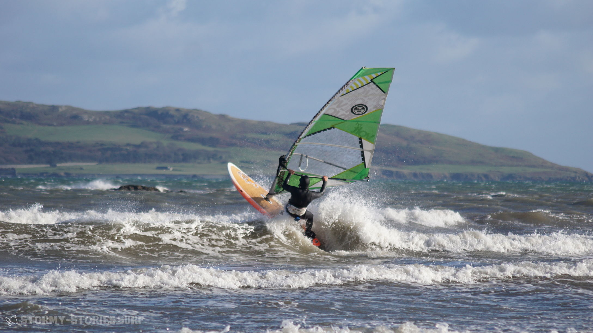
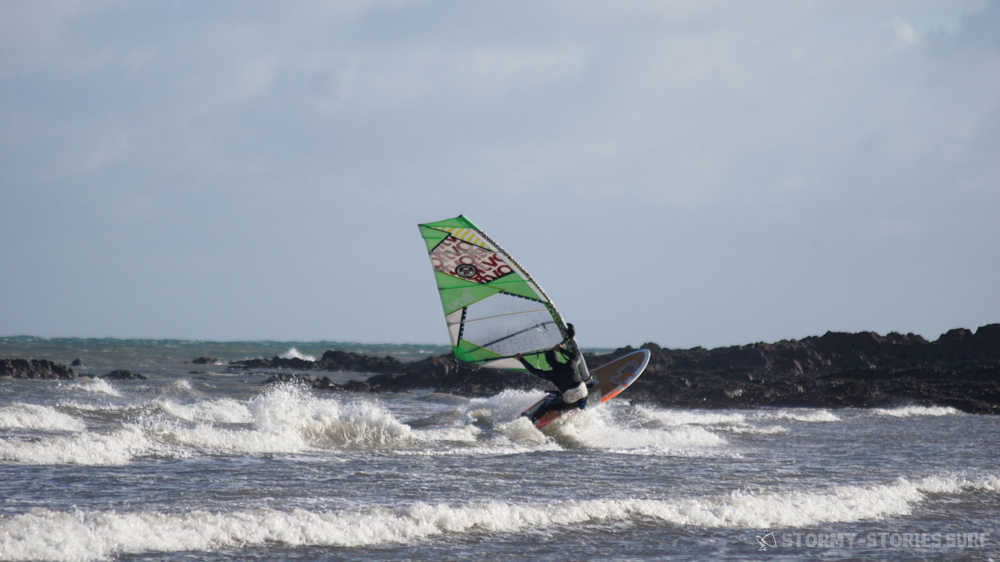
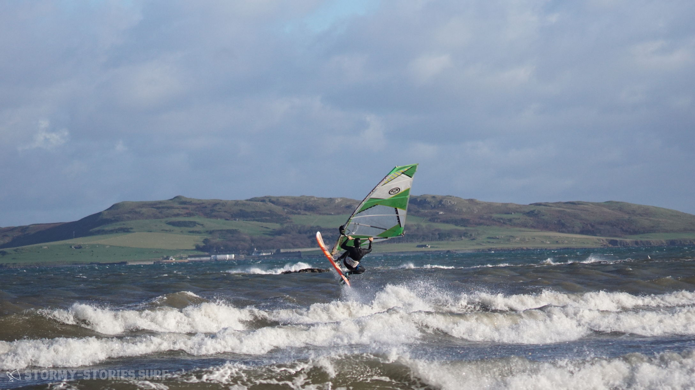

# Irland 2017 : Portrane Beach (Dublin)

Unser Weg von Magheroarty Richtung Süd-Osten führte uns einmal quer durch Nord-Irland.
Unser grobes Ziel war die Küste kurz vor oder hinter Dublin um von dort aus einen relativ kurzen Weg zum Flughafen zu haben. Auf dem gleichen Weg, auf dem wir auch bereits hergefahren sind, ging es zurück durch den Glenveagh National Park, dann auf die N56 und in Letterkenny weiter auf die N14.

Kurz vor Strabane warteten wir die ganze Zeit auf ein Zeichen, an dem wir erkennen konnten, wann wir die Nord-Irische Grenze übertreten haben. Dieses Zeichen blieb allerdings aus. Als wir dann jedoch den Grenz-Fluss Foyle überfahren hatten und nirgends auch nur ein Hinweis auf eine Grenze zu sehen war, akzeptierten wir einfach nun in einem neuen Land zu sein und fuhren munter weiter die A5 entlang in Richtung Omagh.
Zwischendurch gab es jedoch ein oder zwei mal die Situation, dass ich mich etwas über die Straßen Schilder wunderte.

Beim ersten Schild freute ich mich noch über die offensichtlich doch garnicht so lange Distanz bis zum nächsten Etappenziel, bei den nächsten zwei Schildern wunderte ich mich dann jedoch kurz darüber wie langsam wir voran zu kommen schienen.
Als wir dann an einer Tanke vorbei fuhren, wurde es mir plötzlich klar.
Auch die Preise, die wir hier lesen konnten waren deutlich geringer als noch vor ein paar Tagen. Hier rechnete man jedoch in anderen Einheiten, Auch wenn nirgends ein Währungs-Zeichen zu erkennen war, hier ging es offensichtlich um Pfund an der Tankstelle und Meilen auf den Verkehrsschildern.

Bei Aughnacloy übertraten wir die nächste Grenze und wechselten am Grenzfluss River Blackwater zurück ins Land Irland und somit zurück zu europäischen Preisen und Einheiten.
Auch hier gab es keinerlei Hinweis auf eine Grenze und so fuhren wir frohen Mutes weiter auf die N2 in Richtung Ardee, wo es dann über die N33 auf die nach Dublin führende M1 ging. Da wir mittlerweile knappe fünf Stunden Fahrt hinter uns hatten und in Magheroarty ein wenig getrödelt hatten, war es mittlerweile leider wieder am Dämmern.
Es wurde also Zeit eine Unterkunft zu suchen. Hier in halbstündiger Entfernung zu Dublin schien alles irgendwie ein bisschen un-irischer zu sein. Hohe unsympatische Mauern und große luxuriöse Grundstücke, schwere Tore vor den Einfahrten und überall nicht zu übersehende Alarm-Anlagen.

Alles wirkte irgendwie unentspannter und weniger herzlich als im ländlichen West-Irland. Nach zwei Fehl-Versuchen bei denen uns auf ein Klingeln nicht geöffnet wurde, fanden wir schließliche in Rush (??? Link) ein B&B in unmittelbare Nähe zum Wasser. Auch diese Unterkunft schien offenbar eigentlich im Winter geschlossen zu sein, doch auch hier wollte man uns gerne in die nagelneuen Zimmer des B&Bs aufnehmen. Die einzige Bedingung schien zu sein, dass wir kein Problem mit dem enventuell noch nicht verflogenen Geruch der Wandfarben haben, denn hier wurde gerade vor kurzem noch gestrichen. Wir willigten gerne ein und lösten das Problem durch einfaches Durchlüften.

