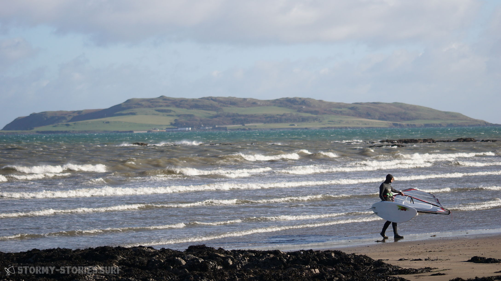
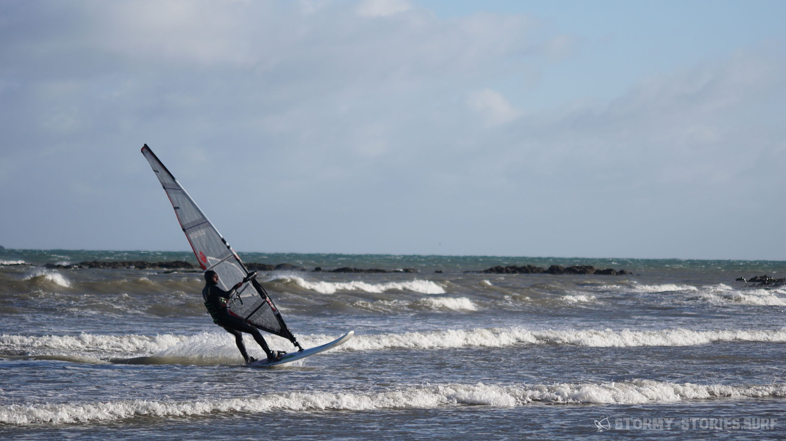
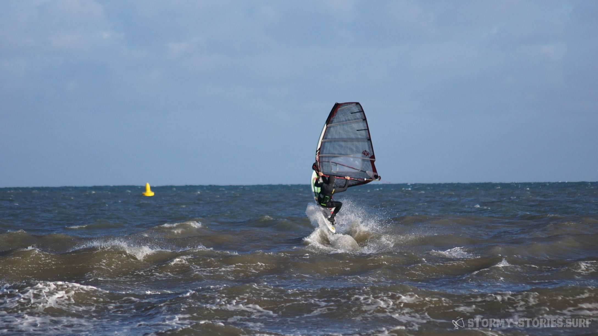
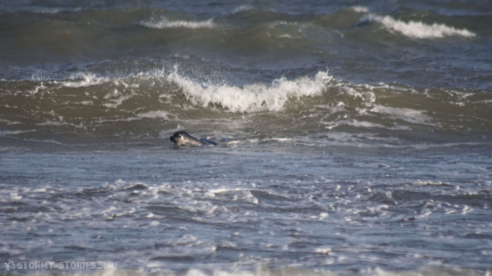

# Irland 2017 : Portrane Beach (Dublin)

Unser Weg von Magheroarty Richtung Süd-Osten führte uns einmal quer durch Nord-Irland.
Unser grobes Ziel war die Küste kurz vor oder hinter Dublin um von dort aus einen relativ kurzen Weg zum Flughafen zu haben. Auf dem gleichen Weg, auf dem wir auch bereits hergefahren sind, ging es zurück durch den Glenveagh National Park, dann auf die N56 und in Letterkenny weiter auf die N14.

Kurz vor Strabane warteten wir die ganze Zeit auf ein Zeichen, an dem wir erkennen konnten, wann wir die Nord-Irische Grenze übertreten haben. Dieses Zeichen blieb allerdings aus. Als wir dann jedoch den Grenz-Fluss Foyle überfahren hatten und nirgends auch nur ein Hinweis auf eine Grenze zu sehen war, akzeptierten wir einfach nun in einem neuen Land zu sein und fuhren munter weiter die A5 entlang in Richtung Omagh.

Das nächste Etappenziel lag einem Schild an der Straße zufolge garnicht mehr so weit entfernt wie ich vermutet hatte.  Bei den nächsten zwei Schildern wunderte ich mich dann jedoch kurz darüber wie langsam wir voran zu kommen schienen.
Als wir dann an einer Tanke vorbei fuhren, wurde es mir plötzlich klar.
Auch die Preise, die wir hier lesen konnten waren deutlich geringer als noch vor ein paar Tagen. Hier rechnete man jedoch in anderen Einheiten. Auch wenn nirgends ein Währungs-Zeichen zu erkennen war, hier ging es offensichtlich um Pfund an der Tankstelle und Meilen auf den Verkehrsschildern.

Bei Aughnacloy übertraten wir die nächste Grenze und wechselten am Grenzfluss River Blackwater zurück ins Land Irland und somit zurück zu europäischen Preisen und Einheiten.
Auch hier gab es keinerlei Hinweis auf eine Grenze und so fuhren wir frohen Mutes weiter auf die N2 in Richtung Ardee, wo es dann über die N33 auf die nach Dublin führende M1 ging. Da wir mittlerweile knappe fünf Stunden Fahrt hinter uns hatten und in Magheroarty ein wenig getrödelt hatten, war es mittlerweile leider wieder am Dämmern.
Es wurde also Zeit eine Unterkunft zu suchen. Hier in halbstündiger Entfernung zu Dublin schien alles irgendwie ein bisschen un-irischer zu sein. Hohe unsympatische Mauern und große luxuriöse Grundstücke, schwere Tore vor den Einfahrten und überall nicht zu übersehende Alarm-Anlagen.

Alles wirkte irgendwie unentspannter und weniger herzlich als im ländlichen West-Irland. Nach zwei Fehl-Versuchen bei denen uns auf ein Klingeln nicht geöffnet wurde, fanden wir schließlich in Rush (??? Link) ein B&B in unmittelbare Nähe zum Wasser. Auch diese Unterkunft schien offenbar eigentlich im Winter geschlossen zu sein, doch auch hier wollte man uns gerne in die nagelneuen Zimmer des B&Bs aufnehmen. Die einzige Bedingung schien zu sein, dass wir kein Problem mit dem enventuell noch nicht verflogenen Geruch der Wandfarben haben, denn hier wurde gerade vor kurzem noch gestrichen. Wir willigten gerne ein und lösten das Problem durch die ebenso neuen großen Kipp-Fenster mit Blick aufs Meer.

Beim Ausladen des Autos wurden wir dann mehrfach darauf hingewiesen, dass es doch sicher sinnvoller sei unser Auto mit all dem Surf-Equipment auf dem Dach in der verschlossenen Einfahrt zu parken. Die ersten zwei Male winkten wir nur freundlich ab. Wir selbst sind in einem behüteten kleinen Dorf in Niedersachsen aufgewachsen und dort, genau wie auch im ländlichen West-Irland, kam es uns eher übertrieben vor unser Hab und Gut besonders schützen oder abschließen zu müssen.
Hier jedoch schien alles ein bisschen anders zu sein. Schlussendlich ließen wir uns dann überzeugen das Auto mit auf den Innenhof zu stellen. Vielleicht war es tatsächlich nicht verkehrt, doch insgesamt, so hatten wir beide das Gefühl, erlebte man hier einfach nur ein typisches Beispiel für : "Wer viel hat, der kann auch viel verlieren." .

Und so kann ein klein bisschen zu viel Reichtum einen auch schnell unnötig paranoid werden lassen. Oder aber, wenn die Zweifel vielleicht sogar berechtig sind, dann kann in diesem Fall das kleine bisschen zu viel Reichtum einfach so viel Neid in der Umgebung erzeugen, das man völlig berechtig paranoid wird.
Naja - was man auf jeden Fall zusammenfassen kann : Die offensichtlich etwas wohlhabenderen Menschen hier in der Vorstadt von Dublin scheinen uns irgendwie deutlich unentspannter und unglücklicher zu sein als die einfachen Menschen in den ländlichen Regionen West-Irlands. Was uns zu dem Schluss kommen lässt, das Geld halt am Ende des Tages einfach nicht alles ist.
Und genau aus diesem Schluss heraus nahmen wir jetzt unser Portemonnaie und liefen ein paar Straßen weiter zu den gut besuchten Pubs, die wir schon zuvor aus dem Auto gesehen hatten.
Prost - und gute Nacht ...

Am nächsten Tag ging es nach einem leckeren Frühstück erst einmal an den nahegelegenen Strand. In unserem Spot-Guide hatten wir von dem hier in der Nähe liegenden Spot "Rush-Portrane" gelesen, der bei südlichen - südwestlichen Winden annehmbare Wave-Bedingungen liefern sollte. Heute blies der Wind leider aus Nord-West was anscheinend alles andere als ein Garant für gute Wave-Bedingungen zu sein scheint.
Hier wo wir gerade standen, bedeutet das außerdem massive Windabdeckung durch die Wohnsiedlung und auch etwas ablandig wehender Wind.

Alles in allem sah es für heute also nicht sonderlich gut aus und das an Marcels Geburtstag, wo wir uns doch eigentlich eine Birthday-Surfing-Session erhofft hatten. Wir beschlossen erst einmal unsere Zelte hier abzubrechen und die Küste nach Wind abzusuchen.
Je nach dem Erfolg unserer Suche würden wir dann eine Runde Surfen gehen und anschließend den Weg in Richtung Dublin einschlagen.
Wir hatten uns bereits auf der Autofahrt zurück in den Osten überlegt in einem Hostel im Temple-Bar Viertel unsere letzte Nacht zu verbringen und so unseren letzten Abend und Marcels Geburtstag ausklingen zu lassen. Hierfür wollten wir unser Auto dann schon einmal beim Flughafen abstellen und mit dem Bus in die Stadt fahren. Wenn möglich wollten wir schon einmal unser Gepäck einchecken oder es im Zweifel dann eine Nacht im Flughafen-Parkhaus auf dem Auto-Dach liegen lassen. An diesem morgen hatte unsere Gastgeberin vom B&B in Rush uns von unserem Plan strengstens abgeraten. Denn ihrer Meinung nach sei dabei geradezu garantiert, dass man uns unser Surf-Material in der Nacht vom Auto-Dach klauen würde.

Nach dem von "Verlust-Angst" geprägten Eindruck, den wir von diesem Vorort Dublins bekommen hatten, waren wir uns zunächst etwas unsicher. Letztendlich entschieden wir dann aber einstimmig für unseren Plan und somit dagegen uns von irgendwelchen Ängsten unseren letzten Tag kaputt machen zu lassen. Schließlich erschien es uns nicht allzu einfach die sperrige Surf-Ausrüstung unbemerkt in einem kameraüberwachten Flughafen-Parkhaus verschwinden zu lassen und außerdem wollten wir ja ohnehin erst einmal versuchen das Gepäck für den Flug aufzugeben. So buchten wir also online zwei Betten in einem 11-Personen Schlafsaal im "Oliver St. John Gogartys" Hostel. Mitten im Herzen des Temple-Bar-Viertels, direkt über dem gleichnamigen "Oliver St. John Gogartys" Pub und für 13€ pro Person pro Nacht durchaus preiswert.

Danach ging es dann mit dem Auto in Richtung Süden die Küste entlang. Doch alle Windsurf-Spots von denen wir gelesen hatten boten nur unterirdische Bedingungen, so dass wir uns schon fast etwas ärgerten nicht doch länger in Magheroarty geblieben zu sein. Hier wäre die Windrichtung zwar auch sehr unpassend gewesen wäre, aber vielleicht immerhin surfbar.
Dann jedoch fanden wir am Ende einer Bucht eine Landzunge die enventuell nicht mehr in der Windabdeckung liegen sollte. Eine wirkliche Straße dorthin gab es nicht, denn dieser Küstenabschnitt schien von einen "Mobile-Home Park" im Beschlag genommen worden zu sein. Also liefen wir, bewaffnet mit Windmesser und warmer Jacke, über ein paar Felsen und erreichten schließlich einen netten kleinen Sandstrand. Vom Strand aus ragten weitere Felsen in das Meer und am Horizont wuchs eine große grün überwucherte Insel aus dem Wasser und verlieh dem Ort somit einen gewissen Charme. Hinter uns ging der Strand in kleine wenige Meter hohe Steil-Klippe auf deren Ende die Mobil-Heime standen und vermutlich einen traumhaften Blick auf das Meer boten.

Wir kletterten ein paar Felsen entlang und konnten hier, etwas vorgelagert im Wasser, tatsächlich gut 20 - 25 Knoten Wind bei Side bis Side-Offshore messen. Das hieß dann wohl perfekte Bedingungen fürs 4.7er Segel. Die Wellen wiederum sahen ziemlich klein und kabellig aus. Ganz anders jedenfalls als noch vor ein paar Tagen auf der Atlantikseite. Auf der anderen Seite war das bei dem links und rechts mit Felsen gesäumten Einstieg vielleicht auch garnicht so schlecht. So hatte man immerhin keine Sorge sicher rein und raus zu kommen. Motiviert liefen wir zurück zum Auto, das wir mangels richtiger Parkplätze einfach auf dem Grünstreifen geparkt hatten. Ab ging es in die Neos und dann nach schnellem Aufriggen zurück an den Strand. Als wir hier nun unsere Boards an den Strand brachten, fiel mein Blick auf etwas schwarzes im Wasser. Im ersten Moment dachte ich an Vögel. Doch dann war das Schwarze auch schon wieder weg und verschwand somit auch aus meinen Gedanken. Wenige Minuten später trugen wir unsere Segel an den Strand und machten sie an unseren Boards fest. Da - schon wieder etwas schwarzes - und da war es auch schon wieder verschwunden. Dann wieder mehrere kleine schwarze Flecken.

