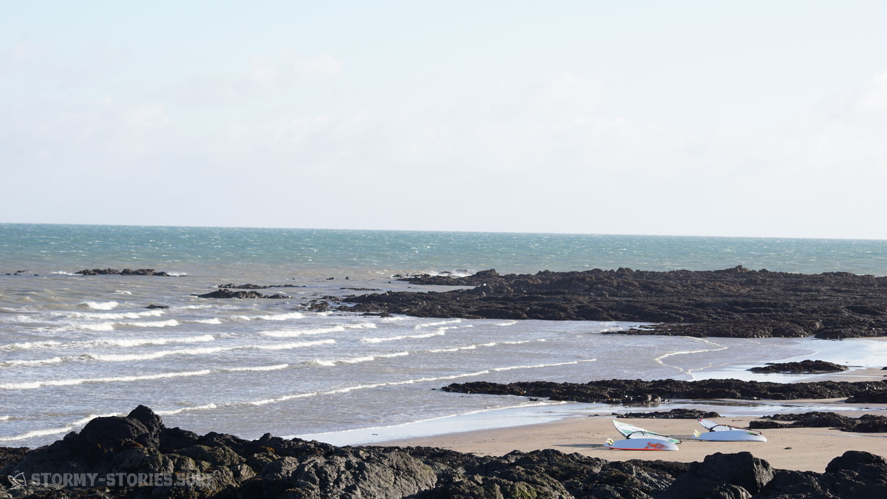

# Ireland 2017 : Portrane Beach (Dublin)

Our route from Magheroarty to the south-east took us right across Northern Ireland.
Our rough destination was the coast just before or after Dublin, so that we would have a relatively short drive to the airport from there. We took the same route we had already used to get here, back through Glenveagh National Park, then onto the N56 and in Letterkenny onto the N14.

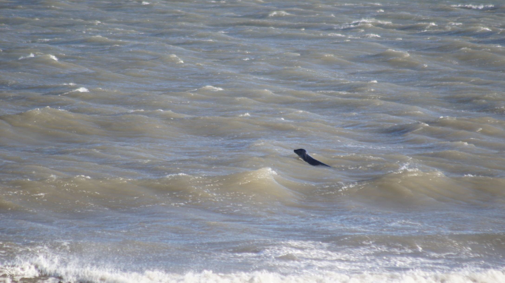

Just before Strabane, we waited the whole time for a sign to tell us when we had crossed the Northern Irish border. However, there was no such sign. After  crossing the border river Foyle and still not seeing any sign of a border anywhere, we simply accepted that we were now in a new country and continued happily along the A5 towards Omagh.

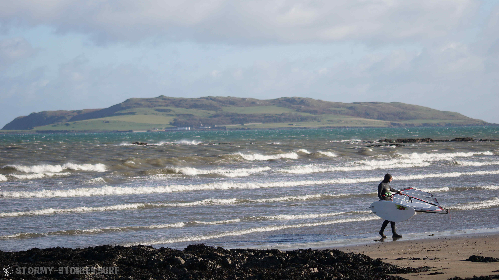

According to a sign on the road, the next stage destination was not as far away as I had assumed. At the next two signs, however, I was briefly surprised at how slowly we seemed to be making progress.
When we passed a petrol station, I suddenly realized it.
The prices we could read here were also significantly lower than a few days ago. They were calculating in different units here... Even though there was no currency sign anywhere, it was obviously pounds at the petrol station and miles on the road signs.

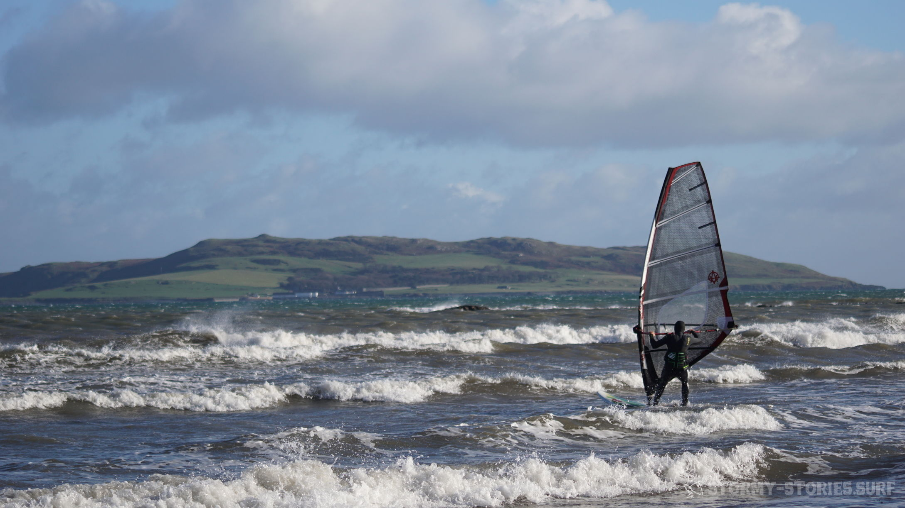

We crossed the next border at Aughnacloy and crossed back into Ireland at the River Blackwater border and thus back to European prices and units.
Again, there was no sign of a border and so we continued happily on the N2 towards Ardee, where we then took the N33 to the M1 leading to Dublin. As we had been driving for almost five hours by now and had dawdled a bit in Magheroarty, it was unfortunately getting dusk again.
So it was time to find somewhere to stay. Here, half an hour's drive from Dublin, everything seemed a little less Irish. High, unappealing walls and large, luxurious properties, heavy gates at the entrances and alarm systems everywhere that couldn't be overlooked.

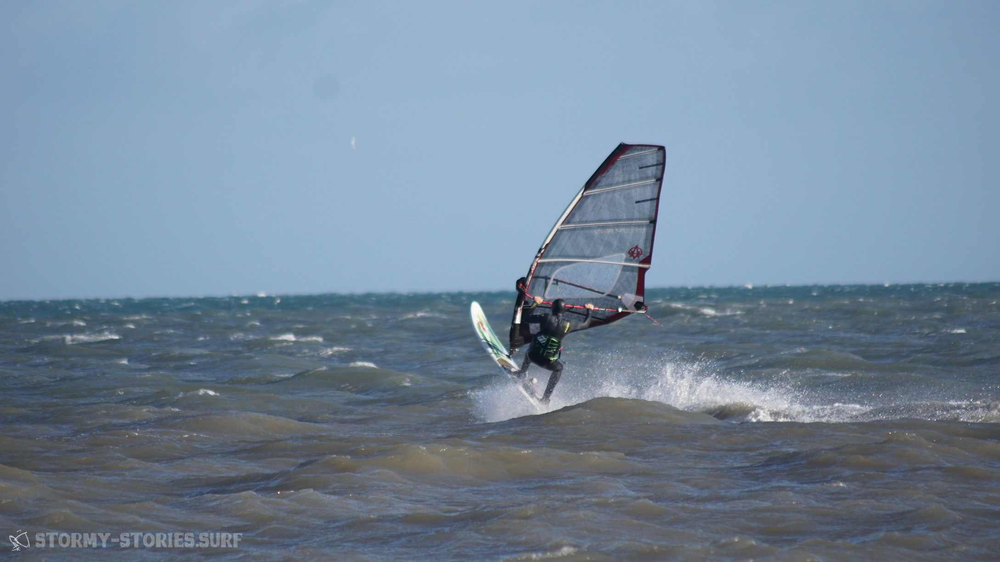

Everything seemed somehow less relaxed and less welcoming than in rural western Ireland. After two unsuccessful attempts, where no-one answered the door when we rang the bell, we finally found a B&B in Rush close to the water. This accommodation also seemed to be closed for the winter, but they were happy to take us into their brand new rooms. The only condition seemed to be that we didn't have a problem with the smell of the wall paint, which might not have gone away yet, as the place had just been painted recently. We gladly agreed and solved the problem with the equally new large tilting windows overlooking the sea.

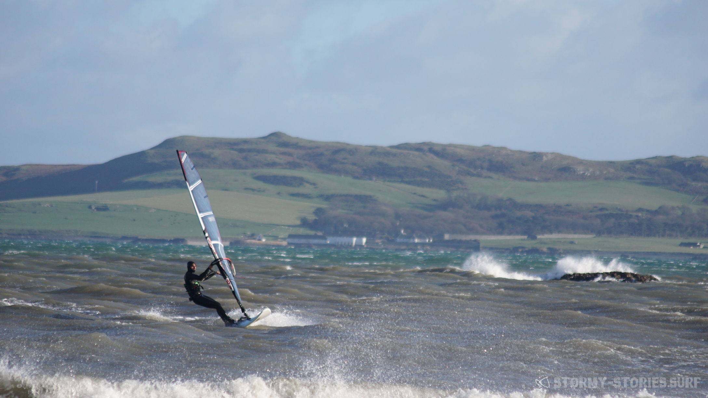

While unloading the car, we were told several times that it would surely make more sense to park our car with all the windsurfing equipment on the roof in the locked driveway. The first two times we just waved goodbye. We ourselves grew up in a sheltered little village in Lower Saxony and there, just like in rural Western Ireland, it seemed rather unnecessary to have to protect or lock up our belongings.
Here, however, everything seemed a little different. In the end, we were persuaded to leave the car in the courtyard. Maybe it wasn't wrong, but overall, we both had the feeling that this was just a typical example of: "If you have a lot, you can lose a lot." .

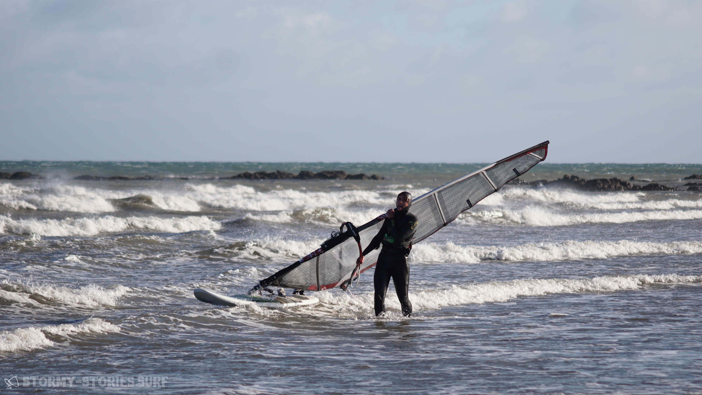

And so a little too much wealth can quickly make you unnecessarily paranoid. Or, if the doubts are perhaps even justified, then in this case the little bit too much wealth can simply create so much envy in the environment that you become paranoid quite legitimately.
Well - what can be summarized in any case: The obviously slightly more wealthy people here in the suburbs of Dublin somehow seem to us to be significantly less relaxed and more unhappy than the ordinary people in the rural regions of western Ireland. Which led us to the conclusion that, at the end of the day, money just isn't everything.
And it was this conclusion that led us to take our wallets and walk a few streets away to the busy pubs we had seen from the car earlier.

Cheers - and good night ...

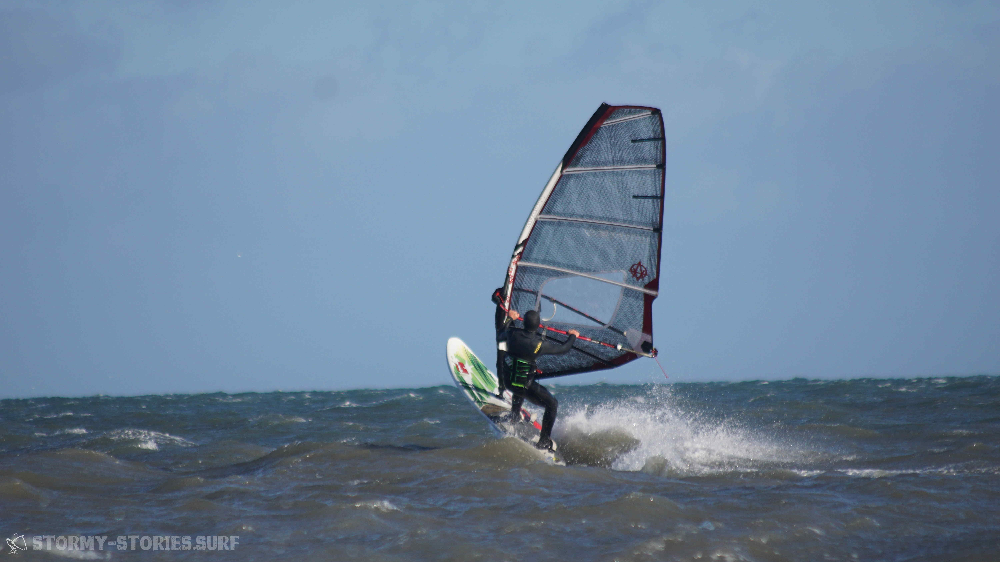

The next day, after a delicious breakfast, we headed to the nearby beach. In our spot guide, we had read about the nearby spot "Rush-Portrane", which was supposed to provide acceptable wave conditions with southerly to south-westerly winds. Today, unfortunately, the wind was blowing from the northwest, which apparently was anything but a guarantee for good wave conditions.
Here, where we were standing, this also meant massive wind cover from the housing estate and some offshore wind.

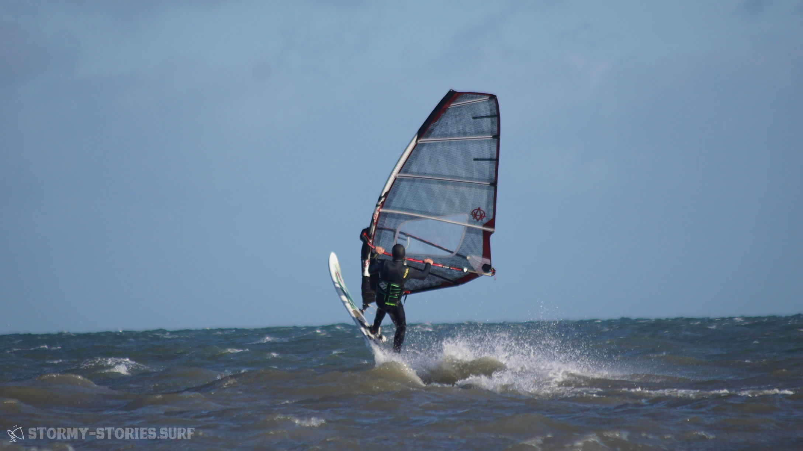

All in all, it didn't look particularly good for today and as this was Marcel's birthday, we had actually hoped for a birthday sailing session. We decided to break up our tents here for the time being and search the coast for wind.
Depending on the success of our search, we would then go for a round of surfing and then make our way towards Dublin or go straight to the second part.
On the drive back east, we had already thought about spending our last night in a hostel in the Temple Bar district to round off our last evening and Marcel's birthday. We wanted to park our car at the airport and take the bus into the city. If possible, we wanted to check in our luggage or, if that was not possible, leave it on the roof of the car in the airport parking garage for one night. That morning, our hostess from the B&B in Rush had strongly advised us against our plan, as in her opinion it was almost guaranteed that our equipment would be stolen from the roof during the night.

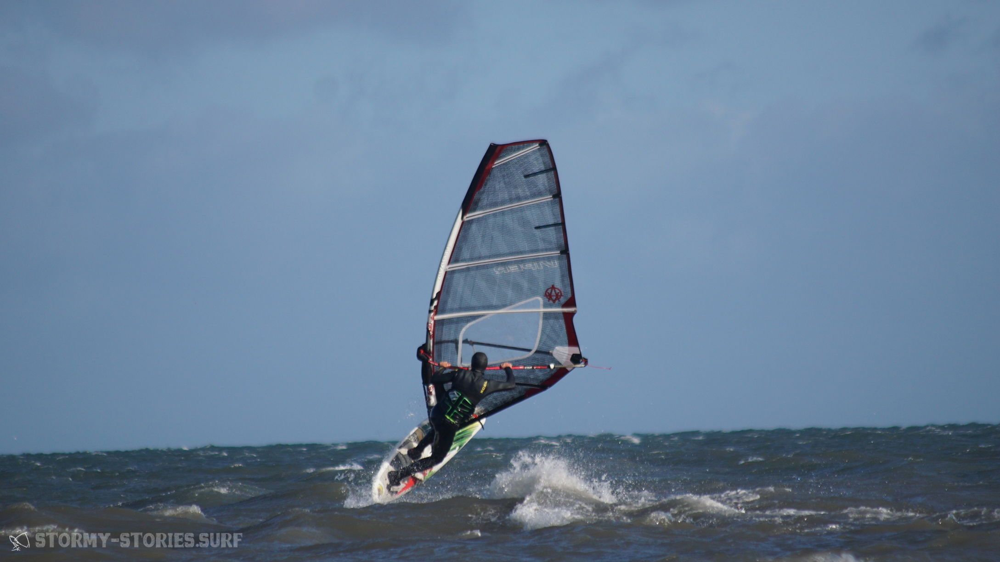

After the "fear of loss" impression we had gained of this Dublin suburb, we were initially a little unsure. In the end, however, we unanimously decided to go ahead with our plan and not let any fears ruin our last day. After all, it didn't seem too easy to let the bulky surfing equipment disappear unnoticed in a camera-monitored airport parking garage and we also wanted to try and check in our luggage for the flight first anyway. So we booked two beds online in an 11-person dormitory at Oliver St. John Gogarty's Hostel. Right in the heart of the Temple Bar district, directly above the "Oliver St. John Gogartys" pub of the same name and at €13 per person per night, it was very reasonably priced.

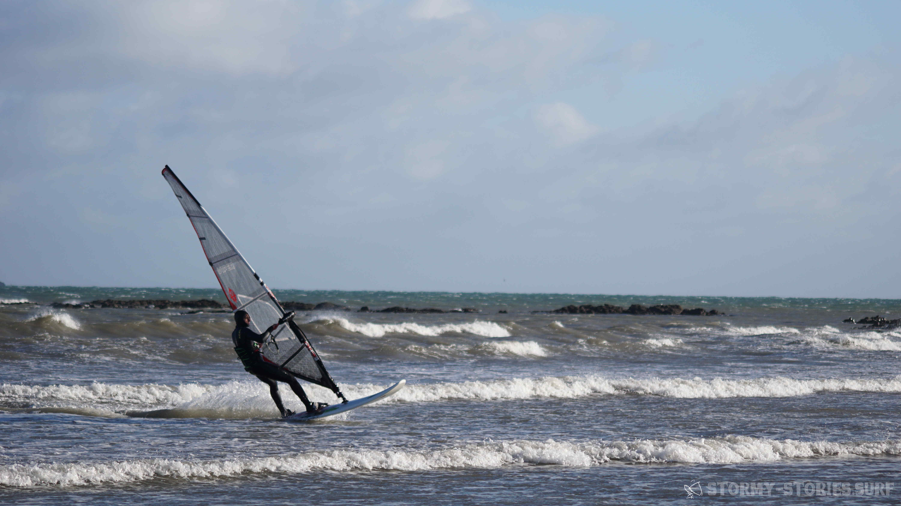

We then headed south along the coast by car. However, all the windsurfing spots we had read about only offered underworldly conditions, so we were almost a little annoyed that we hadn't stayed longer in Magheroarty. The wind direction here would also have been very bad, but at least it might have been windsurfable.
But then we found a headland at the end of a bay which, with a bit of luck, would no longer be covered by the wind. There was no road to it, as this stretch of coast seemed to have been taken over by a "mobile home park". So, armed with an anemometer and warm jackets, we walked over a few rocks and finally reached a nice little sandy beach. From the beach, more rocks jutted out into the sea and on the horizon a large, green overgrown island grew out of the water, giving the place a certain charm. Behind us, the beach merged into a small, steep cliff a few meters high, at the end of which stood the mobile homes, whose windows probably offered a fantastic view of the sea.

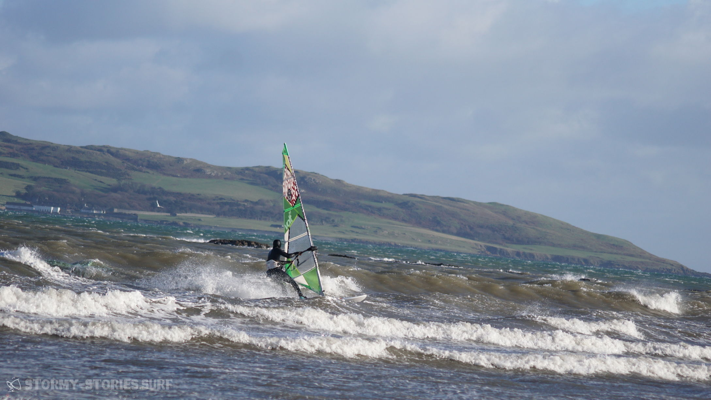

We climbed along a few rocks and here (53.492891, -6.098071), slightly offshore in the water, we were actually able to measure a good 20 - 25 knots of wind from side to side-offshore. That meant perfect conditions for a 4.7 sail. The waves, on the other hand, looked pretty small and choppy, quite different from a few days ago on the Atlantic side. On the other hand, with the entrance lined with rocks to the left and right, perhaps that wasn't such a bad thing, at least we didn't have to worry about getting in and out safely. Motivated, we walked back to the car, which we had simply parked on the grass strip due to the lack of proper parking spaces. Off we went into the wetsuits and then, after a quick rigging, back to the beach. As we brought our boards onto the beach, I noticed something black in the water. At first I thought of birds, but then the black thing was gone again and disappeared from my thoughts. A few minutes later, we carried our sails onto the beach and tied them to our boards. There, something black again! But it had already disappeared again. Then several more small black spots!

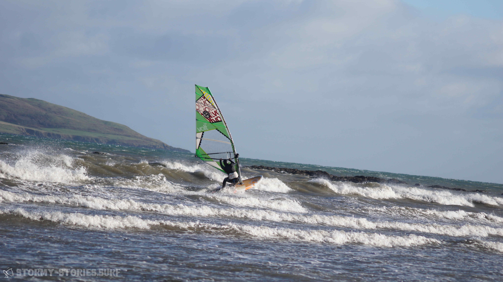

Marcel had now also seen them and we walked closer to the beach to take a better look. There they appeared again. Little black heads, maybe two or three of them. And then it hit us. Seals! They were actually seals, having fun in the small wind waves, diving under from time to time and sometimes even surfing in the waves. Then there were even more heads and even more. Almost ten cheerfully swimming seals were having fun in the waves. We weren't quite sure whether the animals would feel disturbed if we jumped into the water with them. We hadn't seen any information or warning signs anywhere on our trip or here. In our opinion, there shouldn't be any pups until spring and as the seals mainly stayed close to the shore, we decided to give it a try and keep a safe distance.

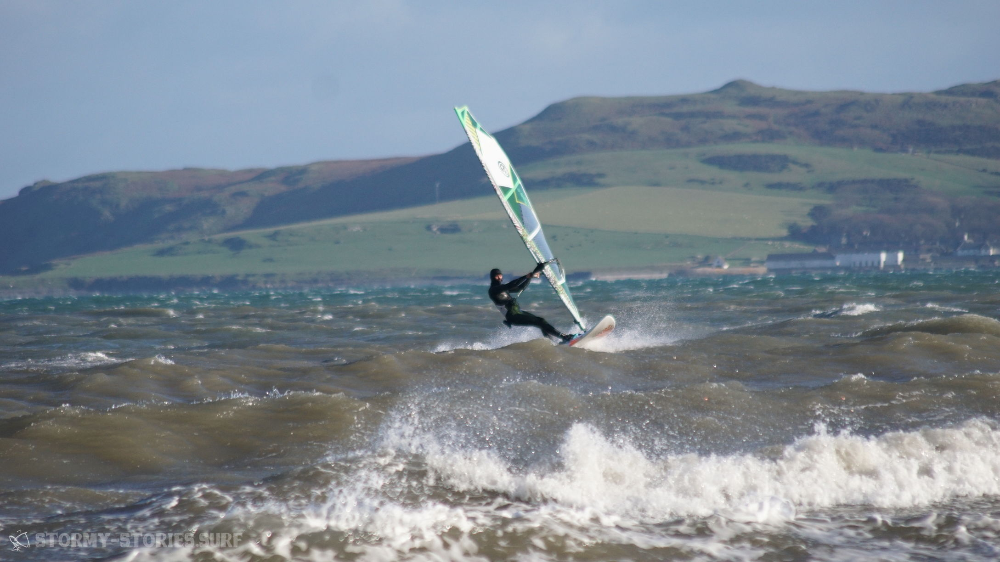

The conditions were like a dream and simply incredibly easy to ride. Completely in our comfort zone and just right to be neither under- nor overchallenging. The wind was super easy to handle, the waves were very small and disorganized but still enough to try out everything we had learned about jumping and riding waves in the previous days. We jumped as high as we could from every little choppy wave, tried table tops with just 50 cm under the board and sliced cutbacks into knee-deep water so that the fins occasionally brushed the bottom.
The only thing that really shocked us at first was the water temperature. As on the previous days, we had agreed to meet back on the beach after one or two laps to discuss the situation. We came to the conclusion that it was safe to continue. But unlike the previous days, we were both amazed to report how incredibly cold the water was. It had actually been logical. The "warm" water temperatures on the west coast of Ireland are possibly only okay even in winter because the Gulf Stream ensures sufficient mixing with warm water from the west.

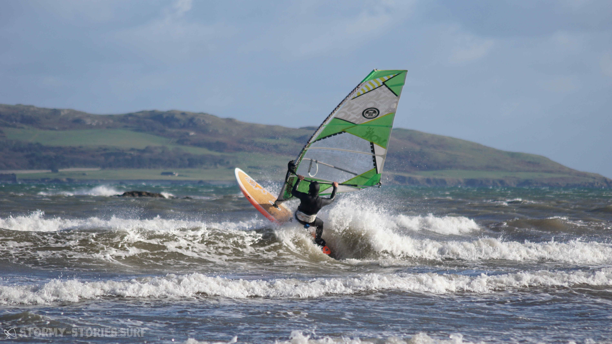

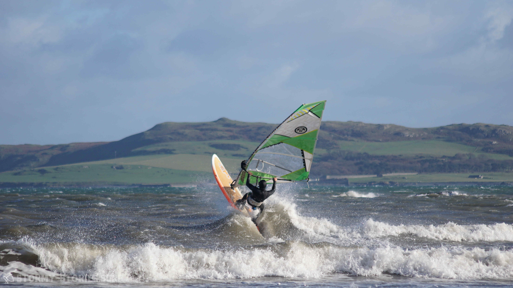

The Gulf Stream, which in some latitudes transports more than one hundred times as much water as flows into the sea via all the world's rivers combined (https://de.wikipedia.org/wiki/Golfstrom), merges into the North Atlantic Current towards Europe. In Ireland, Great Britain and parts of Scandinavia in particular, it ensures a warmer climate than what would actually be expected due to the high latitude. This makes Ireland an attractive windsurfing destination even in the fall and winter. The Irish Sea, on the other hand, which runs between Ireland and Great Britain, is not as directly exposed to this "warm water heating" as the Atlantic coast of Ireland and does not seem to have received much of the heating power, at least on this day.
After a short break, we were sufficiently warmed up again and started a second attempt. Now we started to see more and more seals appearing near us while we were surfing. Even though we tried to keep our distance from the animals, they didn't necessarily seem interested in keeping their distance.
Quite often when we were heading out, a cute-looking black head would suddenly emerge from the water nearby and watch as the surfboard made its way through the water. A few meters before we reached them, the head would dive into the depths, only to peek out of the water again a few seconds later and watch us from behind.

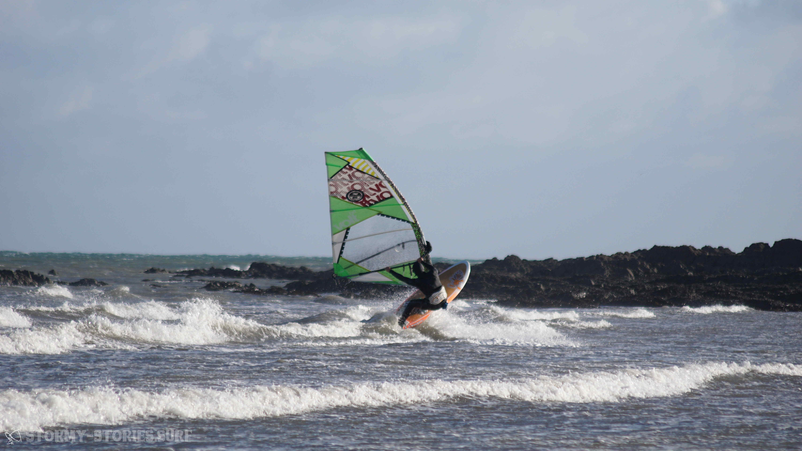

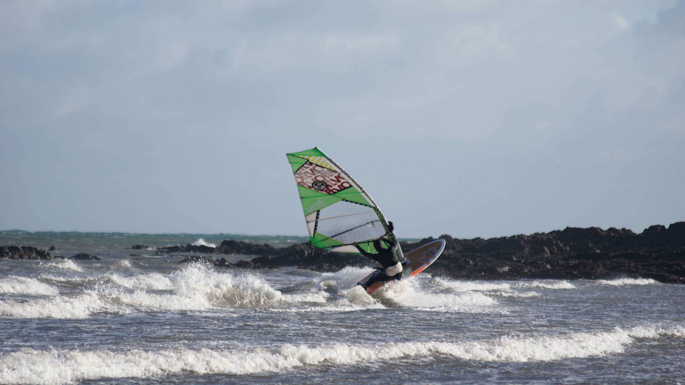

You almost felt like the attraction rather than the observer. After a few hours, our batteries were finally drained. The cold water was sapping our energy and as we still had Dublin planned for the evening, we headed back to the car. While de-rigging the equipment, we met a German-Irish windsurfing couple. According to them, they lived on the other side of the bay, a few hundred meters away, and had been watching us from there. As hardly anyone normally sails here, their interest had been awakened and they had made their way to us in their van.

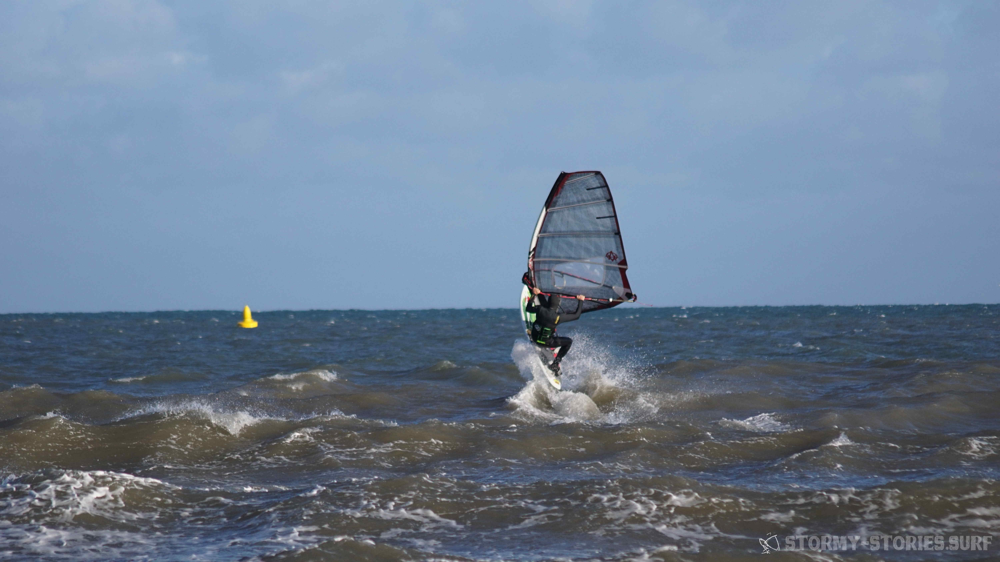

We talked about the west coast of Ireland, about Brandon Bay and about the fact that they usually travel all the way there to windsurf and hardly ever go into the water here, right on their doorstep. They also told us about the small windsurfing community in Ireland. Apparently, windsurfing is not particularly popular in Ireland. Many people don't have enough money for the expensive, bulky equipment and therefore prefer surfing. And the number of advanced Irish windsurfers that can be found in the waves is supposedly limited to less than 100 people. This comment made us think back to the completely overcrowded Baltic Sea parking lots on a good day in summer. On one such day alone, there were probably a hundred or more people windsurfing in many places in Germany. It's hard to imagine that the Irish windsurfing scene is in such a bad state. Especially when the west coast is bombarded by storms in winter and regularly delivers world-class conditions.

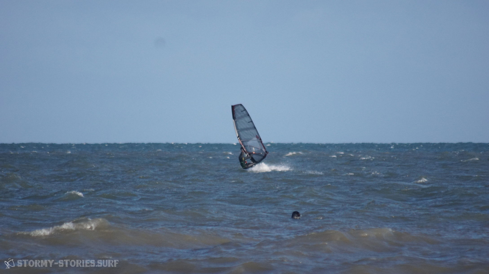

Then we came to the subject of the seals, or "sea lions" as the Irish call them. The two of them told us that you could often see them here and that the previous week, a friend of them, who swims in the bay every day, had been accompanied by ten or more seals. An experience he would not soon forget.
So the de-rigging somehow took a little longer than we had thought at the beginning. But it was very nice to meet friendly people, even in this expensive and fake-looking area of Ireland. When everything was finally packed, we continued on towards Dublin. Here we parked our car in the airport parking garage as planned and tried our luck at the Ryanair baggage counter. As we had secretly feared, it was unfortunately not possible to check in our luggage the day before. The reason for this was supposedly that the same flight was still going to Germany that day and the luggage from this flight could not be separated from our flight.
Okay - so luck didn't seem to be on our side here. We then made a second attempt at the baggage storage counter. Here it was possible to store luggage for a period of time in exchange for money. Interestingly, the size of the bags didn't seem to be important here, it was all about weight and number of items. When we asked whether it was also possible to deposit two large sports bags, we once again received a relaxed Irish "No problem" in response, so we happily walked back to the car and picked up our board bags from the roof. Around €30 later, the boards were handed in and we were on a shuttle bus for another €6 per person, which would take us into the city center today and back to the airport tomorrow.

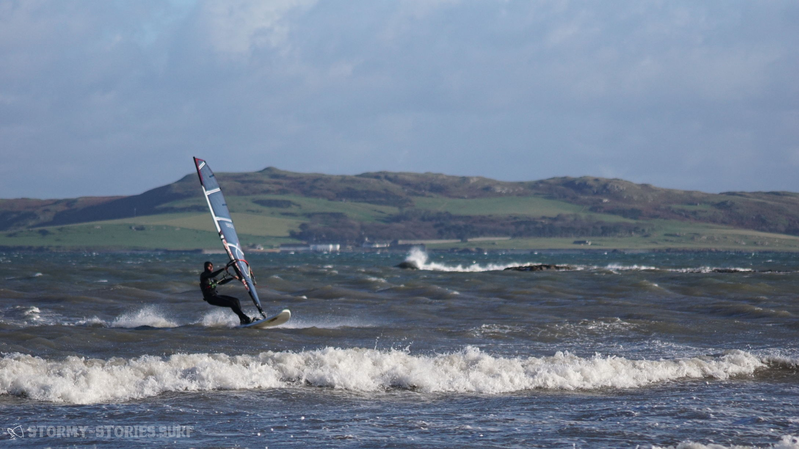

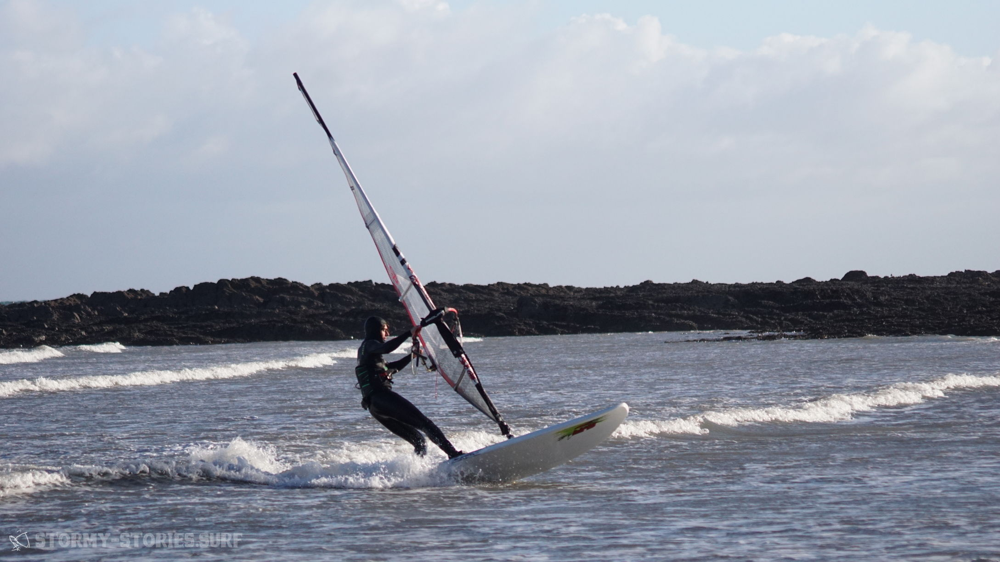

When we arrived at Gogarty's, we quickly dragged our clothes up to the room and then made our way to the restaurant of the same name. As we knew from a city trip two years earlier, this restaurant has by far the best spare ribs we have ever eaten anywhere. We had been looking forward to this treat for months. Unfortunately, we were brought back to reality a short time later and our dreams came to an abrupt end. The spare ribs had unfortunately all been sold this evening. Damn! But well, it's hard to dampen a windsurfing day like this, thank goodness. Alternatively, there was the barbecue dish directly below it on the menu - also a treat for the palate, but also at a typically high Dublin price.

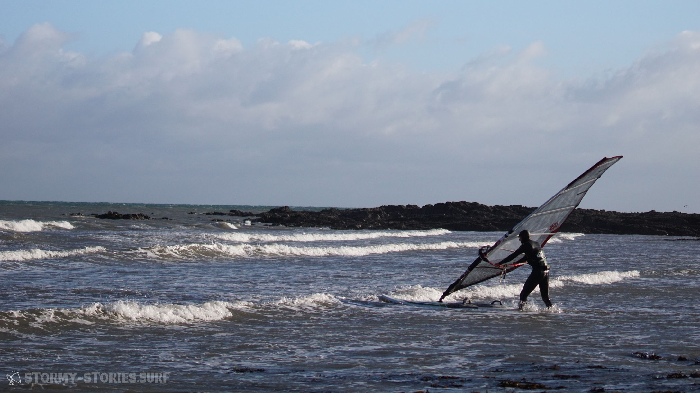

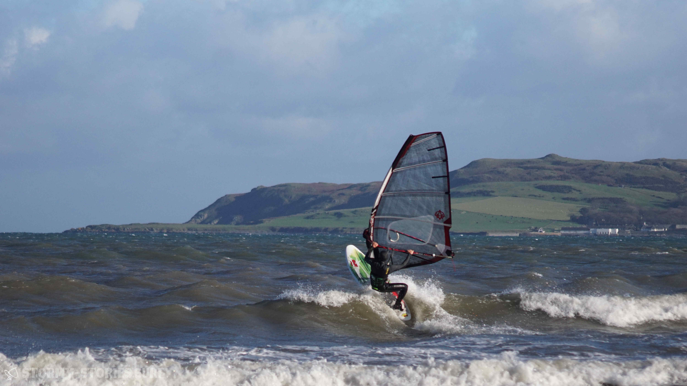

Afterwards, we went to the pubs for plenty of live music until closing time, which is around 1am in Dublin. This was accompanied by delicious snakebite, a mixture of cider, lager-beer and a shot of blackcurrant. We listened to the talented musicians and reflected on the last few days. Basically, we hadn't been out on the water that much and had been chasing the wind quite a lot.

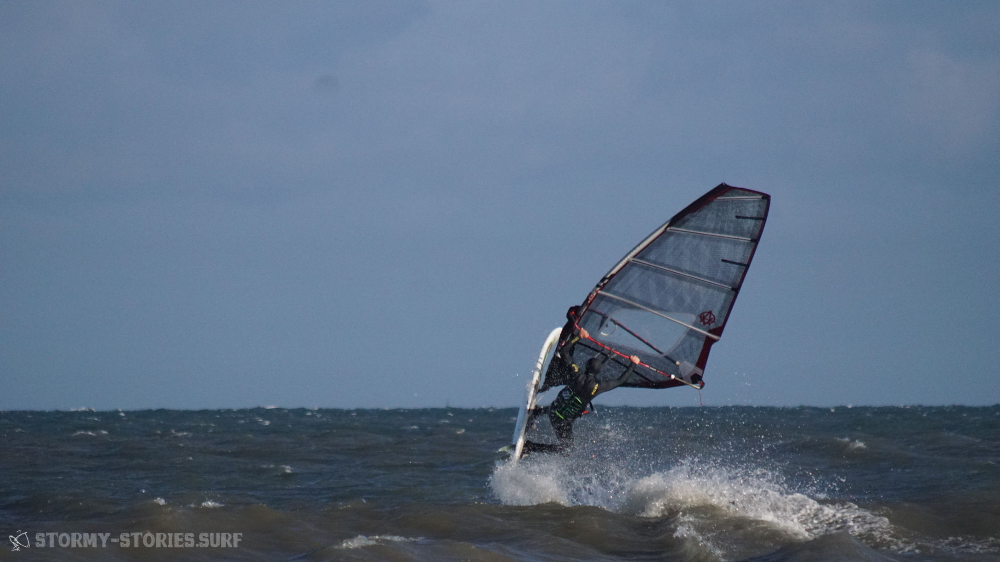

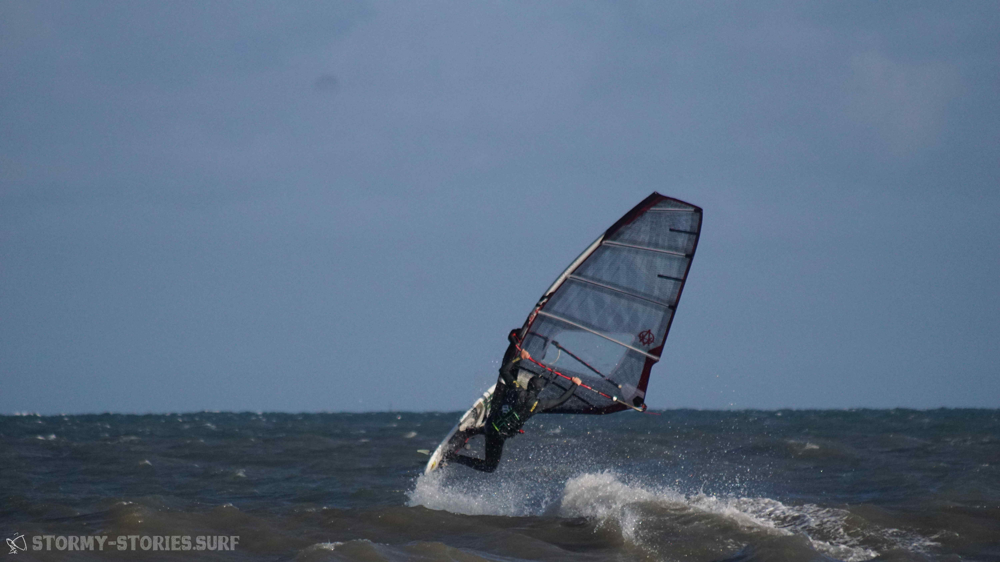

4 days of sailing on a 10-day vacation. But somehow it was really worth it. The hospitality of the relaxed Irish, the beautiful wide landscape, the quiet atmosphere and the empty beaches with their incredibly clean and long waves. Before the vacation, jumping hadn't really worked out so well. Now, after the vacation, I clearly had the feeling that I had got the hang of it. And the wave riding too. It got better from day to day and especially on the last day in Portrane it worked incredibly well and was so much fun. Yes - all in all, it had been a damn great vacation.

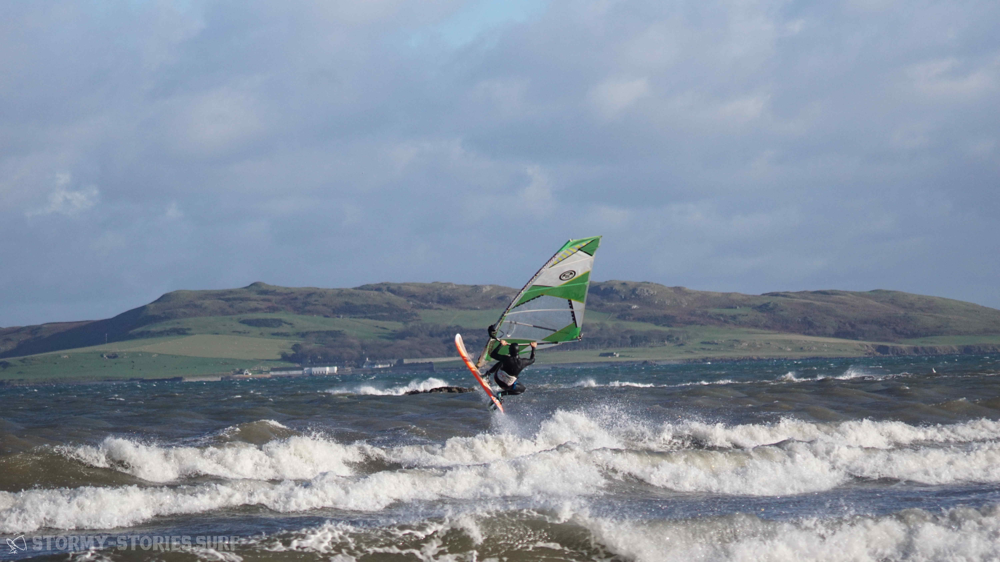

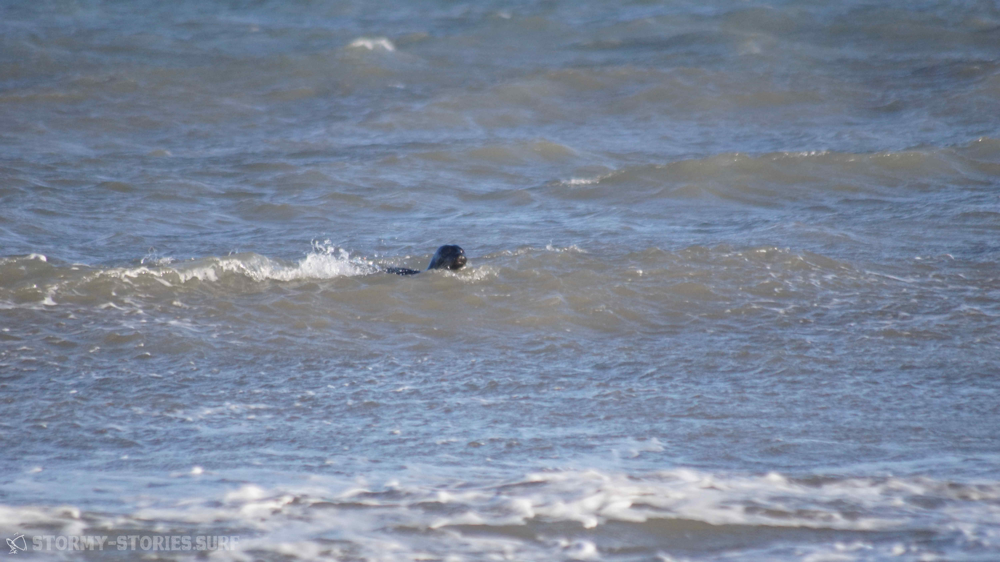

And the return flight was just as relaxed as the last few days had been. The next morning - who would have thought it - we took the shuttle bus back to the airport on time. We unloaded the rest of our luggage, collected our board bags from the baggage station and walked to check-in. Here we learned that there were no more check-in counters, only self-service terminals.

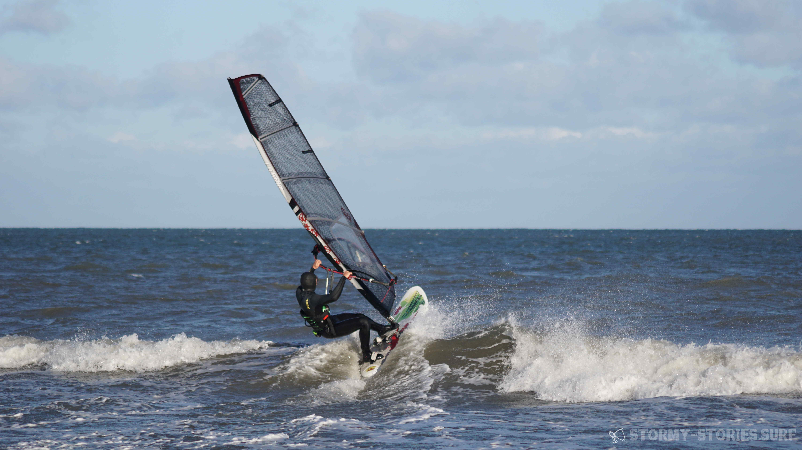

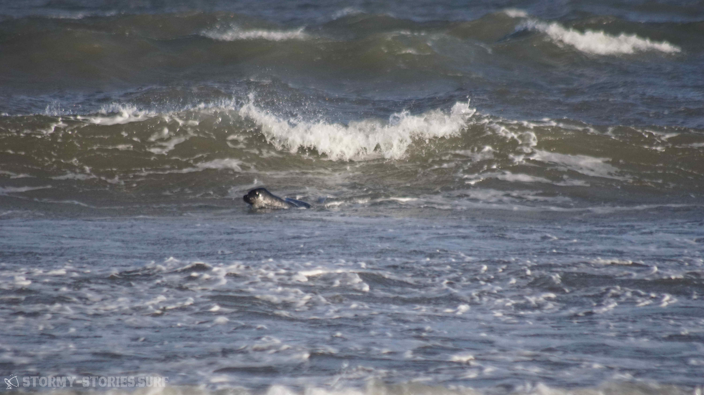

What we didn't quite understood at first turned out to be a blessing in disguise. Here you had to weigh and label your luggage yourself. As our luggage now weighed a few kilos more than on the outward flight after the rain, dirt and salt water, this was exactly what we needed. We weighed exactly 20.0 kilograms three times, labeled our sports baggage and then went to the bulky baggage counter, which accepted everything without any problems. Then it was time for the second test of our nerves, the return of the rental car.

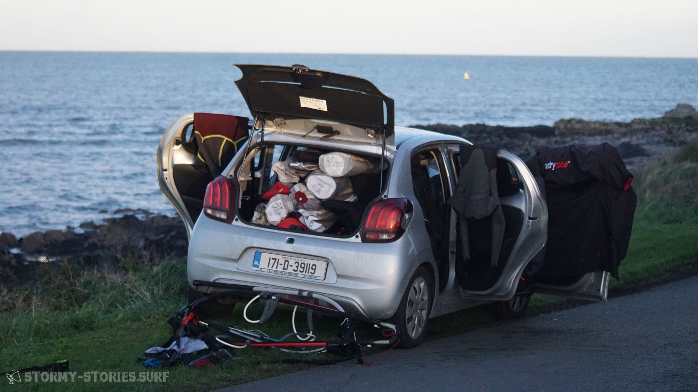

This year we had maltreated the much too small car (with the luggage for two windsurfers) even more than the year before. Whereas last year I was still worried when the roof was bend inside under the weight of my board on a bump, in the last few days we just started laughing when the roof gave way again. The car had simply not been designed for so much luggage. As we also had a crack in the windshield in the meantime, we had already put an end to the issue anyway. We would have to pay, it would cost money, that was life.

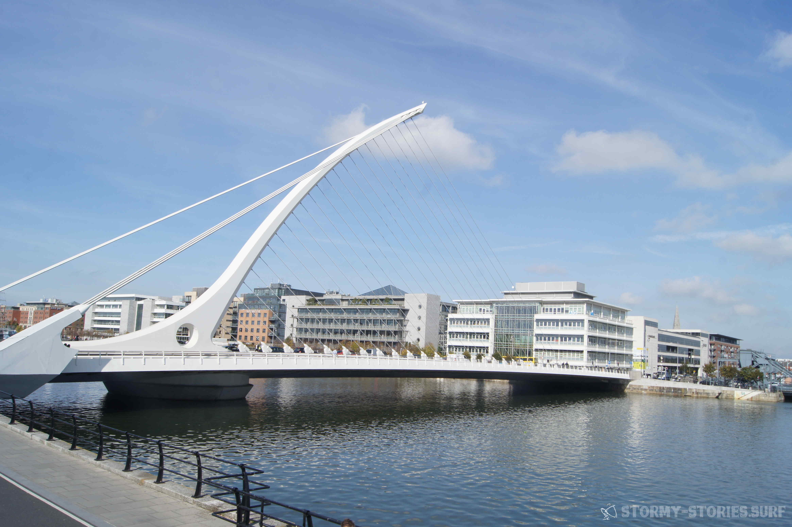

However, when we got through here without any problems or complaints, we were truly amazed. All right, apparently they had really meant well with us today. So we walked to the security check completely relaxed, sat down in the empty plane and landed in Hamburg a few hours later - what a trip!

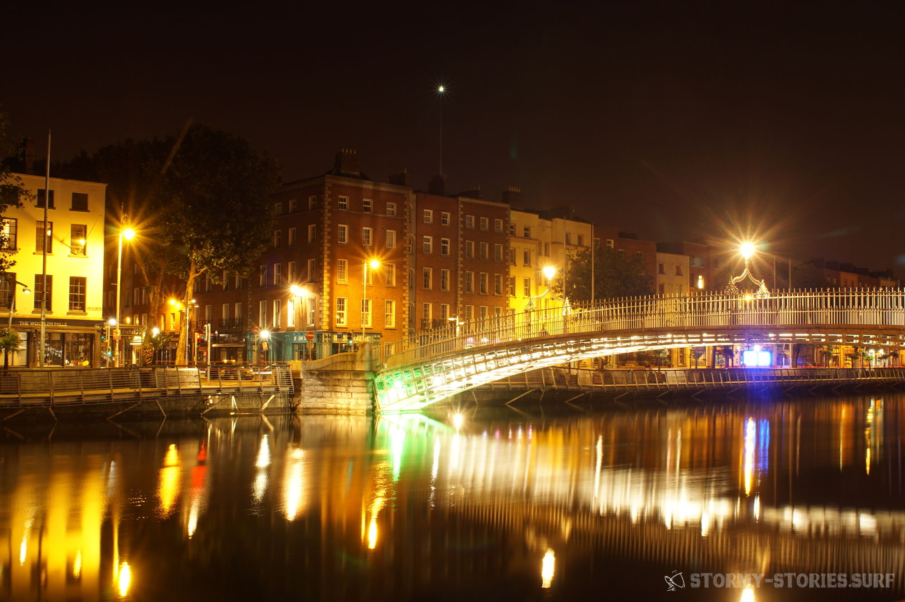
