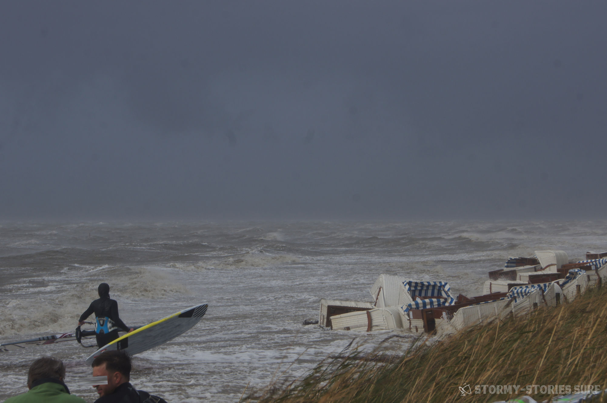
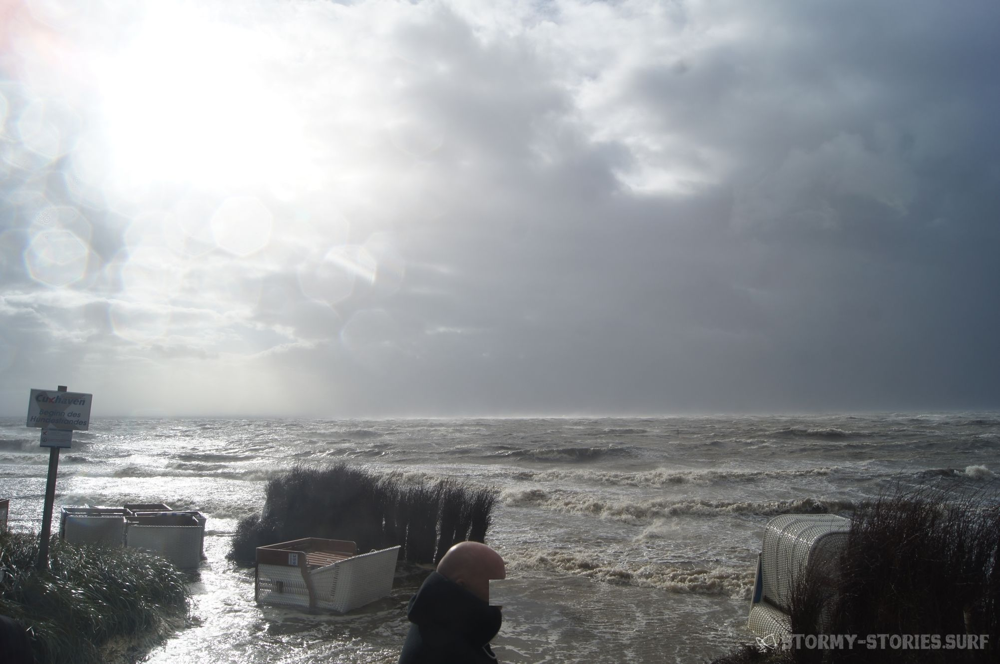
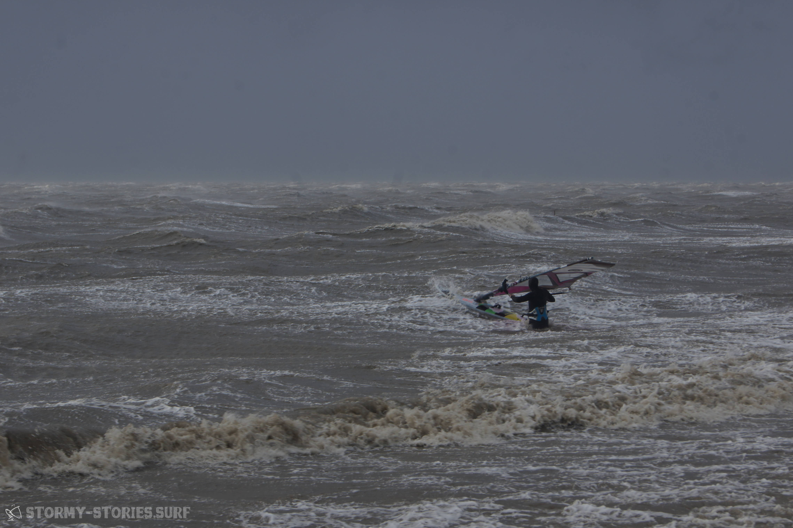
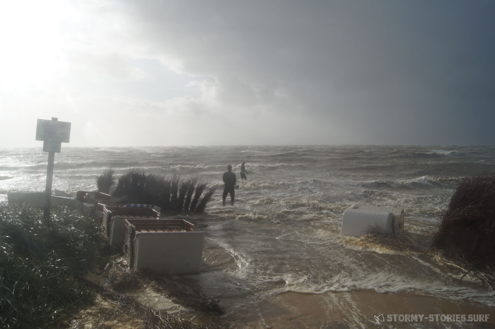

# Orkan Irma : Cuxhaven Sahlenburg

Die Wetterkarte zeigte längere Zeit schon ein richtig schönes stabiles "Stürmchen".
Mit Blick auf den Kalender wurde dann aber schnell klar, dass ein Tag Urlaub wohl nicht drin sein würde.
Ein paar Überstunden abfeiern half dann aber immerhin um noch einen Spontan-Trip nach Sahlenburg möglich zu machen.

Auf dem Weg dort hin sah es teilweise schon etwas abenteuerlich aus. Während auf der Autobahn nur hin und wieder mal ein größerer Ast von der Polizei wieder eingesammelt werden musste, war auf manchen Straßen fast die Hälfte der Straße mit Laub und kleinen Ästen bedeckt.
In Sahlenburg angekommen standen schon ca. 5 Autos bereit, die alle irgendwie nach Surfen aussahen.
Aufgrund des waagerechten Regens schien aber keiner so wirklich überzeugt das Auto verlassen zu wollen.

Nach einer viertel Stunde in der sich nichts bewegte, bin ich dann mit Snowboard-Klamotten einmal zum Strand und zurück.
Zwei Minuten später war alles triefend nass und ich wusste dass es "doch schon ganz gut windig ist", man auf dem Wasser aber aufgrund von Nebel eigentlich nichts sah.
Ca. eine dreiviertelstunde später klarte es auf und die ersten machten sich mit 4.0, 3.7 und 3.2 auf den Weg.
4.0 fuhr einmal heraus, wurde dann zerlegt und kam eine halbe Stunde später wieder den Strand hochgelaufen.

3.7 und 3.2 kamen garnicht wirklich raus. Irgendwie war die Stimmung an Land dann ziemlich ernüchternd.
Alle hatten Bock, aber irgendwie fehlte jemand der zeigte dass es möglich war.
Ca. eine Stunde später kam die Sonne kurz raus und der Wind wurde ein klein bisschen weniger.
Schnell wurde das Material klar gemacht und ab ging es slalom-mäßig zwischen den angespülten Strandkörben entlang ins
Wasser. Zu Anfang war es selbst mit 2.9 einfach nur unglaublich stark und ungewohnt.
Nach einer Zeit lernte man dann aber die Böen einzuschätzen und wir konnten noch eineinhalb Stunden alles geben bis die Ebbe und die Dunkelheit kam.

