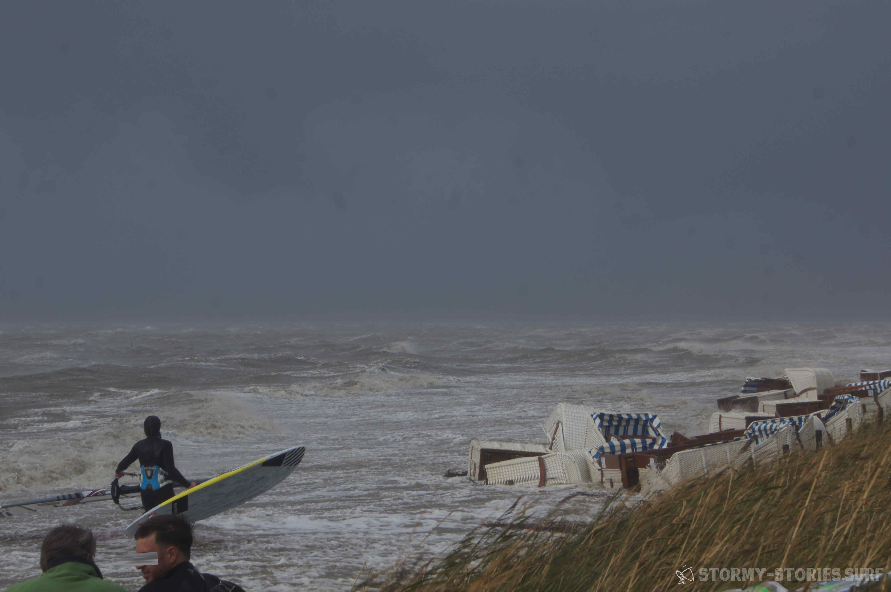
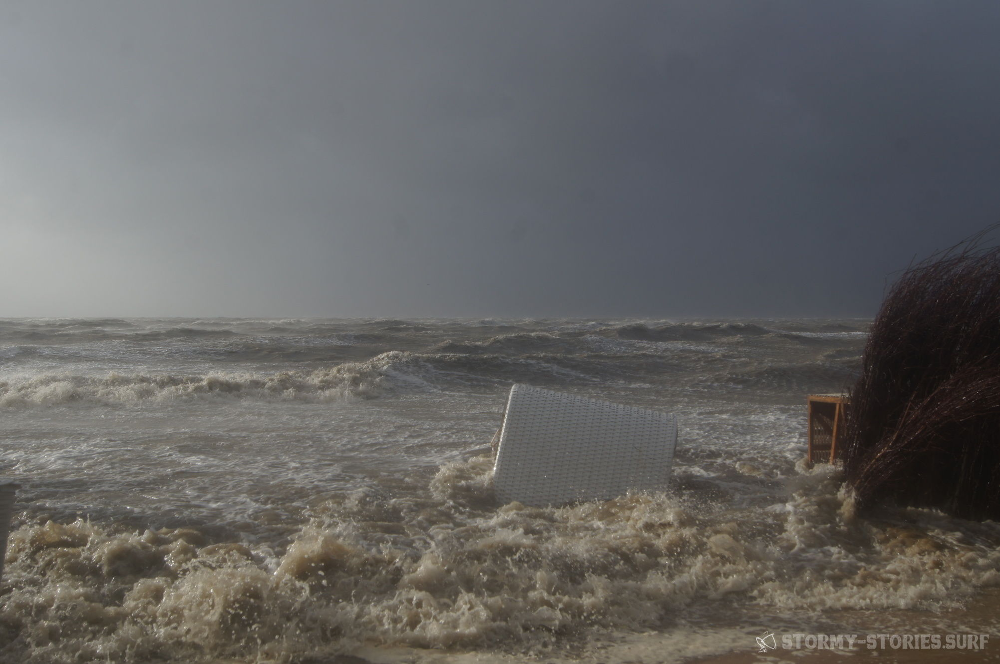
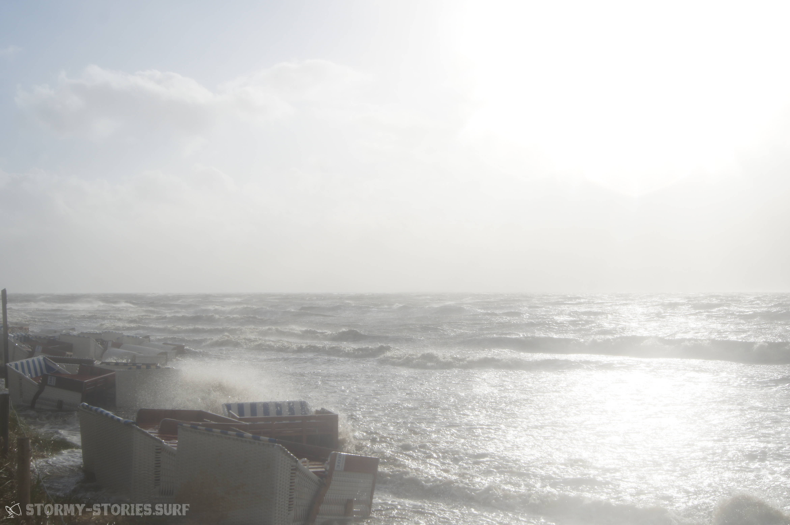
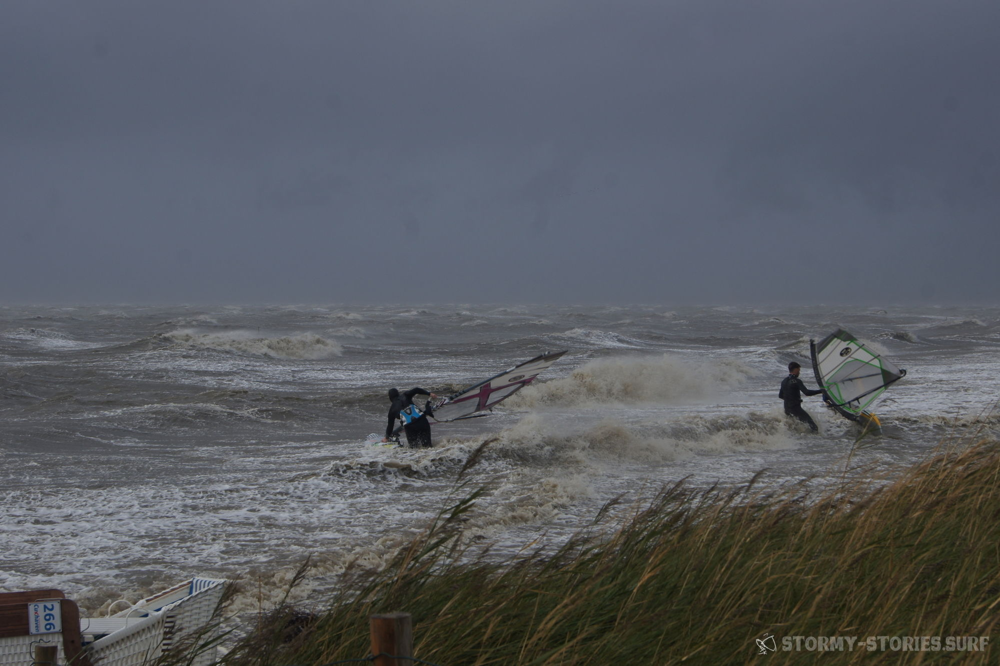
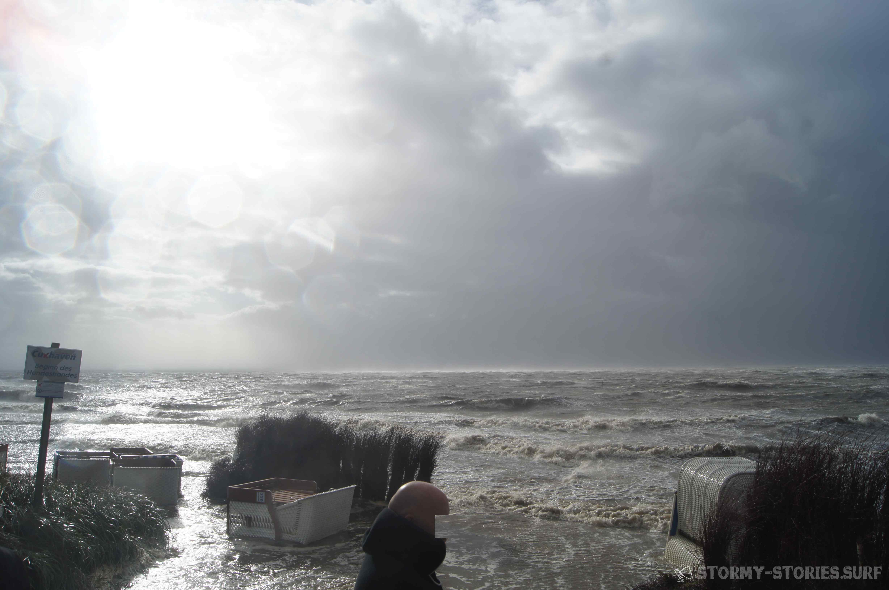
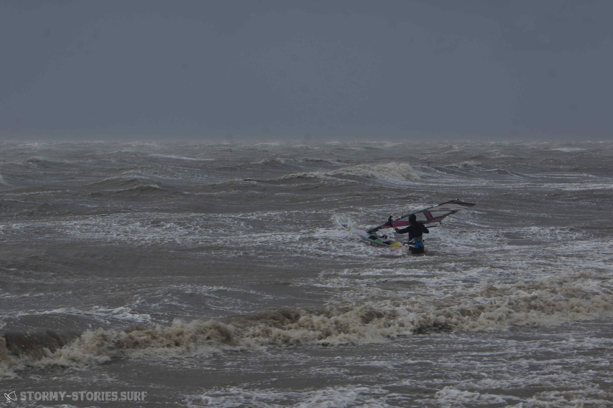
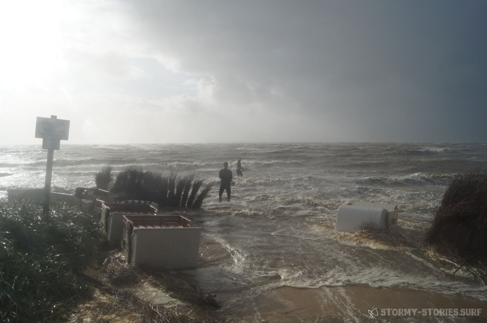
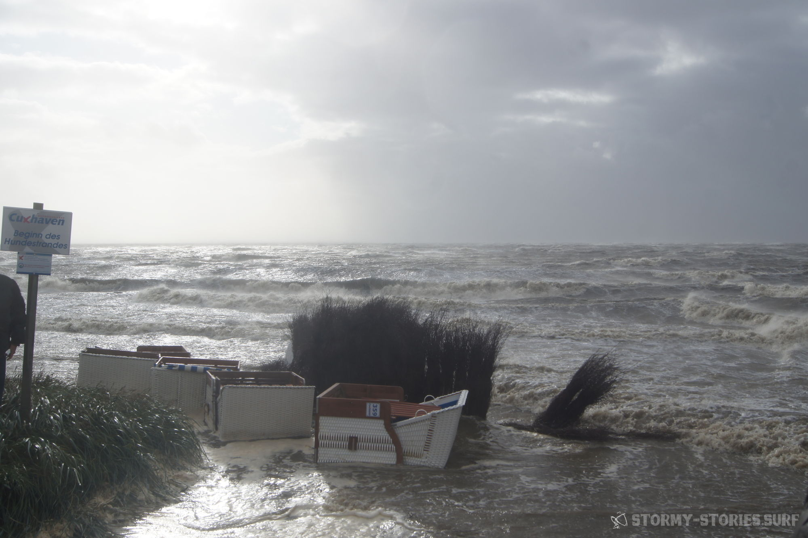

# Orkan Irma : Cuxhaven Sahlenburg

The weather map showed a really nice, stable, big storm for a long time.
But looking at the calendar, it quickly became clear that a vacation day would probably not be possible.
But at least a few hours of overtime helped to make a spontaneous trip to Sahlenburg possible.

On the way there it looked a bit adventurous at times. While the police only occasionally had to collect a larger branch on the freeway, on some roads almost half of the road was covered with leaves and small branches.
Arriving in Sahlenburg, about 5 cars were already waiting, all of which somehow looked like windsurfing.
Because of the horizontal rain nobody seemed really convinced to want to leave the car.

After fifteen minutes in which nobody was moving, I left the car and went to the beach and back in my warm snowboard gear.
Two minutes later everything was dripping wet and I knew that "it was pretty windy after all", but I couldn't really see anything on the water due to the fog.
About three quarters of an hour later it cleared up and the first guys set off with 4.0, 3.7 and 3.2.
4.0 went for the first round, then got wiped out very hard and came back up the beach half an hour later.

3.7 and 3.2 didn't really made it out at all. Somehow the atmosphere on land was pretty sobering.
Everyone was up for it, but somehow someone was missing to show that it was possible.
About an hour later the sun came out for a moment and the wind dropped a little bit.
The gear was quickly rigged and off we went slalom-like between the washed-up beach chairs into the water. In the beginning, even with 2.9, it was just incredibly overpowered and unfamiliar.
But after a while we learned to handle the gusts and we were able to give everything we had for another hour and a half until the tide went out and it got dark.

