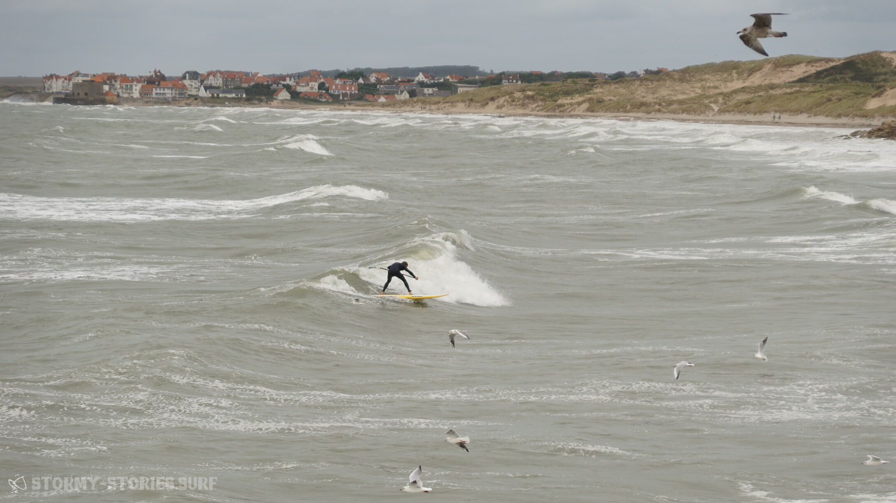
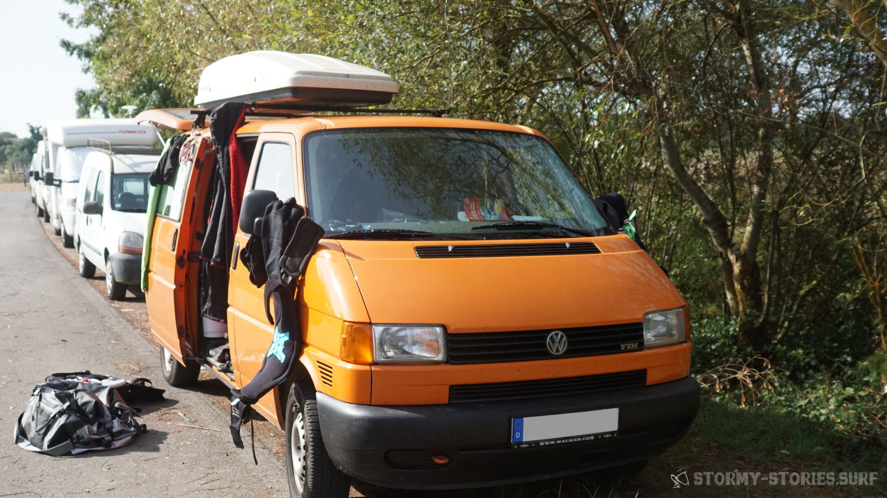
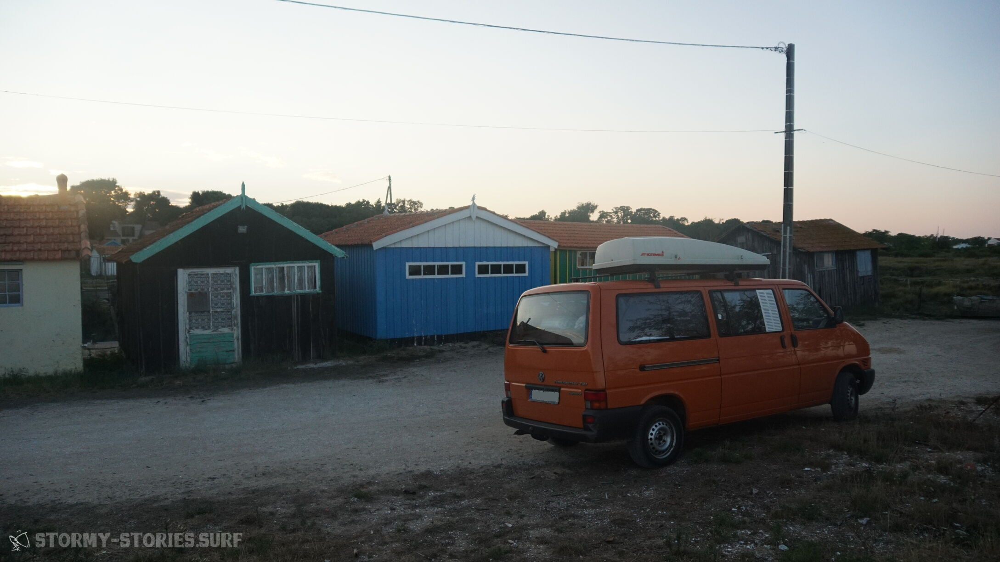

# Frankreich 2018 –  Ein Roadtrip

Da war er also, der große Urlaub: Endlich mal wieder drei Wochen nur für uns. Letztes Jahr hatten Marcel und ich uns einen Bulli gekauft, kleine Autos kann schließlich jeder und Surfboards auf dem Dach fliegen viel zu gern beim Herunterholen in Richtung des nächsten Autos. Also musste eines her, in dem man alles unterbringen kann, was 2 Leute beim Windsurfen und gelegentlichen Wellenreiten nunmal so brauchen. Ein VW T4 Syncro mit langem Radstand ist es geworden. Orange ist er, man muss ihn ja auch wiederfinden können auf dem Parkplatz. Ein Bett ist mittlerweile auch drin. Und wenn man schon so ein Blechzelt besitzt, sollte man es auch nutzen! :)
Somit war der Plan für diesen Sommerurlaub schon vor einiger Zeit entstanden: Einfach mal losfahren, ohne jegliche Planung, die europäische Küste entlang, wo es einen gerade hinverschlägt. Für mich war es der erste Trip dieser Art, bisher habe ich immer irgendwo zumindest ein Bett gebucht gehabt. Marcel kennt so etwas noch aus Kindertagen mit dem Wohnmobil der Eltern.

Also, Auto vollpacken und – nein, halt stop, erst braucht das nochmal TÜV, der ist nämlich schon einen Monat überfällig. Okay, gut, 2 Tage vor Start konnte das Packen dann doch losgehen. Eine Dachbox ist dann doch noch draufgekommen, irgendwann ist auch ein Bulli leider zu voll. Immerhin konnten die Bretter unterm Bett bleiben.

Eigentlich wollten wir Freitag nach der Arbeit starten und abends noch die ersten Kilometer hinter uns bringen, aber nee, zu müde. ‚Wir können ja auch morgen früh rechtzeitig aufstehen!‘
Pustekuchen, Wecker verschlafen und doch erst nach dem Mittag los.
Nach den letzten Wochen Hochsommer in Deutschland war es mittlerweile auch recht kühl geworden, wir lagen mittlerweile bei nur noch 20 °C, und dann regnet es auch noch! Da ist dringendst die Flucht in den Süden nötig ;)

Erstmal ging es allerdings eher westlich. Ein Bekannter war übers Wochenende in Workum. Da bot es sich doch direkt an, mal vorbeizuschauen, war der Plan doch, an der Küste entlangzufahren, und die Nordseeküste ist nunmal von uns aus die dichteste. Die ganze Fahrt über regnete es, das fördert die Fernweh definitiv noch weiter.
In Workum angekommen, klarte es schon wieder etwas auf. Und tatsächlich war am Strand noch Wind zu finden! Also kurz Bekannte begrüßt und zack, Brett raus und aufs Wasser. Wir hatten ca. 16 Knoten, das war Marcel noch zu wenig, er blieb am Strand. Ich hatte jedoch enorme Lust, hab mir 5,7qm aufgebaut und war damit auch zeitweise ganz gut unterwegs. Der Strand in Workum ist ein großes Stehrevier, außerhalb der Fahrrinne blieb ich ständig mit der Seegrasfinne stecken. Gut, die hat auch 36 cm :)

  
  

Als ich einmal raushatte, wie die Fahrrinne verläuft, liefs dann richtig rund und das Urlaubsfeeling kam so richtig bei mir an. So entstanden 2 Std Surfspaß in der Abenddämmerung auf fast leerem Wasser, nur ein paar Kiter waren weit entfernt von mir unterwegs.

  
  

  
  

Den Abend verbrachten wir in bester Gesellschaft mit Bier und Cider auf dem Campingplatz. Tipp: Braucht ihr gutes Licht für den Campingtisch, stellt eine Wasserflasche auf eine Lichtquelle wie Handyblitz oder Taschenlampe, dann verteilt sich das wunderbar in der Umgebung. Farbige Flaschen sorgen hier auch für die passende Stimmung :)
Aber auch hier mussten irgendwann die dicken Jacken her, weil es einfach zu kalt wurde. Das waren wir ja nun echt so gar nicht mehr gewohnt. Das musste sich irgendwie noch ändern.

  
  

Am nächsten Morgen lagen wir noch kurz am Strand und genossen das Gefühl, einfach keine Verpflichtungen mehr zu haben. Die nächsten Wochen würden da nur noch wir zwei, der Bulli und das Wasser sein. Dabei fällt einem erst wirklich auf, wie dringend man diese Entspannung einfach mal wieder nötig hatte.
Wir beschlossen, heute nochmal gut Strecke zu machen und fuhren bis Frankreich durch, nach Boulogne-sur-Mer. Auf dem Weg nahm der Wind deutlich zu, ein großer Sturm kündigte sich an. Der Bulli machte seine ersten Erfahrungen mit echten Bergen, das war ganz schön anstrengend! Ich hatte vorher nicht gedacht, dass der Norden Frankreichs so hügelig ist, aber mehr als 90 km/h waren zwischendurch einfach nicht mehr drin. Ein sehr merkwürdiges Gefühl, wenn man das Gaspedal bis zum Boden durchdrückt und es. Passiert. Einfach. Nichts.

Wir kamen spät in Boulogne an und machten uns erstmal auf die Suche nach Essbarem. Pizza ist immer gut und Pizzaläden haben auch immer auf, also her damit. Gegessen wurde dann auf dem Wohnmobilstellplatz, der einen Blick aufs Meer bot. Der Sturm war mittlerweile um uns herum in vollem Gange und wurde auch die ganze Nacht über nicht weniger. Er wackelte kräftig am Auto und der Regen prasselte dazu, viel Schlaf war in dieser Nacht nicht drin.

So ein bisschen Wasser in Sichtweite ist beim Aufwachen einfach Gold wert. Wir haben dann erstmal gemütlich gefrühstückt und festgestellt, dass ein bisschen Reststurm durchaus noch vorhanden war. Leider haben wir schlecht geplant und waren für Westwind an der völlig falschen Stelle, alle näheren Spots lagen auflandig. Aber wenn man schon mal hier ist, kann man sie sich ja zumindest mal genauer anschauen. Wir fuhren von Boulogne aus Richtung Calais.

Wimereux ist eine maritime kleine Stadt, deren Strandpromenade so wirkt, als ob sich sich in der Hochsaison kaum vor Tourist:innen retten könnte. Im September konnte man die anwesenden Menschen jedoch fast an einer Hand abzählen. Um Hochwasser herum läuft das Wasser auf die sehr effektiv gestalteten Wellenbrecher und spritzt amüsierte und quietschende Spielkinder jeden Alters ganz gut nass. Wenn man sich hier ans Wasser setzt und einen Moment innehält, wird man sich der grandiosen Naturgewalt, die Wasser eigentlich ist, auf ganz merkwürdige Art bewusst. Ich liebe es, dann einfach mal zuzuhören.

  
  

Zum Surfen ist diese Architektur eher schlecht geeignet, das Risiko mit den eigenen Knochen zwischen dieser Gewalt und dem Beton zu landen scheint etwas hoch ;)

Etwas weiter nördlich wird die Küste dann deutlich steiler, man wird am laufenden Band vor abstürzenden Kanten gewarnt. Klar, nicht zu dicht ran und vor allem nicht drauf rumspringen! (Link: https://www.swr3.de/aktuell/nachrichten/Studentin-stuerzt-bei-Selfie-von-der-Klippe/-/id=47428/did=4556092/9ze4zh/index.html) Nach etwas auf und ab kann man dann vorsichtig wieder herabgehen in eine „Bucht“: Man hat 2 Meter mehr Platz zwischen Wasser und Klippe.

  
  

Abgesehen vom mit Material noch deutlich erschwertem Laufweg also wohl eher ein Spot für niedrige Wasserstände.

Überall an der Küste sieht man alte Bunker aus dem Zweiten Weltkrieg verteilt, die im Laufe der Zeit immer tiefer in den Sand eingesunken sind. Die Bunker sind Teil des Atlantikwalls, den die deutschen Besetzer an der gesamten westeuropäischen Küste aufgebaut haben und dessen Überresten man immer einmal wieder begegnet. Da die NSDAP fest davon ausging, dass die Alliierten an der engsten Stelle des Ärmelkanals angreifen würden (was sich als falsch herausstellte, sie kamen in die Normandie), war der Wall um Calais herum am stärksten ausgeprägt.
Mit diesen direkten Hinterlassenschaften der deutschen Invasion und des Krieges konfrontiert zu werden, lässt einen irgendwie demütig werden. Dieser von Deutschland verursachte Krieg hat andere Länder und damit so viele Menschen und Kulturen so sehr ausgenutzt und zerstört, dass die Folgen davon bis heute nachwirken, die Bunker sind nur der sichtbare Eisberg des Ganzen. Und da sprechen Idioten bei uns davon, dass man das Ganze doch so langsam mal wieder vergessen sollte und von einem „Vogelschiss“. Einfach unbegreiflich. Wir alle sind dafür verantwortlich, dass so eine Scheiße wirklich nie wieder passiert.

Okay, genug gerantet, zurück ans Wasser! In Ambleteuse war der zu bewältigende Laufweg schon deutlich kürzer und man hat auch hier von oben am Parkplatz eine super Aussicht. Das scheinen auch die Vögel gemerkt zu haben, die haben hier anscheinend eine Vollversammlung abgehalten :)
Einige Surfer:innen waren in den Wellen auch zu sehen. Unser Plan war ja aber nunmal Windsurfen und der Wind war leider auch hier noch auflandig. Also weiter.

  
  

Mittlerweile sind wir in Wissant gelandet und haben damit den perfekten Spot für die vorherrschende Windrichtung gefunden: der Wind kam leicht seitlich, der Strand war lang und flach, es waren auch einige Surfer:innen auf dem Wasser zu sehen. Nur leider war mittlerweile deutlich weniger Wind zu spüren, es waren vielleicht noch 10 Knoten. Also beschlossen wir, es für heute gut sein zu lassen und einfach ein wenig zu entspannen. Wir setzten uns an den Strand. Es ist erstaunlich, unter welchen Mengen Adrenalin man in einem solchen Urlaub schnell steht und wie schwierig es ist, davon wirklich wieder runterzukommen. Aber langsam wurden wir ruhiger. Wellengeräusche und ein gutes Buch sind als Hilfen einfach unschlagbar. Auch gutes Essen im Sinne von einem Crêpe mit Ziegenkäse, aus dem der Honig nur so rausläuft, ist natürlich unverzichtbar :)

  
  
     

Nach einiger Zeit beschlossen wir, uns weiter auf den Weg zu machen. Wir wollten es endlich etwas wärmer haben, also schauten wir uns auf der Vorhersagekarte für die nächsten Tage an, wo die Warmzone beginnt und legten La Rochelle als Anlaufpunkt fest. Das Zwischenziel war dann ein Stellplatz hinter Dieppe, den wir uns im Stellplatzführer ausgeguckt hatten. Zu unserer Art der Routenplanung und unseren Hilfsmitteln schreibe ich demnächst nochmal einen separaten Beitrag.
Kurz vor Dieppe sehen wir auf einmal sehr viele Wohnwagen recht ungeordnet auf einer Wiese stehen. Hä, was ist da denn los? Nach einem offiziellen Stellplatz sieht das so gar nicht aus, das sind aber schon sehr viele und absolut nicht unauffällig. Die meisten haben auch Vorzelte aufgebaut. Okay, stellen wir uns erstmal dazu, sieht ja schon ganz nett aus. Wir suchen uns eine ruhige Ecke, parken und suchen erstmal Menschen, die vielleicht ein wenig Englisch sprechen können. Fehlanzeige. Irgendwann haben wir uns mit französischen Bruchstücken soweit verständigt, dass wir wohl problemlos über Nacht bleiben können: „Dormir? Ici? Oui oui! Payer? Non non!“
Bei näherer Betrachtung ist die ganze Szenerie uns dann doch etwas suspekt: Die Anwesenden haben sich offensichtlich selbst mit Strom versorgt, Kabel liegen quer über die Wiese verteilt. Wo der Strom herkommt, ist nicht zu erkennen. Allerdings liegen auch noch reichlich offene Kabelenden herum: dicke Stromkabel einfach abgeschnitten und völlig ungeschützt. Okay, das ist definitiv nichts offizielles hier. Aber was dann? Ist das so eine Art Nomadengruppe, oder leben die hier dauerhaft? Die rumstehenden Gespanne sehen auf jeden Fall sehr teuer und luxuriös aus.

Nunja, erstmal muss Essen her, also machen wir es uns gemütlich und schmeißen den Campingkocher an. Langsam wird es dunkel. Ein Auto fährt stundenlang auf einer freien Fläche im Kreis. Was zur Hölle haben die hier vor? Zwischenzeitlich schauen drei junge Männer bei uns vorbei und fragen auf französisch nach, ob es uns gut geht. Sehr zuvorkommend, aber auch etwas befremdlich. Es fühlt sich so an, als wären wir Besucher:innen bei jemandem zuhause oder so.
Das Autorätsel klärt sich später: Da wurde ein Kleinkind im Kreis gefahren, damit es endlich mal einschläft :D Hat nicht funktioniert, als das Auto irgendwann bei einem der Wohnwagen parkt, schreit das Kind. Nun gut.
Wir beschließen, schlafen zu gehen. Scheint ja alles gut zu sein. Es schleicht sich allerdings schon der Gedanke ein, ob die morgen früh wohl alle weg sind und wir ganz allein hier stehen…

Am nächsten Morgen werden wir von merkwürdigen Geräuschen geweckt. Kurzer Blick aus dem Fenster: Alle anderen noch da. Jetzt haben sich allerdings die Klappen der ebenfalls herumstehenden Anhänger geöffnet: Die haben alle Waschmaschinen dabei! Es scheint allgemeine Waschzeit zu sein, auf dem ganzen Gelände hört man sie schleudern :D Ein faszinierender Anblick. Wir stehen gemütlich auf, frühstücken und beobachten das morgendliche Treiben. So richtig durchschaut haben wir das Ganze immer noch nicht, aber egal.

  
  
     

Bei der weiteren Routenplanung ist uns aufgefallen, dass es in der Normandie tatsächlich eine Route du Cidre gibt! Da ich ein riesiger Fan von französischem Cidre bin, musste ich da natürlich hin. Es lag auch halbwegs auf dem Weg nach La Rochelle, also hatte Marcel nichts einzuwenden.

 Da wir im Alten Land, einem der größten Apfelanbaugebiete Deutschlands wohnen, hatten wir eine grobe Vorstellung von Obstplantagen: flach, Felder mit Bewässerung durchsetzt, kleine Bäume in Reih und Glied.

In der Normandie sieht das dann doch recht anders aus: Die Landschaft ist sehr bergig, die Bäume sind deutlich größer als gewohnt, stehen viel weiter auseinander und sind vieles, aber nicht regelmäßig angeordnet. Im ersten Hofladen lernen wir dann auch, dass die Cidrefrüchte auch ganz spezielle Äpfel sind, sehr klein und nicht zum Verzehr gedacht. Eine Verköstigung ist natürlich Pflicht. Es werden vier verschiedene Produkte aus den Früchten hergestellt: Cidre, Calvados und eine Mischung aus beidem namens Pommeau, sowie normaler Apfelsaft. Wir decken uns über die Strecke reichlich ein, allerdings ist der Cidre deutlich teurer als der, den es im Supermarkt zu kaufen gibt.
An der Strecke liegt auch das Dorf Beuvron-en-Auge (?), ein wunderschönes kleines Dorf mit sehr alten Gebäuden. Hier merkt man allerdings, dass die Preise für Tourist:innen gemacht werden. Unbedingt vergleichen! Wenn man etwas schaut, findet man auch hier bezahlbare Angebote. Ansonsten kann man auch einfach etwas durch die Straßen schlendern.

  
  

Verdammt, Auto voll! :D Wir fuhren am Abend bis Avranches und verbrachten dort die Nacht. Am nächsten Morgen ging es fix weiter und wir erreichten La Rochelle gegen Mittag. Da für den Tag ein wenig Wind angekündigt war, machten wir uns direkt auf die Suche nach einem guten Wasserzugang. In der Stadt selbst gab es keine wirkliche Möglichkeit, mit einem Auto größer als 2,20m zu parken, was der Bulli mit Dachbox leider ist. Dieses Problem wird uns auf der ganzen Reise immer wieder begegnen, die Parkplätze dicht am Strand haben fast alle eine Höhenbegrenzung.
Also fahren wir an der Küste entlang weiter südlich. Aytré war knallevoll mit Kiter:innen, das konnte man von weitem schon sehen. Etwas weiter südlich liegt jedoch Châtelaillon-Plage, ein schöner und durch Kiteverbot erstaunlich leerer Strand mit kleinen Wellen. Das sah doch sehr verlockend aus. Ich war noch etwas zögernd, Wellen sind irgendwie nicht so richtig mein Ding, aber Marcel hatte Bock, Also rödelten wir sein Material aus dem Auto und ab aufs Wasser!

(mehr schreiben zum Surfen? Gedanken Marcel?)

  
  

Ein paar Locals waren unterwegs, die einzigen Franzosen, die in dieser Gegend ein klein wenig Englisch verstanden :)
Ich lag ein wenig am Strand, genoss die Umgebung und spielte mit der Kamera. Gegenlicht durch untergehende Sonne ist einfach eines der besten Stilmittel ever!

  
  
     

Nach einer Weile wollte ichs dann doch zumindest einmal antesten. Ich habe Marcel das Material abgequatscht und kämpfte eifrig mit der Koordination von mir, dem Rigg und sowieso allem in den Wellen. Am Ende kamen dann tatsächlich die ersten, wenn auch noch recht kurzen, Touren durch die Welle zustande :) Leider wurden sie nicht fotografisch festgehalten, Marcel musste ja Intensivbetreuung an meiner Seite leisten…

Wir genossen den Sonnenuntergang noch ein wenig und machten uns dann auf den weiteren Weg. Das Nachtquartier war zwar im Campingführer eingezeichnet, war aber nur durch kopfloses Herumirren zu erreichen und wirkte auch nichtmal im Ansatz nach einem Stellplatz: Einige fahrbare Unterkünfte standen in einer Sackgasse am Straßenrand. Nun gut, wir sind ja nicht wählerisch, wir wollen ja nur schlafen und da bekommen wir ja eh nichts von der Außenwelt mit.

Am nächsten Morgen standen wir ganz gemächlich auf und bauten unseren Frühstückstisch auf. Die  allgemeine Urlaubsentspannung schritt immer weiter fort, der Tag auf dem Wasser war da sicher nicht ganz unschuldig. Dann kam tatsächlich noch ein Eiswagen vorbei, der kannte den Stellplatz wohl auch. Eis zum Frühstück machte den Start in den Tag perfekt.

Wir fuhren rüber auf die Île d'Oléron und beschlossen, uns einen Strand mit anständigen Wellen zu suchen. Der Wind hatte sich mittlerweile vollständig verabschiedet, aber glücklicherweise gibt es da ja auch noch das Wellenreiten und sogar ein passendes Board in unserem Auto. Die Strandsuche erwies sich jedoch deutlich schwieriger als geplant: Sämtliche Parkplätze in Laufweite waren auf eine Höhe von 2,35 m begrenzt. Der Bulli hätte druntergepasst, aber mit der Dachbox obendrauf hatten wir keine Chance. Wir landeten schlussendlich in Les Alassins und parkten an der Straße. Der Fußweg zum Wasser belief sich (ha, Wortspiel!) auf ca. 1 km, dafür erwarteten uns optimale Wellen in Gesellschaft eher wenig Franzosen, die das Sommerende genossen.

Im Wellenreiten ist definitiv noch eine ganze Menge Übung nötig. Ich hatte vor einigen Jahren Surfunterricht in Spanien, dadurch kenne ich die Grundlagen. Mein Brett ist jedoch ein 7 ft Hardboard mit deutlich weniger Volumen als die damaligen Softboards. Man braucht ja doch immer etwas Herausforderung :) Die Balance zu finden ist dadurch um einiges schwieriger und wir mussten uns erst einmal etwas aneinander gewöhnen. So habe ich sehr sehr viel gepaddelt und Salzwasser geschluckt, aber es war einfach ein großartiger Spaß.

  
  
     

Wir verbrachten den ganzen Tag am Strand und im Wasser, hatten uns auch einiges an Proviant und Büchern mitgebracht. So stellt man sich den Sommerurlaub vor.
So ein Roadtrip bringt einem immer wieder erneut ein Gefühl von Ankommen mit jedem neuen Ort, den man für sich entdeckt und liebgewinnt.

Für die Nacht fanden wir einen Stellplatz, der direkt an einen Campingplatz angeschlossen war. Dadurch konnten wir die sanitären Anlagen mitnutzen und hatten Strom und Wasser. Die Standgebühr war für einen Stellplatz recht hoch, aber die anständigen Duschen und Toiletten waren uns das nach den letzten Tagen auf simpleren Plätzen auf jeden Fall wert. Wir setzten uns also neben den Bulli, machten uns Essen und beendeten den Tag mit einer schönen Runde Cider.

Den nächsten Morgen waren wir dann auch eher faul. Wir schliefen aus, kauften kurz ein um unsere Chips- und Getränkevorräte aufzufüllen und schauten dann gemütlich im Bett liegend auf dem Handy ein paar Filme. Einfach mal den Pauseknopf gedrückt.
Abends erkundeten wir noch ein wenig die Gegend und fanden eine ganz nette Ecke nahe des Campingplatzes, in der direkt am Wasser einige heruntergekommene Hütten standen und man super den Sonnenuntergang beobachten konnte.

  
  
     

Die Nacht verbrachten wir auf einem ehemaligen Campingplatz, der noch als Stellplatz genutzt wurde: Eine riesige Fläche mit Unmengen an Wohnmobilen und Wohnwagen.

Fortsetzung folgt...
