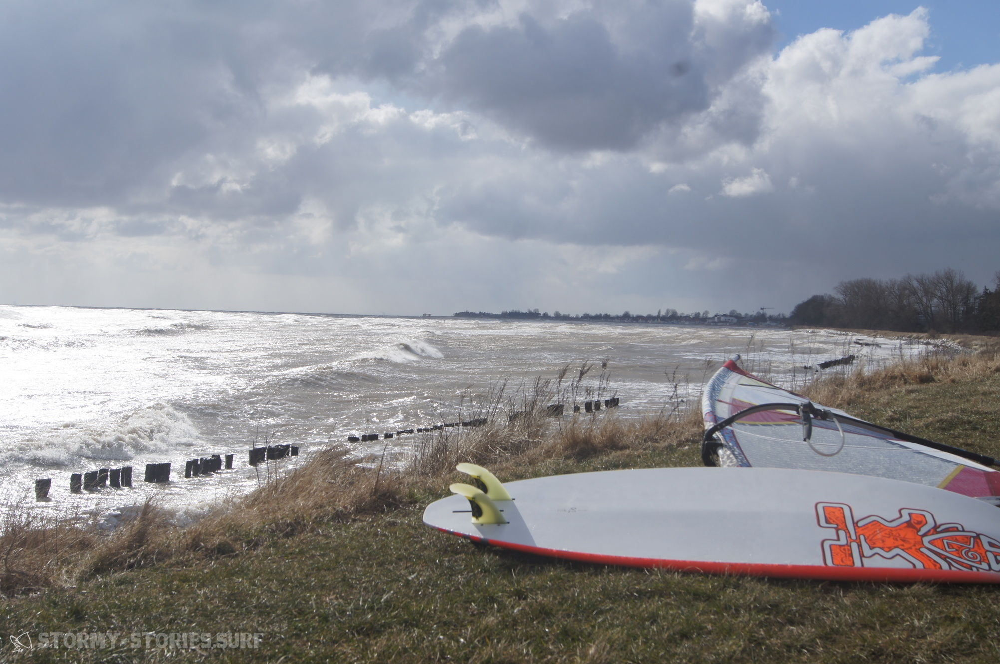
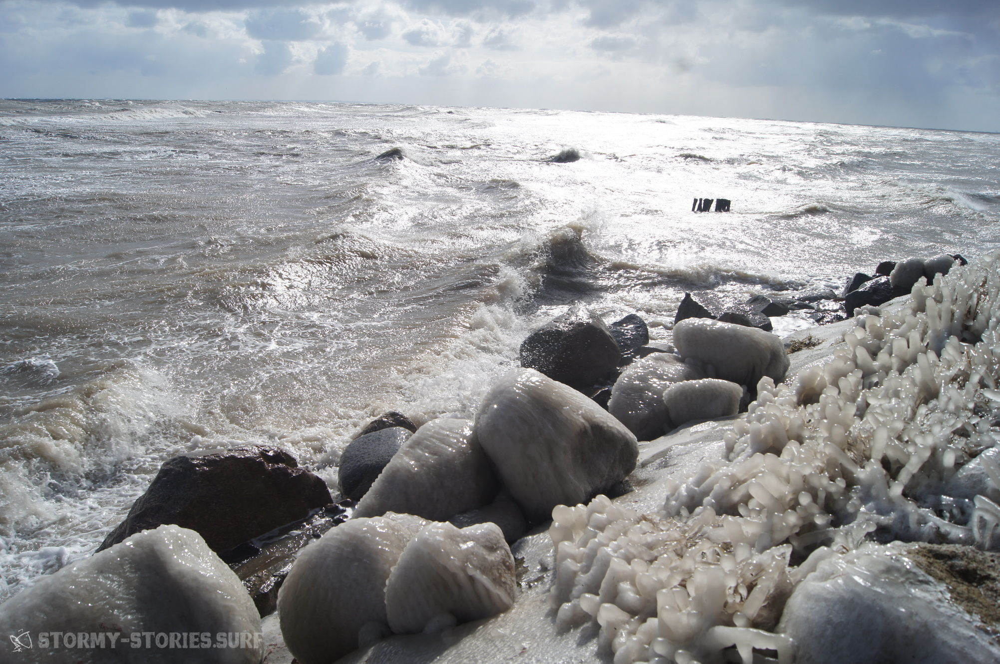
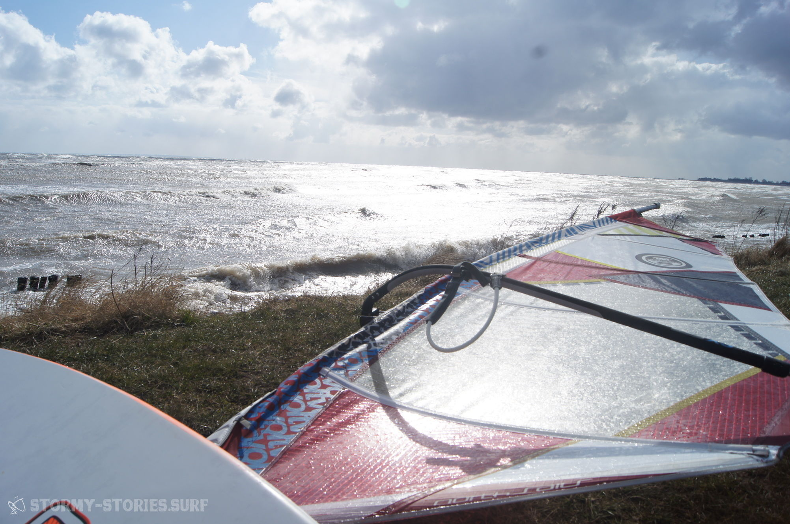
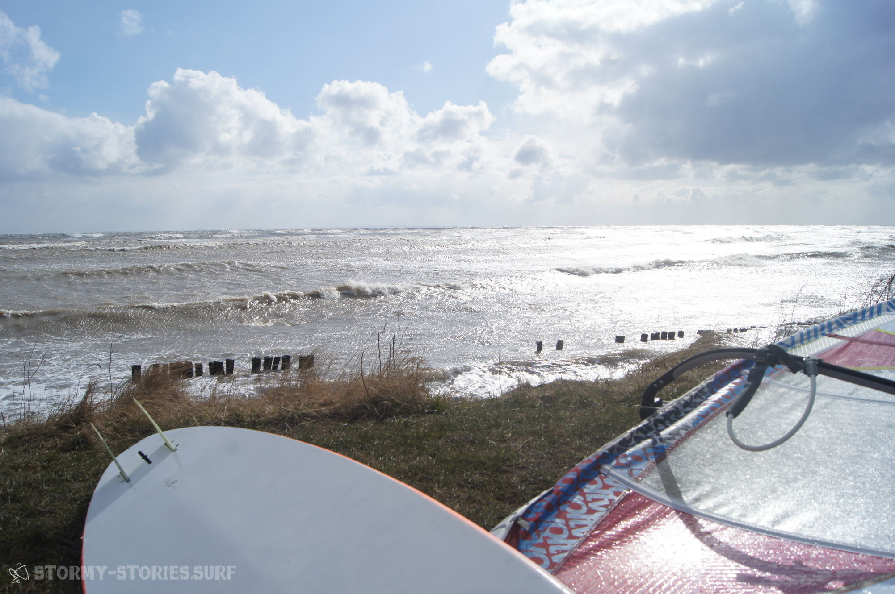
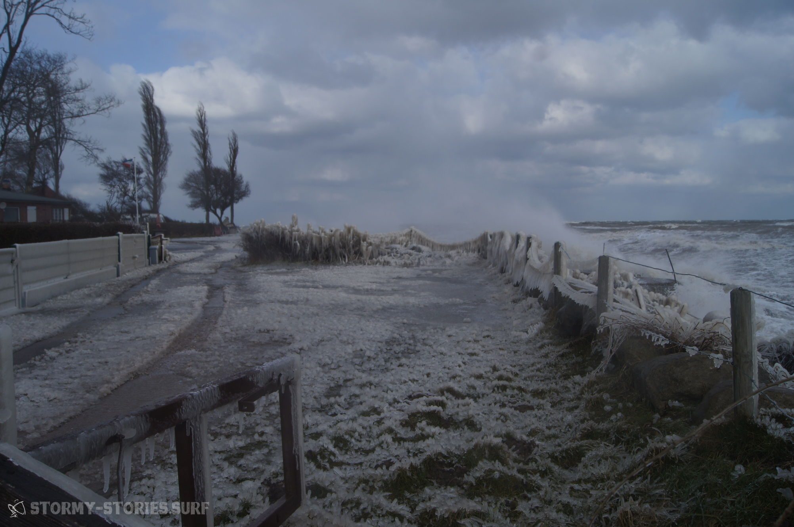
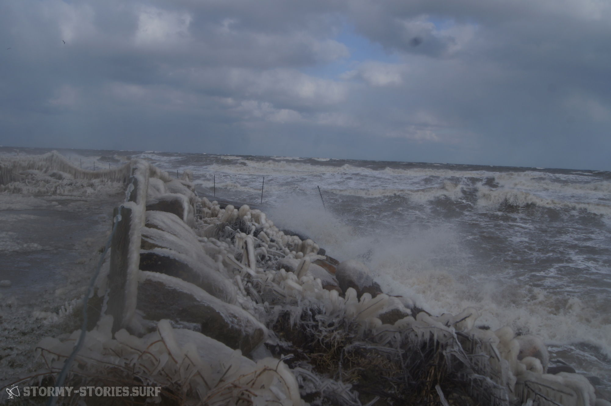
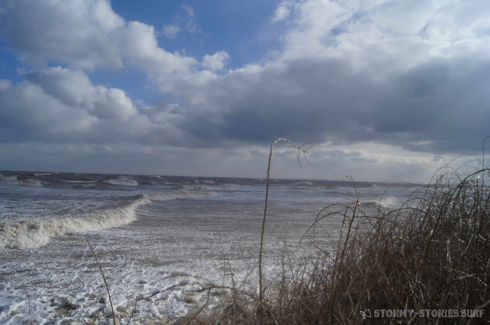
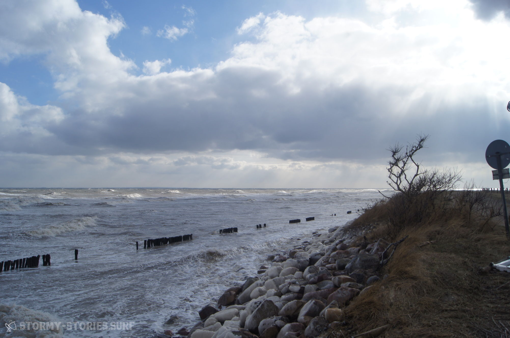

# Dahmeshöved

35 knots are 35 knots...
There is no way around that...
35 Knoten sind 35 Knoten…  
Da kann man wohl nix dran rütteln..

And as this does not happen very often in "beautiful" Germany, and if it does happen it usually never happens on the weekend, there was not even a lazy dog which had something against the very low temperatures. After the forecast turned out 

Da das hier im schönen Deutschland nicht so besonders oft vorkommt, und wenn dann in der Regel nie am Wochenende, gab es diesmal tatsächlich nicht einmal einen inneren Schweinehund der etwas an den Temperaturen auszusetzen hatte.. Als die Vorhersage dann tatsächlich auch noch die ganze Woche durchhielt und sich immer noch keine inneren Gegenstimmen breit gemacht hatten wurde das Auto mit dem kleinen Winter-Gepäck beladen..

Nun blieb nur noch die Frage nach dem Ort des Geschehens.. Irgendwie war das bei Ost-NordOst garnicht mal so einfach. Ganz ursprünglich kam mal kurz Kegnaes in den Sinn, dann Kellenhusen, Dänisch-Nienhof und schlussendlich wurde es dann Dahmeshöved.  
Die Entscheidung war meiner Meinung nach eine Gute, kleine erstaunlich saubere und lange Wellen „rollten“ hier in die relativ sichere Bucht. Das Ganze beleuchtet durch eine wirklich geile Wintersonne, die nur ganz selten mal durch 5-minütige Schneestürmchen unterbrochen wurden.
Weiter draußen gab es sogar richtige Brecher, die sich vor der Nordsee wohl nicht fürchten bräuchten und die 2 Meter Marke wohl ohne irgendwelche Probleme geknackt haben..

Hier ging es dann zu dritt aufs Wasser. 3.7 und 90 Liter war alles in allem eine super Wahl. Relativ sicher, sehr sehr gut angepowert und nur hin und wieder zu groß. Selbst die Temperaturen waren tatsächlich auch garnicht mal so schlimm wie erwartet.. Nur scheinen die menschlichen Finger für solche Aktionen leider irgendwie garnicht wirklich konzipiert worden zu sein.. Irgendwie einfach schlecht designed – viel zu wenig durchblutet, bei viel zu wichtigem Funktionsumfang.. 😛

Alles in allem also ein echt geiler Tag, dank dem ich endlich die ersten richtigen Sprünge auf das 2018er Konto buchen kann.

Danke auch noch mal an die beiden Mitstreiter, die obwohl sie schon lange abfahrbereit waren noch so lange auf mich gewartet haben, bis ich mit meiner letzten Runde fertig war! Das war echt cool.. Da fühlt man sich gleich viel sicherer!!

