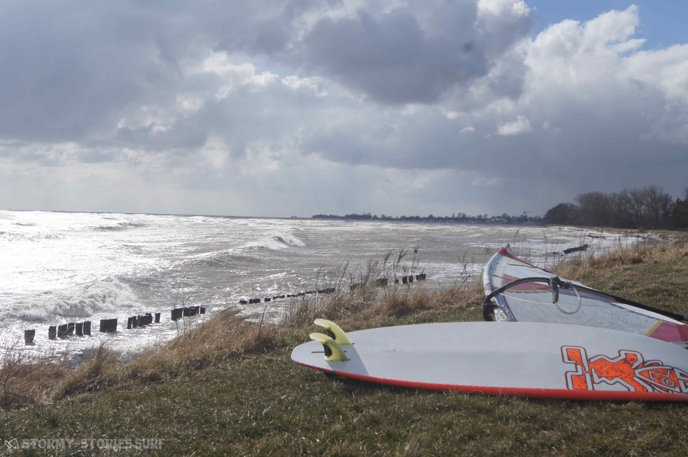
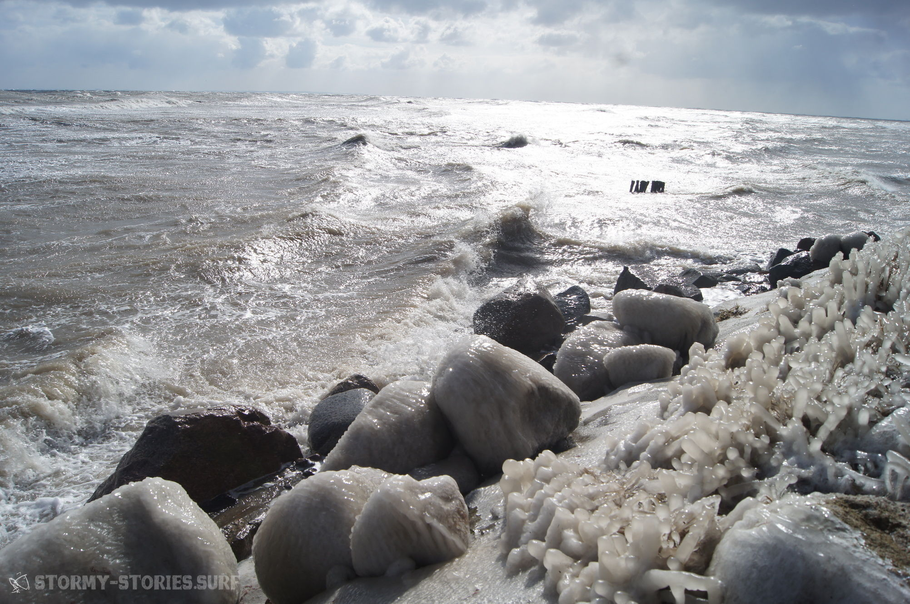
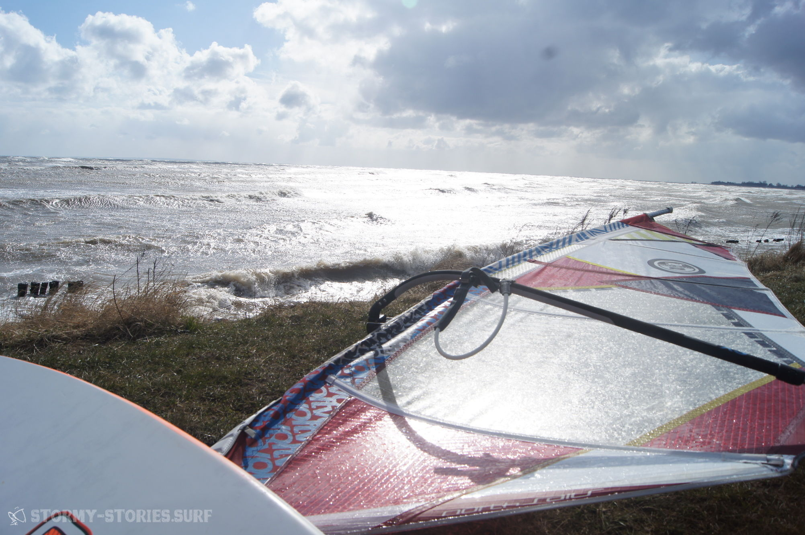
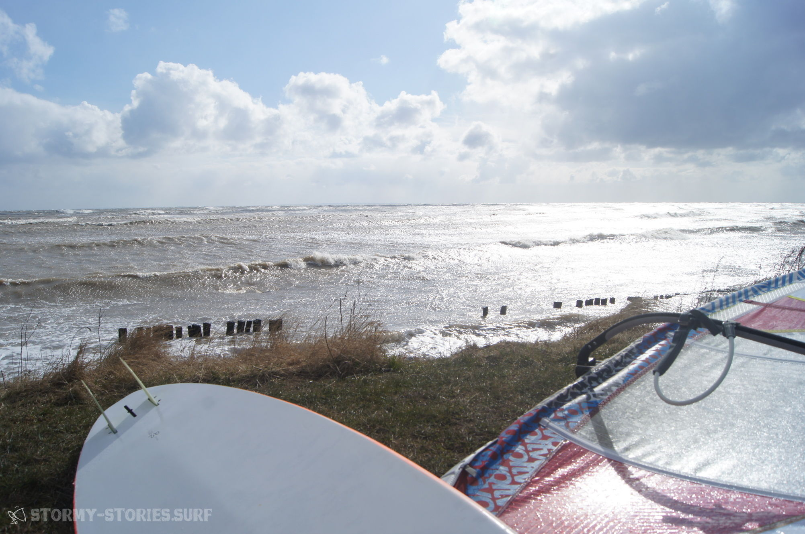
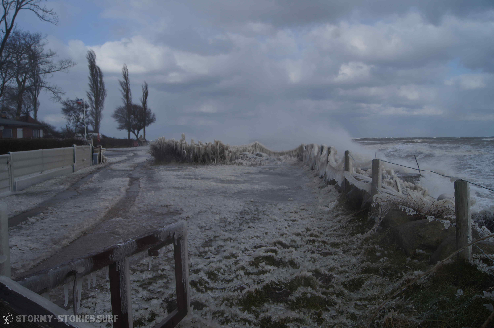
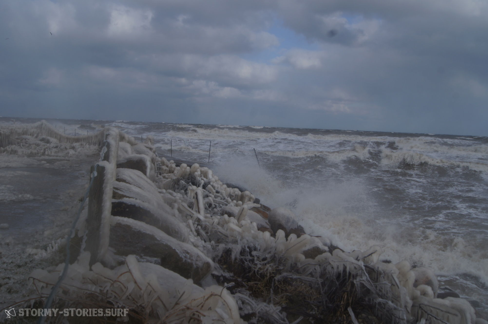
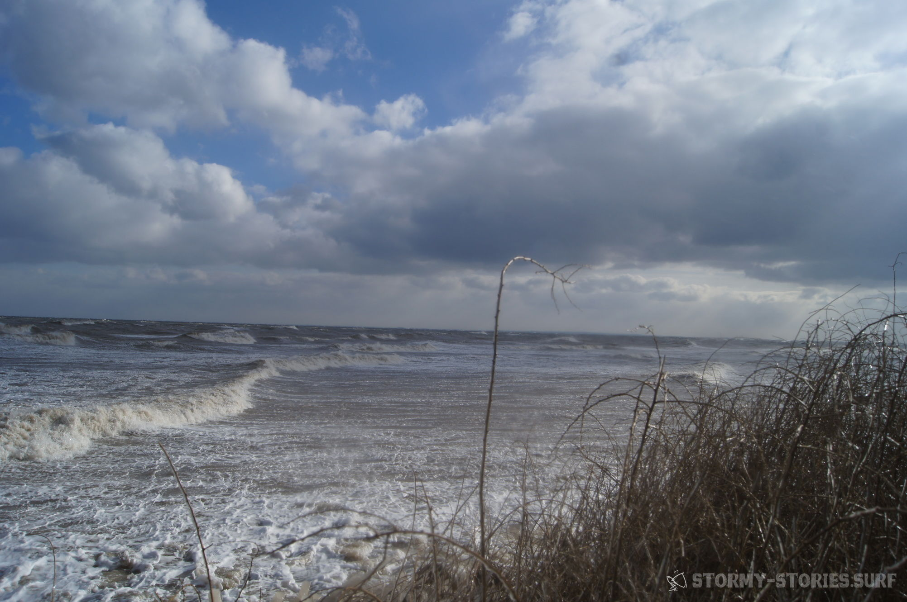
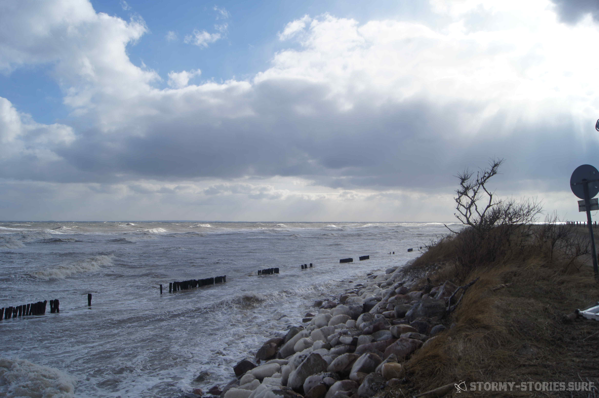

# Winter-Surf : Dahmeshöved

35 knots are 35 knots...  
There's nothing you can do about it...

As this doesn't happen very often here in beautiful Germany, and when it does it's usually never at the weekend, this time there wasn't even a single inner bastard to complain about the temperatures. When the forecast actually held out for the whole week and there were still no inner dissenting voices, the car was loaded with the small winter luggage ...

Now all that remained was the question of the location of the event. Somehow it wasn't that easy with a east-north-east wind. Originally Kegnaes came to mind, then Kellenhusen, Dänisch-Nienhof and finally it was Dahmeshöved.  
The decision was a good one in my opinion, small, surprisingly clean and long waves "rolled" into the relatively safe bay here. The whole thing was lit up by a really great winter sun, which was only very rarely interrupted by 5-minute snowstorms.
Further out, there were even some real breakers that probably didn't need to be afraid of the North Sea and probably broke the 2 meter mark without any problems.

The three of us then took to the water. 3.7 and 90 liters was a great choice all in all. Relatively safe, very well powered on and only occasionally too big. Even the temperatures were actually not as bad as expected. Unfortunately, the human fingers don't really seem to have been designed for this kind of action. Somehow simply badly designed - far too little blood supply, with far too important a range of functions... 😛

All in all, a really great day, thanks to which I can finally book the first real jumps on my 2018 account.

Thanks again to the two fellow competitors who, although they had been ready to leave for a long time, waited for me until I had finished my last laps! That was really cool. Makes you feel much safer!!

