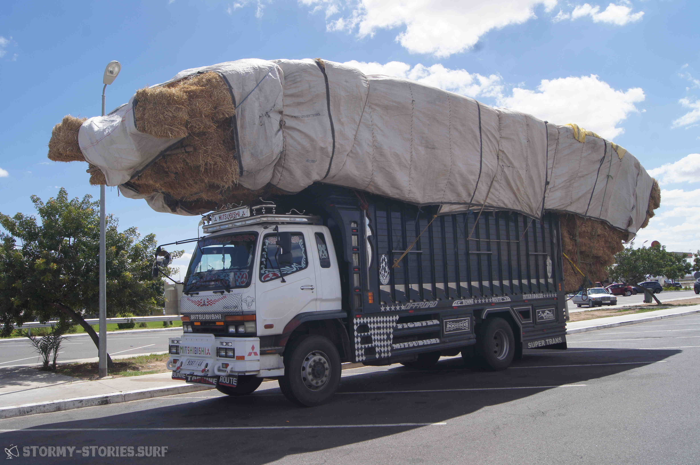

# Marokko 2019 : Marrakesch - Taghazout

# Marocco

Marokko, was war das mit uns? Iwie doch alles nicht so eindeutig.
Fast als hätte man alle Urlaubs-Gefühle in einen großen Mixer geschmissen.
Einiges hatte ich mir mit dir etwas anders vorgestellt. Auch wenn ich nicht genau sagen kann wie genau..
Andere Seiten von dir wiederum hätte ich mir schöner garnicht vorstellen können.
So hinterlässt du mich hier mit ganz schön gemischten Gefühlen und wenn mich jemand fragt, wie
unsere gemeinsame Zeit denn so gewesen ist, dann weiß ich auch garnicht so recht, was ich sagen soll.

Aber um das mit uns vielleicht ein bisschen besser zu verstehen, fangen wir vielleicht mal am Anfang unserer Geschichte an.
Wie kam es überhaupt dazu, dass wir uns kennen gelernt haben?
Schon vor einiger Zeit hatte ich von dir das erste Mal gehört.
Damals an einem Strand ganz im Norden der Ostsee-Insel Fehmarn, erzählten mir zwei junge Männer von dir
und die Begeisterung war in Ihren Augen zu sehen. Damals, ich weiß es noch wie heute, nachdem
ich mich stundelang versucht hatte, mich mit meinem Freeride-Board durch den Shorebreak von Altenteil zu kämpfen,
erzählten sie mir davon wie sie das gleiche tagelang im marokkanischen Riesen-Shorebreak durchgemacht hatten.
Sie sprachen von der Spontanität ihres Trips, zu dem sie sich wenige Tage vor Beginn erst entschieden hatten.
Sie wurden mit einem bis oben voll geladenen Ford Galaxy Taxi für einen spott-Preis von Marrakesch nach Moulay Bouzerktoun gekarrt. In Moulay, das ca. 30 Minuten nördlich von Essaouira liegt und sämtliche Infrastruktur seinem Windsurf-Tourismus verdankt, hatten sie mit Mühe und Not noch eine Unterkunft gefunden
und widmeten sich nun die nächsten Tage der einen großen Hauptaufgabe : das Durchbrechen des Shorebreaks.
Man erzählte mir von dem vollkommen wahnsinnig windsurfenden Local und Windsurf-Pro Boujmaa Gouillol, der dort
alles andere in seinen Schatten stellt.
Damals, das weiß ich noch, hat mich diese Geschichte ziemlich angefixt.

Immer mal wieder in den letzten Jahren tauchten dann Videos im Netz auf, wie die Moulay Locals Down-The-Line gigantische super cleanen Wellenberge entlang schossen. Mit diesen Bildern im Kopf fiel es mir vor etwa anderhalb Jahren
relativ schwer die zwischenzeitlichen Reisepläne zum zeitgleichen Worldcup nach Marokko abzulehnen. In diesem Jahr sollte es für mich stattdessen nach Pozo Izquirdo gehen, da war ich mir sicher. Als dann die Videos und Bilder des Worldcups um die Welt gingen, war ich von meiner Entscheidung nicht mehr ganz so überzeugt. Haushohe Wellen ließen den Worldcup zwischenzeitlichen pausieren, da an Windsurfen für große Teile der Windsurf-Welt-Elite nicht mehr zu denken war.
Boujmaa, der Local-Hero und Organisator des Worldcups jedoch zeigte dann der ganzen Welt einmal mehr, was Menschen möglich ist, und verschob die Grenzen des Möglichen, zumindest meiner Meinung nach, in andere Sphären.

Die Reiseplanung für dieses Jahr schwankte dann lange Zeit hin und her.
Seit Jahren liebäugle ich mit Sardinien, dann warf sich mit einem mal Albanien in die Diskussions-Runde und wurde dann schlussendlich aber von Marokko aus dem Rennen gedrängt. Jedes Land hat seinen ganz eigenen Charme.
Aber Marokko, bei dem es sich anbot in der Top-Reisezeit über die Osterfeiertage mit gerade mal 9 Tagen Urlaub insgesamt 17 Tage unterwegs zu sein, gewann schlussendlich unser Herz.
Irgendwie reizte uns die Mischung aus einer anderen Kultur, traumhaften Surf und Windsurf-Bedingungen und das Ganze gemischt mit der Möglichkeit Wüste, Gebirge und Meer so nah bei einander zu haben.
Außerdem gab es günstige Direktflüge von Nürnberg nach Marrakesch und eventuell die Möglichkeit auch an etwas abgelegeneren Orten eventuell noch mit Französisch zurecht zu kommen, wenn Englisch nicht ausreichen sollte.

Bald waren unsere Flüge gebucht. Es sollte für TODO Euro mit Ryanair innerhalb von TODO Stunden von Nürnberg nach Marrakesch gehen. Nicht super-billig, aber für die Feiertage absolut okay. Da wir am Tag des Fluges erst Nachts in Marrakesch ankommen sollten, planten wir zwei Übernachtungen in einer gemütlichen Riad direkt in der Stadt. Von hier aus sollte es dann am zweiten Tag wieder zum Flughafen gehen um unseren Mietwagen abzuholen. Nachdem wir unseren Verwandten und Freunden von unseren Urlaubs-Plänen erzählten, hatten wir relativ bald noch eine weitere Mitreisende. Die Schwester meiner Freundin, wollte für die ersten zehn Tage zu uns stoßen und so wurde unsere Unterkunft auf ein drei Personen Zimmer upgegraded.

Ab jetzt lief der Countdown, wie würde das Blind-Date ablaufen? Viel wussten wir nicht über dich Marokko.
Während Tanja versuchte so viel wie möglich über dich herauszufinden, hatte ich ein bisschen das
Gefühl, dass ich es am liebsten einfach ein bisschen auf mich zukommen lassen wollte.
Da jedoch auch ich das Gefühl nicht los wurde, dass ein bisschen Vorbereitung nicht schaden könnte,
wühlten wir uns ein bisschen durch typische Reise-Informationen. Die empfohlenen Impfungen
Hepatitis A, Hepatitis B und Typhus fanden ihren Weg in unsere Blutbahnen und der obligatorische Reise-Führer und die überlebenswichtige Straßenkarte wurden angeschafft.

Einigermaßen gut vorbereitet, kam es nun zu den etwas schwierigeren Fragen. Mietwagen groß oder klein? Mit Allrad und dann ab durch die Wüste oder lieber schön klein und günstig und dann entspannt auf befestigten Straßen die Küste entlang? Irgendwie hörte sich das alles ganz gut an. Aber von dieser Frage hing vor allem auch noch eine der schwierigsten Entscheidungen ab : Windsurf-Equipment mitnehmen oder vor Ort mieten? Aus eigener Erfahrung wissen wir mittlerweile, dass beides einen Urlaub ganz schön auf die Probe stellen kann.
Bei traumhaften Bedingungen ohne Material und ohne Surf-Verleih an einem traumhaften Strand zu stehen ist in etwa ziemlich genau so scheiße wie, wenn das Surf-Board wochenlang im zu kleinen Miet-Bulli das Bett und die Küchenzeile blockiert. Weitere Recherchen zeigten mir, dass man die Anzahl der Windsurf-Verleih-Stationen in Marokko ziemlich genau an einer Hand abzählen kann. Das klang für mich alles andere als verlockend. Auf der anderen Seite jedoch, befand sich mein 90-Liter Wave-Board aktuell auch eher in einem semi-einsatzbereiten Zustand und gerade die ersten zwei Nächte im Zentrum Marrakeschs ohne eigenes Auto und vermutlich ohne große Möglichkeiten das Equipment irgendwo sinnvoll zu lagern, sprachen eindeutig dagegen.
Wenige Tage vor der Abreise fiel die Entscheidung dann gegen das eigene Material. Es war "hart" aber es war vor allem auch eine Entscheidung für mehr Entspannung und gegen zu viel Stress. Wenn es sich anbieten sollte, sollte es eben aufs Wasser gehen und wenn nicht dann eben nicht. Entspannt einfach mal nichts zu machen ist im Grunde ja auch nicht all zu verkehrt. Hiermit fiel dann auch die Entscheidung für einen kleinen günstigeren Mietwagen. Nach ein paar Recherchen entschieden wir uns dann auch gegen Allrad.
Den zwei oder teilweise dreifachen Preis für etwas zu zahlen, von dem man nicht weiß ob man es wirklich braucht, passte uns nicht ganz so in den Kram. Das wiederum bedeutete allerdings auch, dass wir uns auch gegen einen Offroad-Trip durch die Wüste entschieden. Gegen die Wüste und für mehr Entspannung. Wenn die Wüste zu uns kommen wollte, dann würde sie das schon tun und dann würden wir sicherlich auch dafür eine Lösung finden.

------------------------------------------------------------

Wir schreiben den 17. April 2019. Gerade noch saßen wir auf der Arbeit, aber jetzt sitzen wir mit Sack und Pack in der wunderbaren Bus-Direkt-Verbindung von Erlangen zum Nürberger Flughafen.
Um 21 Uhr soll es dann los gehen und unsere drei Koffer und drei Rucksäcke sind auch schon total gespannt auf den Flug. Zum bersten gespannt könnte man fast sagen. Und leichte Gewichts-Probleme haben sich auch. Aber naja, was soll man sagen, es war keine leichte Aufgabe Kleidung und Bücher für zweieinhalb Wochen, Handtücher & co., Neopren-Anzüge, Trapez, Dachgepäck-Träger, Kamera-Ausrüstung inkl. großem Tele-Objektiv und Stativ und Laptop in zwei Handgepäck-Koffer, einen 20kg-Trolli und drei kleine Rucksäcke zu pressen, aber am Ende steht man dann doch immer relativ stolz davor.
Solange zumindest, bis es an der Sicherheits-Kontrolle wieder "Auspacken" heißt.

-------------------------------------------------------------

18. April 2019 kurz nach Mitternacht.
Seit gefühlten Stunden stehen wir an der Passkontrolle in Marrakesch. Hier scheint man auf besondere Sorgfalt des Kontrollierens jedes einzelnen Buchstabens im Reisepass wert zu legen. Also zumindest geht das manchen Grenz-Beamten so. Andere wiederum kompensieren ihre zu schnelle Arbeitsweise durch ausschweifende Telefon-Gespräche mit der Familie oder wem auch immer oder anderen interessanten Aufgaben wie das Abschreiben iwelcher scheinbar sinnlosen Zahlen aus dem eigenen Smartphone. Hin und wieder unterbricht sich mein Bearbeiter dann aber doch und widmet sich meinem, wie sein Blick mir sagt, extrem spannenden Visum.

---------------------------------------------------------------

Draußen vor dem Flughafen erwartet uns unser Taxi-Fahrer mit einem Namens-Schild. Er ist einer von ca. 150 Menschen mit einem Schild in der Hand. Aber wie immer in solchen Ländern sind alle vollkommen entspannt und wir finden ihn ohne Probleme. Die Fahrt durch die Medina von Marrakesch ist dann sehr interessant und abendteuerlich. Bis zu unserer Unterkunft war es aber im Grunde relativ einfach - eigentlich nur zwei mal Rechts abbiegen, dann abwechselnd vierhundert mal links-recht-links abbiegen und hin und wieder - am besten ohne einen Mofa-Fahrer zu überfahren - durch superenge Gassen und Torbögen die vermutlich ursprünglich eher für Esel und Pferde gedacht waren. Danach dann noch zwei mal links, das Auto parken und zufuß die letzten zwei-hundert Meter durch die ganz schmalen Gassen. Nach Übergabe von etwas Trinkgeld verabschiedeten wir uns von unserem Taxi-Fahrer und ließen weniger später erschöpft in unsere Betten fallen.

----------------------------------------------------

18. April 2019 - irgendwann nach dem Aufwachen, bzw. kurz vor Ende des Frühstücks.
Heute soll es in die Altstadt von Marrakesch gehen - ein typischer Städte-Trip-Tag.
Im ersten Stock unserer Unterkunft gibt es das Frühstück. Von hier aus kann man über ein Geländer nach unten in einen der zwei Innenhöfe und nach oben in den Himmel schauen. Das mit dem Himmel klappt heute allerdings nicht ganz so gut, da die Öffnung im Dach mit einer großen Plane abgedeckt ist, in deren Mitte sich ein Schlauch nach unten befindet. Wie wir später erfahren, wird hiermit das Regenwasser aufgefangen und da es in den nächsten Tagen vermutlich noch ein bisschen regnen wird schützt man so die Möbel unten im Innenhof.
Zum Frühstück gibt es Brot, Kuchen und Pfannkuchen-ähnliches relativ luftiges Gebäck, dazu Marmelade und Rührei und marrokanischen Minz-Tee. Alles in allem relativ lecker, nur leider nicht annähernd so sättigend wie das Irish-Breakfast das ich noch vor ein paar Wochen zum Frühstück genossen habe.
Von unserer Unterkunft geht es dann zufuß in Richtung Innenstadt.
Nach wenigen Minuten werden wir angesprochen und gefragt, wo es denn hin gehen soll. Wie wir bereits in unserem Reiseführer gelernt haben, eine beliebte Frage, die meist mit dem Wunsch einhergeht den Touristen gegen Geld an den Zielort zu führen. Da wir uns sicher sind, dass wir den Weg auch alleine finden versuchen wir schnell abzulehnen. Unsere neue Bekanntschaft allerdings ist hartnäckig und beteuert, dass er kein Geld von uns möchte und sowieso auf dem Weg in diese Richtung ist.
Insgesamt erscheint uns das zwar etwas komisch, aber schlussendlich folgen wir ihm und landen dann irgendwann in den Souks von Marrakesch und verabschieden uns ohne Bezahlung von ihm.
Die Souks ist ein Basar in Form eines großes Labyrinths aus vielen vielen schmalen Gassen. Hier drängen sich links und rechts an den Seiten kleine urige Geschäfte und in der Mitte hunderte Touristen, Verkäufer, Lieferanten mit Handkarren und hin und wieder slalom-fahrende Mofas aneinander.
Die Atmosphäre ist einfach beeindruckend. Hektisch, aber irgendwie beeindruckend. Wir bahnen uns den Weg durch die erste vor uns liegende Gasse. Die Geschäfte hier bieten viele bunte Gewürze, Steine, Schuhe und Kleider an. Alles sieht irgendwie ein bisschen anders aus als gewohnt. Wenige Sekunden später werden unsere erstaunten Gesichter vom nächsten Verkäufer auf der linken Seite erkannt und er ergreift die Chance um uns seine Waren zu präsentieren. In seinem Sortiment gibt es Gewürze und Tee aber auch jede Menge farbiger Steine und getrockneter Kräuter. Wie uns nun erklärt wird haben die Steine alle möglichen interessanten Fähigkeiten. Es gibt Steine, die als Lippenstift genutzt werden, andere können auf der Haut verrieben werden und riechen wie Parfum, wiederum andere helfen Männern gegen das Schnarchen oder Frauen für eine weichere Haut, wenn man sie in Wasser auflöst und verreibt. Wir werden in einen Laden geführt und auf einen marrokanischen Minz-Tee eingeladen und in meinem Kopf sehe ich ein Film ablaufen der demonstriert wie man sich nicht verhalten soll, wenn man auf einem Basar kein Geld ausgeben möchte. Die Hauptdarsteller in diesem Film sind - wer hätte es gedacht - wir.
Nach dem der Tee, den wir eigentlich garnicht hatten trinken wollen in uns ist und die Körperpflege-Produkte und Parfums die wir uns normalerweise niemals angesehen hätten auf unserer Haut sind, beginnt mein Kopf sich zu fragen, wie wir aus dieser Nummer jetzt am besten wieder heraus kommen können. Mein schlechtes Gewissen gibt mir deutlich zu verstehen, dass man nun eigentlich zumindest irgendetwas kaufen müsste um zumindest den leckeren Tee und die "Beratungs-Zeit" wieder auszugleichen. Ein anderer Teil meines Kopfes, der vor einigen Monaten viele Entscheidungen über den Verkauf oder das Entsorgen vieler unnützer Dinge in meinem Leben getroffen hatte, meldet sich nun jedoch auch zu Wort und kündigt Widerstand an. Ich versuche zwischen den beiden ein bisschen zu vermitteln und schlage den Kauf von etwas Tee vor.
So etwas gibt es zumindest bei uns nicht zu kaufen, lecker scheint er auch zu sein und irgendwann wird dann ja schließlich auch wieder verbraucht.
Die anderen beiden scheinen Einverstanden zu sein und auch Tanja und ihre Schwester finden die Idee ganz gut.
Nach einigen Versuchen wird mir dann wieder mal klar, wie
