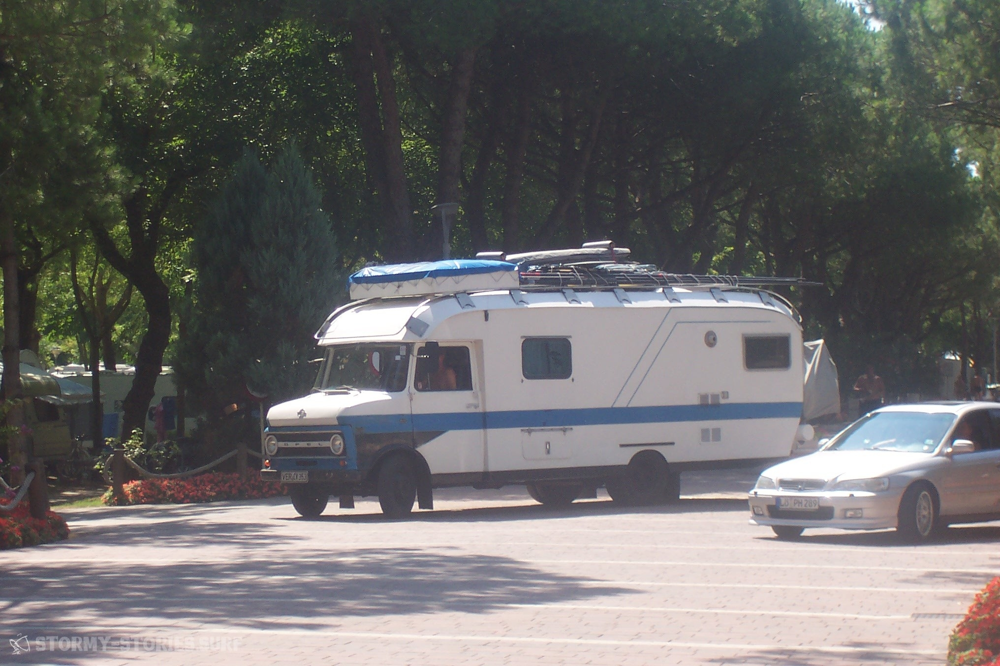

# Surf - & Reisemobile : Opel Blitz

Ich wache auf, ein sonores Brummen ist zu hören. Wir fahren also noch. Ich drehe mich verschlafen um und gucke nach Vorne in die Fahrerkabine. Es scheint schon relativ spät zu sein. Zumindest ist es das für meine Verhältnisse, denn normalerweise ist es zu dieser Uhrzeit schon lange für mich an der Zeit zu schlafen. Aber jetzt wo wir unterwegs sind und es in den Urlaub geht, wird das nicht ganz so eng gesehen. Im Urlaub ist halt alles immer ein bisschen anders. Jeder hat Zeit, jeder ist gut gelaunt - zumindest meistens - und man kann den ganzen Tag das machen wozu man Lust hat.
Ich drehe mich in die andere Richtung, sehe meinen Bruder der ebenfalls zu schlafen scheint und ziehe die Gardine vor meinem Fenster zur Seite. Draußen ist nicht viel zu erkennen. Die Autobahn ist nachts schön leer und das im Hintergrund könnten schon die ersten Berge sein.
An ihnen geht es jedes Jahr vorbei, bzw. über sie hinüber und durch sie hindurch. Über hunderte Kilometer erst einmal quer durch Deutschland, dann ins immer bergiger werdene Österreich und von dort in das ebenso gebirgige Italien, dass dann Stunde für Stunde immer flacher ausläuft und zunehmend wärmer, mediterraner und "italienischer" wird.

An diese Reisen erinnere ich mich noch gut. Jedes Jahr ging es mit unserem Wohnmobil im Sommer nach Italien ans Meer in die nähe von Venedig. Das erste Mal als ich dort war, war ich noch im Bauch meiner Mutter und sollte das Licht der Welt erst in einem knappen halben Jahr erblicken. Danach ging es dann weitere zwanzig Jahre jedes Jahr dort hin zurück. Jedes Jahr mit unserem treuen Begleiter dem 7 (TODO) Meter langem Opel Blitz.
Die Reise dorthin dauerte mit unserem doch eher geringen Reise-Tempo von etwa 100 Kilometern in der Stunde ca. 2 volle Tage. Doch genau das ist das, an das mich am liebsten zurück erinnere. Zwei Tage lang entpanntes Reisen in unserem Blitzi. Gemütlich brummend krabbelte er mit uns vieren die Landkarte entlang. Wie lange es genau dauerte war für uns Kinder dabei nicht so entscheidend. Wir schliefen, spielten, lasen, höhrten Musik und blickten immer mal wieder nach draußen, wo sich die Welt langsam veränderte. In der Zeit der langen Reise hatten wir einfach Zeit. Das sonore Brummen, dass gerade bergauf und in den Kurven deutlich hörbar und sicherlich deutlich lauter war als in modernen Wohnmobilen, hat uns dabei eigentlich nie gestört. Mich persönlich hat es glaube ich sogar eher beruhigt und in den Schlaf geschaukelt - war ich doch seit klein auf damit aufgewachsen. Hinten im Bauch unseres Blitzis fühlte man sich sicher und geborgen und gelegentlich schwang auch immer ein bisschen Abenteuer mit.

Unser Blitzi war etwas besonderes - und seine Geschicht beginnt im März 1972 auf dieser Erde.
Erbaut von dem deutschen Auto-Bauer der Adam Opel AG, wurde er - soweit wir wissen - von einer schweitzer Firma, die sich auf solcherlei Umbauten spezialisiert hatte, auf 3.5 Tonnen abgelastet und zu einem Wohnmobil umgebaut. Dieser Umbau wurde vermutlich in Kleinserie an mehreren solcher Opel Blitze durchgeführt. Zumindest wurde uns über Gerüchte zugetragen, dass ein sehr ähnliches Fahrzeug einmal in einer Stadt gesichtet worden sei. Der Wohnmobil-Aufbau, wurde aus einem sehr stabilen GFK-Sandwich gebaut, so dass das Auto auch bis ins Hohe Alter vollständig Frei von Wasser-Einbrüchen und auf dem Dach immernoch für mehrere Menschen begehbar war. Der GFK Koffer wurde an die Fahrerkabine anlaminiert und ein Durchgang mit Schiebetür zwischen Aufbau und Fahrerkabine geschaffen. Hinter der Fahrerkabine konnten zwei 90 Grad zur Fahrrichtung gedrehte Sitzbänke zu einem großen Bett für zwei bis vier Personen umgebaut werden. Von dort aus führte ein Gang, gesäumt von zwei großen Schränken links und rechts in den hinteren Bereich des Fahrzeugs  der nun auf jeder Seite jeweils einen großen Schrank 
