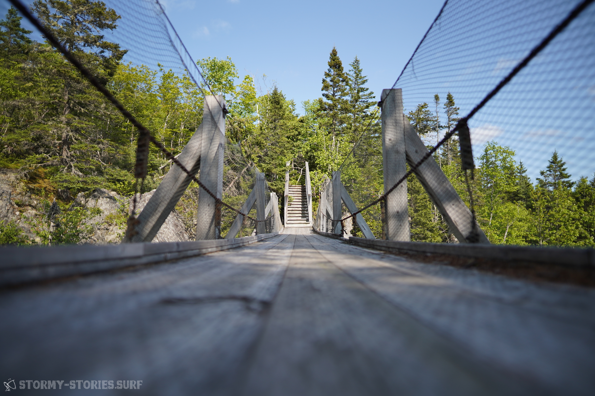

# Kanada 2023 : Es geht los!

*Wanderweg Liscomb Mills Trail (Sony A7 III + Sigma 20mm DG HSM f1.4; 1/160s bei f4.5; ISO 100)*

"Wer von seinem Tage nicht zwei Drittel für sich hat, ist ein Sklave"

\----

das zumindest schrieb Friedrich Nietzsche 1878 in seinem Buch "Menschliches, Allzumenschliches - Ein Buch für freie Geister" über die "Hauptmangel der tätigen Menschen".

Das Buch habe ich zwar - natürlich - nie gelesen, denn so viel Langeweile habe ich dann doch wieder nicht, aber dieser kurze Ausschnitt gefällt mir besonders gut und geistert mir nun seit über 10 Jahren immer mal wieder durch den Kopf. Damals war mir das Zitat in einer Studentenzeitschrift über den Weg gelaufen und ich hatte es, weil ich es zur gleichen Zeit erschreckend, weltfremd, witzig und inspirierend fand, ausgeschnitten und auf meinen Schreibtisch gelegt. Schon ein paar Jahre zuvor, hatte ich jemanden getroffen die nach der Schule günstig durch Europa reiste und dabei hier und da Freunde in ihrem Urlaub besuchte.

Etwas an dieser Idee begeisterte und inspirierte mich. Klar, für meinen Geschmack fehlte in so einer Reise auf jeden Fall noch das Windsurfen, aber wenn man diese Zutat dazugab klang es für mich wie ein Traum : Eine Zeit lang von Strand zu Strand fahren, die besten Surfspots Europas surfen und einfach mal Zeit haben.

*Peggys Cove (Sony A7 III + Tamron 28-75mm f/2.8 Di III VXD G2; 1/320s bei f8 und 28mm; ISO 100)*

Seit diesem Zeitpunkt hat sich diese Idee in meinem Kopf festgesetzt und immer weiterentwickelt und auch der Input von dem guten Friedrich, hat sicherlich seinen Teil dazu beigetragen.
Mit den Jahren kamen dann Studium, Job und das normale Leben dazwischen und die Idee rückte als Traum eher in den Hintergrund.

*Flug Frankfurt -> Halifax (Fairphone 3, interne Kamera; 1/30s bei f2 und 28mm; ISO 224)*

Jetzt, fast 10 Jahre später hat sich so einiges verändert..
Ich sitze auf einer Bank mit Blick auf die ersten Ausläufer der Bay of Fundy in Nova Scotia (Neu Schottland) - Kanada. Es ist bewölkt, aber warm. Es weht ein leichter Wind, aber die Abendsonne hat sich ihren Weg wieder durch die Wolken gekämpft und beleuchtet alles in einem schönen Goldgelb. Es ist also doch nicht Europa geworden und irgendwie sieht das Auto mit dem ich unterwegs bin auch ganz anders aus, als ich es mir ganz zu Anfang einmal vorgestellt hatte. Außerdem bin ich auch nicht mehr alleine unterwegs. Genau genommen bin ich vielleicht sogar nur hier weil ich nicht alleine unterwegs bin. Irgendwann kam Tanja plötzlich mit in mein Leben und aus meinem Traum wurde über die Jahre unser Traum. Auch sie wollte schon immer so viel von der Welt sehen und mal eine Zeit lang im Ausland verbringen. Für sie war aber auch immer klar, dass es für so eine Reise schon etwas weiter weg gehen müsste als "nur" durch Europa. Denn schließlich erfordert so eine Reise ja auch ein paar Opfer, wie beispielsweise den sicheren gut bezahlten Job und die schöne Wohnung in der man sich doch eigentlich so wohlgefühlt hat. So wuchs unsere Reise weit über meinen ursprünglichen Traum hinaus. Alles wurde etwas konkreter, aber natürlich auch teurer und unfangreicher. Für mich war klar, das zukünftige fahrbare Domizil brauchte jetzt vermutlich ein wenig mehr Platz um sowohl alle meine Surfboards, als auch den nötigen Komfort - den man seiner Partnerin gerne bieten will - zu ermöglichen. Für Tanja war hingegen klar, dass es für so eine Reise auch eine entsprechende Planung brauchte. So wurden Budgets abgesteckt und ein Plan entworfen wie man das Ganze finanziell auf die Beine stellen könnte.

*Peggys Cove (Sony A7 III + Tamron 28-75mm f/2.8 Di III VXD G2; 1/400s bei f8 und 28mm; ISO 100)*

Naja und jetzt sind wir also hier - in Kanada. Irgendwie fühlt es sich so normal und doch so unwirklich an. Über die letzten Jahre, hatten wir so einige Hoch - und Tiefpunkte. Immer mal wieder rückte die Reise näher und dann doch wieder weiter weg, fühlte sich immer mal wieder zum Greifen Nahe und dann wieder unerreichbar an.

In der nächsten Zeit wird es vom maritimen Osten Atlantik-Kanadas durch die Prärie in Richtung pazifischer Westküste gehen und von dort dann immer Richtung Süden, ab durch die USA, Mexico, Mittelamerika und dann wohl irgendwie weiter nach Südamerika.

*Halifax Waterfront (Sony A7 III + Sigma 20mm DG HSM f1.4; 1/250s bei f5.6; ISO 100)*

Naja so oder so ähnlich. Sowas erzähle ich zumindest immer interessierten Kanadiern, die sich über unser auffälliges Kennzeichen wundern.

"Wie lange wir noch hier in der Gegend sind?" - Gute Frage! Vielleicht noch ein paar Tage, vielleicht ein paar Wochen. Mal sehen wo es uns so hintreibt.

"Wo wir dann als nächstes Hinfahren?" - Eine sehr gute Frage! Vielleicht hier hin oder da hin, oder doch ganz in die andere Richtung.

*Cape Breton / Cabot Trail (Sony DSC-RX100 III; 1/2000s bei f3.2 und 8.8mm; ISO 125)*

Und so ist es dann meistens auch. Plant man morgens noch in die eine Richtung weiter zu fahren, bekommt man dann Mittags schon einen guten Tipp und bleibt dann doch noch ein paar Tage in der Gegend. Will man eigentlich erst mal ein paar Tage für sich sein, findet man sich dann doch mit einem mal auf dem Grundstück von neuen Freunden wieder und genießt dann doch den Abend in Gesellschaft. Plant man den nächsten regnerischen Tag mal in Ruhe Pancakes zu machen, scheint dann doch plötzlich wieder die Sonne.

*Stellplatz-Suche bei Canso (Sony DSC-RX100 III; 1/2000s bei f1.8 und 8.8mm; ISO 400)*

Umso genauer man plant - umso mehr trifft einen der Zufall.

Also lassen wir uns einfach treiben und schauen wo wir am Ende so herauskommen..
Und so bekommt man von Tag zu Tag mehr ein Gefühl dafür, was es bedeutet Zeit zu haben.

Nietzsche wäre vermutlich stolz auf uns. Haben wir doch rein theoretisch aktuell drei von drei Drittel unserer Zeit für uns.

Zugegeben, danach fühlt es sich aktuell noch nicht wirklich an - verbringen wir doch immer noch jede Menge Zeit damit uns in den Supermärkten zurechtzufinden, Stellplätze zu suchen und den Verlust unserer Geschirrspülmaschine mental zu verarbeiten. Aber irgendwie merkt man dann doch schon einen kleinen Unterschied. Die Zeit vergeht einfach irgendwie anders. Mal sehen wie es sich in Zukunft entwickelt :D Auch das lassen wir einfach mal auf uns zukommen.

*Cape Breton / Cabot Trail (Sony A7 III + Tamron 28-75mm f/2.8 Di III VXD G2; 1/1250s bei f2.8 und 28mm; ISO 100)*

Da du das hier jetzt liest, interessiert dich vielleicht wie es uns auf unserer Reise so geht und was wir so treiben. Und da bist du hier schon mal sehr richtig. Sehr wahrscheinlich werden wir hier hin und wieder immer mal wieder ein paar Bilder und ein paar Geschichten veröffentlichen - immer dann wenn uns gerade mal danach ist und wir Lust darauf haben.

Parallel dazu wird es wahrscheinlich noch die Möglichkeit geben auf einer Karte mitzuverfolgen wo wir uns gerade befinden und ein paar Bilder von den jeweiligen Orten anzuschauen.
Wer hieran interessiert ist, kann sich gerne bei unserem E-Mail Newsletter anmelden und bekommt dann weitere Informationen sobald es hier etwas konkreteres gibt.

*Wanderweg Liscomb Mills Trail (Sony A7 III + Sigma 20mm DG HSM f1.4; 1/320s bei f6.3; ISO 100)*

Da unser Plan ist, einfach mal eine Zeit lang nur das zu machen worauf wir wirklich Lust haben, wird es wohl auch immer nur dann etwas Neues von uns geben, wenn wir Lust haben etwas zu schreiben.

Wir freuen uns schon darauf, euch immer mal wieder ein paar Bilder und Geschichten nach Hause schicken zu können. Wer weiß vlt. hören wir dann ja auch mal das ein oder andere von euch. Oder der ein oder andere bekommt Lust uns hier mal vor Ort zu besuchen oder eine ähnliche Reise zu starten.

Es wäre uns auf jeden Fall eine Freude :)

*Wanderweg Liscomb Mills Trail (Sony A7 III + Sigma 20mm DG HSM f1.4; 1/5000s bei f1.4; ISO 100)*
