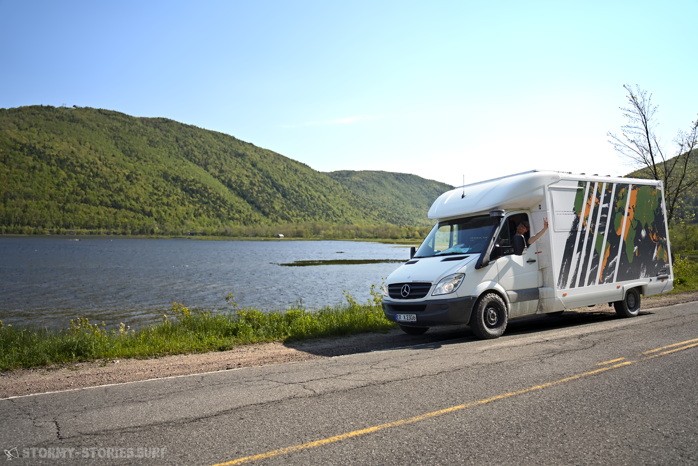
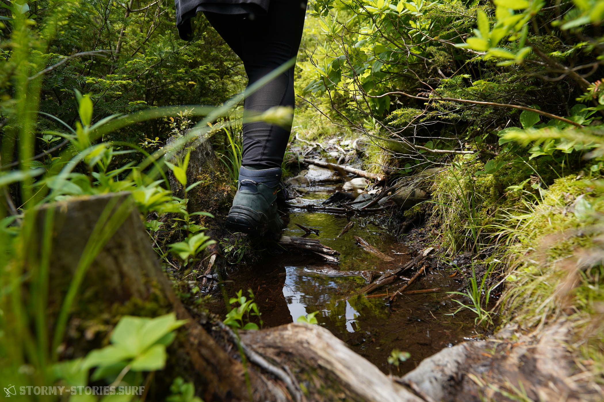
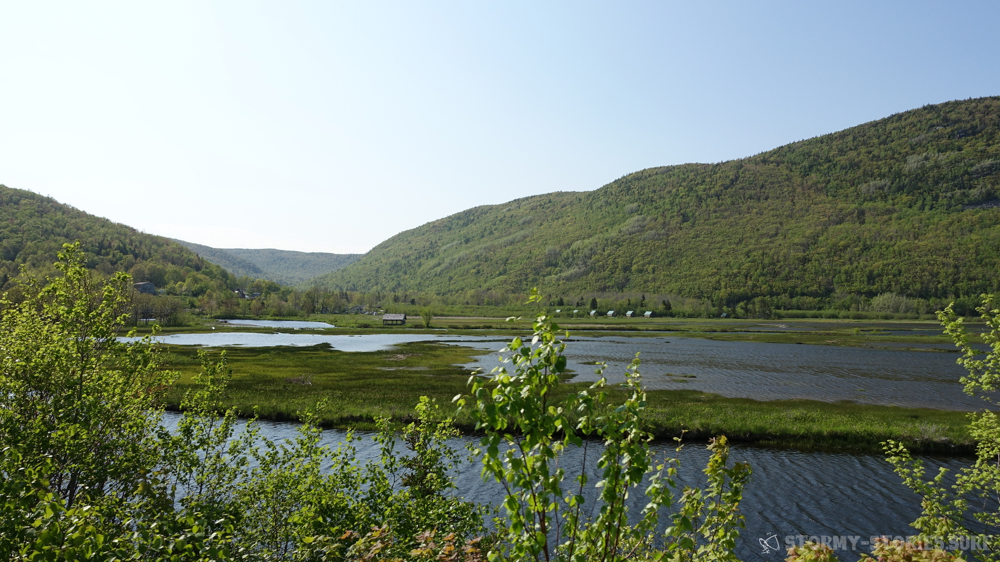

# Kanada 2023 : It's getting started!

"Whoever does not have two-thirds of his day for himself, is a slave"

\----

this at least is what Friedrich Nietzsche wrote in his book "Human, All Too Human - A Book for Free Spirits" about the "Main deficiency of active people" in 1878. I've never read the book - of course - because I'm not that bored after all, but I particularly like this short excerpt and it's been buzzing in my head for more than 10 years now. I came across this quote, as I was reading a student magazine. I was cutting it out of the magazine and putting it on top of my desk as I found it at the same time frightening, unworldly, funny and inspiring. Already a few years before, I met someone who was after finishing school traveling cheaply through Europe, meeting friends here and there in their vacation. Something about this idea excited and inspired me. Sure, for my taste windsurfing was definitely missing in such a trip, but when you would add this ingredient it would sound like a dream to me: driving from beach to beach for a while, surfing the best surf spots in Europe and just having time .

Since then, this idea has stuck in my head somehow and has continued to developed itself and also the good Friedrich has certainly played his role in this story.
Over the years university, the job and also normal life came in the way and the idea took a back seat as a dream.

Now, alsmost ten years later many things have changed.
I am sitting on a bench, having a nice view over the first reaches of the Bay of Fundy in Nova Scotia - Canada. It is cloudy, but warm. I can feel a light wind, but the evening sun has fought its way back through the clouds again and illuminates everything in a beautiful golden yellow.

So it didn't turn out to be Europe in the end and somehow the car I'm driving also looks completely different than I had imagined at the very beginning. Also, I am not on my own. In fact, maybe I am only here because I am not not on my own. At some point Tanja suddenly was part of my live and my dream became our dream over the years. She also always wanted to see so much of the world and wanted to spend some time abroad. But for her it was also always clear that such a trip would have to go a little further away than "just" through Europe, because in the end such a trip requires also some sacrifices, such as leaving your secure, well-paid job and your nice rental flat in which you always felt so at home. So our journey grew far beyond my original dream. Everything became a little bit more concrete, but of course also bigger and more expensive. For me it was clear that our future domicile-on-wheels would need a little more space to still fit inside all my surfboards as well as the necessary comfort - which one would like to offer one's partner. For Tanja on the other side it was clear that such a trip needed some appropriate planning. So budgets were defined and a plan was drawn up on how to get the whole thing off the ground financially.

Well and now we are here - in Canada. Somehow it all feels so normal and yet still so unreal. Over the years we've had a few highs and lows. Every now and then the trip seemed to come closer and closer, just to feel so far away suddenly again. It sometimes nearly felt like on the tip of our fingers and then again nearly unreachable.

In the near future we will go from the maritime east of Atlantic Canada through the Prairies towards the Pacific west-coast and from that point always south, across USA, Mexico, Central-America and well then somehow down to South America.

Alright, something like that. At least that's what I always tell interested Canadians who wonder about our strange license plate.

"How long will we be around here?" - Good question! Maybe a few more days, maybe a few weeks. Let's see where it takes us.

"Where do we go next then?" - A very good question! Maybe this way or that, or maybe in the complete opposite direction.

And thats also how it is most of the days. If you plan to go in this one direction in the morning, you will suddenly get a good suggestion at noon and then stay in the area for another few days.
If you plan to discover the surrounding alone for a few days, you suddenly find yourself on the property of new friends and then enjoy the evening in company. If you plan to make pancakes in the morning because it should be rainy all day, the sun suddenly shines again.

The more you plan - the more the coincidences will hit you.
So we just let ourselves drift around and look where we get washed up in the end.
And so, day by day, we get a better feeling for what it means to have time.

Nietzsche would probably be proud of us, as we now theoretically have three of three thirds of our time completely to ourselves.

To be honest, it doesn't quite feel like that yet - are we still very occupied with finding our ways through the supermarkets, searching for places to stay overnight and mentally processing the loss of our automated dishwasher. But somehow we can already feel some slight difference. Somehow time seems to go by differently. We are very curious how it will develop and feel after some time :D But also this we will just let come to us.

Since you are currently reading this, you might be interested in how we are doing on our journey and what we do currently. For this kind of information you are here in the very right place. Most probably we will use this blog to publish a few pictures and stories - always when we feel like doing that and when it brings us joy doing this.

In parallel to this there will most likely be a possibility to follow us on a virtual map, which shows where we currently are and which also offers some pictures and descriptions on what we found at these places. Whoever is interested in this, is very welcome to subscribe to our e-mail newsletter and will after that receive an email as soon as this map is going online.

As our main plan is to do only do what we really like to do for a while, you will only see new posts and pictures when we really feel like we would love to work on that.

We really look forward to send you new pictures and stories back in to your home every now and then. Who knows, maybe we might also hear something from you afterwards? Or we motivate you to visit us for some time or to start a similar trip one day.

It would definitely be a pleasure for us! :)

