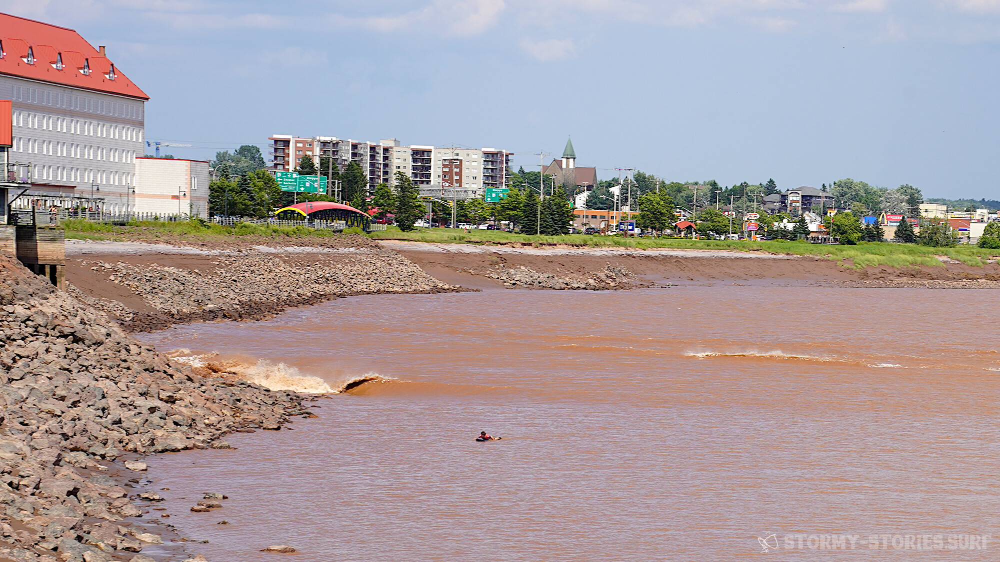
*Moncton Tidal Bore (Sony A7 III + Tamron 28-75mm f/2.8 Di III VXD G2;Bildausschnitt von 1/200s bei f10 und 75mm; ISO 100)*

# River-Surfing Canada - Moncton Tidal-Bore

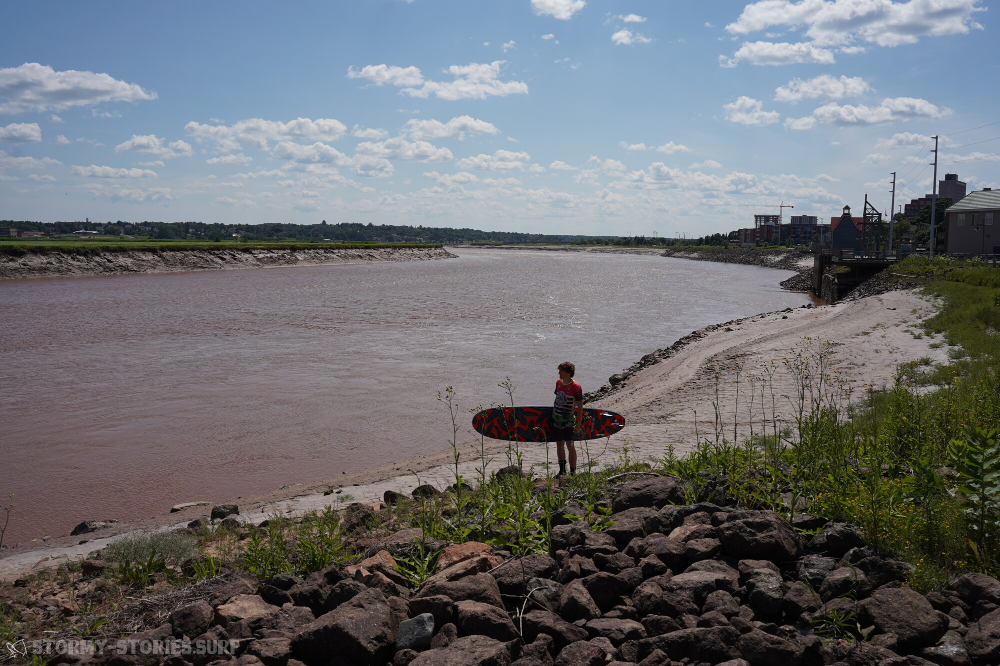
*Moncton Tidal Bore (Sony A7 III + Tamron 28-75mm f/2.8 Di III VXD G2; 1/640s bei f8 und 28mm; ISO 100)*

After a slippery and very muddy descent, I stand on the edge of the Petitcodiac River and try to spot the coming wave in the opposite curve of the river.
And well here it comes already. At the edge of the bank you can see tiny white water crashing against the rocks and if you listen closely you can also hear the tidal wave making its way up the river little by little. Now it's time to get into the water and position myself at the best possible position in the river and ideally do all this better sooner than later. Funnily enough, every time I see the first white water of the wave, I notice how my pulse noticeably increases and my heart starts pounding.

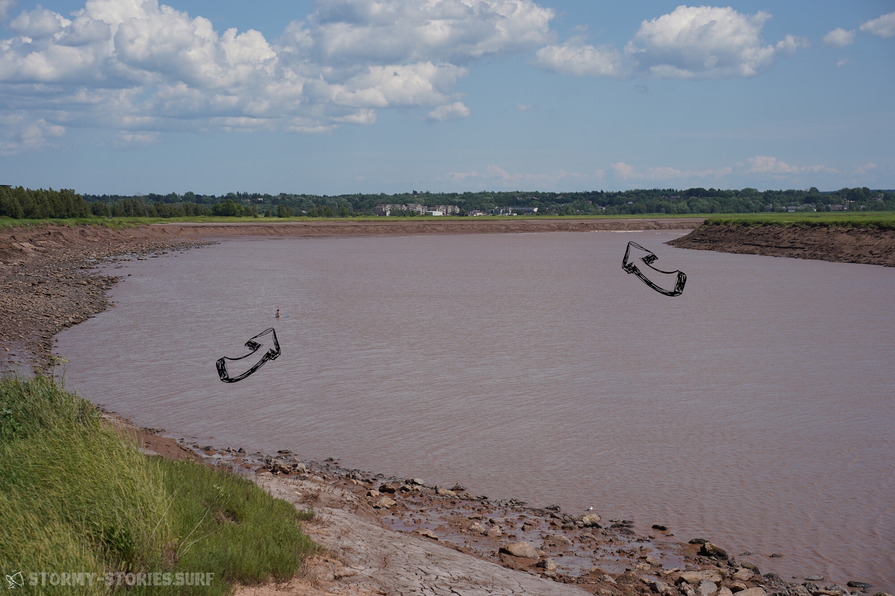
*Moncton Tidal Bore (Sony A7 III + Tamron 28-75mm f/2.8 Di III VXD G2; 1/500s bei f8 und 75mm; ISO 100)*

The whole thing is funny because the wave itself is neither particularly high, nor fast, nor strong, nor dangerous in any way. As with many things in life, the value of this wave apparently increases simply because there is very little supply and that is exactly what makes my pulse race a little.
The tidal wave - or as the Canadians call it "Tidal Bore" or "Mascaret" - occurs exactly twice every day, exactly when the rising tide flows from the sea into the river and then as a wave over the actually opposite current of the river.

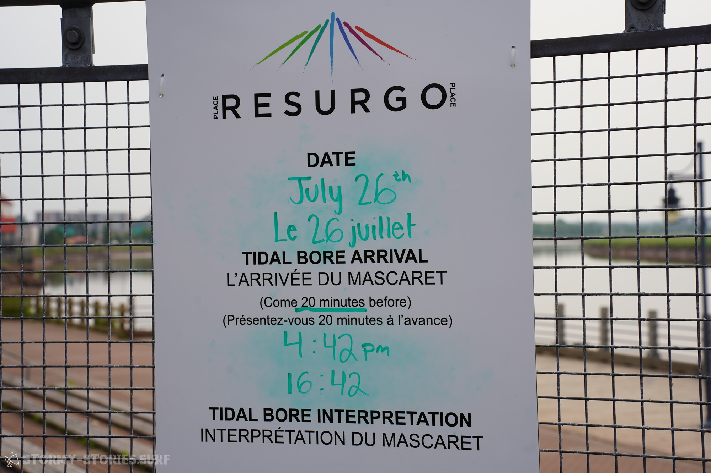
*Moncton Tidal Bore (Sony A7 III + Tamron 28-75mm f/2.8 Di III VXD G2; 1/125s bei f7.1 und 69mm; ISO 100)*

For me, this means that I have pretty much one attempt - if you count the second wave at night, a maximum of two attempts - to catch this wave during the day. And it is with this knowledge in mind that I now sit in the left half of the river and watch as the small wave rolls towards me bit by bit. In the middle of the river, it is sometimes very difficult to see, but on the pack bank of the river you can now see a mini barrel breaking on the rocks.
Unfortunately, this barrel is only a very cute 30-40 centimeters high and the chance of paddling into this small wave in such a way that it takes me on a journey downstream is very small.

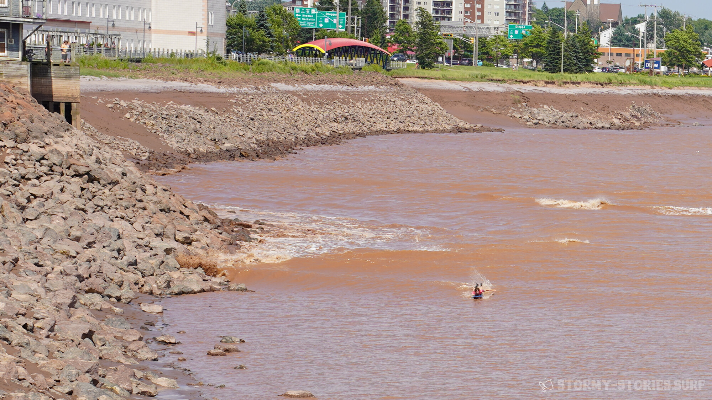
*Moncton Tidal Bore (Sony A7 III + Tamron 28-75mm f/2.8 Di III VXD G2; Bildausschnitt von 1/200s bei f10 und 75mm; ISO 100)*

The forecast for today - and also for the next few days - rates the estimated wave height as only one out of a maximum of four possible points. The overall wave height depends on several factors, but one of the main factors - as with any tide - is the position of the moon and the sun in relation to the planet Earth. The sun and moon pull on the earth with their gravitational pull and therefore also on all water masses. If the sun and moon are in the same direction to the earth, for example at full moon and new moon, their gravitational forces add up and the highest high tides, the lowest low tides and the largest tidal waves can be expected. In our case, we are still a few days before the next full moon and unfortunately have to deal with very small waves.

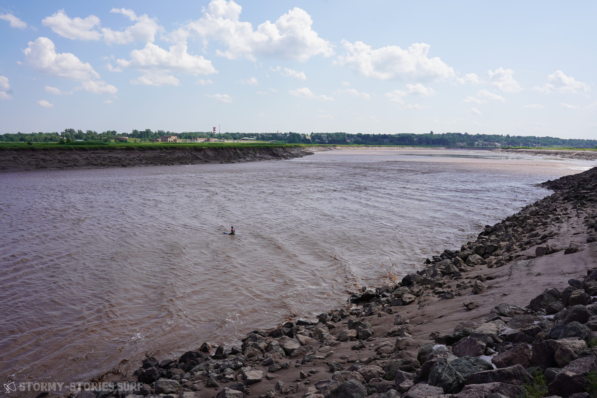
*Moncton Tidal Bore (Sony A7 III + Tamron 28-75mm f/2.8 Di III VXD G2; 1/160s bei f10 und 28mm; ISO 100)*

Nevertheless, I sit here and wait. A few seconds before the wave comes close to me, I lie down on my stomach and try to paddle so fast that my board reaches the same speed as the wave itself. As the small wave has hardly any power, you can't rely on being pushed from behind like you can with big ocean waves, so I paddle like a berzerker.
I was too slow the two days before. On my first attempt, the wave was so small that I could still see it from a distance, but then it was no longer recognizable just in front of me and simply sloshed underneath me.

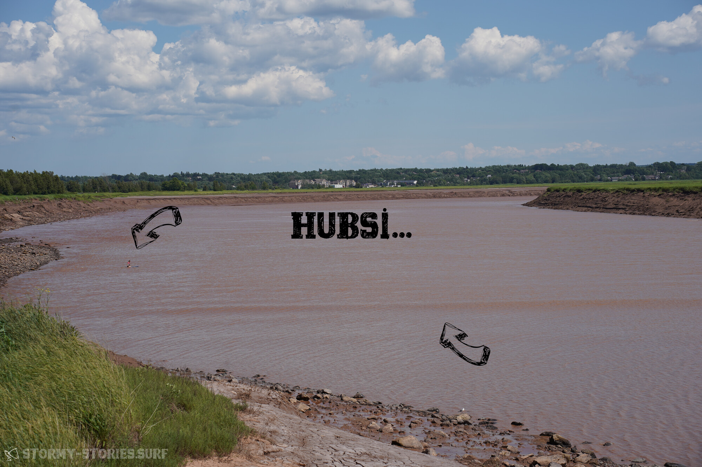
*Moncton Tidal Bore (Sony A7 III + Tamron 28-75mm f/2.8 Di III VXD G2; 1/500s bei f7.1 und 75mm; ISO 100)*

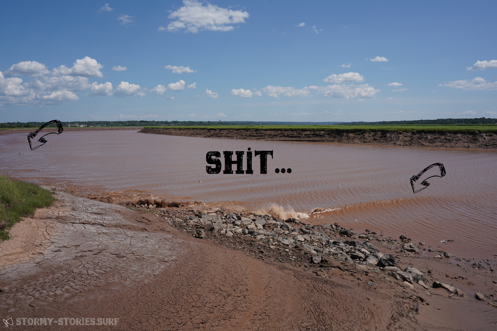
*Moncton Tidal Bore (Sony A7 III + Tamron 28-75mm f/2.8 Di III VXD G2; 1/500s bei f8 und 28mm; ISO 100)*

24 hours and 50 minutes later I narrowly missed the wave again - this time because I was simply too slow. Today, another 24 hours and 50 minutes later, all the paddeling finally seems to be paying off. It finally takes me with it, first on my stomach and then on the knees for a few meters. Although I can't ride the wave for kilometers down the river because as soon as I stand up the wave just doesn't push enough and slips under the board, but still it feels like a great success.

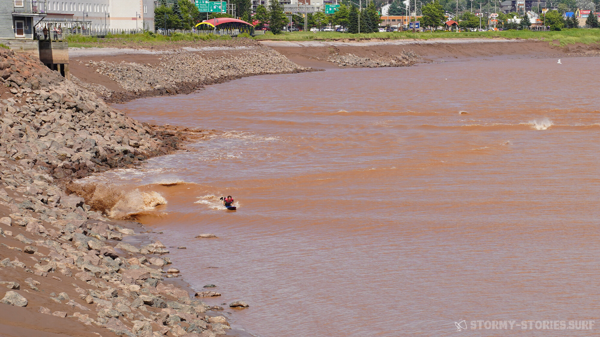
*Moncton Tidal Bore (Sony A7 III + Tamron 28-75mm f/2.8 Di III VXD G2; Bildausschnitt von 1/200s bei f10 und 75mm; ISO 100)*

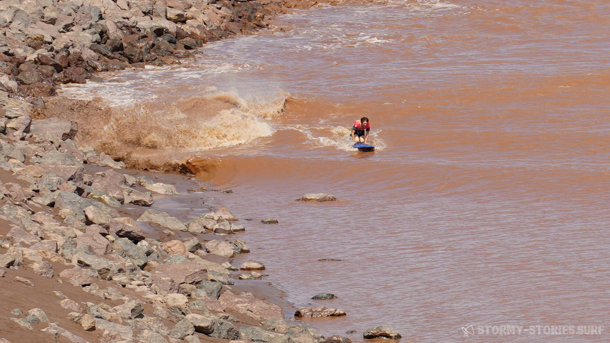
*Moncton Tidal Bore (Sony A7 III + Tamron 28-75mm f/2.8 Di III VXD G2; Bildausschnitt von 1/200s bei f10 und 75mm; ISO 100)*

I try my luck two more times on the following days, once during the day and once a little more adventurously in the dark just before sunrise at just before five in the morning. Both times I am too slow or the wave is too weak or both, but each time it drives me back into the water, because the whole atmosphere, the waiting, the tension and last but not least, the many curious tourists on the riverbank, a few of them gather here even at night to watch the wave come in, makes the whole thing just too exciting not to try it again and again.

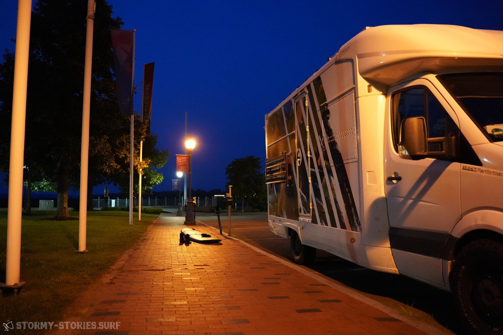
*Moncton Tidal Bore (Sony A7 III + Tamron 28-75mm f/2.8 Di III VXD G2; 1/125s bei f2.8 und 28mm; ISO 12800)*

For potential surfers, it should be mentioned at this point that surfing in Moncton is not officially legal, but seems to be tolerated in most cases.
Information on wave height and run-in time can be found at the tourist information office in Moncton or at https://tides.gc.ca/en/stations/00175 . It is always important to be ready at least 20 minutes before the predicted time to not to miss any potentially too early waves. The best view of the spectacle can be found in the so-called "Parc du mascaret" / "Bore Parc" in GPS : 46.0895145,-64.7709387

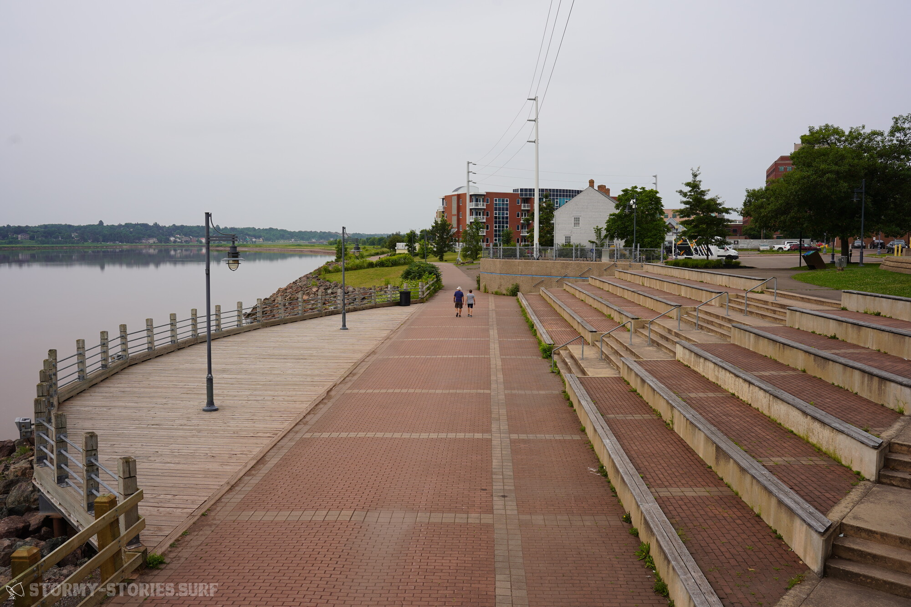
*Moncton Tidal Bore (Sony A7 III + Tamron 28-75mm f/2.8 Di III VXD G2; 1/125s bei f8 und 28mm; ISO 100)*

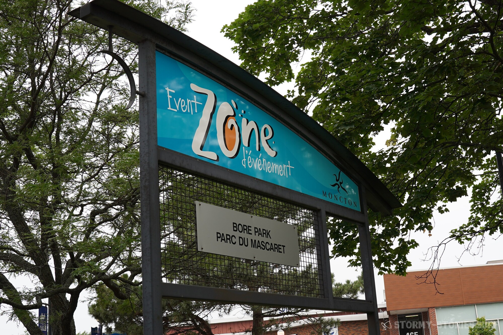
*Moncton Tidal Bore (Sony A7 III + Tamron 28-75mm f/2.8 Di III VXD G2; Bildausschnitt von 1/80s bei f5.6 und 28mm; ISO 100)*
