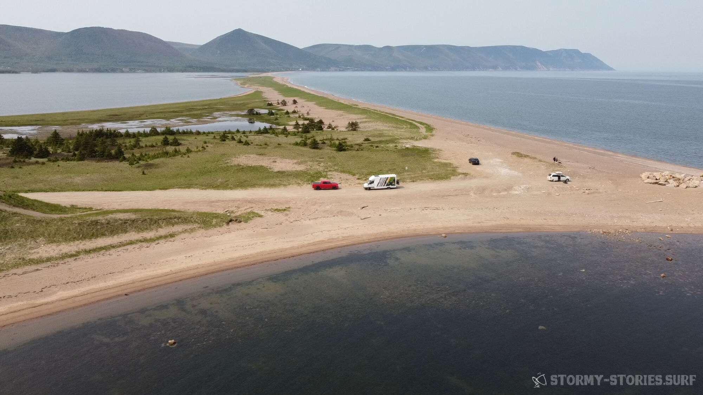
*Surfspot Erkundungsfahrt - Dingwall Beach (Nova Scotia) (DJI Mini 2 Drone - Ausschnitt aus Video)*
# Ost-Kanada : Eindrücke und Gedanken

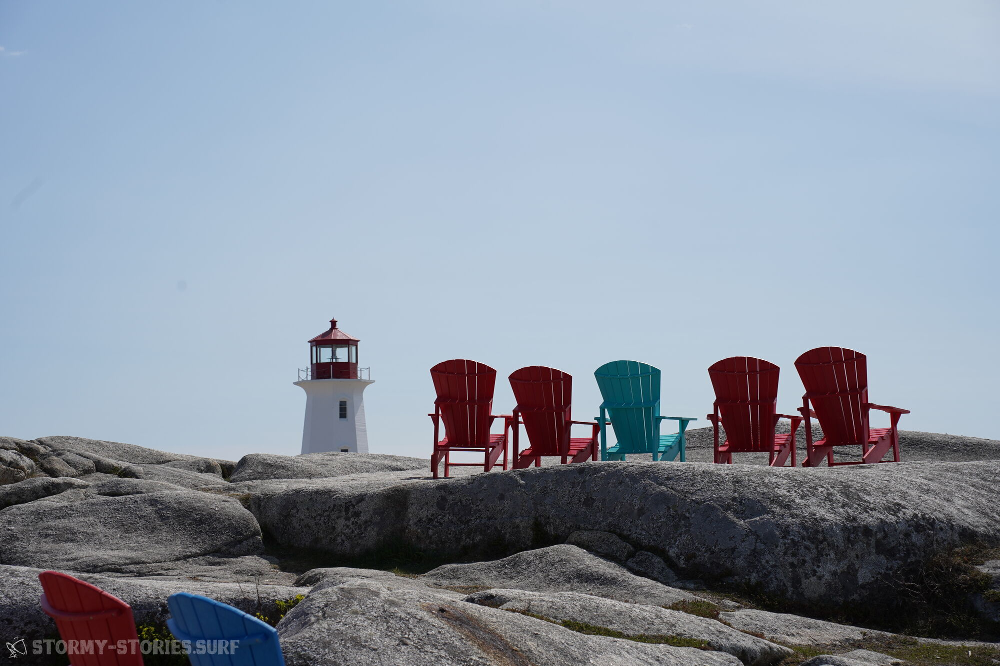
*Peggy's Cove (Nova Scotia) (Sony A7 III + Tamron 28-75mm f/2.8 Di III VXD G2; 1/640s bei f2.8 und 75mm; ISO 100)*

Kanada - jetzt kennen wir dich mittlerweile schon fast seit 3 Monaten. Eigentlich sollte man denken, dass diese Zeit reicht um "jemanden" ganz gut kennenzulernen. Vor allem dann, wenn man Tag für Tag 24 Stunden miteinander verbringt.
Bei dir Kanada, sind wir uns da aber noch nicht so sicher.

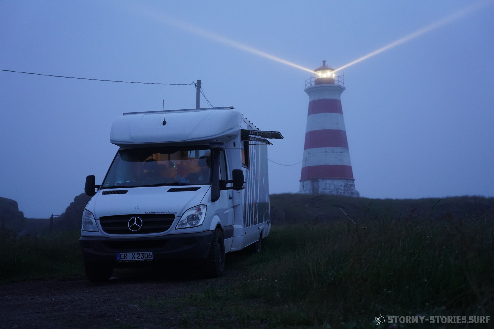
*Wildcamping Briar Island (Nova Scotia) (Sony A7 III + Tamron 28-75mm f/2.8 Di III VXD G2; 1/6s bei f2.8 und 43mm; ISO 3200)*

Zweieinhalb unserer ersten drei Monate haben wir im Osten des Landes verbracht. 7 Wochen davon alleine auf der Insel und Provinz "Nova-Scotia".

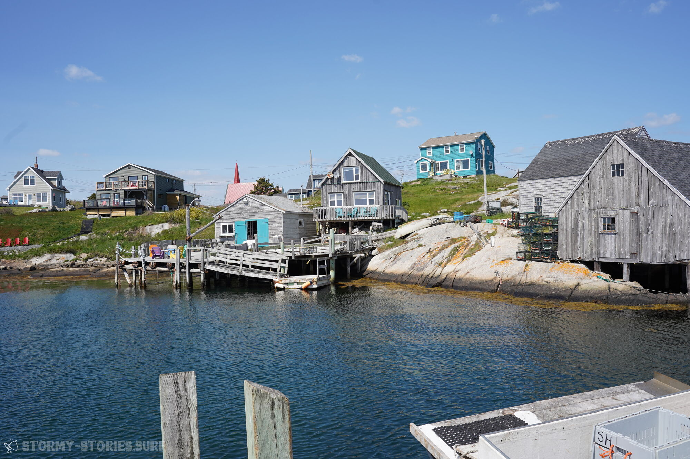
*Peggy's Cove (Nova Scotia) (Sony A7 III + Tamron 28-75mm f/2.8 Di III VXD G2; 1/250s bei f8 und 28mm; ISO 100)*

Hier im Osten heißt Kanada uns mit der herzlichsten aller Begrüßungen willkommen.
In den ersten Tagen dürfen wir in der Wohnung eines damals völlig Unbekannten - der heute ein guter Freund geworden ist - verbringen. Wir lernen die Stadt Halifax aus der Sicht eines Locals kennen, laufen und fahren gemeinsam durch die Gegend, kochen gemeinsam und lernen seine Freunde bei ein paar Gläsern Wein kennen.

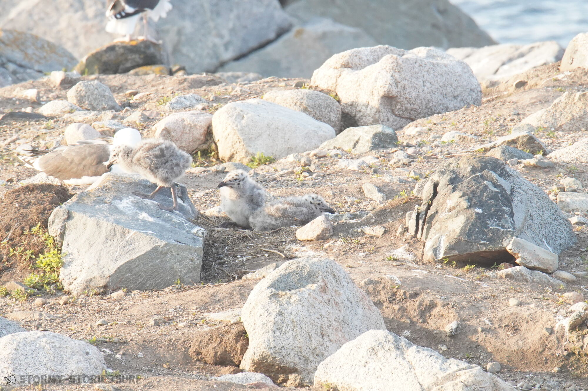
*Baby-Möwen am Middle Head Trail (Nova Scotia) (Sony A7 III + Tamron SP 150-600mm f/5-6.3 Di USD G2 + Sony LA-EA3 Adapter; 1/250s bei f16 und 900mm (dank Cropfactor); ISO 3200)*

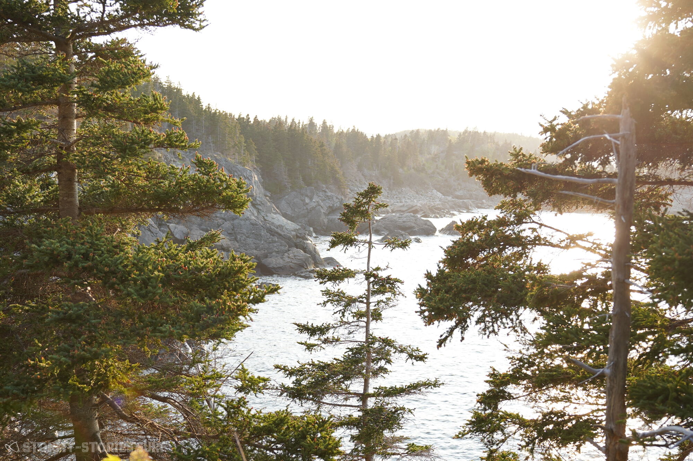
*Sonnenuntergang am Middle Head Trail (Nova Scotia) (Sony A7 III + Tamron 28-75mm f/2.8 Di III VXD G2; 1/200s bei f3.2 und 28mm; ISO 100)*

Gemeinsam mit ihm und seinen Freunden greifen wir einige unserer Anfangs-Probleme an : suchen uns eine günstige kanadische SIM-Karte, lernen wo es Lebensmittel und Gas zum Auffüllen unseres europäischen Gas-Tanks gibt, sammeln Stempel beim Zoll - und wo nicht sonst überall noch - und holen unseren Bus aus dem Hafen. Pünktlich zu unserer Einreise in Halifax lässt Kanada dann noch die ersten paar Tage richtiges Sommer-Wetter des Jahres springen.

Was für ein Start!

Wir haben jetzt auch eine Karte von Nova-Scotia. Sie ist gefüllt mit vielen handschriftlichen Empfehlungen. So viele, dass wir noch garnicht so recht wissen wo wir anfangen sollen. Unglücklicherweise wüten im Südenwesten der Insel gerade zwei große Waldbrände, einer davon der größte den Nova-Scotia je gesehen hat und zerstören in den nächsten Wochen auf über 200 Quadratkilometer Fläche mehr als 150 Wohnhäuser, 60 weitere Häuser und andere Gebäude und vertreiben zeitweise über 6000 Menschen aus ihrer Heimat. [\[1\]](#1) [\[2\]](#2)

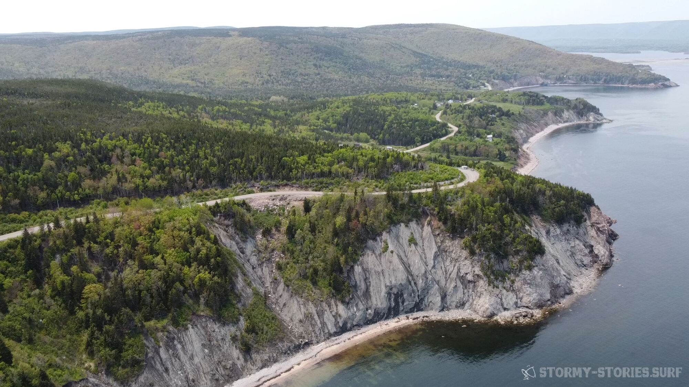
*Cabot Trail (Nova Scotia) (DJI Mini 2 Drone - Ausschnitt aus Video)*

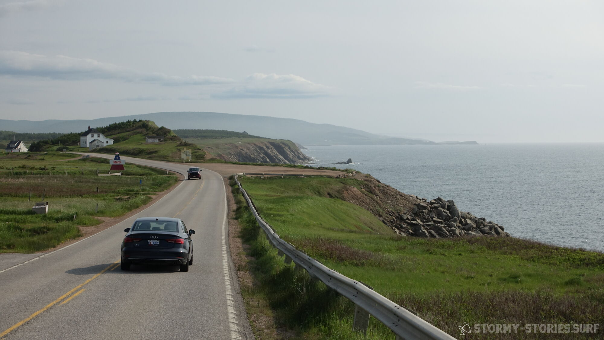
*Cheticamp am Cabot Trail (Nova Scotia) (Sony DSC-RX100 III; 1/2000s bei f3.5 und 25.7mm; ISO 125)*

Für uns heißt das, dass es erst mal in Richtung Norden geht, weg von den Feuern und in Richtung des malerischen Cape Bretons, für das auch so einige Notizen auf unsere Karte Werbung machen. Zur gleichen Zeit fahren auch zwei neue Freunde, die wir am Flughafen kennengelernt haben, weg vom Feuer mit ihrem gemieteten Camper in Richtung Norden und bieten uns an, ein paar Tage mit ihnen zu verbringen.

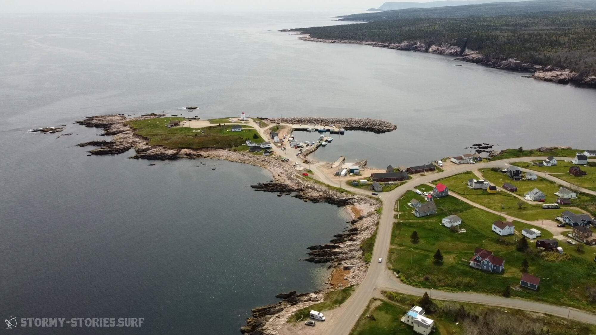
*Wildcamping am Cabot Trail (Nova Scotia) (DJI Mini 2 Drone - Ausschnitt aus Video)*

Für uns kommt dieses Angebot genau richtig. Wir sind beide einfach nur noch total fertig von den vergangenen Monaten der Reisevorbereitung und brauchen dringend Urlaub. So reisen wir für einige Tage zu viert durch Cape Breton. Tagsüber gehen wir wandern und besichtigen viele schöne Orte. Abends lauschen wir entspannten Liedern auf der Akustik-Gitarre und trinken uns mit viel Bier das schlechte Wetter und den Regen schön, der hier im Norden einen krassen Kontrast zu den Feuern im Süden bietet.

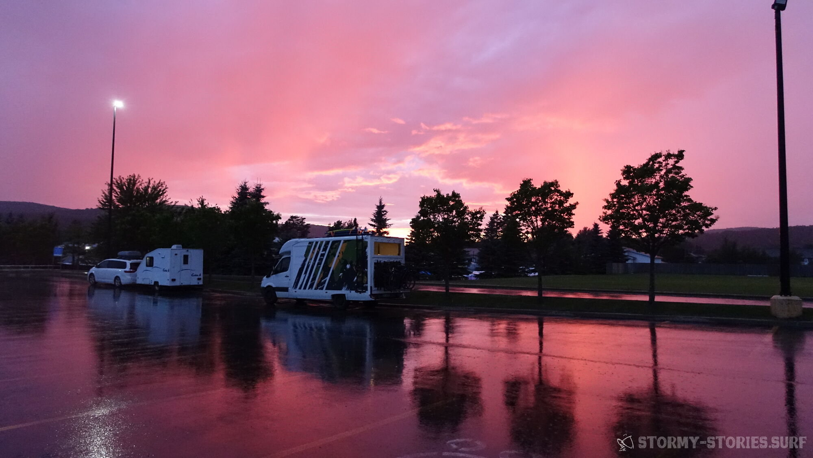
*Kanadische Abendröte (Sony DSC-RX100 III; 1/1000s bei f1.8 und 8.8mm; ISO 2000)*

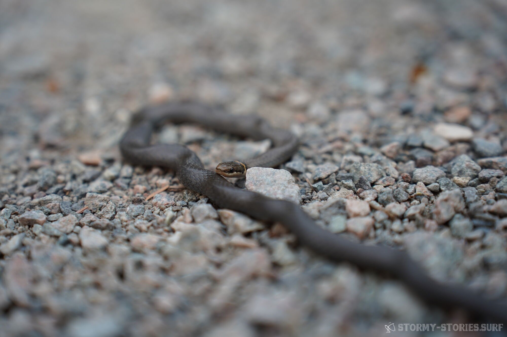
*Nördliche Ringhalsnatter am Skyline Trail (Nova Scotia) (Sony A7 III + Tamron 28-75mm f/2.8 Di III VXD G2; 1/80s bei f2.8 und 75mm; ISO 200)*

In den nächsten Wochen lernen wir dann das kennen, was uns später einmal als "Kulturelles Mosaik" erklärt werden wird. Kanada - vor allem Ost-Kanada - ist ein Land in dem in den vergangenen Jahrhunderten und auch heute noch Einwanderer unterschiedlichster Kulturen, Religionen und Herkunftsländer ein neues Zuhause gefunden haben und finden. Fast alle Menschen die wir persönlich treffen haben Vorfahren die aus Irland, Schottland, Frankreich, Polen oder Deutschland nach Kanada ausgewandert oder vertrieben worden sind und vor allem in größeren Städten bekommt man ein gutes Gefühl dafür, dass es in Kanada mindestens ebenso viele Menschen aus allen anderen Ländern und Kulturen der Welt gibt.

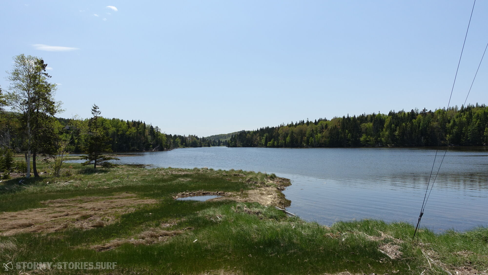
*Traumhafte Landschaft in Cape Breton (Sony DSC-RX100 III; 1/800s bei f5.6 und 8.8mm; ISO 125)*

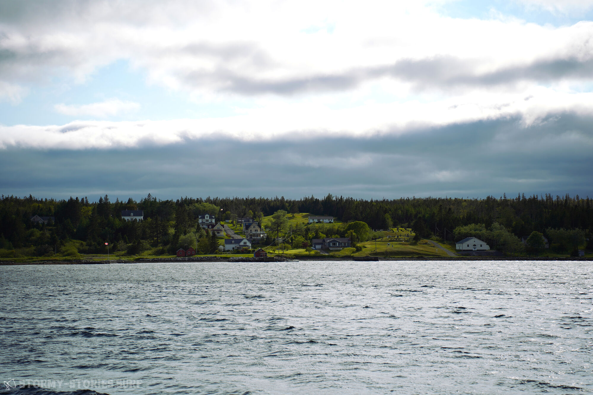
*Blick von Goldboro nach Isaacs Harbour (Nova Scotia) (Sony A7 III + Tamron 28-75mm f/2.8 Di III VXD G2; 1/3200s bei f2.8 und 75mm; ISO 100)*

Auf unserem Weg durch Nova Scotia fahren wir durch viele Akadische Regionen, in denen fast ausschließlich französisch gesprochen wird. Hier gibt es in der "Boulangerie" leckere Croissants zu kaufen, der "KFC" ("Kentucky Fried Chicken") heißt "PFK" ("Poulet Frit Kentucky") und wir finden uns eines Abends in einem Gesangsabend für französische / akadische Volksmusik wieder und verstehen als einzige im Raum überhaupt kein Wort. Straßenschilder sind hier teilweise oder ausschließlich auf französisch und jedes zweite Grundstück ist mit der blau-weiß-roten französisch-akadischen Flagge zugepflastert.

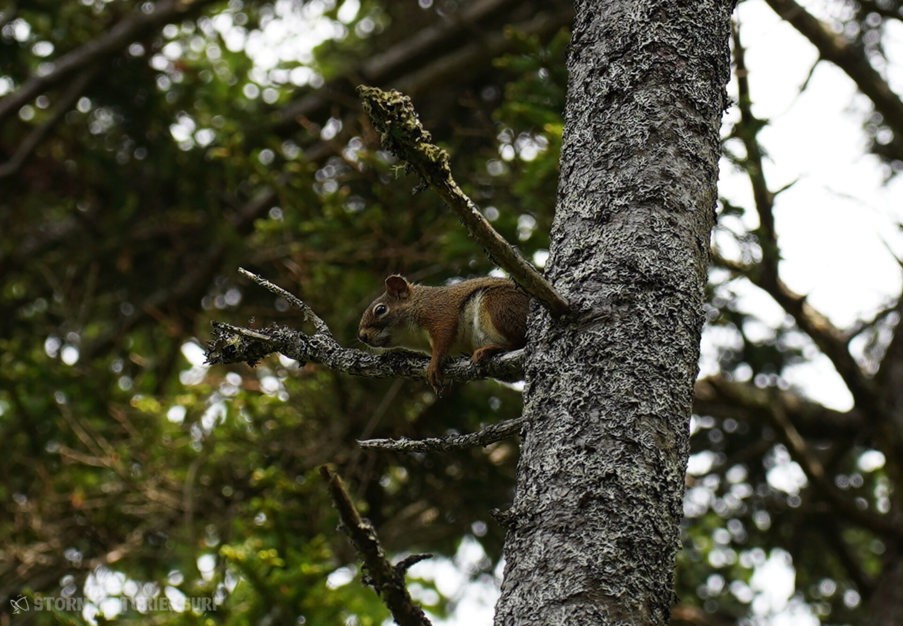
*Squirrels (Kanadisches Eichhörnchen) (Sony A7 III + Tamron 28-75mm f/2.8 Di III VXD G2;Bildausschnitt von 1/320s bei f4 und 75mm; ISO 100)*

Nur ein paar Kilometer weiter finden sich überall gälische Übersetzungen auf den Straßenschildern. Hier landen wir eines Abends in einem Irish Pub, im Hintergrund spielt eine Band traditionelle irische Folk Musik und wir unterhalten uns mit einer sichtbar begeisterten Lehrerin in unserem Alter darüber, dass die Kinder in dieser Region Kanadas gälisch in der Schule lernen können und dass sie es hier in Kanada geschafft haben alte gälische Dialekte am Leben zu erhalten die in Groß-Britannien seit Ewigkeiten ausgestorben sind.

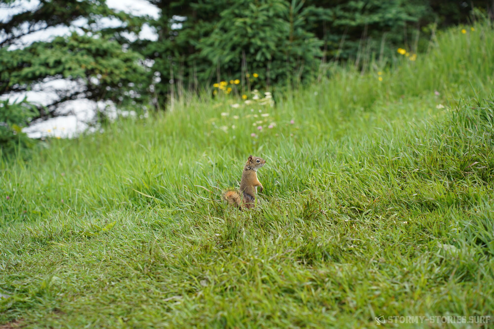
*Squirrels (Kanadisches Eichhörnchen) (Sony A7 III + Tamron 28-75mm f/2.8 Di III VXD G2;Bildausschnitt von 1/160s bei f4 und 75mm; ISO 100)*
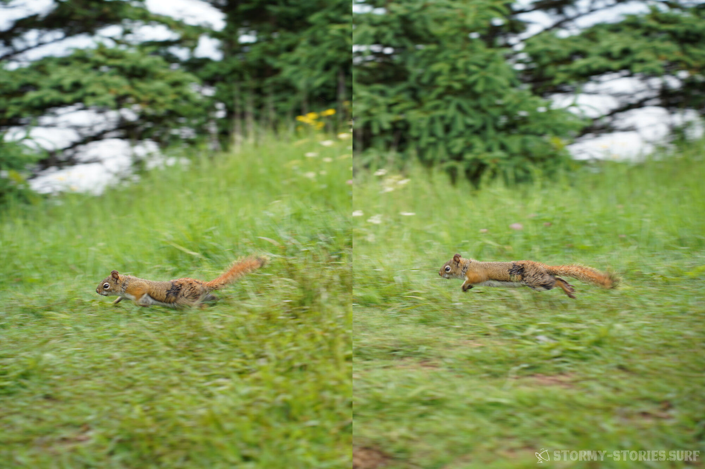
*Squirrels (Kanadisches Eichhörnchen) (Sony A7 III + Tamron 28-75mm f/2.8 Di III VXD G2;Bildausschnitt von 1/160s bei f4 und 75mm; ISO 100)*

Wenig später finden wir uns irgendwo im nirgendwo auf einer Square-Dance Veranstaltung eingeladen. Wir werden kurzer Hand in ein Auto eingeladen und schneller als wir gucken können ist auch unser Eintritt bezahlt und wir sitzen gemütlich in einem kanadischen "Community Center". Auf der gegenüberliegenden Seite rattert jemand super schnelle Melodien auf seiner Geige hoch und runter und steppt dazu einen wilden Takt mit seinen Füßen auf dem Boden. Dazu holt ein Zweiter an seinem Klavier alles raus was menschen-möglich ist und ein Dritter schrubbt so schnell es geht Akkorde auf seiner Gitarre ab. Wenige Minuten später sehen wir uns beide mit einem neuen Tanzpartner ausgestattet und lernen die traditionellen Gruppen- und Step-Dance-Tänze des Dorfes und erfahren, dass diese Veranstaltungen hier mehrmals die Woche den ganzen Sommer durch stattfinden. Für einen Moment denken wir fast wir wären wieder in Irland oder Schottland gelandet, aber nein, wir sind noch immer in Kanada!

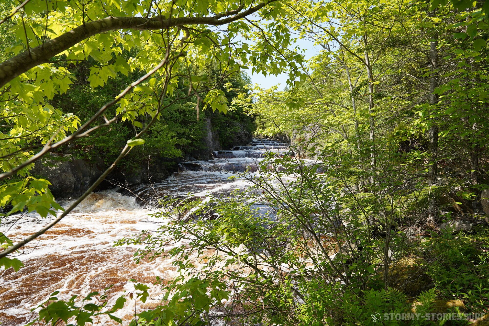
*Wanderweg - Liscomb Mills Trail (Nova Scotia) (Sony A7 III + Sigma 20mm DG HSM f1.4;1/250s bei f5.6 und 20mm; ISO 100)*

Auf der anderen Seite der Halbinsel laufen wir einige Wochen später durch Städte wie "Lunenburg", fahren an Regionen wie "New Germany" und Orten wie "Ost-Berlin" und "West-Berlin" vorbei und hier und da sehen wir in Restaurants Dinge wie "German Knackwurst". Kanada scheint uns schon nach den ersten Wochen groß und vielseitig und irgendwie sind wir immer wieder positiv überrascht wie gut das Land mit seinen vielen unterschiedlichen Kulturen klarkommt. Das Land und seine Einwohner machen auf mich immer wieder den Eindruck, dass es mit dem ganzen Thema "Einwanderung" entspannter und besser umgeht als die europäischen Staaten.

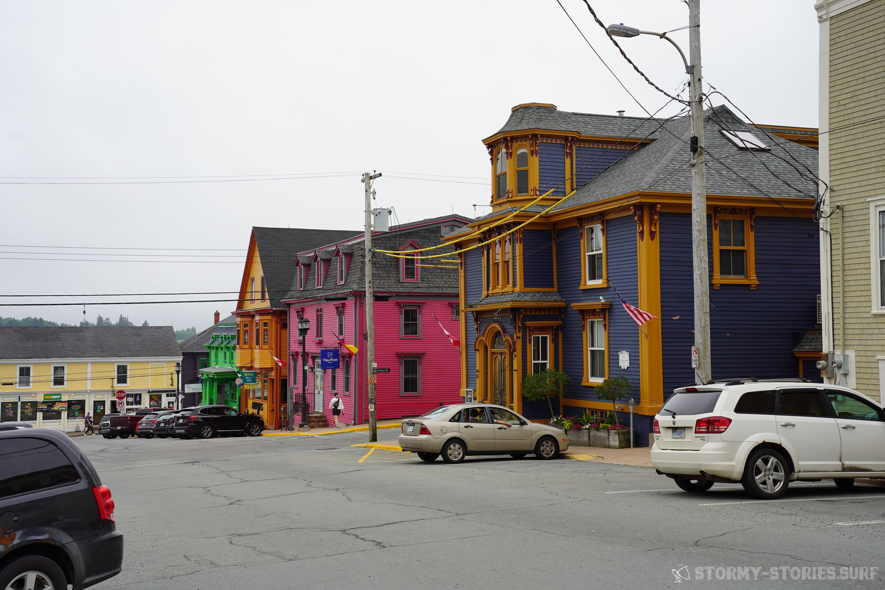
*Lunenburg (Nova Scotia) (Sony A7 III + Tamron 28-75mm f/2.8 Di III VXD G2; 1/100s bei f7.1 und 43mm; ISO 100)*
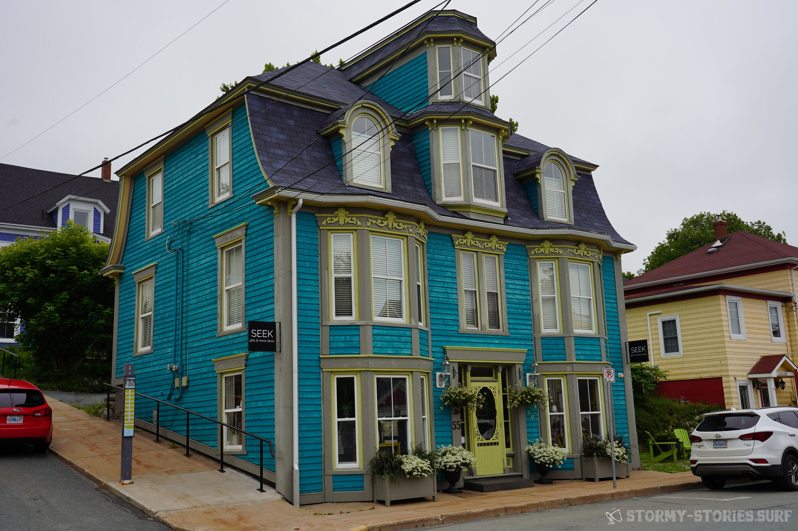
*Lunenburg (Nova Scotia) (Sony A7 III + Tamron 28-75mm f/2.8 Di III VXD G2; 1/125s bei f8 und 37mm; ISO 100)*

Hin und wieder habe ich das Gefühl bzw. hege die Hoffnung, dass es hier einfach weniger Rassismus und generelle weniger Ausgrenzung von Minderheiten gibt. Im nächsten Moment wird mir dann allerdings auch immer wieder klar, dass ich als weißer, reicher, priviligierter Mensch und Tourist natürlich auch sehr wenig von solchem Rassismus mitbekomme.

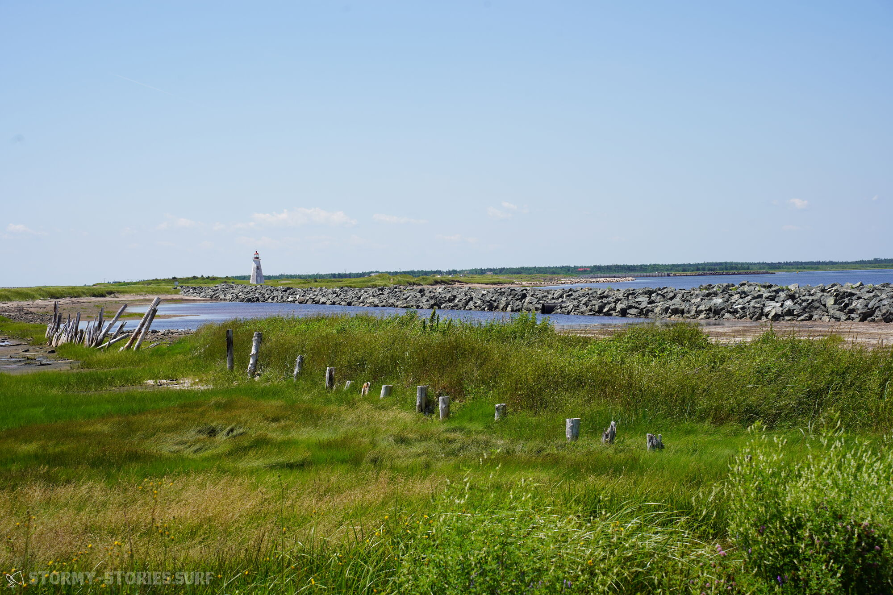
*Windsurf-Spot Chiasson Office Lagoon - Île Lamèque (Quebec) (Sony A7 III + Tamron 28-75mm f/2.8 Di III VXD G2; 1/200s bei f10 und 75mm; ISO 100)*

Während die Nachfahren der ersten europäischen Einwanderer untereinander alle in einer ähnlichen Situation sind und die Mehrheit der Bevölkerung bilden, beschränken sich solche Probleme hier offenbar hauptsächlich auf die Minderheiten der indigenen Bevölkerung (die ursprünglich bevor die Europäer kamen, hier lebten) und auf neuere Einwanderungs-Gruppen wie z.B. Menschen aus Asien.

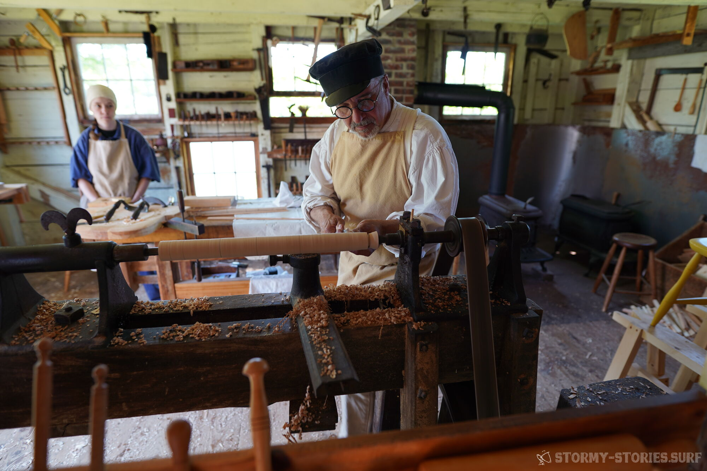
*Sherbrooke Village Museum (Nova Scotia) (Sony A7 III + Sigma 20mm DG HSM f1.4; 1/40s bei f2.2 und 20mm; ISO 100)*

Aber immerhin stelle ich fest, dass Einwanderung zumindest von offizieller Seite anders wahrgenommen wird. Während in Europa weiterhin viele Menschen versuchen sich einzureden, dass Migration immer etwas kriminelles und illegales ist, dass man mit Zäunen, Booten und zur Not auch mit Gewalt verhindern muss, hat man in Kanada verstanden, dass Menschen schon immer, seit Millionen von Jahren, dahin gegangen sind, wo es ihnen am besten geht. Aus genau diesem Grund kamen alle diese europäischen Einwanderer nach Kanada, weil es ihnen dort unter Umständen besser ergehen könnte als in Europa und sie machten Kanada zu dem Land, dass es heute geworden ist.  
Mit der Geschichte des Landes im Hinterkopf macht es dann auch Sinn, dass die Kanadische Regierung offen mit dem Thema Migration umgeht und auch offiziell positiv von einer gewollten Einwanderung und Multikulturalismus als Staatsideologie spricht.

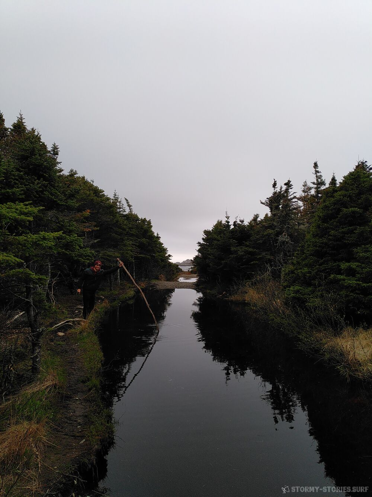
*Stellplatz-Suche / Pfützentiefe kontrollieren (Nova-Scotia) (Fairphone 3, interne Kamera; 1/477s bei f1.8 und 4.4mm; ISO 100)*

Bei diesem Thema, kommt mir dann auch immer wieder der Gedanke, dass Kanada natürlich auch etwas größer ist als Deutschland und vielleicht andere Möglichkeiten hat Menschen aufzunehmen als wir.
Und dieser Gedanke ist auch nicht ganz und gar falsch.
Kanada ist ca. 28 mal so groß wie Deutschland, nach Russland das zweitgrößte Land der Erde und mit 3,9 Einwohnern / km² gehört es zu den am dünnsten besiedelten Ländern der Welt. Da sollte man doch denken, dass hier eigentlich noch jede Menge Platz für neue Mitbewohner ist. Tatsächlich stellen wir aber auch in Gesprächen mit vielen Kanadiern immer wieder fest, dass Kanada zwar gigantomanisch riesig und größtenteils einfach leer ist, aber dass das auch einfach daran liegt, dass die meisten Teile des Landes einfach unbewohnbar sind.

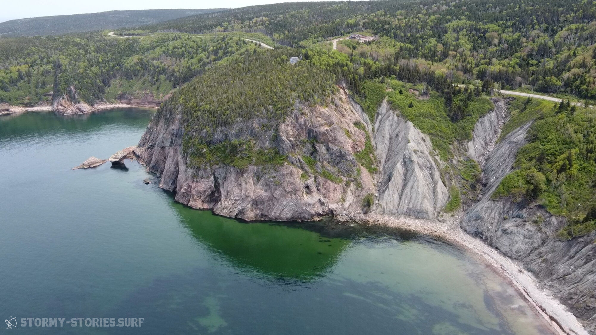
*Cabot Trail (Nova Scotia) (DJI Mini 2 Drone - Ausschnitt aus Video)*

90% der Kanadischen Bevölkerung leben in den ersten 100km nördlich der US-Grenze. Fast alles nördlich der dichter besiedelten Bereiche ist größte Teile des Jahres so unfassbar kalt, und in den anderen Teilen des Jahres geplagt von Waldbränden, Stechmücken und Black-Flies, so dass eine dauerhafte Besiedlung für die meisten Menschen schlicht undenkbar wäre. Hinzukommt, dass fast alles in diesem Bereich fast ausschließlich per Flugzeug oder im Sommer auch rein theoretisch per Boot erreichbar ist. Straßen gibt es so gut wie keine, auf jeden Fall keine die von Süden dorthin führen würden und Strom, fließend Wasser oder gar Telefon-Netz gibt es schon hier im bewohnten Teil Kanadas vielerorts nicht. So gesehen kann man Kanada wsl. weniger mit Deutschland aber deutlich eher mit Europa vergleichen (Kanada misst ca. 98% der Fläche des Kontinent Europas), nur mit deutlich weniger bewohnbarer Fläche. [\[3\]](#3) [\[4\]](#4)

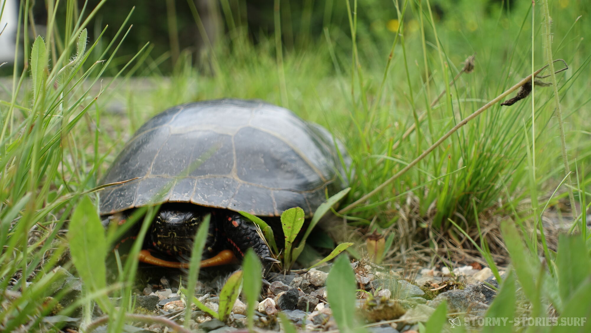
*Östliche Zierschildkröte nähe Kejimkujik Nationpark (Nova Scotia) (Sony DSC-RX100 III; 1/125s bei f4 und 25.7mm; ISO 125)*
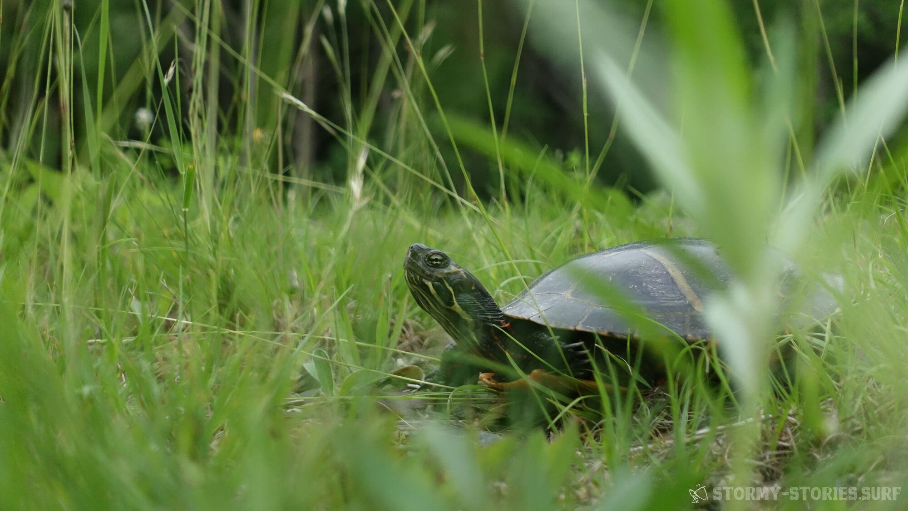
*Östliche Zierschildkröte nähe Kejimkujik Nationpark (Nova Scotia) (Sony DSC-RX100 III; 1/2000s bei f2.8 und 25.7mm; ISO 800)*

Was uns an Kanada schon in den ersten Monaten immer wieder begeistert ist, dass es hier tatsächlich noch unangetastete Natur gibt, die auch zukünftig nicht vom Menschen eingenommen werden kann, weil ihre Fläche als Nationalpark oder Provincial Park besonderen Gesetzen unterliegt.

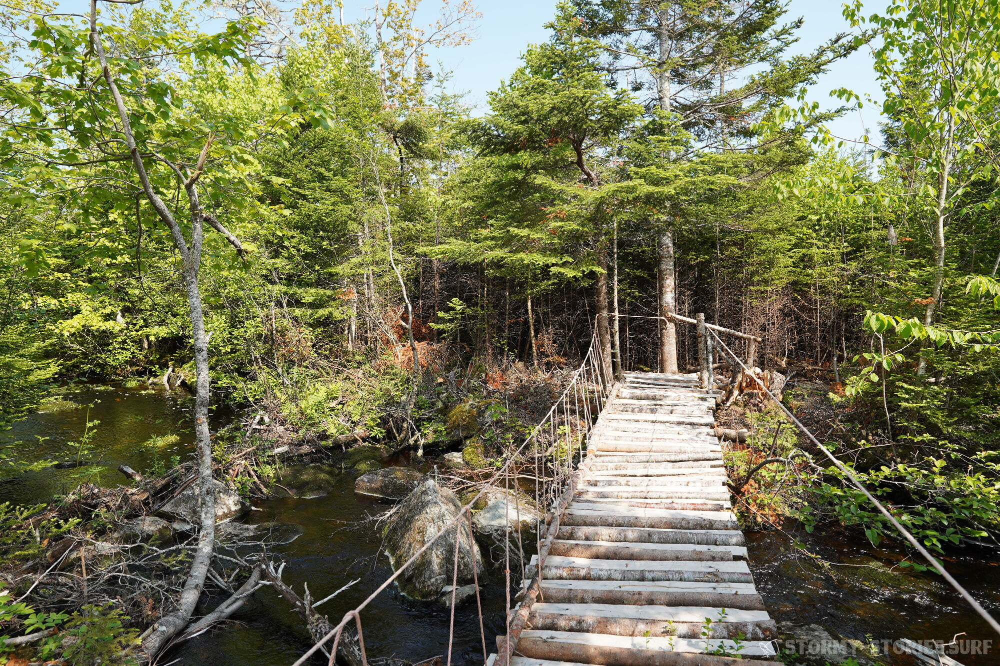
*Wanderweg - Liscomb Mills Trail (Nova Scotia) (Sony A7 III + Sigma 20mm DG HSM f1.4; 1/200s bei f5 und 20mm; ISO 100)*

Spannend finden wir hierbei auch, dass die kanadische Regierung hier teilweise sogar Flächen von Hotels oder Privatpersonen zurückkauft oder enteignet damit die schützenswerte Natur in diesen Bereichen nicht weiter ausgebeutet werden kann. Selbst kleine unbekannte Nationalparks sind dabei nicht selten mehrere hundert Quadratkilometer groß, sodass man hier problemlos Tage - und Wochenlang durch die Wildnis wandern oder Kanufahren könnte ohne irgendwelche Zivilisation zu sehen. Was uns außerdem schwer beeindruckt hat, ist dass von diesen gigantischen Flächen teilweise bewusst nur Bruchteile touristisch nutzbar gemacht werden und andere Bereiche geplant von menschlichen Einfluss ferngehalten werden um der Natur Raum ohne den Menschen zu geben.

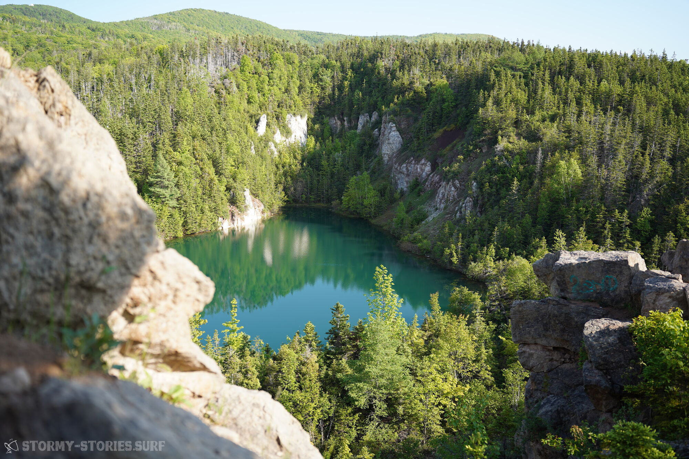
*Gymsum-Mine-Lake - Cheticamp (Nova-Scotia) (Sony A7 III + Tamron 28-75mm f/2.8 Di III VXD G2; 1/500s bei f2.8 und 28mm; ISO 100)*

Hier haben wir immer mal wieder das Gefühl, dass hier ein paar Dinge wirklich gut laufen und Kanada Europa hier in vielerlei Hinsicht einiges voraus ist. Aber auch hier ist Kanada ein Land der krassen Kontraste. Auf der einen Seite setzt man sich viel für die Erhaltung und den Schutz der Natur ein, aber auf der anderen Seite können in Kanada immer noch Tiere wie Pumas, Bären (sogar Eisbären) und Elche legal gejagt werden.

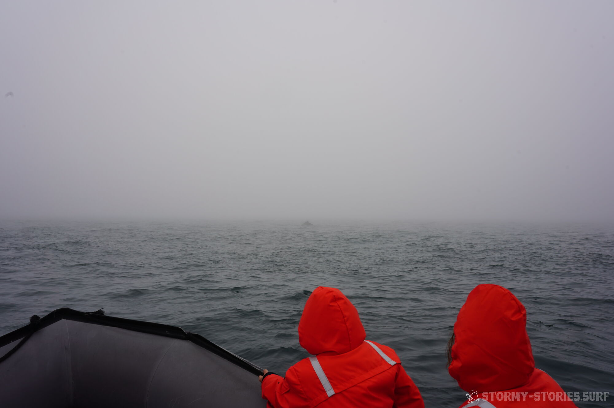
*Buckelwale nähe Briar Island (Nova Scotia) (Sony A7 III + Tamron 28-75mm f/2.8 Di III VXD G2; 1/100s bei f6.3 und 28mm; ISO 100)*
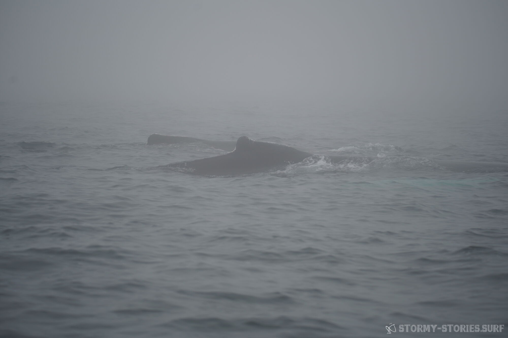
*Buckelwale nähe Briar Island (Nova Scotia) (Sony A7 III + Tamron SP 150-600mm f/5-6.3 Di USD G2 + Sony LA-EA3 Adapter; 1/1000s bei f5 und 160mm; ISO 200)*

Entsetzt stellen wir fest, dass es problemlos möglich ist Puma- oder Eisbär-Jagd-Ausflüge im Norden Kanadas online zu buchen und auch während unserer Reise treffen wir immer wieder auf Menschen die stolz von ihren Jagdkünsten bei Elch- und Bärjagd erzählen. Zwar sind diese Arten offiziell innerhalb Kanadas nicht vom Aussterben bedroht, aber kommt uns hierbei auch immer die Frage in den Kopf : "Muss man denn eigentlich immer solange warten etwas zu schützen bis es bedroht ist?".

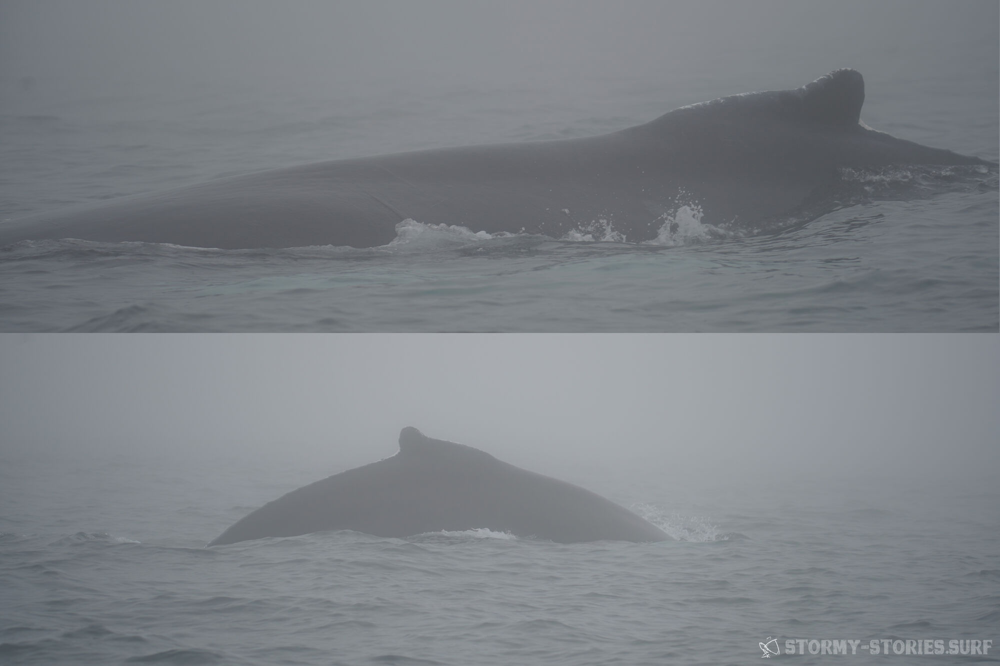
*Buckelwale nähe Briar Island (Nova Scotia) (Sony A7 III + Tamron SP 150-600mm f/5-6.3 Di USD G2 + Sony LA-EA3 Adapter; 1/1000s bei f5 und 150mm; ISO 200 & 1/1000s bei f5.6 und 210mm; ISO 125)*
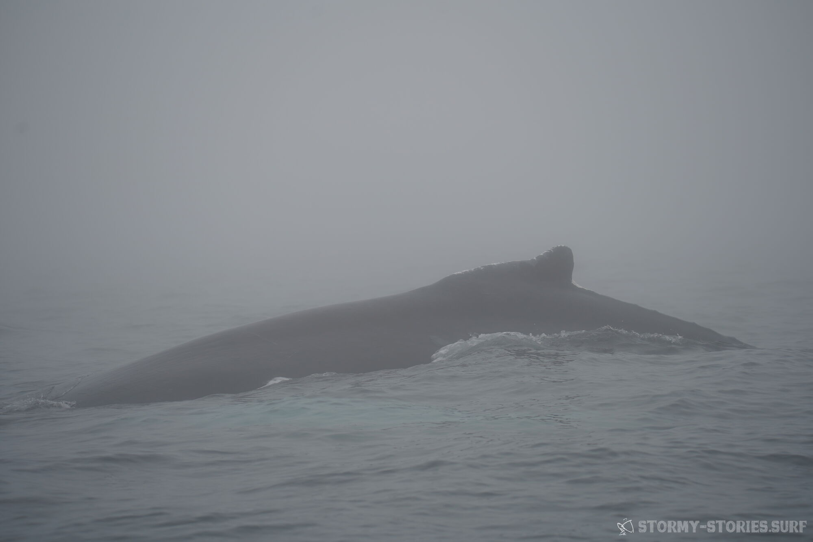
*Buckelwale nähe Briar Island (Nova Scotia) (Sony A7 III + Tamron SP 150-600mm f/5-6.3 Di USD G2 + Sony LA-EA3 Adapter; 1/1000s bei f5.6 und 160mm; ISO 125)*

Auch wenn wir das Gefühl haben, dass Kanada viel für den Erhalt der Natur tut, wenn es um populäre Freizeitaktivitäten wie Angeln oder Jagen geht, scheint man sich hier schwer zu tun sich einschränken zu wollen. Und so kommt es dann vlt. auch irgendwann zu Situationen wie in Nova-Scotia. Hier erzählt man uns, wie die jahrzehntelange Freude über das Geld der vielen Jagd-Touristen aus den USA (die hier Elche jagen konnten, die es in ihrem Land kaum mehr gab) nun die Elch-Population auf der Insel an die kritische Grenze gebracht hat. Die urpsrüngliche Population von etwa 15.000 Tieren wird aktuell auf ca. 700 geschätzt. Um die Tragik der Geschichte noch ein bisschen auf die Spitze zu treiben, werden die verbleibenden Elche aktuell auch noch durch eine Gehirnwurm-Infektionen bedroht - die neben den üblichen Problemen wie den Verlust von Lebensraum auf Grund von Waldrodungen - nicht unbedingt noch notwendig gewesen wären, sodass es unklar ist, ob sich die Nova-Scotia Elche noch lange vor dem Aussterben retten können. [\[5\]](#5)

Also auch hier in der weiten Wildnis Kanadas ist am Ende wahrscheinlich nicht alles perfekt...

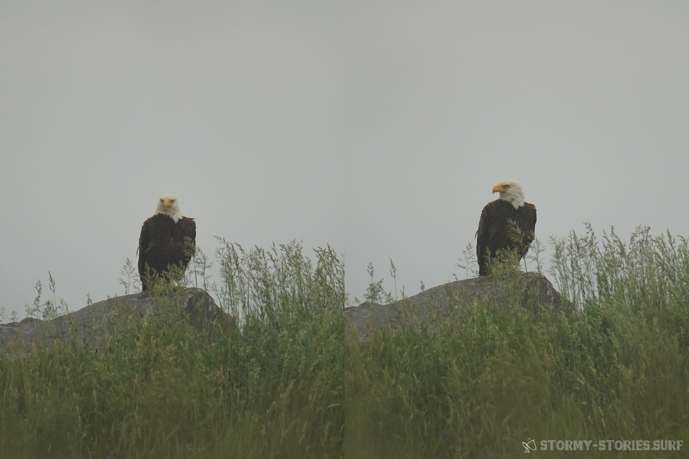
*Weißkopfseeadler nähe Grand Pré (Nova Scotia) (Sony A7 III + Tamron SP 150-600mm f/5-6.3 Di USD G2 + Sony LA-EA3 Adapter; 1/400s bei f6.3 und 900mm (dank Cropfactor); ISO 800)*
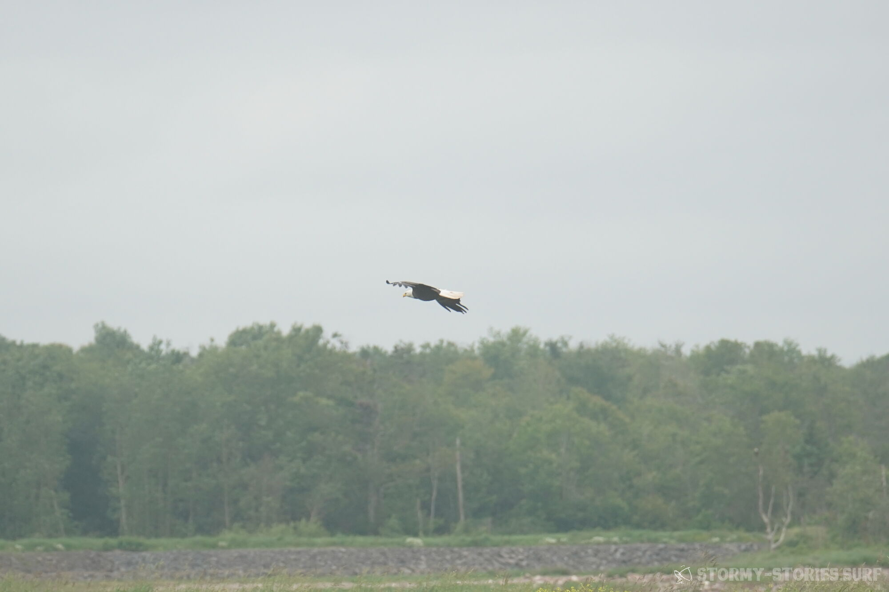
*Weißkopfseeadler nähe Grand Pré (Nova Scotia) (Sony A7 III + Tamron SP 150-600mm f/5-6.3 Di USD G2 + Sony LA-EA3 Adapter; 1/320s bei f5.6 und 495mm (dank Cropfactor); ISO 1250)*
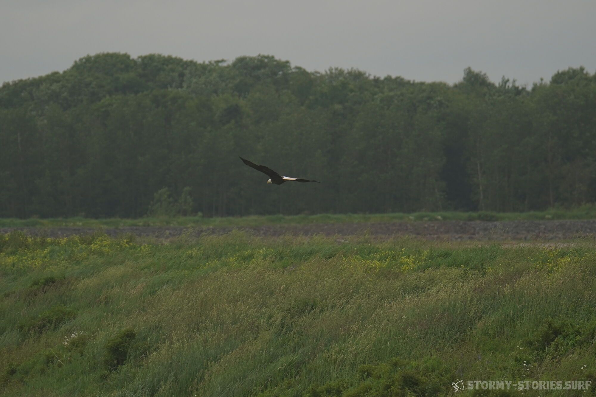
*Weißkopfseeadler nähe Grand Pré (Nova Scotia) (Sony A7 III + Tamron SP 150-600mm f/5-6.3 Di USD G2 + Sony LA-EA3 Adapter; 1/320s bei f5.6 und 495mm (dank Cropfactor); ISO 500)*

Nichtsdestotrotz die Wildnis und auch der Umgang mit der Wildnis ist hier einfach anders und das begeistert uns. Schon in unseren ersten Wochen sehen wir morgens beim Spazierengehen einen Weißkopf-Seeadler in seiner freien Wildbahn wie er majestätisch über unseren Schlafplatz an einer Bucht gleitet. Was sich in diesem Moment einfach wie ein wahrgewordener Kindheits-Traum anfühlt, wird sich in den kommenden Wochen noch viele viele Male wiederholen, denn diese Könige der Lüfte gibt es hier überall.
An einem Strand in der Nähe von Louisbourg treffen wir einen schüchternen jungen Rot-Fuchs und er zeigt uns immer wieder mit ausgiebigen Gähnen wie müde er doch ist.
Auf dem Skyline-Trail am Cabot Trail stehen plötzlich zwei Elch-Kühe hinter uns auf dem Wanderweg und keine 15 Minuten später entdecken wir eine ganze Schule Pilot-Wale die vor uns die Küste hochziehen.

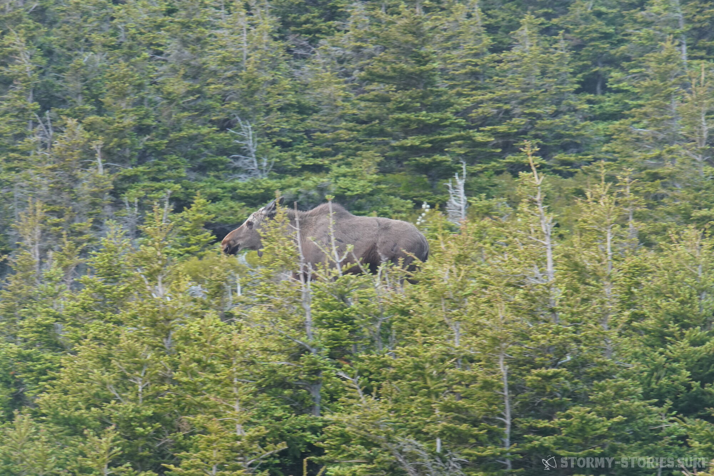
*Elch-Kuh am Skyline-Trail (Nova Scotia) (Sony A7 III + Tamron SP 150-600mm f/5-6.3 Di USD G2 + Sony LA-EA3 Adapter; 1/125s bei f22 und 400mm; ISO 3200)*
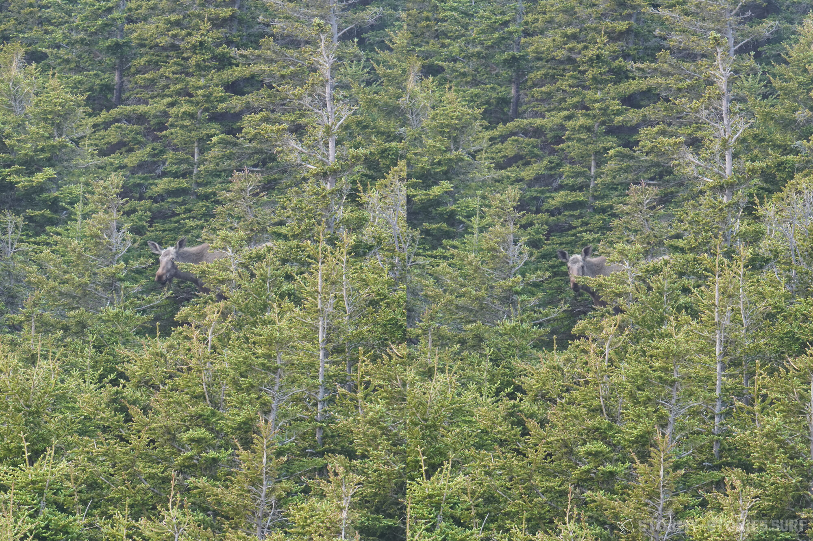
*Elch-Kuh am Skyline-Trail (Nova Scotia) (Sony A7 III + Tamron SP 150-600mm f/5-6.3 Di USD G2 + Sony LA-EA3 Adapter; 1/100s bei f22 und 300mm; ISO 3200)*
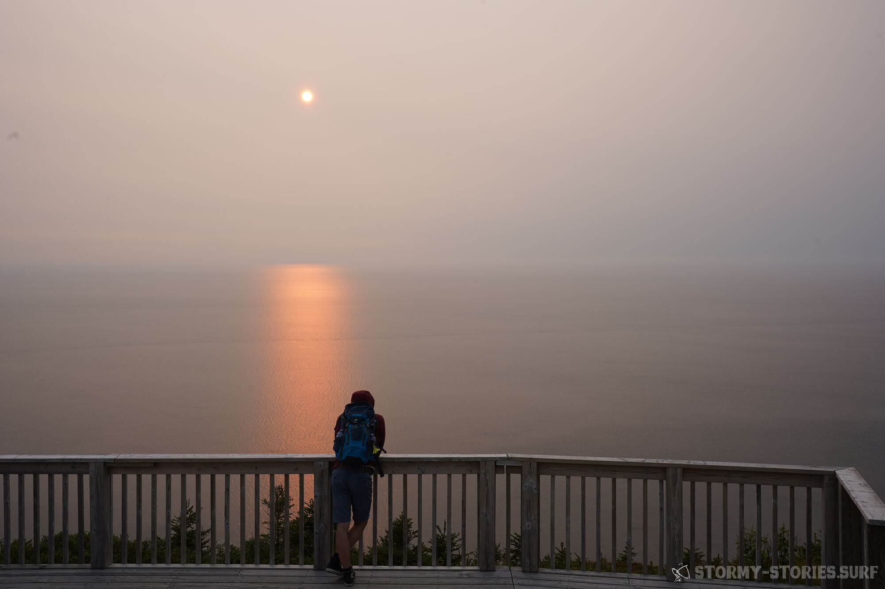
*Pilotwale beobachten am Skyline-Trail (Nova Scotia) (Sony A7 III + Tamron 28-75mm f/2.8 Di III VXD G2; 1/60s bei f22 und 32mm; ISO 100)*

In der Abenddämmerung demonstriert uns ein Stachelschwein wie sicher es sich mit seinen Stacheln fühlt und wie unfassbar langsam es sich über die Straße bewegen kann. Während wir gerade telefonierend im Auto sitzen läuft ein Kojote, dem sein ziemlich totes Mittagessen aus dem Maul hängt an uns vorbei. Auf dem Weg zum Kejimkujik-Nationalpark bremsen wir überrascht für eine Schildkröte und begleiten sie bis auf die andere Straßenhälfte. In der St. Mary's Bay sehen wir vom Schlauchboot ein paar Buckelwale die entspannt 1-2 mal so groß sind wie unser Boot. Immer wieder beobachten wir nistende Möwen die ihre niedlichen, flauschigen Küken aufziehen und mehr als einmal treten wir beim Wandern fast auf eine Schlange, die hier glücklicherweise alle ungiftig sind. Immer mal wieder sehen wir Nachts ein paar Waschbären die mit ihrem witzigen Gesicht ein bisschen wie kleine Banditen aussehen.
Hier in Kanada lernen wir auch zum ersten Mal was es heißt sich den Lebensraum mit anderen Lebewesen zu teilen. Auch hier hat der Mensch natürlich große Flächen für sich beansprucht und innerhalb dieser Flächen gelten quasi seine Regeln, aber sobald man sich außerhalb dieser Flächen aufhält muss man sich einfach an gewisse Regeln halten, die notwendig sind weil dieses Gebiet nicht allein von den Menschen "regiert" wird. Da wir in Deutschland eigentlich nie Rücksicht auf andere Tiere nehmen müssen ist das erstmal ziemlich ungewohnt. Aber umso mehr ich darüber nachdenke umso mehr wird mir eigentlich klar, dass die Menschen nicht die einzigen Lebewesen sind, die einen Anspruch auf den Planeten haben, sondern sich ihn mit allen anderen Lebewesen teilen müssen. Und wenn dazu gehört dass man im Dunkeln eben nicht mehr alleine durch den Wald läuft um nicht von einem Wolf-Kojoten-Mischling zerfleischt oder einem Elch oder Bär überrannt zu werden, dann ist das zwar schon eine gewisse "nervige" Einschränkung die man nicht gewohnt ist, aber in Wirklichkeit ist es eigentlich auch kein Problem und es zeigt diesen Tieren gegenüber auch eine gewisse Art an Respekt und dass man ihnen auch Lebensraum und Tageszeiten zum Leben zugesteht. Aus diesem Blickpunkt kann man eigentlich sehr gut erkennen, wie kaputt unser Ökosystem und unser Umgang mit Wildnis in Europa ist. Wir haben so lange alles "gefährliche" ausgerottet bis unsere komplette Nahrungskette so defekt war, dass wir jetzt selbst Bestände von Tieren reglementieren müssen die keine natürlichen Feinde mehr haben und während die Kanadier über die "sehr zurückhaltenden und im Grunde scheuen und ungefährlichen Wölfe" nur lachen können, drehen in Deutschland alle vollkommen frei wenn sich hier und da mal wieder ein paar Rudel in ihren natürlichen Lebensraum zurückkehren. Natürlich hat alles immer seinen Preis. In Kanada beispielsweise kann man eigentlich nicht wandern gehen ohne vorher an einem Haufen Bär, Kojoten, Puma oder Wolf-Warnschilder vorbeizukommen. In manchen Gegenden würde ich wahrscheinlich auch nicht ohne Bärenspray oder mit stark riechendem Essen in die Wildnis spazieren und zugegeben beim Windsurfen fällt es mir nicht gerade leicht mich über süße neugierige Robben zu freuen die mir beim Surfen "zugucken", wenn ich dabei immer an die 5-6 Meter großen Weißen Haie denken muss, die ich anhand ihrer GPS-Tracker erst ein paar Tage vorher im Internet genau hier vor dieser Küste verfolgen konnte. Aber auch hier kann ich mit ganz einfachen Regeln die Chance, dass ich jemals einem solchen Tier begegne auf fast Null schwinden lassen. Natürlich heißt auch das wieder Einschränkungen für mich, aber nach einer Zeit merkt man dann schnell, dass es eigentlich überhaupt garkein tragisches Problem darstellt und man wenn man sich an einfach Regeln hält überhaupt garkeine Angst haben braucht.

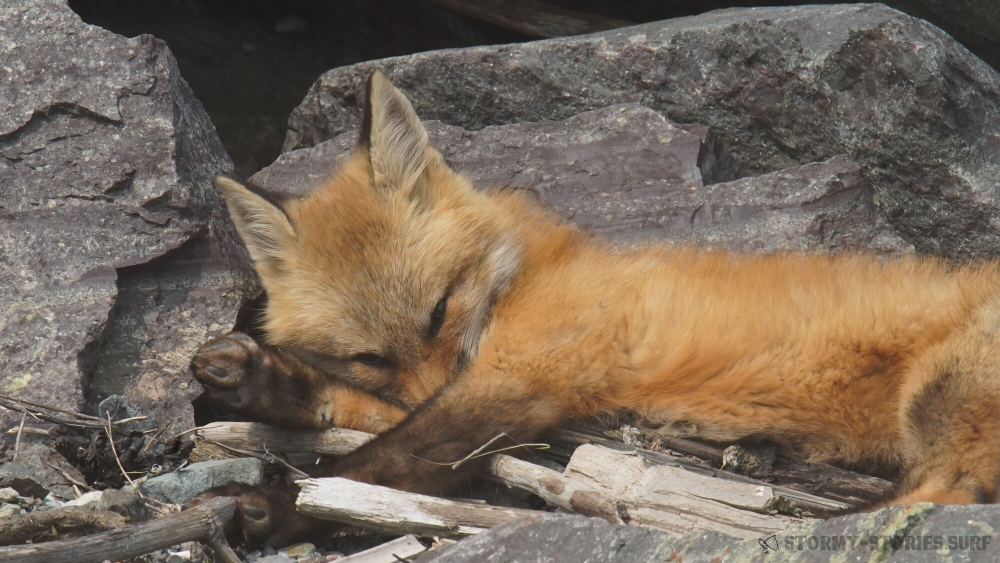
*Rotfuchs nähe Fortress Louisbourg (Nova Scotia) (Sony A7 III + Tamron SP 150-600mm f/5-6.3 Di USD G2 + Sony LA-EA3 Adapter; 1/640s bei f20 und 750mm (dank Cropfactor); ISO 1600)*
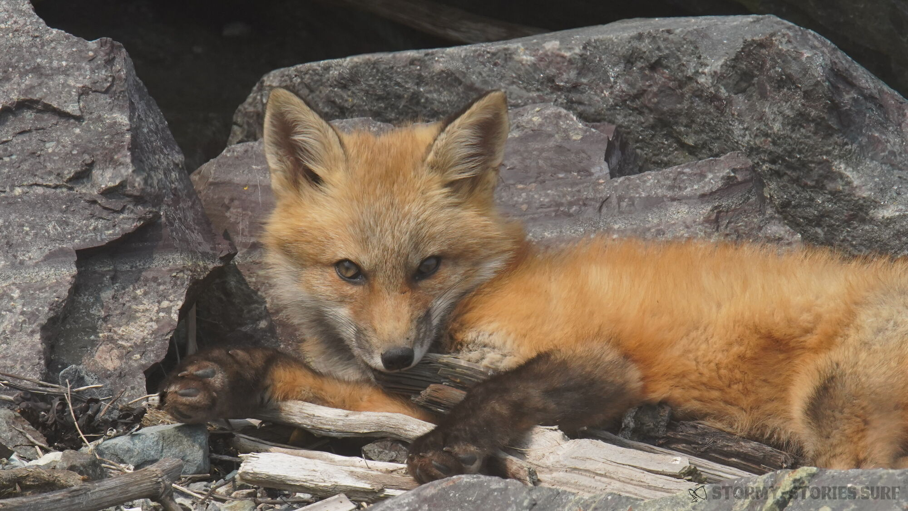
*Rotfuchs nähe Fortress Louisbourg (Nova Scotia) (Sony A7 III + Tamron SP 150-600mm f/5-6.3 Di USD G2 + Sony LA-EA3 Adapter; 1/640s bei f20 und 750mm (dank Cropfactor); ISO 1600)*
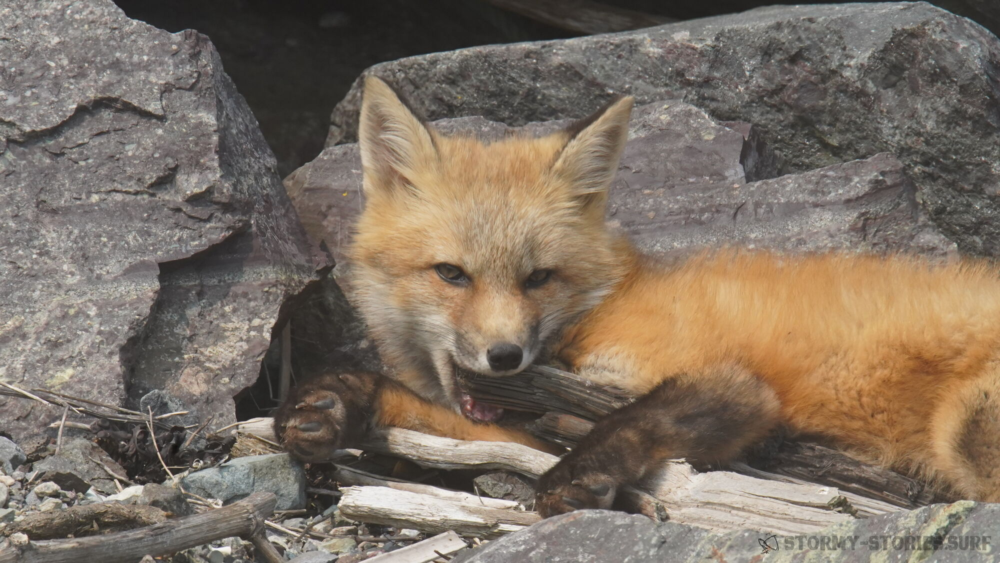
*Rotfuchs nähe Fortress Louisbourg (Nova Scotia) (Sony A7 III + Tamron SP 150-600mm f/5-6.3 Di USD G2 + Sony LA-EA3 Adapter; 1/500s bei f20 und 750mm (dank Cropfactor); ISO 1600)*
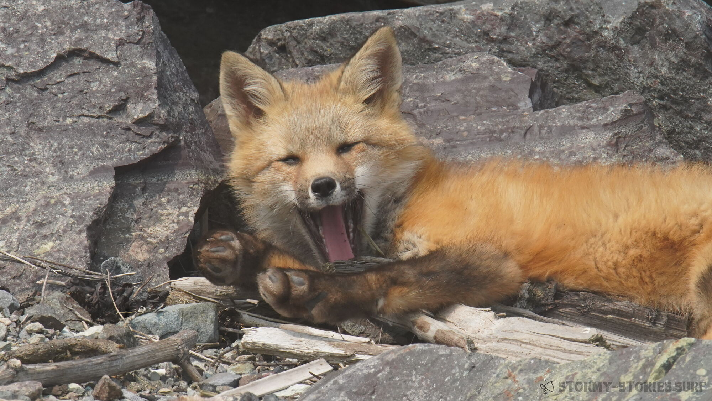
*Rotfuchs nähe Fortress Louisbourg (Nova Scotia) (Sony A7 III + Tamron SP 150-600mm f/5-6.3 Di USD G2 + Sony LA-EA3 Adapter; 1/500s bei f20 und 750mm (dank Cropfactor); ISO 1600)*

Lässt man diesen Tieren Raum zum Leben hat man eigentlich nie ein Problem und gerät man dann doch einmal in eine heikle Situation gibt es für jedes Tier einfache Regeln um es zu verscheuchen oder abzuwehren. So erklärt sich dann wahrscheinlich auch die Entspanntheit der Kanadier in diesem Thema. Wenn man von klein auf mit solchen Regeln aufgewachsen ist, dann sind sie irgendwann selbstverständlich und dann kann man der Natur enspannt ihren Raume gönnen ohne sich selbst eingeschränkt zu fühlen.

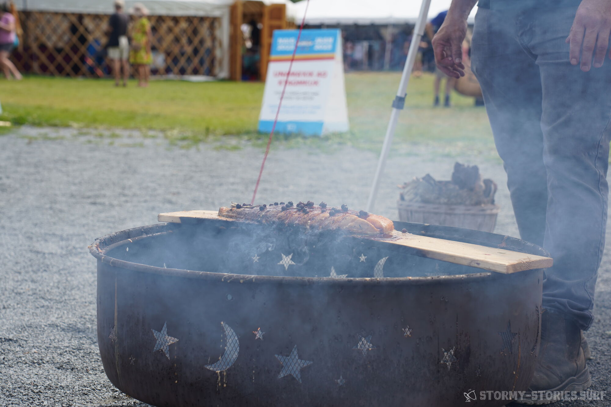
*Lachs-BBQ bei den North American Indigenous Games (Nova Scotia) (Sony A7 III + Tamron 28-75mm f/2.8 Di III VXD G2; 1/400s bei f6.3 und 75mm; ISO 100)*

Ein weiteres Thema was uns in Kanada sofort in die Augen springt wie GROß hier einfach alles ist. Egal wo man hinguckt, alles muss groß sein. Eier gibt es ab 12 Stück, günstiger sind aber natürlich die größeren Packungen mit 18 oder gleich 30. Milch, Saft und Wasser gibt es normalerweise ab 2 Liter, eine andere gängige Größe scheint wohl 4 oder sogar 10 Liter zu sein, beides ist mit unserem Kühlschrank aber nicht so wirklich kompatibel :D Haferflocken kaufen wir meistens im 2.5 kg Pack und mit einer Packung Küchentüchern oder Klopapier kommt man gefühlt Monate über die Runden. Entsprechend groß sind hier auch die Kühlschränke in den Häusern die oft mindestens doppelt oder dreimal so groß sind wie große Kühlschränke in Deutschland und fast schon eher aussehen wie ein kleiner Kleiderschrank.
Wie man es von Nordamerika erwartet sind auch die Fahrzeuge hier etwas größer als noch in Europa. Das Standard-Fahrzeug der meisten Leute und vor allem von den Menschen denen Autos wichtig sind, ist hier ein großer Pickup von Dodge, GMC, Ford, Chevrolet oder Toyota die fast immer mit V8 und 5-10 Litern Hubraum angetrieben werden.

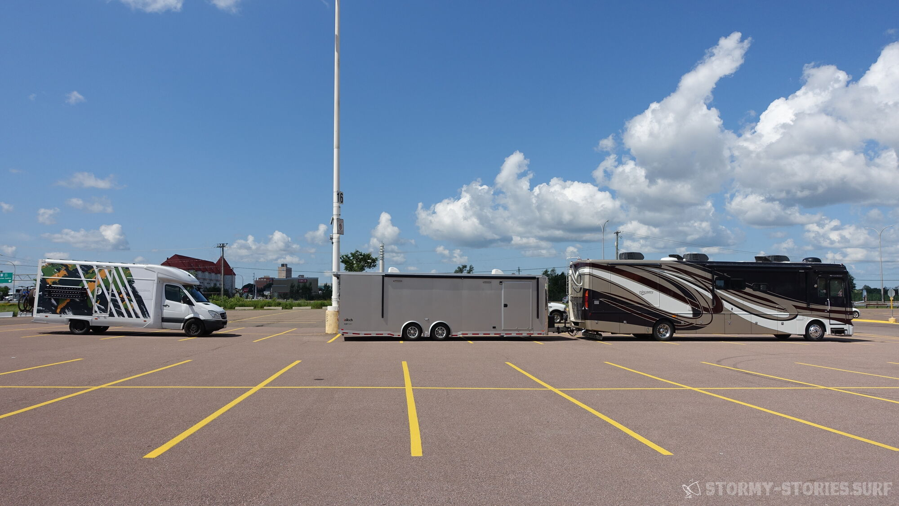
*Campingfahrzeuge in Nordamerika (Sony DSC-RX100 III; 1/1250s bei f5 und 8.8mm; ISO 125)*

*Mayo und Ketchup Auswahl im Supermarkt (Fairphone 3, interne Kamera; 1/40s bei f1.8 und 4.4mm; ISO 126)*
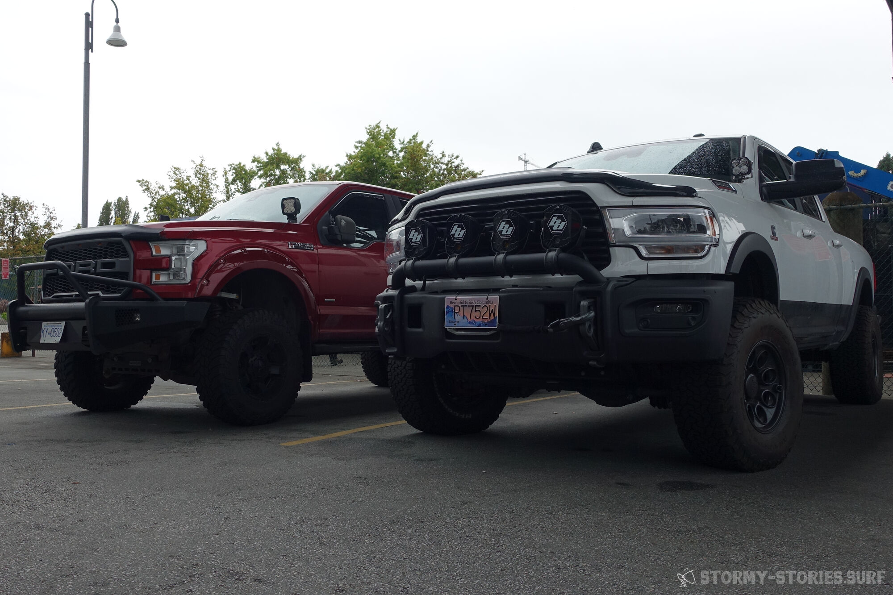
*Durchschnittliche Pickups in Nordamerika (Sony DSC-RX100 III; Bildausschnitt von 1/125s bei f5.6 und 8.8mm; ISO 125)*

Ein guter durchschnittlicher Pickup ist dann natürlich mit riesigen Offroad-Reifen ausgestattet, die links und rechts ordentlich aus dem Kotflügel rausstehen und soviel höhergelegt, dass die Motorhaube ziemlich perfekt auf der Kopfhöhe von Kindern beginnt. Ganz in diesem Sinne gibt es dann ebenfalls auf Kopfhöhe immer ein passendes Logo wie beispielsweise das "RAM" Logo vom Dodge RAM das sicherlich spannende Abdrücke hinterlassen würde.
Wer keinen Pickup hat und vermutlich nicht so viel Wert auf Autos legt, fährt hier meistens ein Mittelklasse-Auto aus Asien. Ein Auto das in Deutschland wsl. ungefähr bei einem Verbrauch von 5-7 Litern landen würde, blubbert hier entspannte 13 Liter im normalen Verkehr durch, weil natürlich auch diese Fahrzeuge nicht dahin optimiert wurden spritsparend zu sein und fast immer Allrad haben, denn generell gibt es gefühlt kaum Fahrzeuge ohne Allrad.
Ähnliches erleben wir dann auch immer wieder mit den Nordamerikanischen Campingfahrzeugen.
Hier scheint das durchschnittliche Freizeitgerät entweder ein gigantomanisches Wohnmobil mit tausenden Slideouts, mehreren Klimaanlagen, integriertem Notstromaggregat und als Anhänger anghängtem zweiten Fahrzeug zu sein oder ein riesiger Trailer der wahrscheinlich mehr Quadratmeter und mehr Ausstattung als so manches europäischees TinyHouse hat und per Auflieger von einem Pickup gezogen wird. Natürlich gibt es auch hier hin und wieder Menschen die im Zelt oder in einer kleinen Pickup-Aufsetzkabine unterwegs sind, aber gefühlt gibt es dann zwischen Zelt und dem privaten Reise-Raumschiff kaum mehr eine Abstufung. Dementsprechen fühlen wir uns in unserem 8 Meter Sprinter immer wieder wie ein kleiner Minivan und passen auch oft auf ganz normale Parkplätze, da ja fast schon die Pickups so groß sind wie wir...

Neben den großen Dingen in Kanada fällt uns auch immer wieder die große Offenheit und Gastfreundschhaft der Kanadier auf. Wie schon erwähnt werden wir hier von Anfang an überall wie gute alte Freunde aufgenommen. Unser erster Host reicht uns nachdem wir seine gemütliche und gut gelegene Wohnung Richtung Norden verlassen an Freunde aus der Uni in Cape Breton weiter. Hier verbringen wir ein paar Tage, basteln ein bisschen an unfertigen Baustellen unseres Busses, trinken Bier und Wein und lernen am Wochenende die ganze Familie beim traditionellen Familien-Supper (=Abendessen) in der Wohnung des Onkels kennen. Dann fahren wir gemeinsam für ein paar Tage mit einem Deutsch-Kanadier der in seinem selbst gebauten Minivan wohnt durch das schöne Cape-Breton, führen lange Gespräche bei ebenso langen Wanderungen und essen Abends zusammen.

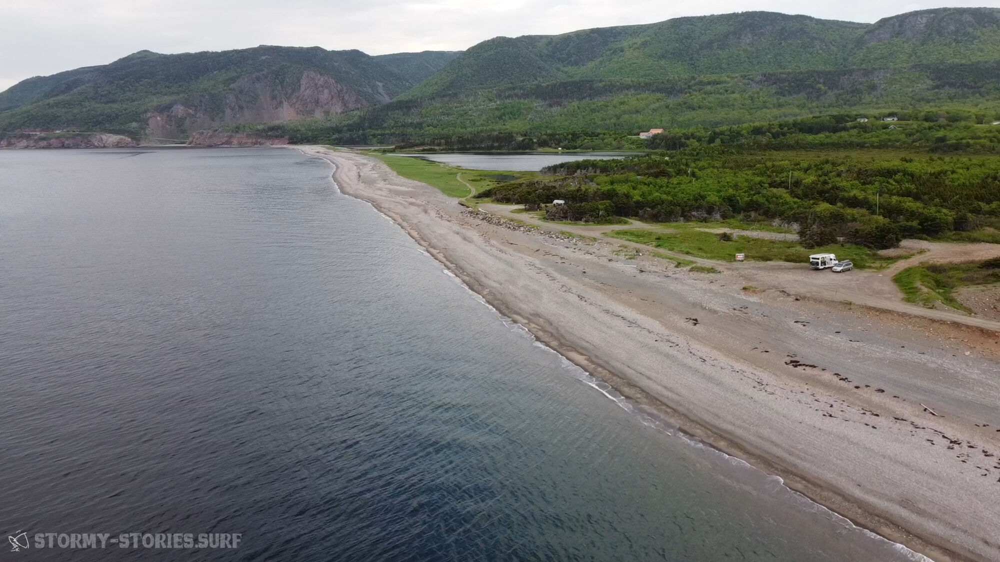
*Wildcamping Cheticamp (Nova Scotia) (DJI Mini 2 Drone - Ausschnitt aus Video)*

Kurze Zeit später werden wir von zwei Windsurfern an den Porters Lake eingeladen und dürfen dort ein paar Tage das Leben auf einem sehr schönen Grundstück am See genießen, werden überraschend zum Essen eingeladen, gehen Windsurfen und philosophieren über die Probleme der Welt. Und immer wieder werden wir hier auf unser auswertiges Kennzeichen angesprochen. Viele Menschen sind interessiert von wo wir kommen, wohin wir wollen und wie das genau mit so einer Reise vonstatten geht. Immer wieder werden uns Kontakte, E-Mail Adressen und Telefonummern von Bekannten oder Verwandten aus anderen Teilen Kanadas oder Nordamerikas aufgeschrieben und immer wieder führen wir viele spannende Gespräche und verabreden uns einmal sogar auf einem Supermarkt-Parkplatz zu einem sehr witzigen Abend in einen Irish Pub in Halifax.

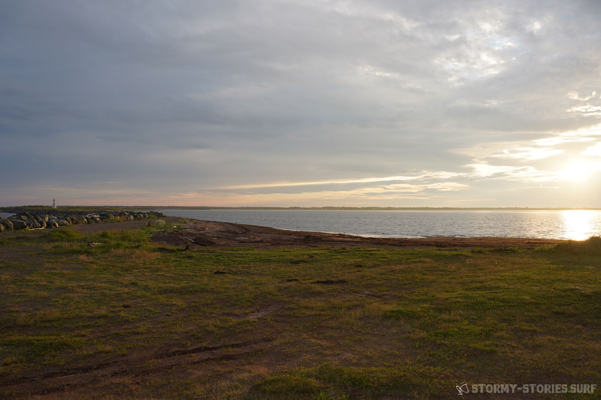
*Windsurf-Spot Chiasson Office Lagoon - Île Lamèque (Quebec) (Sony A7 III + Tamron 28-75mm f/2.8 Di III VXD G2; 1/100s bei f5 und 28mm; ISO 100)*
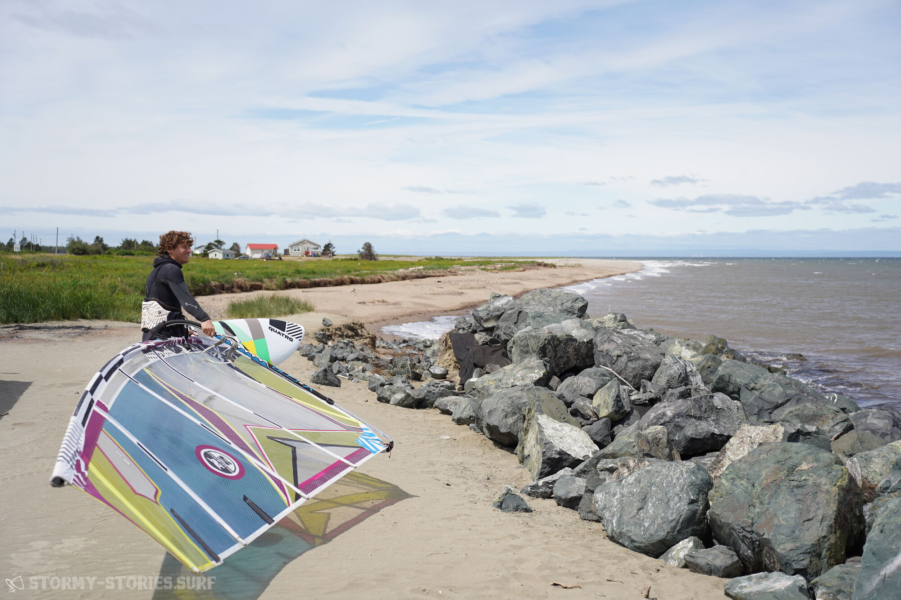
*Windsurfen Miscou Lighthouse (Quebec) (Sony A7 III + Tamron 28-75mm f/2.8 Di III VXD G2; 1/3200s bei f2.8 und 42mm; ISO 160)*

So vergehen unsere ersten Monate hier in Kanada irgendwie wie im Flug. Irgendwie hat man so viel mehr Zeit als im "normalen" Leben und irgendwie passiert aber dann doch jeden Tag so viel, dass die Wochen und Monate schneller verfliegen als man sich vorstellen kann. Später werden wir immer mal wieder erstaunt gefragt, wie wir es denn geschafft haben so lange im Osten und vorallem in Nova-Scotia zu verbringen - Naja was sollen wir sagen? Dieser Teil Kanadas war für uns einfach genau das was wir uns für den Beginn unserer Reise erträumt hatten : viel Zeit um ein bisschen den Takt des Lebens auszubremsen, wunderschöne und super vielfältige Natur und das, ohne viel fahren zu müssen und so viele erinnerungsträchtige, interessant-inspierende und freundliche Begegnungen wie wir es uns nie hätten vorstellen können und auch mehr als wir es jemals später in Kanada erlebt haben - einfach ein perfekter Start!

*Rotfuchs nähe Fortress Louisbourg (Nova Scotia) (Sony A7 III + Tamron SP 150-600mm f/5-6.3 Di USD G2 + Sony LA-EA3 Adapter; Bilderreihe)*

 [1] https://www.bbc.com/news/world-us-canada-65755795

 [2] https://www.cbc.ca/news/canada/nova-scotia/nova-scotia-most-devastating-wildfire-season-ever-1.7010205

 [3] https://cordis.europa.eu/article/id/18984-canada-gets-people-and-values-together/de

 [4] https://library.fes.de/fulltext/asfo/01017001.htm

 [5] https://www.nationalobserver.com/2023/07/24/news/biologist-nova-scotia-mainland-moose
